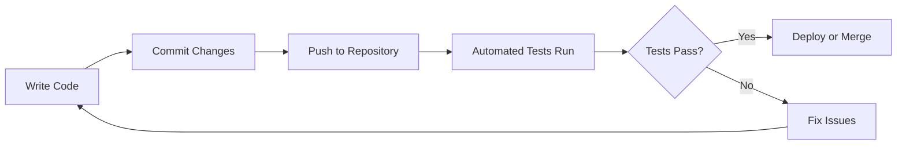
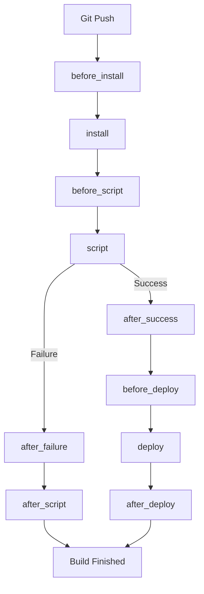

# Travis CI

## Introduction

Travis CI is a popular continuous integration and continuous deployment (CI/CD) platform that automates the building, testing, and deployment of your applications. It integrates seamlessly with GitHub repositories and runs your tests every time you push code or create a pull request, ensuring that new changes don't break your existing functionality.

In this guide, we'll explore Travis CI from the ground up, making it accessible for beginners while providing practical examples to help you implement CI/CD in your own projects.

## What is Continuous Integration?

Before diving into Travis CI, let's understand the concept of Continuous Integration:

Continuous Integration is a development practice where developers integrate code into a shared repository frequently, usually multiple times a day. Each integration is verified by an automated build and automated tests to detect integration errors as quickly as possible.



## Why Use Travis CI?

Travis CI offers several benefits for development teams:

- **Free for open-source projects** - Making it ideal for beginners and community projects
- **Easy setup** - Configuration is done through a simple YAML file
- **GitHub integration** - Works seamlessly with GitHub repositories
- **Parallel testing** - Can run tests across multiple environments simultaneously
- **Extensive language support** - Works with nearly all popular programming languages
- **Deployment options** - Can automatically deploy your application when tests pass

## Getting Started with Travis CI

### Step 1: Sign Up for Travis CI

1. Go to [travis-ci.com](https://travis-ci.com) for private repositories or [travis-ci.org](https://travis-ci.org) for open-source projects
2. Sign in with your GitHub account
3. Authorize Travis CI to access your GitHub repositories
4. Select the repositories you want to enable for Travis CI

### Step 2: Add a .travis.yml File

The `.travis.yml` file is the configuration file that tells Travis CI how to build and test your project. Create this file in the root of your repository:

```yaml
language: node_js
node_js:
  - 14
  - 16

# Install dependencies
install:
  - npm install

# Run tests
script:
  - npm test
```

This simple configuration tells Travis CI to:
1. Use Node.js as the language
2. Test on Node.js versions 14 and 16
3. Run `npm install` to install dependencies
4. Run `npm test` to execute tests

### Step 3: Push to GitHub

Once you've created the `.travis.yml` file, commit and push it to your GitHub repository:

```bash
git add .travis.yml
git commit -m "Add Travis CI configuration"
git push origin main
```

### Step 4: Check Build Status

After pushing to GitHub, Travis CI will automatically detect the new commit and start running your build according to the configuration. You can check the build status on the Travis CI dashboard or directly on your GitHub repository through the build status badge.

## Understanding the .travis.yml File

Let's break down the components of a `.travis.yml` file with more detailed examples:

### Specifying Language and Versions

You can specify the programming language and the versions you want to test against:

```yaml
language: python
python:
  - "3.7"
  - "3.8"
  - "3.9"
```

### Setting Up Dependencies

Install dependencies before running your tests:

```yaml
install:
  - pip install -r requirements.txt
  - pip install pytest pytest-cov
```

### Running Tests

Specify the commands to run your tests:

```yaml
script:
  - pytest --cov=myapp tests/
  - flake8 myapp
```

### Matrix Builds

Travis CI can test your code against multiple configurations simultaneously:

```yaml
matrix:
  include:
    - name: "Python 3.8 on Ubuntu"
      os: linux
      python: 3.8
    - name: "Python 3.7 on macOS"
      os: osx
      language: shell
      before_install: pyenv install 3.7.0
```

### Conditional Builds

You can set conditions for when builds should run:

```yaml
# Only build on specific branches
branches:
  only:
    - main
    - development

# Skip builds for certain commit messages
if: commit_message !~ /\[skip ci\]/
```

## Real-World Example: Setting Up Travis CI for a Node.js Web Application

Let's create a practical example for a Node.js web application that includes testing, linting, and deployment to Heroku:

```yaml
language: node_js
node_js:
  - 16

# Cache dependencies for faster builds
cache:
  directories:
    - node_modules

# Install dependencies
install:
  - npm ci

# Run tests and linting
script:
  - npm run lint
  - npm test

# Set up for deployment
before_deploy:
  - npm run build

# Deploy to Heroku
deploy:
  provider: heroku
  api_key:
    secure: "YOUR_ENCRYPTED_API_KEY"
  app: your-heroku-app-name
  on:
    branch: main
    
# Send notifications
notifications:
  email:
    on_success: change
    on_failure: always
```

This configuration:
1. Uses Node.js 16 for testing
2. Caches `node_modules` to speed up future builds
3. Installs dependencies using `npm ci` (faster and more reliable than `npm install`)
4. Runs linting and tests
5. Builds the application before deployment
6. Deploys to Heroku when tests pass on the main branch
7. Configures email notifications for build results

## Using Environment Variables

Travis CI allows you to set environment variables for your builds. Sensitive information should not be included directly in your `.travis.yml` file.

### Setting Environment Variables in Travis CI

You can set environment variables in two ways:

1. **Through the Travis CI dashboard** (for sensitive data)
   - Go to your repository settings on Travis CI
   - Add environment variables under "Environment Variables" section

2. **In the .travis.yml file** (for non-sensitive data)
   ```yaml
   env:
     global:
       - NODE_ENV=test
       - PORT=3000
   ```

### Using Encrypted Variables

For sensitive data like API keys, you can encrypt them using the Travis CI CLI tool:

```bash
# Install Travis CI CLI
gem install travis

# Encrypt your API key
travis encrypt SOMEAPI_KEY=your_api_key --add
```

This adds the encrypted variable to your `.travis.yml` file automatically.

## Continuous Deployment with Travis CI

Let's explore how to set up continuous deployment to different platforms:

### Deploying to GitHub Pages

```yaml
deploy:
  provider: pages
  skip_cleanup: true
  github_token: $GITHUB_TOKEN
  local_dir: build
  on:
    branch: main
```

### Deploying to AWS S3

```yaml
deploy:
  provider: s3
  access_key_id: $AWS_ACCESS_KEY
  secret_access_key: $AWS_SECRET_KEY
  bucket: "your-bucket-name"
  local_dir: dist
  skip_cleanup: true
  on:
    branch: main
```

### Deploying to Multiple Environments

You can deploy to different environments based on the branch:

```yaml
deploy:
  - provider: heroku
    api_key: $HEROKU_API_KEY
    app: your-staging-app
    on:
      branch: develop
  - provider: heroku
    api_key: $HEROKU_API_KEY
    app: your-production-app
    on:
      branch: main
```

## Travis CI Build Lifecycle

Understanding the build lifecycle helps you configure your builds more effectively:

1. **Install phase** - Install required dependencies
2. **Script phase** - Run the build script(s)
3. **Before/After phases** - Execute commands before or after specific phases
   - `before_install`
   - `before_script`
   - `before_deploy`
   - `after_success`
   - `after_failure`
   - `after_script`



## Best Practices for Travis CI

### 1. Keep Build Times Short
- Cache dependencies when possible
- Use parallel builds for independent tests
- Only run necessary tests for each branch

### 2. Secure Your Secrets
- Never commit sensitive information to your repository
- Use environment variables for sensitive data
- Encrypt sensitive information when necessary

### 3. Build Status Badges
Add a build status badge to your README.md to show the current status of your builds:

```markdown
[](https://travis-ci.com/username/repo)
```

### 4. Validate Your .travis.yml
Use the [Travis CI YAML validator](https://config.travis-ci.com/) to check your configuration file before pushing.

## Troubleshooting Travis CI Builds

### Common Issues and Solutions

1. **Build Timing Out**
   - Break down tests into smaller parts
   - Increase the timeout limit with `travis_wait`

   ```yaml
   script:
     - travis_wait 30 npm test
   ```

2. **Caching Issues**
   - Clear the cache through the Travis CI web interface
   - Add a cache-busting timestamp to your configuration

3. **Dependencies Not Installing**
   - Check your package manager configuration
   - Ensure you're using the correct versions of dependencies

4. **Build Failing Due to Missing Environment Variables**
   - Check that all required environment variables are set
   - Verify that secure variables are properly encrypted

## Advanced Travis CI Features

### 1. Build Stages

Split your build into stages that run sequentially:

```yaml
jobs:
  include:
    - stage: test
      script: npm test
    - stage: lint
      script: npm run lint
    - stage: deploy
      script: skip
      deploy:
        provider: heroku
        # ... deployment configuration
```

### 2. Build Matrix Expansion

Test against multiple configurations:

```yaml
language: node_js
node_js:
  - 14
  - 16
env:
  - DB=mongodb
  - DB=mysql
```

This creates 4 different build configurations (2 node versions × 2 database types).

### 3. Custom Build Scripts

For complex build processes, you can use a custom script:

```yaml
script: ./scripts/travis-build.sh
```

## Summary

Travis CI is a powerful tool that helps you implement continuous integration and deployment in your projects. In this guide, we've covered:

- The basics of CI/CD and Travis CI
- Setting up Travis CI for your projects
- Writing effective `.travis.yml` configuration files
- Implementing continuous deployment
- Best practices and troubleshooting tips

By integrating Travis CI into your workflow, you can catch bugs earlier, ensure your code is always in a deployable state, and save time on manual testing and deployment.

## Additional Resources

To deepen your understanding of Travis CI and CI/CD practices:

- [Official Travis CI Documentation](https://docs.travis-ci.com/)
- [Travis CI GitHub Repository](https://github.com/travis-ci/travis-ci)
- [Travis CI Community Forums](https://travis-ci.community/)

## Exercises

1. Set up Travis CI for a simple Hello World application in your preferred language.
2. Configure Travis CI to run tests on multiple versions of your language runtime.
3. Add a linting step to your Travis CI configuration.
4. Set up continuous deployment to GitHub Pages or Heroku.
5. Add a build status badge to your project's README.md file.
6. Create a build matrix to test your application with different database backends.

By completing these exercises, you'll gain practical experience with Travis CI and be well on your way to implementing effective CI/CD pipelines for your projects.