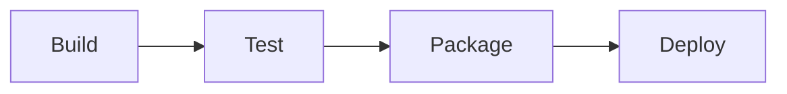
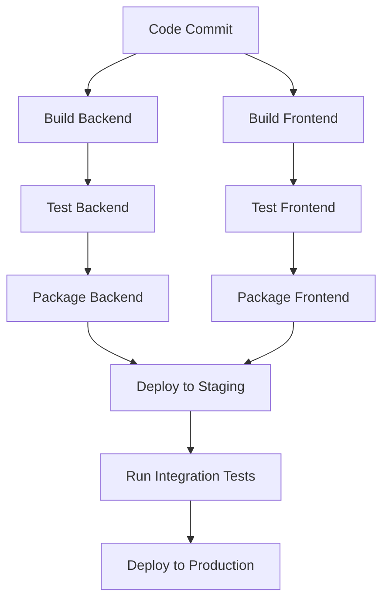

# TeamCity: Powerful CI/CD for Your Projects

## Introduction

TeamCity is a powerful Continuous Integration and Continuous Deployment (CI/CD) server developed by JetBrains. It's designed to help development teams automate the building and testing of software, ensuring code quality and streamlining the deployment process. Whether you're working on a small personal project or within a large enterprise team, TeamCity offers the tools and flexibility needed to create efficient development pipelines.

In this guide, we'll explore what TeamCity is, how it works, and how to set it up for your projects. By the end, you'll understand how to leverage TeamCity to automate your build, test, and deployment processes.

## What is TeamCity?

TeamCity is a build management and continuous integration server that helps development teams:

- Build and test software continuously
- Detect integration problems early
- Deploy applications automatically
- Monitor code quality
- Facilitate collaboration between team members

### Key Features

- **Intuitive UI**: Easy to navigate interface for configuring builds and viewing results
- **Build Chains**: Ability to create dependencies between builds
- **Build Grid**: Distribute builds across multiple machines
- **Version Control Integration**: Supports Git, Mercurial, Perforce, and more
- **Extensibility**: Hundreds of plugins and REST API support
- **Built-in Test Runners**: Support for popular testing frameworks
- **Docker Support**: Native integration with Docker

## Getting Started with TeamCity

### Installation

TeamCity consists of a server component and build agents. The server coordinates builds and provides the web interface, while agents execute the actual build processes.

Here's how to install TeamCity on a Linux server:

```bash
# Download TeamCity
wget https://download.jetbrains.com/teamcity/TeamCity-2023.11.3.tar.gz

# Extract the archive
tar -xzf TeamCity-2023.11.3.tar.gz

# Start TeamCity server
cd TeamCity
./bin/teamcity-server.sh start
```

Once started, access the TeamCity web interface at `http://your-server:8111` to complete the setup.

### Initial Configuration

After installation, you'll need to:

1. Accept the license agreement
2. Set up a database (built-in HSQLDB or external like MySQL/PostgreSQL)
3. Create an administrator account
4. Configure your first build agent

## Creating Your First Project

Let's create a simple CI/CD pipeline for a Node.js application:

1. From the TeamCity dashboard, click "Create project"
2. Select "From a repository URL"
3. Enter your Git repository URL
4. Configure authentication if needed
5. Name your project and click "Proceed"

TeamCity will scan your repository and suggest build configurations based on detected build files:

```javascript
// package.json example that TeamCity will detect
{
  "name": "sample-app",
  "version": "1.0.0",
  "scripts": {
    "test": "jest",
    "build": "webpack --mode production",
    "start": "node server.js"
  }
}
```

### Configuring Build Steps

Each build configuration consists of multiple steps. For our Node.js app:

1. **Install Dependencies**:
   ```yaml
   Runner type: Command Line
   Step name: Install Dependencies
   Run: npm install
   ```

2. **Run Tests**:
   ```yaml
   Runner type: Command Line
   Step name: Run Tests
   Run: npm test
   ```

3. **Build for Production**:
   ```yaml
   Runner type: Command Line
   Step name: Build
   Run: npm run build
   ```

### Build Triggers

Configure when builds should run automatically:

1. Click "Add New Trigger" in your build configuration
2. Select "VCS Trigger" to run builds on code changes
3. Optionally, set filters for specific branches or files

```javascript
// TeamCity DSL example for defining a trigger
vcs {
    branchFilter = "+:master"
    triggerRules = """
        -:*.md
        -:docs/**
    """
}
```

## Advanced TeamCity Features

### Build Dependencies

In real-world scenarios, you'll often need multiple build configurations that depend on each other:



To set up a dependency:

1. Navigate to your build configuration
2. Go to "Dependencies" and add a "Snapshot Dependency"
3. Select the build configuration it depends on
4. Configure artifact dependencies if you need files from the previous build

### Docker Integration

TeamCity offers excellent Docker support. Here's an example of running tests in a Docker container:

```yaml
Runner type: Docker
Step name: Run Tests in Docker
Image name: node:16
Run command: npm test
```

### Deployment Automation

Let's set up a deployment step for our application:

```yaml
Runner type: SSH Upload
Step name: Deploy to Production
Target host: production-server.example.com
Source paths: dist/**
Target path: /var/www/html
```

### Build Parameters

Define and use parameters to make your builds more flexible:

```javascript
// Define a parameter in TeamCity DSL
params {
    text("env.NODE_ENV", "production")
    password("env.API_KEY", "credentialsJSON:******")
}
```

Use these parameters in your build steps:

```bash
npm run build -- --mode %env.NODE_ENV%
```

## Real-World Example: Full CI/CD Pipeline

Let's create a complete CI/CD pipeline for a web application with frontend and backend components:



### Implementation Steps

1. **Create Project Structure**:
   - Main project: WebApp
   - Build configurations: Backend, Frontend, Integration, Deployment

2. **Backend Configuration**:
   ```yaml
   Steps:
     - Command Line: npm install
     - Command Line: npm test
     - Command Line: npm run build
   Artifacts to publish: dist/** => backend-build.zip
   ```

3. **Frontend Configuration**:
   ```yaml
   Steps:
     - Command Line: npm install
     - Command Line: npm test
     - Command Line: npm run build
   Artifacts to publish: build/** => frontend-build.zip
   ```

4. **Integration Configuration**:
   ```yaml
   Dependencies:
     - Snapshot: Backend
     - Snapshot: Frontend
     - Artifact: Backend => backend-build.zip
     - Artifact: Frontend => frontend-build.zip
   Steps:
     - Command Line: ./deploy-to-staging.sh
     - Command Line: npm run integration-tests
   ```

5. **Deployment Configuration**:
   ```yaml
   Dependencies:
     - Snapshot: Integration
   Steps:
     - Command Line: ./deploy-to-production.sh
   ```

## Monitoring and Reports

TeamCity provides extensive monitoring and reporting capabilities:

- **Build Statistics**: Track build times, test counts, code coverage
- **Code Quality Tools**: Integration with SonarQube, ESLint, etc.
- **Custom Reports**: Create dashboards with the information you need
- **Notifications**: Email, Slack, or custom webhooks for build status

Example configuration for Slack notifications:

```xml
<server>
  <notifications>
    <notificator type="slackNotifier">
      <parameters>
        <param name="webhook.url" value="https://hooks.slack.com/services/XXXX/YYYY/ZZZZ"/>
        <param name="channel" value="#builds"/>
        <param name="username" value="TeamCity"/>
      </parameters>
    </notificator>
  </notifications>
</server>
```

## Troubleshooting Common Issues

### Build Failures

When builds fail, TeamCity provides detailed logs. Common issues include:

1. **Environment Problems**:
   ```bash
   # Check agent environment
   teamcity-agent.sh report-environment
   ```

2. **Dependency Issues**:
   Make sure build dependencies and artifacts are configured correctly.

3. **Resource Limitations**:
   Check if your build agents have enough CPU, memory, and disk space.

### Performance Optimization

For large projects, consider:

1. **Multiple Build Agents**: Distribute workload across machines
2. **Build Chains**: Break builds into smaller, parallel parts
3. **Caching**: Use TeamCity's internal caching for dependencies

```javascript
// Example of configuring a cache in TeamCity DSL
features {
    swabra {
        forceCleanCheckout = true
    }
    perfmon {}
}
```

## Summary

TeamCity is a versatile CI/CD tool that can transform your development workflow. In this guide, we've covered:

- Basic installation and configuration
- Creating build configurations and pipelines
- Advanced features like build dependencies and Docker integration
- Setting up a complete CI/CD pipeline
- Monitoring and troubleshooting your builds

By implementing TeamCity in your projects, you can:
- Catch bugs earlier through continuous integration
- Reduce manual work through automation
- Improve code quality with consistent testing
- Deploy more frequently with confidence
- Enhance team collaboration

## Additional Resources

To deepen your knowledge of TeamCity:

- [TeamCity Documentation](https://www.jetbrains.com/help/teamcity/teamcity-documentation.html)
- [TeamCity Blog](https://blog.jetbrains.com/teamcity/)
- [Kotlin DSL API Reference](https://www.jetbrains.com/help/teamcity/kotlin-dsl-api-reference.html)

## Exercises

1. Set up a basic TeamCity server and run a simple build
2. Create a build chain with at least three dependent steps
3. Configure a deployment pipeline for a sample application
4. Implement notifications for build failures
5. Create a custom build report based on test results

With TeamCity in your CI/CD toolbox, you'll have a powerful ally in ensuring your code is always in a deployable state, ready to deliver value to your users.