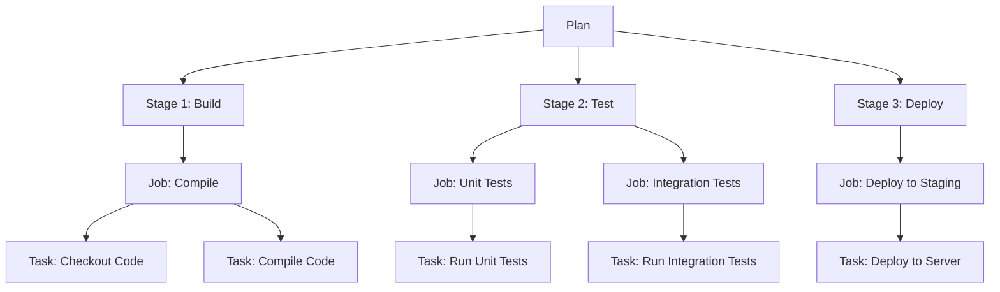

# Bamboo - Powerful CI/CD Tool from Atlassian

## Introduction

Bamboo is a continuous integration and continuous deployment (CI/CD) server developed by Atlassian, the company behind popular tools like Jira and Confluence. First released in 2007, Bamboo has evolved into a robust solution that helps development teams automate their software delivery pipeline.

Unlike many other CI/CD tools that rely heavily on configuration as code, Bamboo provides a user-friendly web interface for setting up build and deployment pipelines, making it particularly appealing to teams transitioning into CI/CD practices. In this guide, we'll explore Bamboo's features, how it works, and how to get started with it in your development workflow.

## What is Bamboo?

Bamboo is a server-based CI/CD tool that automates the process of:

1. Building your code
2. Running automated tests
3. Preparing software for release
4. Deploying to various environments

It's particularly known for its tight integration with other Atlassian products, creating a seamless workflow from issue tracking (Jira) to code repositories (Bitbucket) to continuous integration and deployment (Bamboo).

## Key Concepts in Bamboo

Before diving into using Bamboo, let's understand its core terminology:

### Plans

A Plan is the fundamental building block in Bamboo. It represents a complete build process for a project. Plans contain:

- **Stages**: Logical divisions of your build process (e.g., Build, Test, Deploy)
- **Jobs**: Tasks that run on a single agent within a stage
- **Tasks**: Individual actions within a job (e.g., running a script, checking out code)

### Here's a visual representation of this hierarchy:



### Agents and Capabilities

**Agents** are the workers that execute your build jobs. Each agent has specific **capabilities** (installed software, tools, etc.) that determine which jobs it can execute.

### Artifacts

**Artifacts** are files produced during a build that you want to keep, such as compiled applications, test reports, or documentation. Artifacts can be shared between jobs and deployed to different environments.

### Deployments

Bamboo separates builds from deployments, allowing you to:

1. **Build once**: Create a stable artifact
2. **Deploy many times**: Deploy the same artifact to multiple environments (development, testing, production)

## Getting Started with Bamboo

### Installation

To install Bamboo on your server:

1. Download the installer from [Atlassian's website](https://www.atlassian.com/software/bamboo/download)
2. Run the installer and follow the setup wizard
3. Access Bamboo through your browser at `http://localhost:8085` (default port)

For Docker users, you can use the following command:

```bash
docker run -v bambooVolume:/var/atlassian/application-data/bamboo \
  -p 8085:8085 -p 54663:54663 atlassian/bamboo
```

### Creating Your First Plan

Let's create a simple plan to build a Java application:

1. Log in to your Bamboo instance
2. Click "Create" → "Create Plan"
3. Fill in the plan details:

```
Project Name: My Java Project
Plan Name: Build Java App
Repository Host: Bitbucket (or your preferred Git provider)
Repository URL: https://bitbucket.org/myteam/my-java-app.git
```

4. Configure your build stages and jobs:

```
Stage 1: Build
  Job 1: Compile
    Task 1: Source Code Checkout
    Task 2: Maven Task (Goals: clean compile)
    
Stage 2: Test
  Job 1: Unit Tests
    Task 1: Maven Task (Goals: test)
    Task 2: JUnit Parser (to process test results)
```

5. Enable the plan to start building

### A Real-World Example: Spring Boot Application

Let's look at a more practical example of how to set up a CI/CD pipeline for a Spring Boot application with Bamboo:

1. **Plan Configuration**:

```
Plan Name: Spring Boot App
Repository: Git (URL to your Spring Boot app)
Branch: main
```

2. **Build Stage**:

```yaml
# Job: Build and Test
- Task: Checkout source code
- Task: Run Maven (clean package)
  Command: mvn clean package -DskipTests
- Task: Run Tests
  Command: mvn test
- Task: Publish JUnit Test Results
  Results from: **/target/surefire-reports/*.xml
- Artifact: Create and share target/*.jar
```

3. **Deployment Stage**:

```yaml
# Environment: Staging
- Task: Deploy to Tomcat
  Artifact: target/*.jar
  Destination: /opt/tomcat/webapps/
  
# Environment: Production
- Task: Deploy to Tomcat
  Artifact: target/*.jar
  Destination: /opt/tomcat/webapps/
  Trigger: Manual
```

## Advanced Bamboo Features

### Bamboo Specs

While Bamboo is primarily configured through its UI, it also offers **Bamboo Specs** - a way to define your build configuration as code (similar to Jenkins pipeline files).

Here's an example of a simple Bamboo Spec written in Java:

```java
package com.mycompany.bamboo;

import com.atlassian.bamboo.specs.api.BambooSpec;
import com.atlassian.bamboo.specs.api.builders.plan.Plan;
import com.atlassian.bamboo.specs.api.builders.plan.PlanIdentifier;
import com.atlassian.bamboo.specs.api.builders.project.Project;
import com.atlassian.bamboo.specs.util.BambooServer;

@BambooSpec
public class PlanSpec {
    
    public Plan plan() {
        return new Plan(new Project()
                .key("PROJ")
                .name("My Project"),
            "BUILD",
            "My Build Plan")
            .description("Plan created from specs")
            .stages(new Stage("Build")
                .jobs(new Job("Compile")
                    .tasks(new VcsCheckoutTask()
                        .description("Checkout source")
                        .checkoutItems(new CheckoutItem().defaultRepository()),
                    new MavenTask()
                        .goal("clean package")
                        .buildJdk("JDK 11")
                        .description("Build with Maven"))));
    }
    
    public static void main(String... args) {
        // Publish plan to a Bamboo instance
        PlanSpec planSpec = new PlanSpec();
        BambooServer bambooServer = new BambooServer("http://localhost:8085");
        bambooServer.publish(planSpec.plan());
    }
}
```

### Integrations

Bamboo's power is amplified by its integrations with other tools:

1. **Jira**: Link builds to issues, display build status in Jira tickets
2. **Bitbucket/GitHub**: Trigger builds on commits or pull requests
3. **Slack/Microsoft Teams**: Send build notifications
4. **SonarQube**: Integration for code quality metrics

### Example: Integrating with Jira

To link your Bamboo build with Jira issues:

1. Configure Jira integration in Bamboo settings
2. Use Jira issue keys in commit messages: `PROJ-123: Fix login bug`
3. Bamboo will automatically link builds to the Jira issues

When you view the issue in Jira, you'll see the build status:

```
PROJ-123: Fix login bug
Status: In Progress
Build: BUILD-42 ✅ Successful
```

## Bamboo vs. Other CI/CD Tools

| Feature | Bamboo | Jenkins | GitLab CI | GitHub Actions |
|---------|--------|---------|-----------|----------------|
| Configuration | UI-focused with Specs option | Pipeline as Code | YAML files | YAML files |
| Hosting | Self-hosted only | Self-hosted or Cloud | Self-hosted or SaaS | Cloud-only |
| Pricing | Commercial license | Free, open-source | Free tier available | Free tier available |
| Atlassian Integration | Native | Plugins required | Plugins required | Limited |
| Agent Management | Built-in | Master/Agent model | Runners | Runners |

## Best Practices for Bamboo

1. **Organize with Project Hierarchies**: Group related plans into projects
2. **Leverage Bamboo Variables**: Use built-in and custom variables to make plans flexible
3. **Implement Deployment Projects**: Separate builds from deployments
4. **Set Up Remote Agents**: Distribute build load across multiple machines
5. **Use Elastic Bamboo**: Scale with cloud-based agents during peak times
6. **Implement Branch Builds**: Automatically test code in feature branches

## Hands-On Exercise: Setting Up a Node.js Project in Bamboo

Let's create a complete Bamboo plan for a Node.js application:

1. **Create a New Plan**:
   - Project: Web Applications
   - Plan: Node.js App
   - Repository: Your Git repository URL

2. **Configure Build Stage**:

Task 1: Check out the source code
```yaml
# Source Code Checkout
repository: default
path: ${bamboo.build.working.directory}
```

Task 2: Install dependencies
```yaml
# Script Task
interpreter: /bin/bash
script: |
  npm install
```

Task 3: Run linting
```yaml
# Script Task
interpreter: /bin/bash
script: |
  npm run lint
```

Task 4: Run tests
```yaml
# Script Task
interpreter: /bin/bash
script: |
  npm test
```

Task 5: Build the application
```yaml
# Script Task
interpreter: /bin/bash
script: |
  npm run build
```

3. **Configure Artifact**:
```yaml
# Artifact Definition
name: build-output
location: build
```

4. **Configure Deployment**:
```yaml
# Deployment Project: Node.js App Deployment
Environment 1: Development
  Task: Extract build artifact
  Task: Copy to web server
    source: build/
    destination: /var/www/dev/
    
Environment 2: Production
  Task: Extract build artifact
  Task: Copy to web server
    source: build/
    destination: /var/www/prod/
  Trigger: Manual with approval
```

## Troubleshooting Common Issues

### Build Fails with "No Agent with Capability X"

**Problem**: Your build requires a capability that no agent has.

**Solution**: 
1. Go to Administration → Agent capabilities
2. Add the required capability to an agent
3. Alternatively, you can install the required software on the agent machine

### Out of Memory Errors

**Problem**: JVM running Bamboo runs out of memory during builds.

**Solution**:
Increase JVM memory by editing `bamboo-wrapper.conf`:

```
# Increase maximum heap size
wrapper.java.maxmemory=2048
```

### Slow Builds

**Problem**: Builds take too long to complete.

**Solution**:
1. Add more build agents
2. Optimize your build scripts
3. Use parallel jobs where possible
4. Use elastic agents to scale during peak times

## Summary

Bamboo is a powerful CI/CD tool that offers:

- A user-friendly interface for setting up build and deployment pipelines
- Excellent integration with other Atlassian products
- Separation of build and deployment processes
- Robust agent management

While it requires a commercial license and is only available as a self-hosted solution, its tight integration with Jira and Bitbucket makes it an excellent choice for teams already using Atlassian products.

## Additional Resources

- [Atlassian Bamboo Documentation](https://confluence.atlassian.com/bamboo/bamboo-documentation-289276551.html)
- [Bamboo Specs Tutorial](https://confluence.atlassian.com/bamboo/bamboo-specs-894743906.html)
- [CI/CD Best Practices Guide](https://www.atlassian.com/continuous-delivery/principles/continuous-integration-vs-delivery-vs-deployment)

## Practice Exercises

1. Create a simple Bamboo plan for a "Hello World" application in your preferred language
2. Set up a multi-stage pipeline with build, test, and deploy stages
3. Configure a deployment project with development and production environments
4. Create a Bamboo Spec for an existing plan
5. Set up integration between Bamboo and Jira to track builds related to specific issues