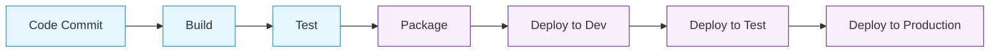

# CI/CD with Azure DevOps

## Introduction

Continuous Integration and Continuous Deployment (CI/CD) is a modern software development approach that enables teams to deliver code changes more frequently and reliably. Azure DevOps is Microsoft's powerful platform that provides a complete set of tools to implement CI/CD workflows efficiently.

In this tutorial, we'll explore how to set up CI/CD pipelines using Azure DevOps, specifically designed for beginners who want to automate their build, test, and deployment processes.

## What is CI/CD?

Before diving into Azure DevOps, let's understand the fundamental concepts:

- **Continuous Integration (CI)**: The practice of frequently merging code changes into a central repository, followed by automated builds and tests.
- **Continuous Deployment (CD)**: The automated process of deploying applications to various environments (development, testing, production) after passing the CI stage.

Here's a visual representation of a typical CI/CD workflow:



## Getting Started with Azure DevOps

### Step 1: Create an Azure DevOps Account and Project

1. Visit [Azure DevOps](https://dev.azure.com/) and sign up for a free account
2. After signing in, create a new organization or use an existing one
3. Create a new project by clicking the "New Project" button
4. Give your project a name, select visibility (public or private), and click "Create"

### Step 2: Set Up a Code Repository

Azure DevOps provides Git repositories for source control. Let's set one up:

1. Navigate to "Repos" in the left sidebar
2. Initialize a new repository or import an existing one
3. If it's a new repository, you can clone it to your local machine:

```bash
# Clone the repository to your local machine
git clone https://dev.azure.com/{your-organization}/{your-project}/_git/{your-repo}

# Navigate to the repository
cd {your-repo}

# Create a sample application (for demonstration)
mkdir sample-app
cd sample-app
# Add your application files

# Commit and push your changes
git add .
git commit -m "Initial commit"
git push origin main
```

## Building Your First CI Pipeline

Azure DevOps uses YAML files to define pipelines. Let's create a simple CI pipeline for a Node.js application:

### Step 3: Create azure-pipelines.yml

In the root of your repository, create a file named `azure-pipelines.yml`:

```yaml
# Node.js CI Pipeline
trigger:
- main  # Trigger the pipeline on changes to the main branch

pool:
  vmImage: 'ubuntu-latest'  # Use the latest Ubuntu agent

steps:
- task: NodeTool@0
  inputs:
    versionSpec: '16.x'  # Use Node.js 16.x
  displayName: 'Install Node.js'

- script: |
    npm install
    npm run build
  displayName: 'npm install and build'

- script: |
    npm test
  displayName: 'run tests'

- task: PublishTestResults@2
  inputs:
    testResultsFormat: 'JUnit'
    testResultsFiles: '**/test-results.xml'
    mergeTestResults: true
    testRunTitle: 'Node.js Tests'
  condition: succeededOrFailed()  # Run this step even if previous steps failed
```

### Step 4: Create and Run the Pipeline

1. In Azure DevOps, navigate to "Pipelines" in the left sidebar
2. Click "Create Pipeline"
3. Select your repository location (Azure Repos Git)
4. Choose your repository
5. Select "Existing Azure Pipelines YAML file"
6. Select the `azure-pipelines.yml` file you created
7. Click "Run" to start the pipeline

After running, you'll see the pipeline execution with all the defined steps. Each step shows its status (succeeded, failed) and logs.

## Implementing Continuous Deployment

Now that we have CI in place, let's extend it to include CD:

### Step 5: Modify the Pipeline for Deployment

Update your `azure-pipelines.yml` to include deployment stages:

```yaml
# Node.js CI/CD Pipeline
trigger:
- main

variables:
  # Build configuration
  buildConfiguration: 'Release'
  # Azure Web App name
  webAppName: 'your-app-name'

stages:
- stage: Build
  displayName: 'Build stage'
  jobs:
  - job: Build
    pool:
      vmImage: 'ubuntu-latest'
    steps:
    - task: NodeTool@0
      inputs:
        versionSpec: '16.x'
      displayName: 'Install Node.js'

    - script: |
        npm install
        npm run build
      displayName: 'npm install and build'

    - script: |
        npm test
      displayName: 'run tests'

    - task: ArchiveFiles@2
      inputs:
        rootFolderOrFile: '$(System.DefaultWorkingDirectory)'
        includeRootFolder: false
        archiveType: 'zip'
        archiveFile: '$(Build.ArtifactStagingDirectory)/$(Build.BuildId).zip'
        replaceExistingArchive: true
      displayName: 'Archive files'

    - task: PublishBuildArtifacts@1
      inputs:
        PathtoPublish: '$(Build.ArtifactStagingDirectory)'
        ArtifactName: 'drop'
      displayName: 'Publish artifacts'

- stage: Deploy
  displayName: 'Deploy stage'
  dependsOn: Build
  condition: succeeded()
  jobs:
  - deployment: Deploy
    pool:
      vmImage: 'ubuntu-latest'
    environment: 'development'
    strategy:
      runOnce:
        deploy:
          steps:
          - task: AzureWebApp@1
            inputs:
              azureSubscription: 'Your-Azure-Subscription'
              appName: '$(webAppName)'
              package: '$(Pipeline.Workspace)/drop/$(Build.BuildId).zip'
            displayName: 'Deploy to Azure Web App'
```

### Step 6: Configure Deployment Environment

1. In Azure DevOps, navigate to "Environments" under "Pipelines"
2. Create a new environment named "development"
3. Configure approval and check requirements if needed

### Step 7: Configure Azure Service Connection

To deploy to Azure, you need to set up a service connection:

1. Navigate to "Project settings" (bottom left)
2. Select "Service connections"
3. Click "New service connection"
4. Choose "Azure Resource Manager"
5. Follow the prompts to authenticate with your Azure account
6. Name your connection 'Your-Azure-Subscription' (match the name in your YAML)

## Working with Variable Groups and Secrets

For sensitive information like connection strings or API keys, use variable groups:

### Step 8: Create a Variable Group

1. Navigate to "Library" under "Pipelines"
2. Click "+ Variable group"
3. Name your group (e.g., "Development-Variables")
4. Add variables with their values
5. Toggle the lock icon for sensitive variables to make them secret
6. Save the variable group

### Step 9: Reference Variable Group in Pipeline

Update your pipeline to use the variable group:

```yaml
trigger:
- main

variables:
- group: Development-Variables  # Reference the variable group

stages:
  # Your stages here
```

You can reference variables using `$(variableName)` syntax in your pipeline.

## CI/CD for Different Application Types

### Web Applications

For web applications, you typically:
1. Build the application
2. Run tests
3. Package the application
4. Deploy to a web service (App Service, VM, etc.)

### API Services

For APIs, you might want to:
1. Build and test the API
2. Run integration tests
3. Deploy to the hosting environment
4. Run API tests to verify deployment

Here's a sample pipeline for an ASP.NET Core Web API:

```yaml
trigger:
- main

pool:
  vmImage: 'ubuntu-latest'

variables:
  buildConfiguration: 'Release'

steps:
- task: UseDotNet@2
  inputs:
    version: '6.0.x'
  displayName: 'Install .NET 6'

- script: dotnet restore
  displayName: 'Restore NuGet packages'

- script: dotnet build --configuration $(buildConfiguration)
  displayName: 'Build the project'

- script: dotnet test
  displayName: 'Run tests'

- task: DotNetCoreCLI@2
  inputs:
    command: 'publish'
    publishWebProjects: true
    arguments: '--configuration $(buildConfiguration) --output $(Build.ArtifactStagingDirectory)'
  displayName: 'Publish the project'

- task: PublishBuildArtifacts@1
  inputs:
    PathtoPublish: '$(Build.ArtifactStagingDirectory)'
    ArtifactName: 'api-drop'
  displayName: 'Publish artifacts'
```

## Real-World Example: Full-Stack Application Deployment

Let's walk through a practical example of deploying a full-stack application with a React frontend and Node.js backend:

### Frontend Pipeline (React)

```yaml
trigger:
  branches:
    include:
    - main
  paths:
    include:
    - 'frontend/*'

pool:
  vmImage: 'ubuntu-latest'

steps:
- task: NodeTool@0
  inputs:
    versionSpec: '16.x'
  displayName: 'Install Node.js'

- script: |
    cd frontend
    npm install
    npm run build
  displayName: 'Build React frontend'

- task: CopyFiles@2
  inputs:
    SourceFolder: 'frontend/build'
    Contents: '**'
    TargetFolder: '$(Build.ArtifactStagingDirectory)/frontend'
  displayName: 'Copy frontend build files'

- task: PublishBuildArtifacts@1
  inputs:
    PathtoPublish: '$(Build.ArtifactStagingDirectory)/frontend'
    ArtifactName: 'frontend'
  displayName: 'Publish frontend artifact'
```

### Backend Pipeline (Node.js)

```yaml
trigger:
  branches:
    include:
    - main
  paths:
    include:
    - 'backend/*'

pool:
  vmImage: 'ubuntu-latest'

steps:
- task: NodeTool@0
  inputs:
    versionSpec: '16.x'
  displayName: 'Install Node.js'

- script: |
    cd backend
    npm install
  displayName: 'Install backend dependencies'

- script: |
    cd backend
    npm test
  displayName: 'Run backend tests'

- task: CopyFiles@2
  inputs:
    SourceFolder: 'backend'
    Contents: |
      **
      !node_modules/**
    TargetFolder: '$(Build.ArtifactStagingDirectory)/backend'
  displayName: 'Copy backend files'

- task: PublishBuildArtifacts@1
  inputs:
    PathtoPublish: '$(Build.ArtifactStagingDirectory)/backend'
    ArtifactName: 'backend'
  displayName: 'Publish backend artifact'
```

### Deployment Pipeline

Create a separate deployment pipeline that consumes the artifacts produced by the frontend and backend pipelines:

```yaml
trigger: none  # Manual trigger or trigger from other pipelines

resources:
  pipelines:
  - pipeline: frontendBuild
    source: 'Frontend-CI'  # Name of your frontend pipeline
  - pipeline: backendBuild
    source: 'Backend-CI'  # Name of your backend pipeline

stages:
- stage: Deploy
  jobs:
  - job: DeployFrontend
    pool:
      vmImage: 'ubuntu-latest'
    steps:
    - download: frontendBuild
      artifact: 'frontend'
    - task: AzureStaticWebApp@0
      inputs:
        azure_static_web_apps_api_token: $(StaticWebAppToken)
        app_location: '$(Pipeline.Workspace)/frontendBuild/frontend'
      displayName: 'Deploy frontend to Static Web App'

  - job: DeployBackend
    pool:
      vmImage: 'ubuntu-latest'
    steps:
    - download: backendBuild
      artifact: 'backend'
    - task: AzureWebApp@1
      inputs:
        azureSubscription: 'Your-Azure-Subscription'
        appType: 'webAppLinux'
        appName: '$(BackendAppName)'
        package: '$(Pipeline.Workspace)/backendBuild/backend'
        startUpCommand: 'npm start'
      displayName: 'Deploy backend to App Service'
```

## Advanced Azure DevOps Features

### Gates and Approvals

To add approval gates:

1. Navigate to your environment in the "Environments" section
2. Click "Add check" under "Checks"
3. Select "Approvals"
4. Add the required approvers and configure timeout settings

### Release Gates

Release gates validate your deployments against external criteria before or after deployment:

```yaml
environments:
  - name: Production
    deployment:
      gates:
        - task: AzureMonitor@0
          inputs:
            connectedServiceNameARM: 'Your-Azure-Subscription'
            resourceGroupName: 'your-resource-group'
            resourceType: 'Microsoft.Insights/components'
            resourceName: 'your-application-insights'
            alertRule: 'Failed Requests'
```

### Branch Policies

To enforce code quality, configure branch policies:

1. Navigate to "Repos" > "Branches"
2. Find your main branch, click "..." and select "Branch policies"
3. Configure required reviewers, build validation, and other policies

## Tips for Effective CI/CD Implementation

1. **Start Small**: Begin with a simple CI pipeline, then gradually add CD stages
2. **Use Branch Policies**: Ensure code quality with required reviews and build validation
3. **Parallelize Tasks**: Speed up pipelines by running independent tasks in parallel
4. **Cache Dependencies**: Cache npm, NuGet packages to reduce build time
5. **Monitor Pipeline Metrics**: Track build times, failure rates, and deployment frequencies
6. **Implement Infrastructure as Code**: Use ARM templates or Terraform for infrastructure deployments
7. **Secure Your Secrets**: Never hardcode credentials; use variable groups and Azure Key Vault

## Common Issues and Troubleshooting

### Failed Builds
- Check that all required tools and dependencies are installed in your pipeline
- Verify your code builds successfully in a local environment
- Review pipeline logs for specific error messages

### Failed Deployments
- Check service connection permissions
- Verify that your deployment configuration is correct
- Test deployment scripts locally before running them in the pipeline

### Permission Issues
- Review Azure DevOps permissions for your team
- Ensure your service principal has proper permissions in Azure

## Summary

In this tutorial, we've explored how to set up CI/CD pipelines using Azure DevOps, from basic integration to advanced deployment strategies. We've covered:

- Creating Azure DevOps projects and repositories
- Building CI pipelines for different application types
- Implementing CD pipelines for automated deployments
- Working with variable groups and secrets
- Setting up approval gates and branch policies
- Best practices for effective CI/CD implementation

By implementing CI/CD with Azure DevOps, you can dramatically improve your development workflow, reduce manual errors, and deliver high-quality software more frequently.

## Additional Resources

- [Azure DevOps Documentation](https://docs.microsoft.com/en-us/azure/devops/)
- [YAML Schema Reference](https://docs.microsoft.com/en-us/azure/devops/pipelines/yaml-schema/)
- [Azure DevOps Labs](https://azuredevopslabs.com/)

## Exercises

1. Create a simple web application and set up a basic CI pipeline
2. Extend your pipeline to include automated testing
3. Configure a CD pipeline to deploy your application to Azure App Service
4. Implement branch policies and pull request validation
5. Add approval gates to your production deployment stage