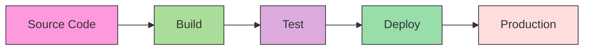
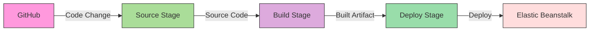

# CICD AWS CodePipeline

## Introduction

Continuous Integration and Continuous Delivery (CI/CD) has revolutionized how software is built, tested, and deployed. AWS CodePipeline is Amazon's fully managed CI/CD service that helps you automate your release pipelines for fast and reliable application and infrastructure updates.

In this tutorial, we'll explore AWS CodePipeline in depth, understanding how it fits into a modern CI/CD workflow and how beginners can leverage its capabilities to automate their software delivery process.

## What is AWS CodePipeline?

AWS CodePipeline is a continuous delivery service that enables you to model, visualize, and automate the steps required to release your software. With CodePipeline, you can quickly model and configure the different stages of your software release process. It automatically triggers your pipeline when changes are detected in your source code repository.

Think of CodePipeline as an assembly line for your code:



## Key Concepts in AWS CodePipeline

Before diving into implementation, let's understand the core components:

1. **Pipeline**: The overall workflow that describes how software changes go from source to release.
2. **Stage**: A logical unit within a pipeline, such as "Build" or "Deploy".
3. **Action**: A task performed on your artifacts in a stage (e.g., deploying to EC2).
4. **Artifact**: A file or set of files that are worked on by the actions in your pipeline.
5. **Transition**: The movement between stages in a pipeline.

## Getting Started with AWS CodePipeline

### Prerequisites

Before we begin, make sure you have:

- An AWS account
- Basic understanding of AWS services
- A source code repository (GitHub, CodeCommit, BitBucket, etc.)
- IAM permissions to create and manage AWS resources

### Creating Your First Pipeline

Let's walk through the process of creating a simple pipeline that automates the deployment of a web application.

#### Step 1: Sign in to the AWS Management Console

Navigate to the AWS CodePipeline service console.

#### Step 2: Create a Pipeline

1. Click on "Create pipeline"
2. Enter a pipeline name, e.g., `MyFirstPipeline`
3. Choose "New service role" or use an existing role with appropriate permissions
4. For advanced settings, you can configure artifact storage and encryption settings
5. Click "Next"

```javascript
// Example of pipeline definition in AWS CloudFormation
const pipeline = {
  "AWSTemplateFormatVersion": "2010-09-09",
  "Resources": {
    "MyPipeline": {
      "Type": "AWS::CodePipeline::Pipeline",
      "Properties": {
        "Name": "MyFirstPipeline",
        "RoleArn": { "Fn::GetAtt": ["PipelineServiceRole", "Arn"] },
        "ArtifactStore": {
          "Type": "S3",
          "Location": { "Ref": "ArtifactBucket" }
        },
        "Stages": [
          // Stages will be defined below
        ]
      }
    }
  }
};
```

#### Step 3: Configure Source Stage

1. Select your source provider (GitHub, AWS CodeCommit, Amazon S3, etc.)
2. Connect to your repository and select the branch to monitor
3. Choose the detection option (webhooks or periodic checks)
4. Click "Next"

```javascript
// Adding a source stage to our pipeline definition
const sourceStage = {
  "Name": "Source",
  "Actions": [
    {
      "Name": "Source",
      "ActionTypeId": {
        "Category": "Source",
        "Owner": "AWS",
        "Provider": "CodeStarSourceConnection",
        "Version": "1"
      },
      "Configuration": {
        "ConnectionArn": "arn:aws:codestar-connections:region:account-id:connection/connection-id",
        "FullRepositoryId": "my-github-user/my-repo",
        "BranchName": "main"
      },
      "OutputArtifacts": [
        { "Name": "SourceCode" }
      ]
    }
  ]
};
```

#### Step 4: Add Build Stage (Optional)

1. Choose your build provider (AWS CodeBuild is commonly used)
2. Configure your build project, which includes:
   - Selecting or creating a build environment
   - Specifying build commands
   - Configuring environment variables
3. Click "Next"

Here's a sample `buildspec.yml` file that defines how CodeBuild should build your application:

```yaml
version: 0.2

phases:
  install:
    runtime-versions:
      nodejs: 14
  pre_build:
    commands:
      - echo Installing dependencies...
      - npm install
  build:
    commands:
      - echo Build started on `date`
      - npm run build
  post_build:
    commands:
      - echo Build completed on `date`

artifacts:
  files:
    - build/**/*
    - package.json
    - appspec.yml
  discard-paths: no
```

#### Step 5: Add Deploy Stage

1. Select your deployment provider (AWS CodeDeploy, AWS Elastic Beanstalk, Amazon ECS, etc.)
2. Configure your deployment settings based on the selected provider
3. Click "Next"

```javascript
// Adding a deploy stage to our pipeline definition
const deployStage = {
  "Name": "Deploy",
  "Actions": [
    {
      "Name": "Deploy",
      "ActionTypeId": {
        "Category": "Deploy",
        "Owner": "AWS",
        "Provider": "CodeDeploy",
        "Version": "1"
      },
      "Configuration": {
        "ApplicationName": "MyApplication",
        "DeploymentGroupName": "MyDeploymentGroup"
      },
      "InputArtifacts": [
        { "Name": "BuildOutput" }
      ]
    }
  ]
};
```

#### Step 6: Review and Create

1. Review your pipeline configuration
2. Click "Create pipeline"

Once created, the pipeline will automatically start and run through each stage, processing your code from source to deployment.

## Real-World Example: Deploying a Node.js Application

Let's look at a complete example of deploying a Node.js application using AWS CodePipeline.

### Scenario

You have a simple Node.js application stored in a GitHub repository, and you want to:
1. Automatically detect changes to the main branch
2. Build and test the application
3. Deploy it to an AWS Elastic Beanstalk environment

### Pipeline Configuration

Here's how we would set up this pipeline:

#### Source Stage:
- Source Provider: GitHub
- Repository: `your-username/your-nodejs-app`
- Branch: `main`
- Detection Method: GitHub webhooks

#### Build Stage:
- Build Provider: AWS CodeBuild
- BuildSpec: Use the following buildspec.yml file

```yaml
version: 0.2

phases:
  install:
    runtime-versions:
      nodejs: 14
  pre_build:
    commands:
      - echo Installing dependencies...
      - npm install
  build:
    commands:
      - echo Running tests...
      - npm test
      - echo Building the application...
      - npm run build
  post_build:
    commands:
      - echo Preparing for deployment...
      - npm prune --production

artifacts:
  files:
    - package.json
    - package-lock.json
    - node_modules/**/*
    - dist/**/*
    - .ebextensions/**/*
  discard-paths: no
```

#### Deploy Stage:
- Deploy Provider: AWS Elastic Beanstalk
- Application Name: `nodejs-app`
- Environment Name: `nodejs-app-env`

### Pipeline Flow Visualization



### Expected Outcome

With this pipeline:
1. Whenever you push code to the main branch of your GitHub repository, the pipeline is triggered.
2. CodePipeline pulls the latest code and passes it to CodeBuild.
3. CodeBuild installs dependencies, runs tests, builds the application, and creates a deployment artifact.
4. The artifact is then deployed to your Elastic Beanstalk environment, making your updated application available.

## Advanced CodePipeline Features

As you become more comfortable with basic pipelines, explore these advanced features:

### 1. Manual Approval Actions

You can add manual approval steps to your pipeline, requiring someone to review and approve before proceeding to the next stage.

```javascript
const approvalAction = {
  "Name": "ApproveDeployment",
  "ActionTypeId": {
    "Category": "Approval",
    "Owner": "AWS",
    "Provider": "Manual",
    "Version": "1"
  },
  "Configuration": {
    "NotificationArn": "arn:aws:sns:region:account-id:topic-name",
    "CustomData": "Please review the application before it is deployed to production"
  }
};
```

### 2. Parallel Actions

You can configure actions to run in parallel within a stage, speeding up your pipeline:

```javascript
const parallelTestStage = {
  "Name": "Test",
  "Actions": [
    {
      "Name": "UnitTests",
      "ActionTypeId": {
        "Category": "Test",
        "Owner": "AWS",
        "Provider": "CodeBuild",
        "Version": "1"
      },
      "Configuration": {
        "ProjectName": "UnitTestProject"
      },
      "InputArtifacts": [
        { "Name": "SourceCode" }
      ],
      "RunOrder": 1
    },
    {
      "Name": "IntegrationTests",
      "ActionTypeId": {
        "Category": "Test",
        "Owner": "AWS",
        "Provider": "CodeBuild",
        "Version": "1"
      },
      "Configuration": {
        "ProjectName": "IntegrationTestProject"
      },
      "InputArtifacts": [
        { "Name": "SourceCode" }
      ],
      "RunOrder": 1
    }
  ]
};
```

### 3. Cross-Region Actions

CodePipeline can perform actions across different AWS regions:

```javascript
const crossRegionDeployAction = {
  "Name": "DeployToUSWest",
  "ActionTypeId": {
    "Category": "Deploy",
    "Owner": "AWS",
    "Provider": "CloudFormation",
    "Version": "1"
  },
  "Region": "us-west-2",
  "Configuration": {
    "StackName": "MyApplicationStack",
    "TemplatePath": "BuildOutput::template.yaml",
    "ActionMode": "CREATE_UPDATE"
  },
  "InputArtifacts": [
    { "Name": "BuildOutput" }
  ]
};
```

### 4. Custom Actions

If AWS's built-in action types don't meet your needs, you can create custom actions:

```javascript
// Example of defining a custom action type in CloudFormation
const customActionType = {
  "Type": "AWS::CodePipeline::CustomActionType",
  "Properties": {
    "Category": "Test",
    "Provider": "MyCustomTester",
    "Version": "1",
    "ConfigurationProperties": [
      {
        "Name": "TestPlanId",
        "Required": true,
        "Key": true,
        "Secret": false,
        "QueryableValue": true,
        "Description": "The ID of the test plan to execute",
        "Type": "String"
      }
    ],
    "InputArtifactDetails": {
      "MaximumCount": 1,
      "MinimumCount": 1
    },
    "OutputArtifactDetails": {
      "MaximumCount": 1,
      "MinimumCount": 0
    },
    "Settings": {
      "EntityUrlTemplate": "https://my-testing-tool.example.com/tests/{TestPlanId}",
      "ExecutionUrlTemplate": "https://my-testing-tool.example.com/executions/{ExecutionId}"
    }
  }
};
```

## Best Practices for AWS CodePipeline

To get the most out of AWS CodePipeline, follow these best practices:

### 1. Security

- Use IAM roles with the principle of least privilege
- Encrypt your artifacts using AWS KMS
- Store sensitive information in AWS Secrets Manager or AWS Systems Manager Parameter Store
- Regularly audit your pipeline configurations

### 2. Performance

- Use parallel actions where possible
- Keep build and test steps efficient
- Consider splitting large pipelines into multiple smaller pipelines

### 3. Reliability

- Implement robust error handling
- Set up pipeline notifications using Amazon SNS
- Regularly test your rollback procedures
- Use AWS CloudWatch to monitor pipeline executions

### 4. Cost Optimization

- Clean up old artifacts
- Use spot instances for build environments when possible
- Consider the cost implications of frequent pipeline executions

## Integrating with Other AWS Services

AWS CodePipeline works seamlessly with many other AWS services:

- **AWS CodeCommit**: For source code management
- **AWS CodeBuild**: For building and testing code
- **AWS CodeDeploy**: For deploying applications
- **AWS CloudFormation**: For infrastructure as code
- **AWS Lambda**: For serverless compute
- **AWS Elastic Beanstalk**: For easy application deployment
- **Amazon S3**: For artifact storage
- **Amazon CloudWatch**: For monitoring and logging
- **Amazon SNS**: For notifications

## Troubleshooting Common Issues

### Pipeline Execution Failed

1. Check the specific error message in the CodePipeline console
2. Verify IAM permissions for the service role
3. Ensure resources referenced in your pipeline exist
4. Check that your buildspec.yml or appspec.yml file is valid

### Source Stage Issues

1. Verify webhook configurations
2. Check repository and branch names
3. Ensure access tokens or connections are valid

### Build Stage Issues

1. Examine build logs in CodeBuild
2. Verify the build environment has sufficient resources
3. Check that all dependencies are available

### Deploy Stage Issues

1. Verify the deployment configuration
2. Check environment health (for Elastic Beanstalk)
3. Ensure deployment IAM permissions are correct

## Summary

AWS CodePipeline is a powerful tool for implementing CI/CD workflows in the AWS ecosystem. By automating your software delivery process, you can:

- Release new features faster
- Reduce manual errors
- Standardize your deployment process
- Improve code quality through consistent testing
- Focus on writing code rather than managing deployments

Whether you're deploying simple web applications or complex microservices architectures, AWS CodePipeline provides the flexibility and integration capabilities to streamline your software delivery pipeline.

## Additional Resources

To further your understanding of AWS CodePipeline:

- Explore the [AWS CodePipeline User Guide](https://docs.aws.amazon.com/codepipeline/latest/userguide/welcome.html)
- Practice with AWS's sample pipelines
- Consider getting AWS DevOps certification

## Exercises

1. Create a simple pipeline that deploys a static website to Amazon S3.
2. Extend your pipeline to include a testing stage using AWS CodeBuild.
3. Add a manual approval action before deploying to production.
4. Create a pipeline that deploys a serverless application using AWS SAM or CloudFormation.
5. Implement a multi-region deployment strategy using CodePipeline.

By mastering AWS CodePipeline, you'll be well-equipped to implement professional-grade CI/CD workflows in your projects and career.