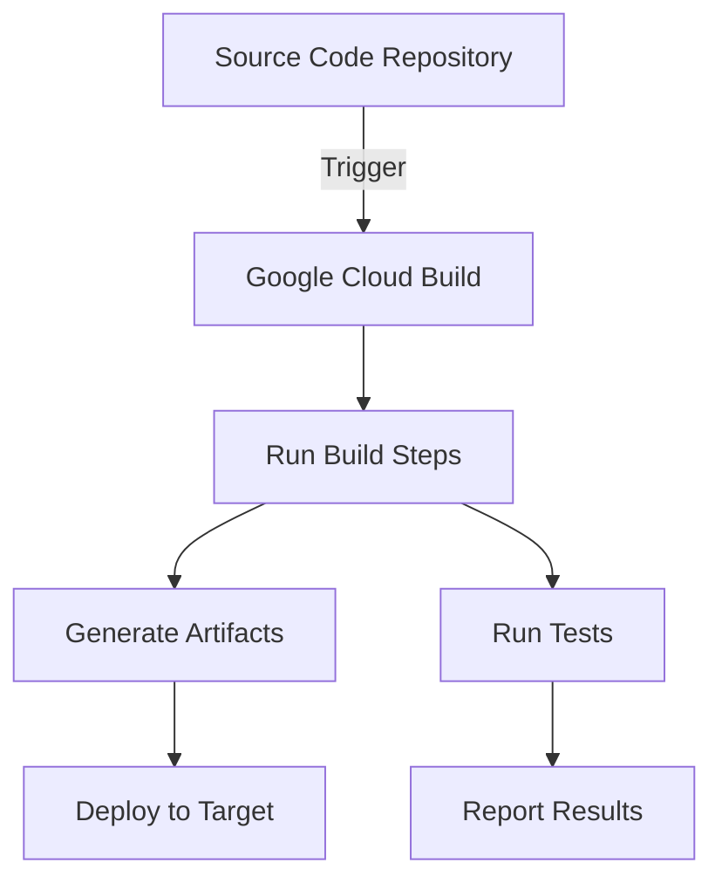

# CICD Google Cloud Build

## Introduction

Google Cloud Build is a fully managed continuous integration and continuous delivery (CI/CD) platform that helps you build, test, and deploy applications quickly and efficiently. As part of Google Cloud Platform (GCP), Cloud Build integrates seamlessly with other GCP services and supports a wide range of programming languages and tools.

In this guide, you'll learn how Cloud Build works, its key features, and how to set up your first CI/CD pipeline using Google Cloud Build.

## What is CI/CD?

Before diving into Cloud Build, let's understand what CI/CD means:

- **Continuous Integration (CI)**: The practice of frequently merging code changes into a central repository, followed by automated builds and tests.
- **Continuous Delivery (CD)**: The practice of automatically preparing code for release to production and making the release process repeatable and reliable.

CI/CD helps teams deliver code changes more frequently and reliably, which is essential in today's fast-paced development environment.

## Key Features of Google Cloud Build

- **Serverless**: No need to provision or manage servers
- **Scalable**: Automatically scales based on your build needs
- **Flexible**: Supports Docker, Gradle, Maven, Bazel, and more
- **Integrated**: Works with GitHub, Bitbucket, Cloud Source Repositories
- **Secure**: Built-in authentication and encryption
- **Cost-effective**: First 120 build-minutes per day are free

## How Google Cloud Build Works

Google Cloud Build uses a concept called **build steps** to define your CI/CD pipeline. Each build step is a Docker container that performs a specific action.



## Getting Started with Google Cloud Build

### Prerequisites

- A Google Cloud Platform account
- A project with billing enabled
- Cloud Build API enabled
- Source code in GitHub, Bitbucket, or Cloud Source Repositories

### Setting Up Your First Build

1. Create a `cloudbuild.yaml` file in the root of your project:

```yaml
steps:
  # Build the container image
  - name: 'gcr.io/cloud-builders/docker'
    args: ['build', '-t', 'gcr.io/$PROJECT_ID/my-app:$COMMIT_SHA', '.']
  # Push the container image to Container Registry
  - name: 'gcr.io/cloud-builders/docker'
    args: ['push', 'gcr.io/$PROJECT_ID/my-app:$COMMIT_SHA']
  # Deploy to Cloud Run
  - name: 'gcr.io/google.com/cloudsdktool/cloud-sdk'
    entrypoint: gcloud
    args:
      - 'run'
      - 'deploy'
      - 'my-app'
      - '--image'
      - 'gcr.io/$PROJECT_ID/my-app:$COMMIT_SHA'
      - '--region'
      - 'us-central1'
      - '--platform'
      - 'managed'
      - '--allow-unauthenticated'
images:
  - 'gcr.io/$PROJECT_ID/my-app:$COMMIT_SHA'
```

2. Connect your repository to Cloud Build:
   - Go to the Cloud Build console
   - Click "Create Trigger"
   - Connect your repository
   - Configure the trigger settings

### Understanding Build Configuration

The `cloudbuild.yaml` file defines your build pipeline through a series of steps. Each step runs in a separate container and can access the workspace.

#### Common Build Steps

1. **Dependency Installation**

```yaml
steps:
  - name: 'gcr.io/cloud-builders/npm'
    args: ['install']
```

2. **Running Tests**

```yaml
steps:
  - name: 'gcr.io/cloud-builders/npm'
    args: ['test']
```

3. **Building Docker Images**

```yaml
steps:
  - name: 'gcr.io/cloud-builders/docker'
    args: ['build', '-t', 'gcr.io/$PROJECT_ID/my-app:$COMMIT_SHA', '.']
```

## Build Triggers

Cloud Build can automatically start builds in response to various events:

- Code changes in repositories (GitHub, Bitbucket, Cloud Source Repositories)
- Manual triggers
- Scheduled builds
- Cloud Pub/Sub messages

### Creating a GitHub Trigger

1. Connect your GitHub repository in the Cloud Build console
2. Create a new trigger with these settings:
   - **Name**: `my-app-trigger`
   - **Event**: Push to a branch
   - **Branch**: `^main$` (regular expression for main branch)
   - **Build configuration**: Cloud Build configuration file
   - **Build configuration location**: Repository

## Real-World Example: Node.js Application Pipeline

Let's build a complete CI/CD pipeline for a Node.js application:

### Project Structure

```
my-nodejs-app/
├── src/
│   ├── app.js
│   └── ...
├── test/
│   └── app.test.js
├── Dockerfile
├── package.json
└── cloudbuild.yaml
```

### Dockerfile

```Dockerfile
FROM node:16-alpine

WORKDIR /app

COPY package*.json ./
RUN npm install --production

COPY . .

EXPOSE 8080
CMD ["node", "src/app.js"]
```

### cloudbuild.yaml

```yaml
steps:
  # Install dependencies
  - name: 'gcr.io/cloud-builders/npm'
    args: ['install']
  
  # Run tests
  - name: 'gcr.io/cloud-builders/npm'
    args: ['test']
  
  # Build the container image
  - name: 'gcr.io/cloud-builders/docker'
    args: ['build', '-t', 'gcr.io/$PROJECT_ID/nodejs-app:$COMMIT_SHA', '.']
  
  # Push the image to Container Registry
  - name: 'gcr.io/cloud-builders/docker'
    args: ['push', 'gcr.io/$PROJECT_ID/nodejs-app:$COMMIT_SHA']
  
  # Deploy to Cloud Run
  - name: 'gcr.io/google.com/cloudsdktool/cloud-sdk'
    entrypoint: gcloud
    args:
      - 'run'
      - 'deploy'
      - 'nodejs-app'
      - '--image'
      - 'gcr.io/$PROJECT_ID/nodejs-app:$COMMIT_SHA'
      - '--region'
      - 'us-central1'
      - '--platform'
      - 'managed'
      - '--allow-unauthenticated'

# Store images in Google Container Registry
images:
  - 'gcr.io/$PROJECT_ID/nodejs-app:$COMMIT_SHA'

# Set timeout for the entire build
timeout: '1200s'
```

### Example Output

When this pipeline runs successfully, you'll see output similar to this in the Cloud Build console:

```
Starting Step #1 - "npm install"
Step #1 - "npm install": Done
Starting Step #2 - "npm test"
Step #2 - "npm test": 
> my-app@1.0.0 test
> jest

PASS  test/app.test.js
  ✓ should return 200 (32ms)
  ✓ should return correct content (3ms)

Test Suites: 1 passed, 1 total
Tests:       2 passed, 2 total
Snapshots:   0 total
Time:        1.032s
Ran all test suites.
Step #2 - "npm test": Done
Starting Step #3 - "docker build"
Step #3 - "docker build": Successfully built 9a7d5ec23f1a
Step #3 - "docker build": Successfully tagged gcr.io/my-project/nodejs-app:a1b2c3d
Step #3 - "docker build": Done
...
```

## Advanced Features

### Substitutions

Cloud Build supports variable substitutions in your build configuration:

```yaml
steps:
  - name: 'gcr.io/cloud-builders/npm'
    args: ['install']
    env:
      - 'NODE_ENV=${_NODE_ENV}'
substitutions:
  _NODE_ENV: production
```

### Concurrent Builds

You can run steps concurrently to speed up your build:

```yaml
steps:
  - name: 'gcr.io/cloud-builders/npm'
    id: 'install'
    args: ['install']
  
  - name: 'gcr.io/cloud-builders/npm'
    id: 'lint'
    args: ['run', 'lint']
    waitFor: ['install']
  
  - name: 'gcr.io/cloud-builders/npm'
    id: 'test'
    args: ['test']
    waitFor: ['install']
  
  - name: 'gcr.io/cloud-builders/npm'
    id: 'build'
    args: ['run', 'build']
    waitFor: ['lint', 'test']
```

### Notifications

You can set up notifications for build status:

1. Go to Cloud Build settings
2. Under "Notifications"
3. Add a new notification channel (email, Slack, Pub/Sub)

## Best Practices

1. **Use caching** to speed up builds:

```yaml
steps:
  - name: 'gcr.io/cloud-builders/npm'
    args: ['install']
    volumes:
      - name: 'node_modules'
        path: '/workspace/node_modules'
```

2. **Keep your build steps modular** for better maintainability
3. **Use build timeouts** to prevent runaway builds
4. **Include proper testing** in your pipeline
5. **Configure appropriate IAM permissions** for security

## Troubleshooting Cloud Build

### Common Issues

1. **Build Timeout**: Increase the timeout in your configuration
2. **Permission Errors**: Check IAM permissions
3. **Network Issues**: Ensure services can communicate
4. **Memory Errors**: Use a higher memory machine type

### Debugging Steps

1. Check build logs in the Cloud Build console
2. Use Cloud Build's "Retry" feature to rerun failed builds
3. Simplify your build to isolate the problem

## Summary

Google Cloud Build is a powerful, serverless CI/CD platform that integrates seamlessly with the Google Cloud ecosystem. It allows you to automate your build, test, and deployment processes, improving development velocity and code quality.

Key points to remember:
- Cloud Build uses YAML configuration files to define build steps
- Each step runs in its own container
- Cloud Build integrates with popular source repositories
- You can set up triggers to automate builds
- First 120 build-minutes per day are free

## Additional Resources

- [Official Google Cloud Build Documentation](https://cloud.google.com/build/docs)
- [Cloud Build GitHub Actions](https://github.com/GoogleCloudPlatform/github-actions)
- [Community Cloud Build Sample Projects](https://github.com/GoogleCloudPlatform/cloud-build-samples)

## Practice Exercises

1. Set up a basic Cloud Build pipeline for a simple web application
2. Configure a build trigger that runs on pull requests
3. Implement caching to speed up your builds
4. Set up notifications for build failures
5. Create a multi-stage build that deploys to different environments based on the branch

By mastering Google Cloud Build, you'll have a powerful tool in your CI/CD toolkit that can help you deliver high-quality software faster and more reliably.