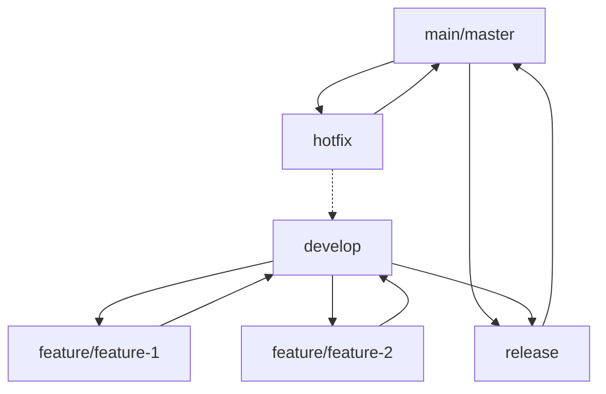
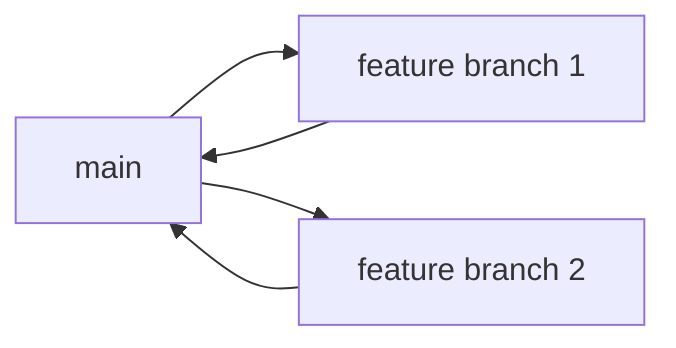
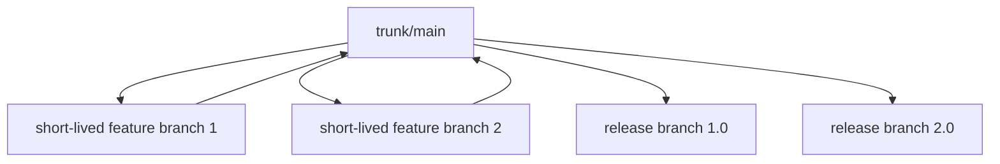
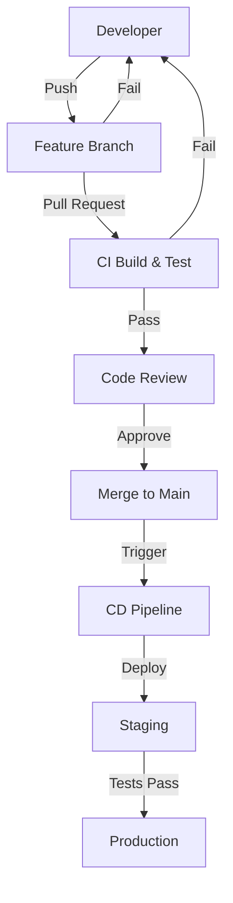

# CI/CD Branching

## Introduction

Branching is a fundamental concept in version control systems that plays a crucial role in Continuous Integration and Continuous Deployment (CI/CD) workflows. In this guide, we'll explore how branching strategies support CI/CD practices, enabling teams to collaborate efficiently while maintaining code quality and deployment stability.

Branching in CI/CD refers to organizing code development through separate lines of development (branches) that can be worked on independently before being integrated into the main codebase. A well-designed branching strategy is essential for:

- Enabling parallel development among team members
- Isolating features until they're ready for integration
- Providing a stable foundation for automated testing and deployment
- Supporting quick releases and hotfixes when needed
- Maintaining clean production code while development continues

Let's dive into the most common branching strategies used in CI/CD pipelines and understand how to implement them effectively.

## Common Branching Strategies for CI/CD

### 1. Git Flow

Git Flow is one of the most well-known branching models, particularly suited for projects with scheduled release cycles.



**Key Branches:**
- **Main/Master**: Contains production-ready code
- **Develop**: Integration branch for features
- **Feature branches**: Individual feature development
- **Release branches**: Preparation for release
- **Hotfix branches**: Emergency production fixes

**CI/CD Integration:**
```bash
# Feature branch workflow
git checkout develop
git pull
git checkout -b feature/user-authentication

# After feature completion
git add .
git commit -m "Implement user authentication"
git push origin feature/user-authentication

# Create pull request for develop branch
# CI automatically runs tests

# After merge to develop
# CD may deploy to staging environment

# For release
git checkout develop
git checkout -b release/1.0.0
# Fix any issues in release branch
git checkout main
git merge release/1.0.0
git tag -a v1.0.0 -m "Version 1.0.0"
# CD deploys to production
```

**Advantages:**
- Clear separation between production and development
- Well-structured workflow
- Support for multiple versions in production

**Disadvantages:**
- Can be complex for smaller projects
- Slower delivery cycle
- May require more maintenance

### 2. GitHub Flow

GitHub Flow is a simpler, lightweight workflow focused on regular deployment and collaboration.



**Key Branches:**
- **Main/Master**: Always deployable
- **Feature branches**: For all changes (features, fixes, experiments)

**CI/CD Integration:**
```bash
# Create feature branch from main
git checkout main
git pull
git checkout -b feature/payment-integration

# Regular commits with push
git add .
git commit -m "Add payment processor integration"
git push origin feature/payment-integration

# Open pull request
# CI runs automated tests

# After code review and tests pass
# Merge to main
# CD automatically deploys to production
```

**Advantages:**
- Simplicity
- Continuous deployment
- Straightforward workflow

**Disadvantages:**
- Less suitable for projects requiring version maintenance
- Potential for unstable main branch if tests aren't thorough

### 3. Trunk-Based Development

Trunk-based development focuses on keeping all development on a single branch with frequent integration.



**Key Branches:**
- **Trunk/Main**: Primary development branch
- **Short-lived feature branches**: Small changes merged quickly (1-2 days)
- **Release branches**: Created only when needed for release stabilization

**CI/CD Integration:**
```bash
# Small feature branch (1-2 days max)
git checkout main
git pull
git checkout -b feature/add-search

# Complete feature quickly
git add .
git commit -m "Add search functionality"
git push origin feature/add-search

# Create pull request to main
# CI runs tests

# After merge
# Feature flags may control visibility in production
# CD deploys to production several times daily
```

**Advantages:**
- Very fast integration
- Reduces merge conflicts
- Supports continuous deployment
- Lower overhead

**Disadvantages:**
- Requires strong testing practices
- May require feature flags for incomplete features

## CI/CD Pipeline Integration with Branching

Let's examine how a CI/CD pipeline connects with your branching strategy:



### Pipeline Configuration Example

Here's an example of how you might configure a CI/CD pipeline with different branch types using GitHub Actions:

```yaml
name: CI/CD Pipeline

on:
  push:
    branches: [ main, develop, feature/*, release/* ]
  pull_request:
    branches: [ main, develop ]

jobs:
  build:
    runs-on: ubuntu-latest
    steps:
      - uses: actions/checkout@v3
      
      - name: Set up Node.js
        uses: actions/setup-node@v3
        with:
          node-version: '18'
          
      - name: Install dependencies
        run: npm ci
        
      - name: Run linter
        run: npm run lint
        
      - name: Run tests
        run: npm test
        
  deploy-staging:
    needs: build
    if: github.ref == 'refs/heads/develop'
    runs-on: ubuntu-latest
    steps:
      - uses: actions/checkout@v3
      - name: Deploy to staging
        run: ./deploy.sh staging
        
  deploy-production:
    needs: build
    if: github.ref == 'refs/heads/main'
    runs-on: ubuntu-latest
    steps:
      - uses: actions/checkout@v3
      - name: Deploy to production
        run: ./deploy.sh production
```

## Best Practices for CI/CD Branching

### 1. Keep Branches Short-Lived

Long-lived branches lead to integration challenges. Aim to merge feature branches within 1-3 days to minimize merge conflicts and ensure continuous integration.

### 2. Automate Testing for Every Branch

Configure your CI system to automatically run tests for all branches:

```yaml
# Example CircleCI config snippet
version: 2.1
jobs:
  test:
    docker:
      - image: cimg/node:18.0
    steps:
      - checkout
      - run: npm install
      - run: npm test

workflows:
  version: 2
  build-test:
    jobs:
      - test:
          filters:
            branches:
              only: /.*/  # Run tests on all branches
```

### 3. Branch Protection Rules

Implement branch protection rules to maintain code quality:

- Require code reviews before merging
- Require status checks to pass
- Prevent force pushes to protected branches

### 4. Use Feature Flags

Decouple feature releases from code deployment by implementing feature flags:

```javascript
// Example of a feature flag implementation
function showNewFeature(user) {
  if (featureFlags.isEnabled('new-dashboard', user.id)) {
    return <NewDashboard />;
  }
  return <CurrentDashboard />;
}
```

### 5. Meaningful Branch Names

Follow a consistent naming convention:

```
feature/user-authentication
bugfix/login-error
hotfix/security-patch-1234
release/2.3.0
```

### 6. Rebase Before Merging

Keep your branch history clean by rebasing before merging:

```bash
# Update your feature branch with latest changes from main
git checkout feature/user-profile
git fetch origin
git rebase origin/main

# Resolve any conflicts
git add .
git rebase --continue

# Push to remote (force push needed after rebase)
git push origin feature/user-profile --force-with-lease
```

## Real-world Example: E-commerce Site Feature Release

Let's walk through a complete example of using branching in a CI/CD workflow for an e-commerce site adding a new payment method:

### 1. Create Feature Branch

```bash
git checkout main
git pull
git checkout -b feature/stripe-integration
```

### 2. Development and Local Testing

```bash
# Make changes to integrate Stripe
# Run local tests
npm test

# Commit changes
git add .
git commit -m "Add Stripe payment gateway integration"
git push origin feature/stripe-integration
```

### 3. CI Process Activation

When the branch is pushed, CI automatically:
- Builds the application
- Runs unit tests
- Performs code quality checks
- Creates a test deployment

### 4. Code Review and Refinement

- Create a pull request
- Team performs code review
- Make necessary changes based on feedback
- CI continues to validate each update

### 5. Integration to Main Branch

```bash
# After approval
# The PR is merged to main
# CI builds the main branch
```

### 6. Staging Deployment

```bash
# CD pipeline automatically deploys to staging
# Integration tests run in staging environment
# QA team performs additional testing
```

### 7. Production Deployment

```bash
# After staging validation
# CD pipeline deploys to production
# Feature flag controls visibility
# Monitoring systems track performance
```

## Common Challenges and Solutions

### Challenge: Merge Conflicts

**Solution:**
- Integrate frequently
- Keep branches small and focused
- Use git rebase instead of merge when appropriate

### Challenge: Slow CI Pipeline

**Solution:**
- Implement parallel testing
- Use caching for build artifacts
- Consider running only relevant tests per branch

```yaml
# Example of test splitting in CircleCI
jobs:
  test:
    parallelism: 4
    steps:
      - checkout
      - run:
          command: |
            TESTFILES=$(circleci tests glob "tests/**/*.test.js" | circleci tests split)
            npm test -- $TESTFILES
```

### Challenge: Broken Main Branch

**Solution:**
- Implement strict branch protection
- Fix broken builds immediately (highest priority)
- Consider using merge queues for high-activity repositories

## Summary

Effective branching strategies are essential for successful CI/CD implementation. By choosing the right approach for your team's needs and project requirements, you can significantly improve development efficiency, code quality, and deployment reliability.

Remember these key points:
- Choose a branching strategy that fits your team size and release cadence
- Keep branches short-lived and focused
- Automate testing for all branches
- Use feature flags to separate deployment from release
- Maintain clean history with proper naming and rebasing
- Prioritize fixing broken builds immediately

## Additional Resources

- [Learn more about Git branching models](https://git-scm.com/book/en/v2/Git-Branching-Branching-Workflows)
- [CI/CD best practices](https://www.atlassian.com/continuous-delivery/principles/continuous-integration-vs-delivery-vs-deployment)
- [Feature flags implementation guide](https://martinfowler.com/articles/feature-toggles.html)

## Exercises

1. **Branching Strategy Design**: Design a branching strategy for a team of 5 developers working on a web application with monthly releases.

2. **CI Pipeline Configuration**: Create a basic CI pipeline configuration file (GitHub Actions, GitLab CI, or CircleCI) that implements testing for different branch types.

3. **Feature Flag Implementation**: Implement a simple feature flag system that allows toggling features based on environment and user roles.

4. **Branch Management Simulation**: Practice resolving merge conflicts by creating conflicting branches and resolving them using both merge and rebase approaches.