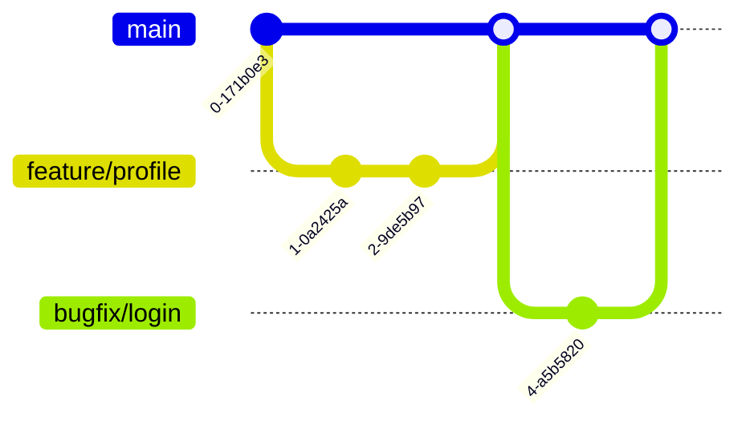

# CI/CD Merging

## Introduction

Code merging is a critical part of any modern software development workflow, but when combined with Continuous Integration and Continuous Deployment (CI/CD) pipelines, it takes on even greater importance. This guide will explore how to effectively manage code merges within CI/CD workflows, common challenges, best practices, and practical techniques that ensure smooth integration of your team's code.

When working on a project with multiple developers, integrating everyone's changes into a single codebase can become complex. CI/CD merging streamlines this process by automating many aspects of code integration, verification, and deployment, reducing errors and saving time.

## Understanding CI/CD Merging

CI/CD merging refers to the set of practices and automated processes that handle how code changes are combined and validated before deployment in a continuous integration/continuous deployment environment.

### Key Components

1. **Version Control**: The foundation of CI/CD merging (typically Git)
2. **Branch Strategies**: Frameworks for organizing code changes
3. **Automated Testing**: Validation mechanisms for merged code
4. **Pull/Merge Requests**: Formalized processes for code review and integration
5. **CI/CD Pipeline Integration**: Automation of the merge process

## Branch Strategies for CI/CD

Before discussing merge techniques, it's important to understand common branching strategies that support CI/CD workflows.

### GitFlow

GitFlow is a branching model that uses multiple long-living branches:


### Trunk-Based Development

Trunk-based development uses short-lived feature branches merged frequently to a main trunk:


### GitHub Flow

A simplified workflow centered around the main branch:



## Automated Merge Techniques

Let's explore various merge techniques automated within CI/CD pipelines:

### 1. Standard Merge

The most common merge strategy that creates a merge commit.

```bash
# Create a feature branch
git checkout -b feature/new-login

# Make changes
echo "<button>Login</button>" > login.html
git add login.html
git commit -m "Add login button"

# Switch back to main and merge
git checkout main
git merge feature/new-login
```

This creates a merge commit in the history:

```
* abc1234 (HEAD -> main) Merge branch 'feature/new-login'
|\
| * def5678 (feature/new-login) Add login button
|/
* ghi9101 Initial commit
```

### 2. Fast-Forward Merge

A clean merge that occurs when there are no changes on the target branch since the feature branch was created.

```bash
# Create a feature branch
git checkout -b feature/signup

# Make changes
echo "<form>Signup form</form>" > signup.html
git add signup.html
git commit -m "Add signup form"

# Switch back to main and perform fast-forward merge
git checkout main
git merge --ff-only feature/signup
```

The resulting history looks linear:

```
* def5678 (HEAD -> main, feature/signup) Add signup form
* abc1234 Initial commit
```

### 3. Squash Merging

Combines all commits from a feature branch into a single commit on the target branch.

```bash
# Create a feature branch
git checkout -b feature/dashboard

# Make multiple commits
echo "<div>Chart 1</div>" > dashboard.html
git add dashboard.html
git commit -m "Add chart 1"

echo "<div>Chart 2</div>" >> dashboard.html
git add dashboard.html
git commit -m "Add chart 2"

# Switch back to main and squash merge
git checkout main
git merge --squash feature/dashboard
git commit -m "Add dashboard with charts"
```

The resulting history has a single commit:

```
* jkl2345 (HEAD -> main) Add dashboard with charts
* abc1234 Initial commit
```

## CI/CD Merge Pipeline Implementation

Let's look at how merging integrates into a CI/CD pipeline:

### Example GitHub Actions Workflow for Automated Merging

```yaml
name: CI/CD Merge Pipeline

on:
  pull_request:
    branches: [ main ]

jobs:
  build_and_test:
    runs-on: ubuntu-latest
    steps:
      - uses: actions/checkout@v3
      
      - name: Set up Node.js
        uses: actions/setup-node@v3
        with:
          node-version: '16'
          
      - name: Install dependencies
        run: npm install
        
      - name: Run tests
        run: npm test
        
      - name: Build application
        run: npm run build
        
  merge_check:
    needs: build_and_test
    runs-on: ubuntu-latest
    steps:
      - name: Check for merge conflicts
        uses: actions/checkout@v3
        with:
          fetch-depth: 0
          
      - name: Check if branch can be merged
        run: |
          git config --global user.name 'CI Bot'
          git config --global user.email 'bot@example.com'
          git checkout main
          git merge --no-commit --no-ff ${{ github.head_ref }} || (echo "Merge conflict detected!" && exit 1)
```

## Common Merge Challenges in CI/CD

### 1. Merge Conflicts

Merge conflicts occur when the same lines of code are modified in both branches:

```
<<<<<<< HEAD
function login(username, password) {
  // Main branch implementation
=======
function login(user, pass) {
  // Feature branch implementation
>>>>>>> feature/auth
}
```

**Solution**: Regular integrations and small, focused commits help minimize conflicts.

### 2. Breaking Changes

When merged code breaks the build or tests:

```bash
# CI pipeline output
$ npm test
FAIL src/auth.test.js
● Login component › handles invalid credentials

    Expected response code: 401
    Received: undefined

Test failed! Build stopped.
```

**Solution**: Comprehensive test coverage and pre-merge testing.

### 3. Long-Running Branches

Branches that live too long become increasingly difficult to merge:

```bash
git merge feature/large-refactor
# Results in 27 conflicts across 14 files
```

**Solution**: Adopt trunk-based development or implement feature flags.

## Best Practices for CI/CD Merging

1. **Small, Frequent Merges**: Keep changes small and merge often to reduce complexity.

2. **Automated Testing**: Ensure comprehensive test coverage to catch issues before merging:

```yaml
# In your CI configuration
test_stage:
  script:
    - npm run lint
    - npm run unit-tests
    - npm run integration-tests
  rules:
    - if: $CI_PIPELINE_SOURCE == 'merge_request_event'
```

3. **Branch Protection Rules**: Configure rules to enforce quality standards:

```json
// Example GitHub branch protection configuration
{
  "required_status_checks": {
    "strict": true,
    "contexts": [
      "build_and_test",
      "security_scan"
    ]
  },
  "enforce_admins": true,
  "required_pull_request_reviews": {
    "required_approving_review_count": 2
  }
}
```

4. **Feature Flags**: Merge code without activating it in production:

```javascript
// Feature flag implementation
function renderButton() {
  if (featureFlags.NEW_UI_ENABLED) {
    return <NewFancyButton />;
  }
  return <LegacyButton />;
}
```

5. **Merge Queues**: Prevent race conditions when multiple PRs are being merged:

```yaml
# GitLab merge queue configuration
merge_trains:
  max_trains_per_project: 5
  pipeline:
    stage: merge_train
    script:
      - echo "Running merge train tests"
```

## Real-World Example: Implementing a CI/CD Merge Strategy

Let's walk through setting up a complete merge strategy for a web application:

### Step 1: Define Branch Strategy in `CONTRIBUTING.md`

```markdown
# Contributing Guidelines

We use a trunk-based development approach:
- Create short-lived feature branches off `main`
- Keep changes small and focused
- Branch naming: `feature/short-description` or `fix/issue-description`
- Update your branch with main frequently
- Create a PR when ready for review
```

### Step 2: Configure CI/CD Pipeline (Jenkins)

```groovy
// Jenkinsfile
pipeline {
    agent any
    stages {
        stage('Build') {
            steps {
                sh 'npm install'
                sh 'npm run build'
            }
        }
        stage('Test') {
            parallel {
                stage('Unit Tests') {
                    steps {
                        sh 'npm run test:unit'
                    }
                }
                stage('Integration Tests') {
                    steps {
                        sh 'npm run test:integration'
                    }
                }
            }
        }
        stage('Merge Check') {
            when {
                expression { env.CHANGE_ID != null } // Only run on PRs
            }
            steps {
                sh '''
                    git checkout main
                    git pull
                    git merge --no-commit --no-ff origin/${CHANGE_BRANCH} || exit 1
                    git reset --hard HEAD
                '''
            }
        }
    }
    post {
        success {
            echo 'Ready to merge!'
        }
    }
}
```

### Step 3: Implement Feature Flags for Safe Merging

```javascript
// feature-flags.js
const FEATURES = {
  NEW_CHECKOUT: process.env.ENABLE_NEW_CHECKOUT === 'true',
  REDESIGNED_PROFILE: process.env.ENABLE_REDESIGNED_PROFILE === 'true',
};

export function isFeatureEnabled(featureName) {
  return FEATURES[featureName] || false;
}
```

### Step 4: Automate Deployment After Successful Merge

```yaml
# GitHub Actions workflow
name: Deploy after merge

on:
  push:
    branches: [ main ]

jobs:
  deploy:
    runs-on: ubuntu-latest
    steps:
      - uses: actions/checkout@v3
      
      - name: Deploy to production
        run: |
          npm install
          npm run build
          ./deploy.sh production
```

## Advanced Merge Techniques

### 1. Semantic Merge

Some tools can understand code structures to resolve conflicts more intelligently.

### 2. Rebase Workflow

A cleaner alternative to merging:

```bash
# Start a feature branch
git checkout -b feature/payment-api
# Make changes
git commit -m "Implement payment API"

# Before merging, rebase on main
git fetch origin
git rebase origin/main

# Push to remote (force needed after rebase)
git push --force-with-lease

# Finally, merge to main (will be fast-forward)
git checkout main
git merge feature/payment-api
```

### 3. Cherry-picking

Selecting specific commits to apply:

```bash
# Find the commit to cherry-pick
git log --oneline feature/experimental

# Apply specific commit to main
git checkout main
git cherry-pick abc1234
```

## Summary

Effective CI/CD merging combines well-structured branch strategies, automated testing, and careful integration processes. By adopting practices like small, frequent merges, comprehensive testing, and feature flags, teams can maintain high code quality while moving quickly.

Remember these key points:
- Choose a branch strategy that suits your team size and release cadence
- Automate testing and validation before merges
- Keep branches short-lived and focused
- Use feature flags for safer deployments
- Configure branch protection to maintain quality standards

## Exercises

1. Set up a sample project with GitHub Actions that implements automated testing on pull requests.
2. Compare the outcomes of using different merge strategies (standard, squash, rebase) on the same feature branch.
3. Implement a feature flag system in a small web application.
4. Practice resolving merge conflicts in a simulated team environment.
5. Create a complete CI/CD pipeline that includes automated merging for a simple application.

## Additional Resources

- [Git Documentation](https://git-scm.com/doc)
- [GitHub Flow Guide](https://guides.github.com/introduction/flow/)
- [Trunk Based Development](https://trunkbaseddevelopment.com/)
- [Feature Flag Best Practices](https://martinfowler.com/articles/feature-toggles.html)
- [CI/CD Pipeline Design Patterns](https://continuousdelivery.com/patterns/)