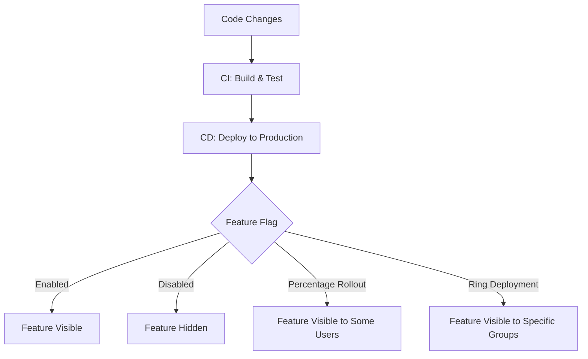

# CICD Feature Flags

## Introduction

Feature flags (also known as feature toggles, feature switches, or feature flippers) are a powerful technique in modern software development that allows teams to modify system behavior without changing code. When integrated into a CI/CD (Continuous Integration/Continuous Deployment) pipeline, feature flags enable developers to deploy code to production that may not be ready for all users, effectively separating code deployment from feature release.

Think of feature flags as light switches in your code that you can turn on or off remotely. This gives you incredible flexibility to:

- Deploy features incrementally to specific user groups
- Test features in production with minimal risk
- Roll back problematic features without redeploying code
- Conduct A/B testing to compare different implementations

This article will guide you through understanding and implementing feature flags in your CI/CD pipeline, even if you're just getting started with development practices.

## Understanding Feature Flags

### What is a Feature Flag?

At its core, a feature flag is a conditional statement in your code that determines whether a particular feature is enabled or disabled. Here's a simple example:

```javascript
// Simple feature flag implementation
if (featureFlags.isEnabled('new-search-algorithm')) {
  // Use the new search algorithm
  return newSearchAlgorithm(query);
} else {
  // Use the existing search algorithm
  return currentSearchAlgorithm(query);
}
```

The conditional check `featureFlags.isEnabled('new-search-algorithm')` acts as a switch that can be turned on or off without changing the code itself. The state of this switch is typically stored in a configuration file, database, or managed through a feature flag service.

### Types of Feature Flags

Feature flags can be categorized based on their lifecycle and purpose:

1. **Release Flags**: Used to hide incomplete or untested features from users
2. **Experiment Flags**: Used for A/B testing to measure impact
3. **Ops Flags**: Used to control operational aspects like system performance
4. **Permission Flags**: Used to provide features to specific user segments

## Feature Flags in the CI/CD Pipeline

### How Feature Flags Enhance CI/CD

A typical CI/CD pipeline without feature flags faces a challenge: code must be completely ready before it can be deployed to production. This can lead to:

- Long-lived feature branches
- Delayed integration
- Large, risky deployments

With feature flags, the CI/CD pipeline becomes more flexible:



This allows teams to:
- Merge code more frequently, even if features aren't complete
- Deploy code to production in a disabled state
- Enable features gradually or for specific users
- Roll back problematic features without code changes

### Integration Points in the Pipeline

Feature flags interact with your CI/CD pipeline at several key points:

1. **Development**: Developers create flags to isolate new functionality
2. **Testing**: QA can test both with flags on and off
3. **Deployment**: Code deploys with flags off for new features
4. **Release**: Features are enabled via flag configuration, not code deployment
5. **Monitoring**: Usage and errors are tracked by flag state

## Implementing Feature Flags

### Basic Implementation

Let's implement a simple feature flag system in a Node.js application:

```javascript
// feature-flags.js - A simple feature flag service
class FeatureFlags {
  constructor() {
    this.flags = {
      'new-login-page': false,
      'advanced-search': false,
      'dark-mode': true
    };
  }

  isEnabled(featureName) {
    return this.flags[featureName] === true;
  }
  
  enable(featureName) {
    this.flags[featureName] = true;
  }
  
  disable(featureName) {
    this.flags[featureName] = false;
  }
}

module.exports = new FeatureFlags();
```

Using this service in your application:

```javascript
// app.js
const featureFlags = require('./feature-flags');
const express = require('express');
const app = express();

app.get('/search', (req, res) => {
  if (featureFlags.isEnabled('advanced-search')) {
    // New advanced search functionality
    return res.json(performAdvancedSearch(req.query.term));
  } else {
    // Current search functionality
    return res.json(performBasicSearch(req.query.term));
  }
});

// Other routes and server setup...
```

### More Advanced Implementation

For production applications, you'll want a more robust solution that can:
1. Load flags from external configuration
2. Update flag states without redeployment
3. Target specific users or user segments

Here's a more sophisticated example:

```javascript
// advanced-feature-flags.js
class AdvancedFeatureFlags {
  constructor() {
    this.flags = {};
    this.loadFlags();
    
    // Refresh flags every 5 minutes
    setInterval(() => this.loadFlags(), 5 * 60 * 1000);
  }
  
  async loadFlags() {
    try {
      // Load from database, API, or configuration service
      const response = await fetch('https://config-server/feature-flags');
      this.flags = await response.json();
      console.log('Feature flags refreshed');
    } catch (error) {
      console.error('Failed to refresh feature flags:', error);
    }
  }
  
  isEnabled(featureName, userId = null) {
    const flag = this.flags[featureName];
    
    if (!flag) return false;
    
    // Simple boolean flag
    if (typeof flag === 'boolean') {
      return flag;
    }
    
    // Percentage rollout
    if (flag.percentage) {
      // Generate a consistent hash based on feature name and user ID
      const hash = this.hashUser(featureName, userId);
      return (hash % 100) < flag.percentage;
    }
    
    // User targeting
    if (flag.enabledForUsers && userId) {
      return flag.enabledForUsers.includes(userId);
    }
    
    return false;
  }
  
  hashUser(featureName, userId) {
    // Simple hash function for demo purposes
    if (!userId) return Math.random() * 100;
    
    let hash = 0;
    const combinedString = featureName + userId;
    for (let i = 0; i < combinedString.length; i++) {
      hash = ((hash << 5) - hash) + combinedString.charCodeAt(i);
      hash |= 0; // Convert to 32bit integer
    }
    return Math.abs(hash) % 100;
  }
}

module.exports = new AdvancedFeatureFlags();
```

### Popular Feature Flag Services

While you can build your own feature flag system, there are many production-ready solutions available:

1. **LaunchDarkly**: Comprehensive feature flag service with advanced targeting
2. **Split.io**: Feature experimentation platform with analytics
3. **Flagsmith**: Open-source feature flag and remote config service
4. **CloudBees Feature Management**: Enterprise-grade feature management
5. **Firebase Remote Config**: For mobile and web applications

Most of these services provide SDKs for various programming languages and frameworks.

## Best Practices for Feature Flags in CI/CD

### Organizing Feature Flags

1. **Naming Conventions**: Use clear, consistent names like `feature-name-action`
2. **Documentation**: Document the purpose and expected lifetime of each flag
3. **Categorization**: Group flags by purpose (release, experiment, ops)

### Flag Lifecycle Management

Feature flags should not live forever. Implement a process to:

1. **Review flags regularly**: Schedule reviews of active flags
2. **Remove obsolete flags**: Once a feature is fully adopted, remove its flag
3. **Track flag usage**: Monitor which code paths use which flags

For example, you might add creation dates and owners to your flags:

```javascript
const flags = {
  'new-checkout-process': {
    enabled: false,
    createdDate: '2023-04-15',
    owner: 'payment-team',
    expectedRemovalDate: '2023-07-01'
  }
};
```

### Testing with Feature Flags

Testing becomes more complex with feature flags. You should:

1. **Test both states**: Ensure your application works with the flag on or off
2. **Test transitions**: Verify that toggling a flag at runtime works correctly
3. **Include flag state in test reports**: Log which flag states were tested

Example Jest test for feature flag functionality:

```javascript
// checkout.test.js
const featureFlags = require('./feature-flags');
const checkoutService = require('./checkout-service');

describe('Checkout Process', () => {
  test('should use new process when flag is enabled', () => {
    // Setup
    featureFlags.enable('new-checkout-process');
    
    // Test
    const result = checkoutService.processOrder({items: [{id: 1, qty: 2}]});
    
    // Assert
    expect(result.processingMethod).toBe('new');
  });
  
  test('should use old process when flag is disabled', () => {
    // Setup
    featureFlags.disable('new-checkout-process');
    
    // Test
    const result = checkoutService.processOrder({items: [{id: 1, qty: 2}]});
    
    // Assert
    expect(result.processingMethod).toBe('legacy');
  });
});
```

## Real-World Examples

### Gradual Rollout for a New UI

Imagine you're updating your application's dashboard with a completely new design. Instead of releasing it to all users at once, you can use feature flags for a gradual rollout:

```javascript
// Dashboard component
import React from 'react';
import { useFeatureFlags } from './feature-flags-hook';

function Dashboard() {
  const { isEnabled } = useFeatureFlags();
  
  if (isEnabled('new-dashboard-ui', getUserId())) {
    return <NewDashboard />;
  } else {
    return <CurrentDashboard />;
  }
}
```

With the corresponding flag configuration:

```javascript
{
  'new-dashboard-ui': {
    // Week 1: Internal users only
    enabledForUsers: ['internal-team-1', 'internal-team-2'],
    
    // Week 2: 5% of users
    percentage: 5,
    
    // Week 3: 20% of users
    // percentage: 20,
    
    // Week 4: 50% of users
    // percentage: 50,
    
    // Week 5: All users
    // percentage: 100,
  }
}
```

This approach allows you to:
1. Test with internal users first
2. Monitor performance and errors at each stage
3. Roll back if issues arise
4. Gradually increase exposure until all users have the new UI

### Feature Flag for a New Payment Provider

When integrating a new payment provider, you might want to test it with real transactions but limit exposure:

```javascript
function processPayment(order) {
  if (featureFlags.isEnabled('new-payment-provider', order.userId)) {
    try {
      return newPaymentProvider.process(order);
    } catch (error) {
      // Log the error
      logger.error('New payment provider failed', error);
      
      // Fall back to the existing provider
      return currentPaymentProvider.process(order);
    }
  } else {
    return currentPaymentProvider.process(order);
  }
}
```

This implementation:
1. Only routes some users to the new payment provider
2. Includes a fallback mechanism if the new provider fails
3. Logs errors for monitoring

## Common Challenges and Solutions

### Challenge: Flag Explosion

**Problem**: Too many flags make code hard to follow and maintain.

**Solution**: 
- Regularly audit and remove unused flags
- Use a hierarchical flag structure
- Implement automated tracking of flag usage in code

### Challenge: Configuration Drift

**Problem**: Different environments have different flag configurations, causing inconsistent behavior.

**Solution**:
- Keep a version-controlled default configuration
- Automate configuration deployment
- Log and alert on configuration changes

### Challenge: Testing Complexity

**Problem**: Feature flags multiply the test cases needed.

**Solution**:
- Automate testing of both flag states
- Use feature flag testing frameworks
- Prioritize test coverage for critical paths

## Summary

Feature flags are a powerful tool for modern CI/CD pipelines, allowing teams to:

1. **Decouple deployment from release**: Deploy code without releasing features
2. **Reduce risk**: Test features in production with limited exposure
3. **Increase deployment frequency**: Merge incomplete features without breaking production
4. **Enable experimentation**: Easily conduct A/B tests and gather user feedback

When implemented correctly and managed properly, feature flags can significantly improve your team's ability to deliver software continuously and confidently.

## Additional Resources

### Libraries and Tools
- **JavaScript**: [unleash-client](https://github.com/Unleash/unleash-client-node), [flagsmith](https://github.com/Flagsmith/flagsmith-js-client)
- **Python**: [pytest-feature-flag](https://github.com/tomatohater/pytest-feature-flag)
- **Java**: [ff4j](https://github.com/ff4j/ff4j)
- **Go**: [flipt](https://github.com/flipt-io/flipt)

### Learning Resources
- Martin Fowler's article on [Feature Toggles](https://martinfowler.com/articles/feature-toggles.html)
- "Release It!" by Michael T. Nygard (Chapter on Decoupling Deployment and Release)
- "Accelerate" by Nicole Forsgren et al. (Research on CI/CD practices)

## Exercises

1. **Basic Implementation**: Create a simple feature flag system in your preferred language.
2. **Integration Exercise**: Add feature flags to an existing project to hide a new feature.
3. **Targeting Exercise**: Implement user targeting based on user properties.
4. **Management Exercise**: Design a process for reviewing and removing old feature flags.
5. **Testing Challenge**: Write tests that verify your application works correctly with different flag configurations.

By mastering feature flags in your CI/CD pipeline, you'll gain more control over your software releases and be able to deliver features to users more safely and confidently.