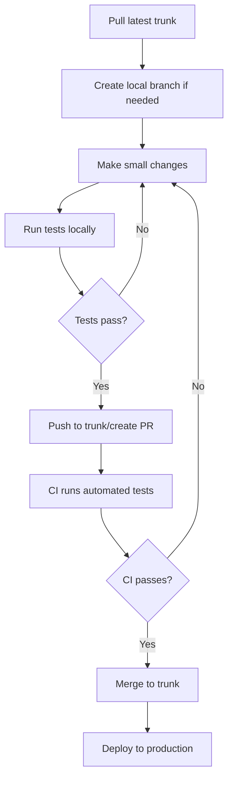
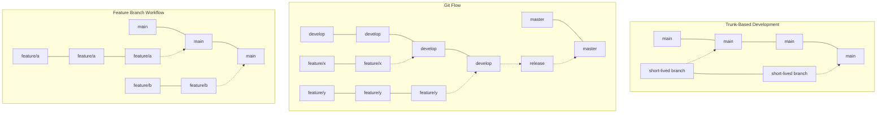

# CICD Trunk-Based Development

## Introduction

Trunk-Based Development (TBD) is a source control branching model where developers collaborate on code in a single branch called the "trunk," resisting the urge to create long-lived feature branches. In this approach, the main branch (often called `main` or `trunk`) is always kept in a releasable state, allowing for continuous integration and continuous delivery/deployment (CI/CD).

This practice stands in contrast to other branching strategies such as Git Flow or Feature Branch Workflow, which rely on multiple long-lived branches. Trunk-Based Development prioritizes integrating code frequently and maintaining a healthy, deployable codebase at all times.

## Key Principles of Trunk-Based Development

1. **Single Source of Truth**: The trunk is the single source of truth for the codebase
2. **Small, Frequent Commits**: Developers make small, frequent commits to the trunk
3. **Feature Toggles**: Incomplete features are hidden behind feature toggles
4. **Continuous Integration**: Automated tests run on every commit
5. **Short-Lived Branches**: When branches are used, they last no more than a day or two

## Benefits of Trunk-Based Development

- **Reduced Merge Conflicts**: Frequent integration means smaller changes and fewer conflicts
- **Faster Feedback**: Developers get immediate feedback on how their changes affect the system
- **Improved Collaboration**: The team works together on a single branch, encouraging communication
- **Simplified CI/CD**: Continuous Integration becomes more effective with all changes in one place
- **Higher Quality**: Issues are caught earlier in the development process

## Implementing Trunk-Based Development

### 1. Setting Up Your Repository

Start with a clean repository structure. Here's how to initialize a new Git repository with trunk-based principles:

```bash
# Initialize a new repository
git init my-project
cd my-project

# Create an initial commit on the main branch
echo "# My Project" > README.md
git add README.md
git commit -m "Initial commit"

# Set up branch protection (if using GitHub, GitLab, etc.)
# This would typically be done through the repository settings UI
```

### 2. Developer Workflow

In trunk-based development, developers follow this general workflow:



Let's break this down step by step:

#### a. Pull the latest trunk code

Always start by getting the latest code from the trunk:

```bash
git checkout main
git pull origin main
```

#### b. Create a local branch (optional)

For slightly larger changes, create a short-lived branch:

```bash
git checkout -b feature-x
```

#### c. Make small, focused changes

Write your code, keeping changes small and focused on a single task.

#### d. Test locally

Run tests to ensure your changes work as expected:

```bash
npm test  # For JavaScript projects
# or
pytest    # For Python projects
# etc.
```

#### e. Commit and integrate frequently

Commit your changes and push to the trunk (or create a pull request):

```bash
git add .
git commit -m "Add feature X"

# If working directly on main:
git push origin main

# If working on a branch:
git push origin feature-x
# Then create a pull request through your Git provider's UI
```

### 3. Working with Feature Toggles

Feature toggles (also called feature flags) allow incomplete features to be merged into the trunk without affecting the user experience. Here's a simple example in JavaScript:

```javascript
// A simple feature toggle implementation
const FEATURES = {
  NEW_DASHBOARD: false,  // Feature is not ready yet
  IMPROVED_SEARCH: true  // Feature is ready for users
};

function showDashboard() {
  if (FEATURES.NEW_DASHBOARD) {
    return renderNewDashboard();
  } else {
    return renderCurrentDashboard();
  }
}
```

In this example, the new dashboard code can be safely merged into the trunk but won't be visible to users until the toggle is switched to `true`.

### 4. CI/CD Pipeline Configuration

A robust CI/CD pipeline is essential for trunk-based development. Here's an example GitHub Actions workflow:

```yaml
name: CI/CD Pipeline

on:
  push:
    branches: [ main ]
  pull_request:
    branches: [ main ]

jobs:
  test:
    runs-on: ubuntu-latest
    steps:
    - uses: actions/checkout@v3
    - name: Set up environment
      uses: actions/setup-node@v3
      with:
        node-version: '16'
    - name: Install dependencies
      run: npm ci
    - name: Run tests
      run: npm test
    - name: Run linter
      run: npm run lint

  deploy:
    needs: test
    if: github.ref == 'refs/heads/main'
    runs-on: ubuntu-latest
    steps:
    - uses: actions/checkout@v3
    - name: Deploy to production
      run: ./deploy.sh  # Your deployment script
```

This workflow runs tests on every pull request and commit to the main branch, and automatically deploys when changes are merged to the main branch.

## Real-World Example: E-commerce Application

Let's consider a practical example of implementing trunk-based development for an e-commerce application.

### Scenario: Adding a New Payment Method

The team wants to add a new payment method (cryptocurrency) to the checkout process. Here's how they would approach it using trunk-based development:

1. **Break Down the Work**:
   - Update the payment interface to include crypto options
   - Implement the crypto payment processor integration
   - Add UI elements for the new payment flow
   - Update the order confirmation process

2. **Create a Feature Toggle**:

```javascript
// In config/features.js
export const FEATURES = {
  CRYPTO_PAYMENTS: process.env.ENABLE_CRYPTO_PAYMENTS === 'true'
};

// In payment-methods.js
import { FEATURES } from './config/features';

export function getAvailablePaymentMethods() {
  const methods = [
    { id: 'credit-card', name: 'Credit Card' },
    { id: 'paypal', name: 'PayPal' },
  ];
  
  if (FEATURES.CRYPTO_PAYMENTS) {
    methods.push({ id: 'crypto', name: 'Cryptocurrency' });
  }
  
  return methods;
}
```

3. **Implement in Small Increments**:

The team works on small parts of the feature, committing frequently to the trunk:

```bash
# Developer 1 - Add payment interface
git checkout main
git pull origin main
# Make changes to the payment interface
git add src/payments/
git commit -m "Add cryptocurrency payment interface"
git push origin main

# Developer 2 - Add UI components
git checkout main
git pull origin main
# Create UI components for crypto payments
git add src/components/payments/
git commit -m "Add cryptocurrency payment UI components"
git push origin main
```

4. **Deploy with Feature Toggle Off**:

The code is deployed to production with the feature toggle turned off, so users don't see the new payment option yet.

5. **Testing in Production**:

Team members can test the feature in production by enabling the feature toggle for themselves:

```bash
# For local development
ENABLE_CRYPTO_PAYMENTS=true npm start

# For specific users in production (using a more sophisticated feature flag system)
```

6. **Gradual Rollout**:

Once confident in the feature, they gradually roll it out to users:

1. Enable for internal users
2. Enable for 5% of customers
3. Enable for 20% of customers
4. Enable for all customers

## Challenges and Solutions

### Challenge 1: Merge Conflicts

Even with frequent integration, merge conflicts can still occur.

**Solution**: Pull from the trunk frequently (at least once a day) and keep changes small:

```bash
# Start your day by pulling the latest changes
git checkout main
git pull origin main

# If working on a branch, rebase it regularly
git checkout feature-x
git rebase main
```

### Challenge 2: Incomplete Features

Sometimes features take longer than a day to complete.

**Solution**: Use feature toggles as shown above, or break the work into smaller, independently valuable parts.

### Challenge 3: Code Quality

With frequent commits to the trunk, there's a risk of introducing bugs.

**Solution**: Implement strong automated testing and code review practices:

- Require all tests to pass before merging
- Use code coverage tools to ensure adequate test coverage
- Implement automated code quality checks
- Consider pair programming for complex changes

## Comparing Branching Strategies

Here's how Trunk-Based Development compares to other popular branching strategies:



## Summary

Trunk-Based Development is a powerful approach to source control that aligns perfectly with CI/CD practices. By keeping the trunk in a releasable state at all times and integrating frequently, teams can reduce integration issues, improve collaboration, and deliver features more quickly.

Key takeaways:
- Commit to the trunk frequently, at least once a day
- Use short-lived branches when needed, but merge them quickly
- Implement feature toggles for incomplete work
- Maintain a robust automated testing suite
- Break large features into smaller, independently valuable parts

## Additional Resources

- [Trunk Based Development website](https://trunkbaseddevelopment.com/)
- Martin Fowler's article on [Feature Toggles](https://martinfowler.com/articles/feature-toggles.html)
- The book "Continuous Delivery" by Jez Humble and David Farley

## Exercises

1. **Convert an Existing Project**: Take an existing project using a different branching strategy and convert it to use trunk-based development.

2. **Implement Feature Toggles**: Add a simple feature toggle system to your application.

3. **CI Pipeline Setup**: Configure a CI pipeline that runs tests on every commit and alerts the team if the trunk build breaks.

4. **Simulate Team Development**: With a partner, practice making concurrent changes to the same codebase using trunk-based development principles, resolving any conflicts that arise.

5. **Measure Improvement**: For an existing project, measure the time between code completion and deployment before and after implementing trunk-based development.