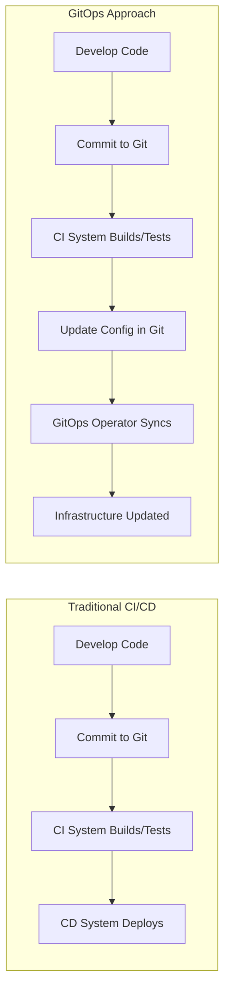

# CICD GitOps

## Introduction

GitOps is a paradigm that takes DevOps principles to the next level by using Git as the single source of truth for declarative infrastructure and applications. In a GitOps workflow, changes to your infrastructure are made through Git pull requests, which are then automatically applied to your environment. This approach combines the core concepts of Infrastructure as Code (IaC) with Git workflows to create a more reliable, consistent, and auditable deployment process.

Think of GitOps as "operations by pull request" - where Git becomes your system of record, and your entire system state is described declaratively and versioned in Git.

## What is GitOps?

GitOps was first coined by Weaveworks and is built on four key principles:

1. **Declarative**: The entire system (infrastructure and applications) is described declaratively
2. **Versioned and Immutable**: The canonical desired system state is versioned in Git
3. **Automatically Applied**: Approved changes are automatically applied to the system
4. **Continuously Reconciled**: Software agents ensure the actual system state matches the desired state

Let's break down how GitOps extends traditional CI/CD pipelines:



## GitOps vs Traditional CI/CD

Traditional CI/CD and GitOps share many similarities but differ in fundamental ways:

| Traditional CI/CD | GitOps |
|-------------------|--------|
| Push-based deployments | Pull-based deployments |
| CI server has direct access to production | CI server never accesses production |
| Credentials stored in CI system | Credentials stored in the cluster |
| Manual intervention for drift | Automatic reconciliation of drift |
| Multiple tools managing state | Git is the single source of truth |

## Setting Up a GitOps Workflow

Let's walk through setting up a basic GitOps workflow using Flux, one of the popular GitOps tools for Kubernetes.

### Step 1: Install Flux CLI

```bash
brew install fluxcd/tap/flux
# or
curl -s https://fluxcd.io/install.sh | sudo bash
```

### Step 2: Bootstrap Flux with your Git repository

```bash
# Export your GitHub personal access token
export GITHUB_TOKEN=<your-token>

# Bootstrap Flux
flux bootstrap github \
  --owner=<your-github-username> \
  --repository=<repository-name> \
  --path=clusters/my-cluster \
  --personal
```

This command creates a repository with the Flux components manifests, deploys Flux in your cluster, and configures it to sync the specified path in your repository.

### Step 3: Create your application manifests

Create a directory for your application in your repository:

```bash
mkdir -p apps/my-application
```

Create a simple deployment manifest:

```yaml
# apps/my-application/deployment.yaml
apiVersion: apps/v1
kind: Deployment
metadata:
  name: my-application
  namespace: default
spec:
  replicas: 3
  selector:
    matchLabels:
      app: my-application
  template:
    metadata:
      labels:
        app: my-application
    spec:
      containers:
      - name: my-application
        image: my-application:v1.0.0
        ports:
        - containerPort: 8080
```

### Step 4: Create a Flux Kustomization to sync your application

```yaml
# clusters/my-cluster/apps.yaml
apiVersion: kustomize.toolkit.fluxcd.io/v1
kind: Kustomization
metadata:
  name: apps
  namespace: flux-system
spec:
  interval: 1m
  path: ./apps
  sourceRef:
    kind: GitRepository
    name: flux-system
  prune: true
```

### Step 5: Commit and push your changes

```bash
git add .
git commit -m "Add my application"
git push
```

Flux will detect the changes in your repository and automatically apply them to your cluster.

## Practical Example: GitOps for Microservices Deployment

Let's work through a more complex example to illustrate how GitOps would work with multiple microservices.

### Repository Structure

A typical GitOps repository for managing multiple microservices might look like this:

```
├── apps/
│   ├── frontend/
│   │   ├── deployment.yaml
│   │   ├── service.yaml
│   │   ├── ingress.yaml
│   │   └── kustomization.yaml
│   ├── backend/
│   │   ├── deployment.yaml
│   │   ├── service.yaml
│   │   └── kustomization.yaml
│   └── database/
│       ├── statefulset.yaml
│       ├── service.yaml
│       ├── persistentvolume.yaml
│       └── kustomization.yaml
├── infrastructure/
│   ├── namespaces.yaml
│   ├── network-policies.yaml
│   ├── monitoring/
│   │   ├── prometheus.yaml
│   │   ├── grafana.yaml
│   │   └── kustomization.yaml
│   └── kustomization.yaml
└── clusters/
    ├── production/
    │   ├── flux-system/
    │   ├── apps.yaml
    │   ├── infrastructure.yaml
    │   └── kustomization.yaml
    └── staging/
        ├── flux-system/
        ├── apps.yaml
        ├── infrastructure.yaml
        └── kustomization.yaml
```

### Implementing a Feature Update using GitOps

Let's say you want to update your frontend application. Here's the workflow:

1. **Create a new branch for your changes**

```bash
git checkout -b feature/update-frontend
```

2. **Update the Docker image tag in your frontend deployment**

```yaml
# apps/frontend/deployment.yaml
apiVersion: apps/v1
kind: Deployment
metadata:
  name: frontend
  namespace: default
spec:
  replicas: 3
  selector:
    matchLabels:
      app: frontend
  template:
    metadata:
      labels:
        app: frontend
    spec:
      containers:
      - name: frontend
        # Updated image tag from v1.0.0 to v1.1.0
        image: my-company/frontend:v1.1.0
        ports:
        - containerPort: 80
```

3. **Commit and push your changes**

```bash
git add apps/frontend/deployment.yaml
git commit -m "Update frontend to v1.1.0"
git push origin feature/update-frontend
```

4. **Create a pull request**

Create a pull request from your feature branch to the main branch.

5. **Review and merge**

After code review and any CI checks pass, merge the pull request.

6. **Automatic deployment**

Flux detects the change in the repository and automatically updates your clusters to match the desired state. The frontend application will be updated to use the new image tag.

## The Git Pull Request Workflow

The GitOps workflow revolves around pull requests. Here's how it works:

1. **Propose Changes**: Developers create branches and make changes to the declarative configuration.
2. **Review**: Team members review the changes through pull requests.
3. **Automated Validation**: CI/CD pipelines automatically validate the changes.
4. **Merge**: Once approved, changes are merged to the main branch.
5. **Automated Deployment**: The GitOps operator detects the changes and applies them to the cluster.

This workflow provides several benefits:

- **Peer Review**: All changes go through code review
- **Audit Trail**: Complete history of changes in Git
- **Rollbacks**: Easy rollback to any previous state
- **Access Control**: Leverage Git's access control mechanisms

## GitOps Tools

There are several tools available for implementing GitOps:

1. **Flux**: A set of continuous and progressive delivery solutions for Kubernetes
2. **ArgoCD**: A declarative, GitOps continuous delivery tool for Kubernetes
3. **JenkinsX**: Extends Jenkins with GitOps automation for Kubernetes
4. **Rancher Fleet**: GitOps at scale for Kubernetes

Let's look at how to implement a basic application deployment using ArgoCD:

```yaml
# application.yaml
apiVersion: argoproj.io/v1alpha1
kind: Application
metadata:
  name: guestbook
  namespace: argocd
spec:
  project: default
  source:
    repoURL: https://github.com/argoproj/argocd-example-apps.git
    targetRevision: HEAD
    path: guestbook
  destination:
    server: https://kubernetes.default.svc
    namespace: guestbook
  syncPolicy:
    automated:
      prune: true
      selfHeal: true
```

This manifest tells ArgoCD to sync the "guestbook" application from the specified Git repository to the "guestbook" namespace in the cluster. The `syncPolicy` configuration enables automated sync and self-healing.

## Benefits of GitOps

GitOps offers numerous advantages for development and operations teams:

1. **Increased Productivity**: Developers use familiar tools (Git) for operations
2. **Enhanced Developer Experience**: Simplified deployment process with familiar Git workflows
3. **Improved Stability**: Declarative configurations reduce configuration drift
4. **Stronger Security**: Reduced need for cluster credentials and better access control
5. **Disaster Recovery**: Quick recovery from cluster failures by reapplying state from Git
6. **Audit Trail**: Complete history of all infrastructure changes
7. **Simplified Rollbacks**: Easy rollback to any previous state

## GitOps Best Practices

To get the most out of GitOps, follow these best practices:

1. **Separate Application and Infrastructure Repositories**: Keep application code and configuration separate
2. **Use Kustomize or Helm**: Manage environment-specific configurations
3. **Implement Trunk-Based Development**: Use short-lived feature branches
4. **Automate Everything**: From testing to deployment
5. **Monitor and Alert**: Detect drift and failed reconciliations
6. **Keep Secrets Secure**: Use tools like Sealed Secrets or external secret management
7. **Implement Progressive Delivery**: Use canary deployments and feature flags

## Advanced GitOps Patterns

As you get more comfortable with GitOps, consider these advanced patterns:

### 1. Multi-Environment Management

Manage multiple environments (development, staging, production) with different configurations:

```
├── base/
│   ├── deployment.yaml
│   ├── service.yaml
│   └── kustomization.yaml
└── overlays/
    ├── development/
    │   ├── kustomization.yaml
    │   └── patch.yaml
    ├── staging/
    │   ├── kustomization.yaml
    │   └── patch.yaml
    └── production/
        ├── kustomization.yaml
        └── patch.yaml
```

### 2. Secrets Management

Secure your secrets using tools like Sealed Secrets:

```bash
# Encrypt a secret
kubeseal -f secret.yaml -w sealed-secret.yaml

# Commit the sealed secret
git add sealed-secret.yaml
git commit -m "Add sealed secret"
git push
```

### 3. Progressive Delivery

Implement canary deployments with Flagger:

```yaml
apiVersion: flagger.app/v1beta1
kind: Canary
metadata:
  name: frontend
  namespace: default
spec:
  targetRef:
    apiVersion: apps/v1
    kind: Deployment
    name: frontend
  progressDeadlineSeconds: 60
  service:
    port: 80
    targetPort: 8080
  analysis:
    interval: 1m
    threshold: 10
    maxWeight: 50
    stepWeight: 10
    metrics:
      - name: request-success-rate
        thresholdRange:
          min: 99
        interval: 1m
      - name: request-duration
        thresholdRange:
          max: 500
        interval: 1m
```

## Common Challenges and Solutions

While GitOps offers many benefits, there are some challenges to be aware of:

| Challenge | Solution |
|-----------|----------|
| Secret Management | Use tools like Sealed Secrets, Vault, or External Secrets |
| Large Repositories | Split into multiple repositories with clear boundaries |
| Stateful Applications | Use operators and backup solutions |
| Slow Convergence | Optimize reconciliation intervals and repository structure |
| Team Collaboration | Define clear ownership and review processes |

## Summary

GitOps transforms how teams deploy and manage applications by leveraging Git as the single source of truth. By adopting GitOps practices, you can:

- Improve collaboration between development and operations
- Increase reliability and reproducibility of deployments
- Enhance security and auditability
- Simplify disaster recovery
- Accelerate development cycles

The key to successful GitOps implementation is embracing declarative configurations, using Git as your system of record, and automating deployment processes.

## Further Resources

To deepen your understanding of GitOps, check out these resources:

- [Flux Documentation](https://fluxcd.io/docs/)
- [ArgoCD Documentation](https://argo-cd.readthedocs.io/)
- [GitOps Working Group](https://github.com/open-gitops/documents)
- [Weaveworks GitOps Blog](https://www.weave.works/blog/category/gitops/)

## Exercises

1. Set up a basic GitOps workflow using Flux or ArgoCD for a simple web application
2. Implement a multi-environment setup (dev, staging, prod) using Kustomize overlays
3. Configure a progressive delivery strategy with canary deployments
4. Implement secret management using Sealed Secrets
5. Practice disaster recovery by deleting and recreating a cluster from your Git repository