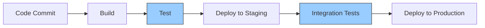

# CI/CD Testing

## Introduction

Testing is a critical component of any CI/CD (Continuous Integration/Continuous Deployment) pipeline. When we implement automated development workflows, ensuring that our code works correctly at each stage becomes essential. CI/CD testing refers to the automated testing processes integrated into your pipeline that verify your application's functionality, performance, and reliability before it moves to the next stage of delivery.

In this guide, we'll explore how testing fits into CI/CD pipelines, different types of tests you should include, and how to implement them effectively. Whether you're new to CI/CD or looking to improve your existing pipeline, understanding testing practices will help you deliver more reliable software.

## Testing in the CI/CD Pipeline

Before diving into specific testing types, let's understand where testing fits in a typical CI/CD workflow:



As shown in the diagram, testing occurs at multiple stages:
1. After building the application
2. After deploying to staging environments
3. Sometimes even after production deployment (monitoring and verification)

This multi-layered approach ensures problems are caught early, reducing the cost and impact of bugs.

## Types of Tests in CI/CD Pipelines

### 1. Unit Tests

Unit tests verify that individual components of your application work as expected in isolation.

**Example: A simple JavaScript unit test using Jest**

```javascript
// math.js
function add(a, b) {
  return a + b;
}

module.exports = { add };

// math.test.js
const { add } = require('./math');

test('adds 1 + 2 to equal 3', () => {
  expect(add(1, 2)).toBe(3);
});
```

In your CI/CD pipeline configuration:

```yaml
# Example GitHub Actions workflow snippet
test:
  runs-on: ubuntu-latest
  steps:
    - uses: actions/checkout@v3
    - name: Set up Node.js
      uses: actions/setup-node@v3
      with:
        node-version: '16'
    - name: Install dependencies
      run: npm ci
    - name: Run unit tests
      run: npm test
```

Unit tests should be fast and focus on testing business logic in isolation.

### 2. Integration Tests

Integration tests verify that different components work together correctly.

**Example: Testing API endpoints with Supertest in Node.js**

```javascript
// app.js
const express = require('express');
const app = express();

app.get('/api/hello', (req, res) => {
  res.json({ message: 'Hello World' });
});

module.exports = app;

// app.test.js
const request = require('supertest');
const app = require('./app');

describe('API Endpoints', () => {
  test('GET /api/hello returns correct message', async () => {
    const response = await request(app).get('/api/hello');
    expect(response.status).toBe(200);
    expect(response.body.message).toBe('Hello World');
  });
});
```

Integration tests typically run after unit tests in your pipeline.

### 3. End-to-End (E2E) Tests

E2E tests verify that your entire application works from a user's perspective.

**Example: Testing a login flow with Cypress**

```javascript
// cypress/integration/login.spec.js
describe('Login Page', () => {
  it('should login with valid credentials', () => {
    cy.visit('/login');
    
    cy.get('input[name="username"]').type('testuser');
    cy.get('input[name="password"]').type('password123');
    cy.get('button[type="submit"]').click();
    
    // Verify redirect to dashboard after login
    cy.url().should('include', '/dashboard');
    cy.contains('Welcome, Test User').should('be.visible');
  });
});
```

E2E tests often run later in the pipeline, perhaps after deploying to a staging environment.

### 4. Performance Tests

Performance tests ensure your application meets performance requirements.

**Example: Load testing with k6**

```javascript
// load-test.js
import http from 'k6/http';
import { sleep } from 'k6';

export const options = {
  vus: 10,  // virtual users
  duration: '30s',
};

export default function() {
  http.get('https://staging-app.example.com/api/products');
  sleep(1);
}
```

Sample output from a performance test:

```
  execution: local
     script: load-test.js
     output: -

  scenarios: (100.00%) 1 scenario, 10 max VUs, 1m0s max duration (incl. graceful stop):
           * default: 10 looping VUs for 30s (gracefulStop: 30s)

running (0m30.0s), 00/10 VUs, 285 complete and 0 interrupted iterations
default ✓ [======================================] 10 VUs  30s

     data_received..................: 1.3 MB 42 kB/s
     data_sent......................: 25 kB  825 B/s
     http_req_blocked...............: avg=1.58ms   min=0s   med=0s      max=76.91ms  p(90)=0s      p(95)=1.45ms   
     http_req_connecting............: avg=1.05ms   min=0s   med=0s      max=31.51ms  p(90)=0s      p(95)=1.08ms   
     http_req_duration..............: avg=104.76ms min=92ms med=102.5ms max=228.39ms p(90)=112.37ms p(95)=115.02ms
     http_req_failed................: 0.00%  ✓ 0    ✗ 285
     http_req_receiving.............: avg=0.63ms   min=0s   med=0s      max=53.11ms  p(90)=0s      p(95)=2.07ms   
     http_req_sending...............: avg=0.13ms   min=0s   med=0s      max=1.9ms    p(90)=0s      p(95)=0.98ms   
     http_req_tls_handshaking.......: avg=0s       min=0s   med=0s      max=0s       p(90)=0s      p(95)=0s       
     http_req_waiting...............: avg=104ms    min=91ms med=102.5ms max=228.39ms p(90)=111.87ms p(95)=114.02ms
     iterations.....................: 285    9.498692/s
     vus............................: 10     min=10 max=10
     vus_max........................: 10     min=10 max=10
```

Performance tests often run on staging environments to avoid impacting production users.

### 5. Security Tests

Security tests identify vulnerabilities in your application.

**Example: Running dependency scanning with OWASP Dependency-Check**

```yaml
# Example GitLab CI configuration
security_scan:
  stage: test
  image: owasp/dependency-check
  script:
    - /usr/share/dependency-check/bin/dependency-check.sh --scan . --format XML --out dependency-check-report.xml
  artifacts:
    paths:
      - dependency-check-report.xml
```

Output might include vulnerability reports like:

```
Dependency: org.apache.commons:commons-text:1.8
Vulnerability: CVE-2022-42889
Severity: High
Description: Apache Commons Text performs variable interpolation, allowing properties to be dynamically evaluated and expanded. Prior to version 1.10.0, when the defaultValueMissingValueStrategy property is set to "CONSTANT", and a malicious input string contains the special variable name "script", an attacker could embed expressions which could then be evaluated.
Recommendation: Update to version 1.10.0 or higher
```

## Implementing Effective CI/CD Testing

### Test Pyramid Strategy

The test pyramid is a concept that guides how many tests of each type you should write:

```mermaid
pyramid-chart
    title Test Pyramid
    Unit Tests: 70
    Integration Tests: 20
    E2E Tests: 10
```

This approach suggests:
- Many unit tests: Fast, focused, and easy to maintain
- Fewer integration tests: Test critical component interactions
- Even fewer E2E tests: Focus on critical user flows

### Setting Up Automated Testing in Popular CI/CD Tools

#### GitHub Actions Example

```yaml
name: CI Pipeline

on:
  push:
    branches: [ main ]
  pull_request:
    branches: [ main ]

jobs:
  build_and_test:
    runs-on: ubuntu-latest
    steps:
      - uses: actions/checkout@v3
      
      - name: Set up Node.js
        uses: actions/setup-node@v3
        with:
          node-version: '16'
          
      - name: Install dependencies
        run: npm ci
        
      - name: Lint code
        run: npm run lint
        
      - name: Run unit tests
        run: npm test
        
      - name: Build application
        run: npm run build
        
      - name: Run integration tests
        run: npm run test:integration
      
      - name: Deploy to staging
        if: github.ref == 'refs/heads/main'
        run: npm run deploy:staging
        
      - name: Run E2E tests on staging
        if: github.ref == 'refs/heads/main'
        run: npm run test:e2e
```

#### Jenkins Pipeline Example

```groovy
pipeline {
    agent any
    
    stages {
        stage('Build') {
            steps {
                sh 'npm install'
                sh 'npm run build'
            }
        }
        
        stage('Unit Test') {
            steps {
                sh 'npm test'
            }
            post {
                always {
                    junit 'test-results/*.xml'
                }
            }
        }
        
        stage('Integration Test') {
            steps {
                sh 'npm run test:integration'
            }
        }
        
        stage('Deploy to Staging') {
            when {
                branch 'main'
            }
            steps {
                sh 'npm run deploy:staging'
            }
        }
        
        stage('E2E Tests') {
            when {
                branch 'main'
            }
            steps {
                sh 'npm run test:e2e'
            }
        }
    }
}
```

### Best Practices for CI/CD Testing

1. **Keep Tests Fast**: Slow tests slow down your pipeline and your development cycle.

2. **Make Tests Deterministic**: Flaky tests (tests that sometimes pass and sometimes fail without code changes) undermine confidence in your pipeline.

   ```javascript
   // Bad practice: test depends on current date
   test('user registration date is valid', () => {
     const user = registerUser('testuser');
     expect(user.registrationDate.getDate()).toBe(new Date().getDate()); // Might fail at midnight!
   });
   
   // Good practice: mock the date
   test('user registration date is valid', () => {
     const mockDate = new Date('2023-01-01');
     jest.spyOn(global, 'Date').mockImplementation(() => mockDate);
     
     const user = registerUser('testuser');
     expect(user.registrationDate).toEqual(mockDate);
     
     jest.restoreAllMocks();
   });
   ```

3. **Implement Parallel Testing**: Run tests in parallel to speed up your pipeline.

4. **Use Test Data Management**: Have a strategy for creating, managing, and cleaning up test data.

5. **Set Up Test Monitoring**: Track test metrics like duration, failure rate, and coverage.

## Real-World Example: Full CI/CD Testing Pipeline

Let's walk through a complete example of testing in a web application CI/CD pipeline:

1. **Developer Workflow**:
   - Developer writes code and tests locally
   - Commits code to version control
   - CI/CD pipeline automatically triggered

2. **Pipeline Stages**:


3. **Test Environment Management**:
   - Each environment (dev, test, staging) is configured to be as similar to production as possible
   - Infrastructure as Code (IaC) ensures environment consistency
   - Database seeding scripts provide consistent test data

4. **Notification System**:
   - Pipeline sends notifications on test failures
   - Dashboards display test results and trends

## Troubleshooting Common CI/CD Testing Issues

### Problem: Tests Pass Locally But Fail in CI

This is often due to environment differences. Check:
- Dependencies versions 
- Environment variables
- Database configuration
- File system differences

**Solution**: Use containerization (Docker) to ensure consistent environments.

```dockerfile
FROM node:16-alpine

WORKDIR /app

COPY package*.json ./
RUN npm ci

COPY . .

CMD ["npm", "test"]
```

### Problem: Flaky Tests

Flaky tests randomly fail without code changes, usually due to:
- Race conditions
- Time dependencies
- External service dependencies

**Solution**: Identify and refactor flaky tests.

```javascript
// Original flaky test
test('user data loads', async () => {
  const user = await fetchUserData(1);
  expect(user.name).toBe('John');
});

// Improved test with timeout and retry
test('user data loads', async () => {
  jest.setTimeout(10000); // Increase timeout
  
  let retries = 3;
  let user;
  
  while (retries > 0) {
    try {
      user = await fetchUserData(1);
      break;
    } catch (error) {
      retries--;
      if (retries === 0) throw error;
      await new Promise(r => setTimeout(r, 1000)); // Wait before retry
    }
  }
  
  expect(user.name).toBe('John');
});
```

### Problem: Slow Tests Bottlenecking the Pipeline

**Solution**: Implement test parallelization and selective testing.

```yaml
# GitHub Actions example of parallel testing
jobs:
  test:
    runs-on: ubuntu-latest
    strategy:
      matrix:
        shard: [1, 2, 3, 4]
    steps:
      - uses: actions/checkout@v3
      - name: Run tests (shard ${{ matrix.shard }}/4)
        run: npm test -- --shard=${{ matrix.shard }}/4
```

## Summary

CI/CD testing is essential for maintaining software quality in automated delivery pipelines. By implementing a comprehensive testing strategy that includes unit, integration, E2E, performance, and security tests, you can:

- Catch bugs early in the development process
- Ensure new features work as expected without breaking existing functionality
- Deliver higher quality software to users
- Reduce the cost of fixing defects
- Build confidence in your release process

Remember that tests should be:
- Fast and reliable
- Focused on critical functionality
- Appropriately balanced across the test pyramid
- Integrated at the right stages of your CI/CD pipeline

## Additional Resources

To further your understanding of CI/CD testing, consider exploring:

1. Test-driven development (TDD) practices
2. Contract testing for microservices
3. Infrastructure testing
4. Test coverage analysis
5. Testing in production with feature flags

## Exercises

1. Set up a basic CI/CD pipeline with unit tests for a simple application.
2. Add integration tests to your pipeline.
3. Implement E2E tests for a critical user flow.
4. Measure and improve the performance of your test suite.
5. Add security scanning to your pipeline.

By mastering CI/CD testing practices, you'll be well on your way to delivering more reliable software through automated pipelines.