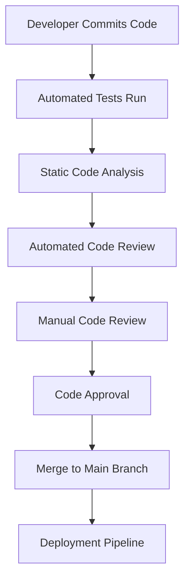
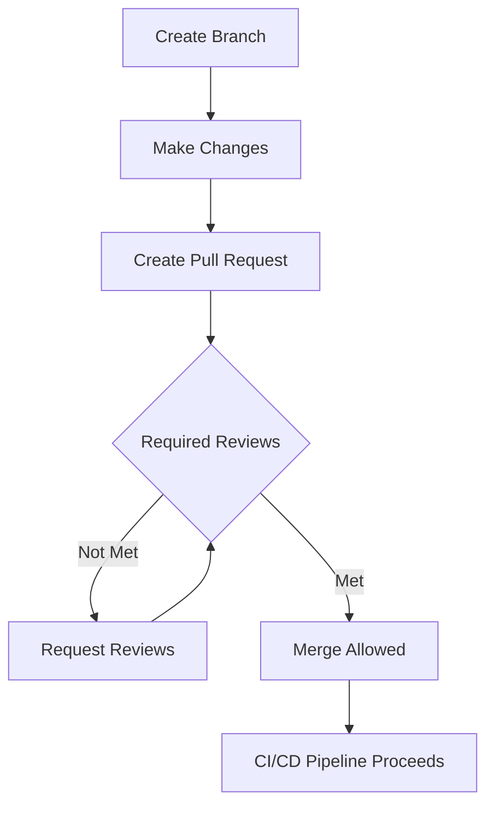
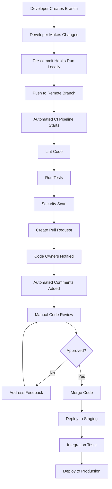

# CICD Code Review

## Introduction

Code review is a critical component in the Continuous Integration and Continuous Deployment (CI/CD) pipeline. It involves systematically examining code to find and fix mistakes, improve code quality, and ensure consistency. When integrated into your CI/CD workflow, automated and manual code reviews become powerful quality gates that prevent problematic code from reaching production.

In this tutorial, we'll explore how code review fits into the CI/CD process, different types of code reviews, best practices, and how to automate parts of this process to make your development workflow more efficient.

## What is CICD Code Review?

CICD Code Review refers to the practice of incorporating code review processes into your Continuous Integration and Continuous Deployment pipeline. This integration ensures that:

1. Code is systematically examined before integration
2. Quality checks are automated where possible
3. Issues are caught early in the development lifecycle
4. The team maintains coding standards and best practices
5. Knowledge is shared among team members

Let's look at how code review fits into the CI/CD workflow:



## Types of Code Reviews in CI/CD

### 1. Automated Code Review

Automated code reviews leverage tools to check code quality, find bugs, ensure style conformity, and identify security vulnerabilities without human intervention.

#### Example: Setting Up ESLint in a CI Pipeline

Here's how you might configure ESLint in a GitHub Actions workflow:

```yaml
name: Lint

on:
  push:
    branches: [ main ]
  pull_request:
    branches: [ main ]

jobs:
  eslint:
    runs-on: ubuntu-latest
    steps:
    - uses: actions/checkout@v3
    - uses: actions/setup-node@v3
      with:
        node-version: '16'
    - run: npm install
    - run: npm run lint
```

In your project, you'd have an ESLint configuration file (`.eslintrc.js`):

```javascript
module.exports = {
  env: {
    browser: true,
    es2021: true,
    node: true,
  },
  extends: [
    'eslint:recommended',
    'plugin:react/recommended',
  ],
  parserOptions: {
    ecmaFeatures: {
      jsx: true,
    },
    ecmaVersion: 12,
    sourceType: 'module',
  },
  rules: {
    'no-unused-vars': 'error',
    'no-console': 'warn',
  },
};
```

The output of an automated ESLint check might look like:

```
/home/user/project/src/App.js
  12:5  error  'count' is assigned a value but never used  no-unused-vars
  15:3  warning  Unexpected console statement                no-console

✖ 2 problems (1 error, 1 warning)
```

### 2. Manual Code Review

Manual code reviews involve developers examining each other's code to provide feedback and ensure quality. In a CI/CD context, this is typically integrated as a required step before code can be merged.

#### Pull Request Review Example

When a developer creates a pull request, team members review the code and provide comments:

```
File: src/utils/formatter.js

> function formatCurrency(amount) {
>   return '$' + amount.toFixed(2);
> }

Comment: This function will fail if amount is null or undefined. 
Consider adding validation or using a default value.

Suggested change:
function formatCurrency(amount) {
  if (amount == null) return '$0.00';
  return '$' + amount.toFixed(2);
}
```

## Integrating Code Review into CI/CD Pipeline

Let's explore how to effectively integrate code review into your CI/CD pipeline:

### 1. Set Up Branch Protection Rules

Most Git platforms allow you to set branch protection rules that enforce code review:



### 2. Automate Static Code Analysis

Incorporate static code analysis tools into your pipeline to catch issues before human review:

Example Jenkins pipeline configuration:

```groovy
pipeline {
    agent any
    stages {
        stage('Checkout') {
            steps {
                checkout scm
            }
        }
        stage('Static Analysis') {
            steps {
                sh 'npm install'
                sh 'npm run lint'
                sh 'npm run test:coverage'
            }
        }
        stage('Review Gate') {
            steps {
                input message: 'Has this code been reviewed?'
            }
        }
        stage('Deploy') {
            steps {
                sh 'npm run build'
                sh 'npm run deploy'
            }
        }
    }
}
```

### 3. Implement Code Review Metrics

Track code review data to improve your process:

```javascript
// Example code review metrics API response
const reviewMetrics = {
  averageTimeToReview: "4.2 hours",
  reviewCoverage: "92%",
  defectsFoundInReview: 42,
  defectsFoundAfterMerge: 7,
  topIssueTypes: [
    { type: "Security vulnerability", count: 12 },
    { type: "Performance concern", count: 9 },
    { type: "Code style violation", count: 8 }
  ]
};
```

## Best Practices for CICD Code Review

### 1. Keep Changes Small

Small, focused pull requests are easier to review and less likely to introduce bugs.

**Bad Example:** A single PR changing 50 files with 2,000 lines of code across multiple features.

**Good Example:** A PR that implements a single feature with changes to 3-5 files and 100-200 lines of code.

### 2. Use Checklists

Create a code review checklist to ensure consistency:

```javascript
// Example code review checklist (often kept in a .github/PULL_REQUEST_TEMPLATE.md file)
const codeReviewChecklist = [
  "Does the code work as described in the requirements?",
  "Is the code easy to understand?",
  "Does the code follow our style guidelines?",
  "Are there any security vulnerabilities?",
  "Are there adequate tests?",
  "Is error handling implemented?",
  "Is the code performant?"
];
```

### 3. Automate What You Can

Use tools to automatically check:

- Code style and formatting
- Test coverage
- Potential bugs and code smells
- Security vulnerabilities
- Documentation

### 4. Focus Manual Reviews on What Matters

Human reviewers should focus on:

- Logic correctness
- Architecture decisions
- Edge cases
- Maintainability
- Business requirements fulfillment

## Real-World Example: Complete CI/CD Code Review Pipeline

Let's walk through a complete example of how code review fits into a modern CI/CD pipeline:



### GitHub Actions Example for a Complete Pipeline

```yaml
name: CI/CD Pipeline

on:
  push:
    branches: [ feature/**, bugfix/** ]
  pull_request:
    branches: [ main, develop ]

jobs:
  code-quality:
    runs-on: ubuntu-latest
    steps:
    - uses: actions/checkout@v3
    - name: Set up Node.js
      uses: actions/setup-node@v3
      with:
        node-version: '16'
    - name: Install dependencies
      run: npm ci
    - name: Lint code
      run: npm run lint
    - name: Check formatting
      run: npm run format:check
    - name: Run tests
      run: npm test
    - name: Static analysis
      run: npm run analyze
    - name: Security scan
      run: npm audit

  build:
    needs: code-quality
    runs-on: ubuntu-latest
    steps:
    - uses: actions/checkout@v3
    - name: Set up Node.js
      uses: actions/setup-node@v3
      with:
        node-version: '16'
    - name: Install dependencies
      run: npm ci
    - name: Build
      run: npm run build
    - name: Upload build artifacts
      uses: actions/upload-artifact@v3
      with:
        name: build
        path: build/

  deploy-staging:
    needs: build
    if: github.event_name == 'pull_request' && github.event.pull_request.draft == false
    runs-on: ubuntu-latest
    steps:
    - name: Download build artifacts
      uses: actions/download-artifact@v3
      with:
        name: build
        path: build/
    - name: Deploy to staging
      run: |
        # Deploy commands here
        echo "Deployed to staging environment"
```

## Code Review Tools for CI/CD

Several tools can enhance your code review process in a CI/CD pipeline:

1. **Static Analysis Tools**
   - SonarQube
   - ESLint
   - Checkstyle
   - PyLint

2. **Automated Review Tools**
   - Codacy
   - CodeClimate
   - DeepSource
   - Danger

3. **Security Scanning**
   - Snyk
   - OWASP Dependency-Check
   - WhiteSource
   - GitHub CodeQL

4. **Coverage Reports**
   - Jest Coverage
   - Istanbul
   - JaCoCo

## Real-World Example: Implementing SonarQube

Here's how to implement SonarQube in your CI/CD pipeline:

```yaml
name: SonarQube Analysis

on:
  push:
    branches: [ main ]
  pull_request:
    branches: [ main ]

jobs:
  sonarqube:
    runs-on: ubuntu-latest
    steps:
    - uses: actions/checkout@v3
      with:
        fetch-depth: 0
    - name: Set up JDK 11
      uses: actions/setup-java@v3
      with:
        java-version: 11
        distribution: 'adopt'
    - name: Cache SonarQube packages
      uses: actions/cache@v3
      with:
        path: ~/.sonar/cache
        key: ${{ runner.os }}-sonar
        restore-keys: ${{ runner.os }}-sonar
    - name: Build and analyze
      env:
        GITHUB_TOKEN: ${{ secrets.GITHUB_TOKEN }}
        SONAR_TOKEN: ${{ secrets.SONAR_TOKEN }}
        SONAR_HOST_URL: ${{ secrets.SONAR_HOST_URL }}
      run: |
        mvn -B verify org.sonarsource.scanner.maven:sonar-maven-plugin:sonar -Dsonar.projectKey=my-project
```

SonarQube would then generate a report like this:

```
QUALITY GATE STATUS: PASSED

Issues to resolve:
- 3 bugs
- 5 code smells
- 0 vulnerabilities
- 0 security hotspots

Code coverage: 87.3%
Duplicated lines: 2.4%
Technical debt ratio: 0.8%
```

## Summary

CICD Code Review is an essential practice that integrates code review processes into your CI/CD pipeline. By combining automated tools with human expertise, you can:

1. Catch bugs and issues early
2. Maintain code quality and consistency
3. Share knowledge among team members
4. Enhance security and performance
5. Build better software more reliably

Effective CICD Code Review is about finding the right balance between automation and human review, implementing appropriate checks at each stage of the pipeline, and continuously improving your processes based on feedback and metrics.

## Additional Resources

- [Google's Engineering Practices Documentation](https://google.github.io/eng-practices/)
- [OWASP Code Review Guide](https://owasp.org/www-project-code-review-guide/)
- [GitHub's Code Review Documentation](https://docs.github.com/en/github/collaborating-with-pull-requests/reviewing-changes-in-pull-requests)
- [GitLab's Code Review Guidelines](https://docs.gitlab.com/ee/development/code_review.html)

## Exercises

1. Set up a basic CI pipeline with linting and testing for a sample project
2. Create a code review checklist for your team
3. Configure branch protection rules in GitHub that require code reviews
4. Implement SonarQube in your CI/CD pipeline and analyze the results
5. Practice code review by examining open-source pull requests