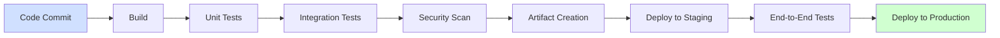

# CI/CD Documentation

## Introduction

Documentation is a critical but often overlooked component of CI/CD (Continuous Integration and Continuous Deployment) pipelines. Well-structured documentation ensures that team members understand how the pipeline works, makes troubleshooting easier, and helps new team members get up to speed quickly. This guide explores the importance of CI/CD documentation, what to document, and best practices for maintaining it.

## What is CI/CD Documentation?

CI/CD documentation refers to the comprehensive set of documents that describe your CI/CD pipeline's configuration, processes, tools, and workflows. It serves as both a reference guide and a knowledge base for your development team.

CI/CD documentation typically includes:

- Pipeline architecture diagrams
- Configuration file explanations
- Environment setups
- Deployment strategies
- Testing frameworks
- Monitoring and alerting mechanisms
- Troubleshooting guides

## Why Documentation Matters in CI/CD

For beginners, CI/CD can seem complex with its many moving parts. Proper documentation addresses several challenges:

1. **Knowledge Transfer**: Prevents knowledge silos by ensuring information isn't kept only in certain team members' heads
2. **Onboarding**: Helps new team members understand your CI/CD setup quickly
3. **Troubleshooting**: Provides guidance when things go wrong
4. **Consistency**: Ensures everyone follows the same processes
5. **Auditability**: Creates traceable records of changes for compliance

## Essential Components of CI/CD Documentation

### 1. Pipeline Architecture Documentation

Start with a high-level overview of your pipeline using diagrams to illustrate the flow.



### 2. Configuration Files Documentation

Document your configuration files with explanations of key sections. For example, for a GitHub Actions workflow:

```yaml
name: CI Pipeline

on:
  push:
    branches: [ main ]
  pull_request:
    branches: [ main ]

jobs:
  build:
    runs-on: ubuntu-latest
    steps:
      - uses: actions/checkout@v3
      # Additional steps...
```

Explanation:
- `name`: Identifies this workflow in the GitHub Actions UI
- `on`: Defines the events that trigger this workflow
- `jobs`: Contains the jobs to run, with each job having its own set of steps

### 3. Environment Configuration

Document each environment's configuration, including:

```yaml
environments:
  development:
    url: https://dev.example.com
    variables:
      DEBUG: true
      API_TIMEOUT: 30
  staging:
    url: https://staging.example.com
    variables:
      DEBUG: false
      API_TIMEOUT: 20
  production:
    url: https://example.com
    variables:
      DEBUG: false
      API_TIMEOUT: 10
```

### 4. Testing Strategy Documentation

Document your testing approach across the pipeline:

| Test Type | Tool | When It Runs | Purpose |
|-----------|------|-------------|---------|
| Unit Tests | Jest | After every commit | Verify individual functions |
| Integration Tests | Cypress | After build | Verify component interactions |
| End-to-End Tests | Selenium | Before production deploy | Verify complete user flows |

## Best Practices for CI/CD Documentation

### 1. Keep Documentation Close to Code

Store documentation in the same repository as your code to ensure they evolve together.

Example file structure:
```
my-project/
├── .github/
│   └── workflows/
│       └── ci.yml
├── docs/
│   ├── ci-cd/
│   │   ├── pipeline-overview.md
│   │   ├── environment-setup.md
│   │   └── troubleshooting.md
│   └── README.md
└── src/
    └── ...
```

### 2. Use Documentation as Code

Treat documentation like code by:
- Versioning it with Git
- Reviewing changes through PRs
- Validating it automatically (e.g., checking for broken links)

Example GitHub workflow for validating documentation:

```yaml
name: Validate Docs

on:
  pull_request:
    paths:
      - 'docs/**'

jobs:
  markdown-lint:
    runs-on: ubuntu-latest
    steps:
      - uses: actions/checkout@v3
      - name: Run Markdown Lint
        run: |
          npm install -g markdownlint-cli
          markdownlint docs/**/*.md
```

### 3. Automate Documentation Where Possible

Use tools to generate documentation directly from your configuration files.

For example, using a script to generate environment documentation:

```javascript
const fs = require('fs');
const yaml = require('js-yaml');

// Read environment config
const envConfig = yaml.load(fs.readFileSync('config/environments.yml', 'utf8'));

// Generate markdown table
let markdown = '# Environment Configurations

';
markdown += '| Environment | URL | Debug Mode | API Timeout |
';
markdown += '|-------------|-----|------------|-------------|
';

for (const [env, config] of Object.entries(envConfig.environments)) {
  markdown += `| ${env} | ${config.url} | ${config.variables.DEBUG} | ${config.variables.API_TIMEOUT} |
`;
}

// Write to documentation file
fs.writeFileSync('docs/ci-cd/environments.md', markdown);
```

### 4. Include Real Examples

Document common scenarios with real examples:

#### Example: Deploying a Feature Branch

```bash
# Create a feature branch
git checkout -b feature/new-login

# Make changes
# ...

# Commit changes
git add .
git commit -m "Implement new login flow"

# Push to remote to trigger CI/CD pipeline
git push origin feature/new-login

# Output from CI/CD system:
# > Building feature/new-login...
# > Running tests...
# > Deploying to dev environment...
# > Feature branch deployed to: https://feature-new-login.dev.example.com
```

### 5. Document Failure Scenarios and Remediation

Create troubleshooting guides for common failures:

#### Example: Build Failure Due to Test Issues

**Problem:**  
Build fails with error: `Test failed: Cannot find element #login-button`

**Diagnosis:**
1. Check if the selector has changed in recent commits
2. Verify the test environment is properly configured
3. Check if the component is conditionally rendered

**Resolution:**
```bash
# Update the test to use the new selector
sed -i 's/#login-button/#signin-button/g' tests/login.test.js

# Or fix the component to use the expected selector
sed -i 's/id="signin-button"/id="login-button"/g' src/components/Login.jsx
```

## Implementing CI/CD Documentation in Practice

Let's look at a complete example of setting up documentation for a new CI/CD pipeline:

### Step 1: Create Initial Architecture Documentation

Start by creating a `README.md` in your `docs/ci-cd` folder:

```markdown
# MyApp CI/CD Pipeline

This document describes the CI/CD pipeline for MyApp.

## Overview

Our pipeline automates building, testing, and deploying MyApp across development, staging, and production environments.

## Pipeline Stages

1. **Build**: Compiles code and creates artifacts
2. **Test**: Runs unit and integration tests
3. **Security Scan**: Analyzes code for vulnerabilities
4. **Deploy**: Deploys to appropriate environment
```

### Step 2: Document Configuration Files

Create a file explaining your main workflow:

```markdown
# GitHub Actions Workflow

Our main workflow is defined in `.github/workflows/main.yml`.

## Trigger Events

The workflow runs on:
- Push to `main` branch
- Pull requests to `main` branch
- Manual dispatch

## Jobs

The workflow contains the following jobs:
- `build`: Builds the application
- `test`: Runs the test suite
- `deploy`: Deploys to the appropriate environment
```

### Step 3: Create a Pipeline Status Dashboard

Generate a status page for your pipeline:

```jsx
import React from 'react';

export const PipelineStatus = () => (
  <div className="pipeline-dashboard">
    <h2>Pipeline Status</h2>
    <table>
      <thead>
        <tr>
          <th>Environment</th>
          <th>Status</th>
          <th>Last Deployment</th>
          <th>Version</th>
        </tr>
      </thead>
      <tbody>
        <tr>
          <td>Development</td>
          <td><span className="badge success">Active</span></td>
          <td>2023-07-15 14:30 UTC</td>
          <td>v1.2.3-dev</td>
        </tr>
        <tr>
          <td>Staging</td>
          <td><span className="badge success">Active</span></td>
          <td>2023-07-14 09:15 UTC</td>
          <td>v1.2.2</td>
        </tr>
        <tr>
          <td>Production</td>
          <td><span className="badge success">Active</span></td>
          <td>2023-07-10 10:45 UTC</td>
          <td>v1.2.0</td>
        </tr>
      </tbody>
    </table>
  </div>
);
```

## Documentation Maintenance

Documentation becomes outdated quickly without proper maintenance:

1. **Regular Reviews**: Schedule quarterly reviews of all CI/CD documentation
2. **Change-Driven Updates**: Update documentation whenever pipeline changes occur
3. **Ownership**: Assign clear ownership for each documentation section
4. **Validation**: Test documentation by having new team members follow it

Example documentation review checklist:

```markdown
## Documentation Review Checklist

- [ ] Pipeline architecture diagram is current
- [ ] Environment configurations are up-to-date
- [ ] All new tools or services are documented
- [ ] Troubleshooting guides cover recent issues
- [ ] Examples use current versions of tools
- [ ] Links to external resources are valid
- [ ] Screenshots reflect current UI
```

## Exercises for Practicing CI/CD Documentation

1. **Document Your Current Workflow**: Create documentation for a project you're currently working on, even if it doesn't have a formal CI/CD pipeline yet.

2. **Create a Pipeline Diagram**: Use Mermaid to diagram a basic CI/CD pipeline for a hypothetical web application.

3. **Write a Troubleshooting Guide**: Document how to diagnose and fix a common issue in your development workflow.

4. **Generate Automated Documentation**: Write a script that reads your project's configuration files and generates documentation.

## Summary

Effective CI/CD documentation is crucial for maintaining and scaling your development processes. By following the practices outlined in this guide, you can create documentation that:
- Is comprehensive yet accessible to beginners
- Stays updated alongside your code
- Helps troubleshoot issues quickly
- Facilitates knowledge sharing across your team

Remember that documentation is not just a one-time task but an ongoing process that evolves with your CI/CD pipeline. Investing time in good documentation today saves countless hours of confusion and troubleshooting tomorrow.

## Additional Resources

- [Docusaurus](https://docusaurus.io/) - A documentation website generator
- [Mermaid JS](https://mermaid.js.org/) - Create diagrams using Markdown-like syntax
- [Conventional Comments](https://conventionalcomments.org/) - Structured feedback for documentation reviews
- [Markdownlint](https://github.com/DavidAnson/markdownlint) - Linting tool for Markdown files