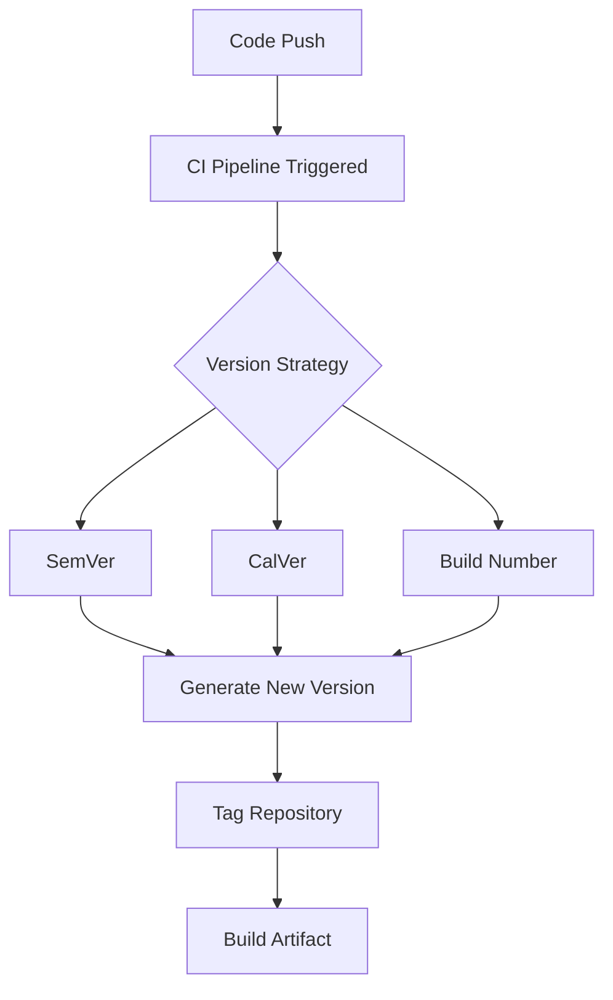
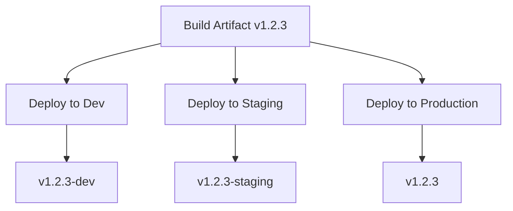

# CI/CD Versioning

## Introduction

Versioning is a crucial aspect of CI/CD (Continuous Integration/Continuous Deployment) practices that ensures your software is properly identified, tracked, and deployed throughout its lifecycle. Effective versioning strategies help teams manage dependencies, troubleshoot issues, and maintain a reliable release process. In this guide, we'll explore how versioning fits into CI/CD pipelines and learn practical approaches to implement versioning in your projects.

## What is CI/CD Versioning?

CI/CD versioning refers to the systematic approach of assigning unique identifiers to software artifacts as they move through the continuous integration and deployment pipeline. These identifiers help distinguish between different builds, releases, and deployments, making it possible to:

- Track which version of software is running in various environments
- Roll back to previous versions when issues arise
- Ensure consistent deployment across different environments
- Facilitate communication between development and operations teams

## Common Versioning Schemes

### Semantic Versioning (SemVer)

Semantic Versioning is one of the most widely adopted versioning schemes, following the format `MAJOR.MINOR.PATCH` (e.g., `2.1.4`).

```
MAJOR: Breaking changes
MINOR: New features (backward compatible)
PATCH: Bug fixes (backward compatible)
```

Example implementation in a CI/CD pipeline:

```yaml
# Example GitHub Actions workflow using SemVer
name: Build and Release

on:
  push:
    branches: [ main ]

jobs:
  build:
    runs-on: ubuntu-latest
    steps:
      - uses: actions/checkout@v3
      - name: Set up Node.js
        uses: actions/setup-node@v3
        with:
          node-version: '16'
      
      - name: Calculate version
        id: semver
        run: |
          # Extract version components from package.json
          CURRENT_VERSION=$(node -p "require('./package.json').version")
          # For this example, we're incrementing patch number on each build
          IFS='.' read -r MAJOR MINOR PATCH <<< "$CURRENT_VERSION"
          NEW_PATCH=$((PATCH + 1))
          NEW_VERSION="$MAJOR.$MINOR.$NEW_PATCH"
          echo "new_version=$NEW_VERSION" >> $GITHUB_OUTPUT
          
      - name: Update package.json
        run: |
          # Update version in package.json
          npm version ${{ steps.semver.outputs.new_version }} --no-git-tag-version
```

### Calendar Versioning (CalVer)

Calendar Versioning ties releases to specific dates, often following the format `YEAR.MONTH.SEQUENCE` (e.g., `2023.03.1`).

```
YEAR: Full year (2023) or shortened (23)
MONTH: Month number (01-12)
SEQUENCE: Build or release number within that month
```

Example in a Jenkins pipeline:

```groovy
// Example Jenkins pipeline using CalVer
pipeline {
    agent any
    
    stages {
        stage('Calculate Version') {
            steps {
                script {
                    def date = new Date()
                    def year = date.format('yyyy')
                    def month = date.format('MM')
                    
                    // Get the last build number from a tracking file or service
                    def buildNumberFile = readFile(file: 'build-number.txt', text: true).trim() ?: '0'
                    def buildNumber = Integer.parseInt(buildNumberFile) + 1
                    
                    // Create CalVer string
                    env.VERSION = "${year}.${month}.${buildNumber}"
                    
                    // Update the build number for next time
                    writeFile file: 'build-number.txt', text: "${buildNumber}"
                }
                echo "Building version ${env.VERSION}"
            }
        }
        
        stage('Build and Tag') {
            steps {
                sh "docker build -t myapp:${env.VERSION} ."
                sh "docker tag myapp:${env.VERSION} myapp:latest"
            }
        }
    }
}
```

### Build Number Versioning

Simple incrementing build numbers can be effective, especially for internal or development builds.

Example in a GitLab CI configuration:

```yaml
# Example GitLab CI configuration with build numbers
variables:
  VERSION_PREFIX: "1.0"

stages:
  - build
  - deploy

build_job:
  stage: build
  script:
    # Use GitLab's CI_PIPELINE_IID as an auto-incrementing counter
    - export VERSION="${VERSION_PREFIX}.${CI_PIPELINE_IID}"
    - echo "Building version ${VERSION}"
    - echo "${VERSION}" > version.txt
    - docker build -t myapp:${VERSION} .
  artifacts:
    paths:
      - version.txt
```

## Implementing Versioning in CI/CD Pipelines

Let's walk through how to implement versioning across different stages of a CI/CD pipeline:

### 1. Version Generation

The first step is automatically generating a version number when code changes are pushed:



Here's a practical implementation using GitHub Actions:

```yaml
# Version generation in GitHub Actions
name: Generate Version

on:
  push:
    branches: [ main ]

jobs:
  version:
    runs-on: ubuntu-latest
    outputs:
      new_version: ${{ steps.versioning.outputs.new_version }}
    
    steps:
      - uses: actions/checkout@v3
        with:
          fetch-depth: 0  # Fetch all history for tags
      
      - name: Generate version
        id: versioning
        run: |
          # Get latest tag
          LATEST_TAG=$(git describe --tags --abbrev=0 2>/dev/null || echo "0.0.0")
          echo "Latest tag: $LATEST_TAG"
          
          # Parse the tag
          IFS='.' read -r MAJOR MINOR PATCH <<< "$LATEST_TAG"
          
          # Increment patch version
          NEW_PATCH=$((PATCH + 1))
          NEW_VERSION="$MAJOR.$MINOR.$NEW_PATCH"
          echo "New version: $NEW_VERSION"
          
          # Set output for other jobs
          echo "new_version=$NEW_VERSION" >> $GITHUB_OUTPUT
          
      - name: Create Git Tag
        run: |
          git config --local user.email "action@github.com"
          git config --local user.name "GitHub Action"
          git tag -a v${{ steps.versioning.outputs.new_version }} -m "Release ${{ steps.versioning.outputs.new_version }}"
          git push origin v${{ steps.versioning.outputs.new_version }}
```

### 2. Artifact Labeling

Once you've generated a version, it's important to label all build artifacts with this version:

```bash
# Example for a Node.js project
npm version $VERSION --no-git-tag-version

# Example for a Java/Maven project
mvn versions:set -DnewVersion=$VERSION

# Example for Docker images
docker build -t myapp:$VERSION .
```

### 3. Environment-Specific Versioning

Different environments may need specific versioning approaches:



Example implementation for environment suffixes:

```yaml
# Environment-specific versioning in GitHub Actions
deploy_job:
  needs: build
  runs-on: ubuntu-latest
  strategy:
    matrix:
      environment: [dev, staging, production]
  
  steps:
    - name: Set environment-specific version
      run: |
        VERSION="${{ needs.build.outputs.version }}"
        if [[ "${{ matrix.environment }}" != "production" ]]; then
          VERSION="${VERSION}-${{ matrix.environment }}"
        fi
        echo "Using version: $VERSION"
        
    - name: Deploy to ${{ matrix.environment }}
      run: |
        # Deploy using the environment-specific version
        ./deploy.sh ${{ matrix.environment }} $VERSION
```

## Best Practices for CI/CD Versioning

### 1. Automate Everything

Manual versioning leads to mistakes. Automate version generation, tagging, and labeling as part of your pipeline.

```yaml
# Example automation script for version bumping
- name: Auto-bump version
  run: |
    # Detect change type (major, minor, patch) based on commit message
    if grep -q "BREAKING CHANGE" <<< "${{ github.event.head_commit.message }}"; then
      VERSION_BUMP="major"
    elif grep -q "feat:" <<< "${{ github.event.head_commit.message }}"; then
      VERSION_BUMP="minor"
    else
      VERSION_BUMP="patch"
    fi
    
    # Bump version accordingly
    npm version $VERSION_BUMP --no-git-tag-version
```

### 2. Immutable Artifacts

Once built and versioned, artifacts should never change. This applies to container images, binaries, and deployment packages.

```bash
# Example policy enforcement in a pipeline
if docker manifest inspect myapp:$VERSION > /dev/null 2>&1; then
  echo "Error: Version $VERSION already exists. Cannot overwrite."
  exit 1
fi
```

### 3. Version Visibility

Make versions visible in your application for easy troubleshooting:

```javascript
// JavaScript example: Adding version to API responses
app.use((req, res, next) => {
  res.setHeader('X-App-Version', process.env.APP_VERSION);
  next();
});
```

```java
// Java example: Exposing version via info endpoint
@RestController
public class InfoController {
    @Value("${app.version}")
    private String appVersion;
    
    @GetMapping("/info")
    public Map<String, String> getInfo() {
        return Map.of("version", appVersion);
    }
}
```

### 4. Version in Logs

Include version information in your application logs:

```bash
# Setting version environment variable in deployment
kubectl set env deployment/myapp APP_VERSION=${VERSION}
```

```javascript
// Using version in logs (Node.js)
console.log(`[${process.env.APP_VERSION}] Application started`);
```

## Real-World CI/CD Versioning Example

Let's look at a complete end-to-end example for a web application:

```yaml
# .github/workflows/ci-cd.yml
name: CI/CD Pipeline with Versioning

on:
  push:
    branches: [ main ]

jobs:
  version:
    runs-on: ubuntu-latest
    outputs:
      new_version: ${{ steps.versioning.outputs.new_version }}
    
    steps:
      - uses: actions/checkout@v3
        with:
          fetch-depth: 0
      
      - name: Calculate new version
        id: versioning
        run: |
          # Get the latest tag
          LATEST_TAG=$(git describe --tags --abbrev=0 2>/dev/null || echo "0.1.0")
          
          # For simplicity, always bump the patch version
          IFS='.' read -r MAJOR MINOR PATCH <<< "$LATEST_TAG"
          NEW_PATCH=$((PATCH + 1))
          NEW_VERSION="$MAJOR.$MINOR.$NEW_PATCH"
          
          echo "new_version=$NEW_VERSION" >> $GITHUB_OUTPUT
      
      - name: Create Git tag
        run: |
          git config --local user.email "action@github.com"
          git config --local user.name "GitHub Action"
          git tag -a v${{ steps.versioning.outputs.new_version }} -m "Release ${{ steps.versioning.outputs.new_version }}"
          git push origin v${{ steps.versioning.outputs.new_version }}
  
  build:
    needs: version
    runs-on: ubuntu-latest
    
    steps:
      - uses: actions/checkout@v3
      
      - name: Set up Node.js
        uses: actions/setup-node@v3
        with:
          node-version: '16'
      
      - name: Update version in package.json
        run: |
          npm version ${{ needs.version.outputs.new_version }} --no-git-tag-version
      
      - name: Install dependencies
        run: npm ci
      
      - name: Build
        run: npm run build
      
      - name: Build Docker image
        run: |
          docker build -t myapp:${{ needs.version.outputs.new_version }} .
          docker tag myapp:${{ needs.version.outputs.new_version }} myapp:latest
      
      - name: Push to registry
        run: |
          echo "${{ secrets.DOCKER_PASSWORD }}" | docker login -u ${{ secrets.DOCKER_USERNAME }} --password-stdin
          docker push myapp:${{ needs.version.outputs.new_version }}
          docker push myapp:latest
  
  deploy-dev:
    needs: [version, build]
    runs-on: ubuntu-latest
    
    steps:
      - name: Deploy to Dev
        run: |
          # Example deployment script
          VERSION="${{ needs.version.outputs.new_version }}"
          echo "Deploying version $VERSION to development environment"
          # Replace with your actual deployment commands
          echo "APP_VERSION=$VERSION" > .env
          # Deploy commands would go here
  
  deploy-production:
    needs: [version, build, deploy-dev]
    runs-on: ubuntu-latest
    if: github.ref == 'refs/heads/main'
    
    steps:
      - name: Deploy to Production
        run: |
          VERSION="${{ needs.version.outputs.new_version }}"
          echo "Deploying version $VERSION to production environment"
          # Replace with your actual production deployment commands
```

## Handling Version Conflicts and Rollbacks

Sometimes you'll need to roll back to a previous version due to issues:

```bash
# Example rollback script
#!/bin/bash
CURRENT_VERSION=$(kubectl get deployment myapp -o jsonpath='{.spec.template.spec.containers[0].env[?(@.name=="APP_VERSION")].value}')
PREVIOUS_VERSION=$(git describe --tags --abbrev=0 "v$CURRENT_VERSION^")

echo "Rolling back from $CURRENT_VERSION to $PREVIOUS_VERSION"

# Update deployment to use previous version
kubectl set image deployment/myapp myapp=myapp:$PREVIOUS_VERSION
kubectl set env deployment/myapp APP_VERSION=$PREVIOUS_VERSION
```

## Summary

Effective CI/CD versioning is essential for maintaining a reliable and traceable software delivery process. In this guide, we've covered:

- Different versioning schemes including Semantic Versioning, Calendar Versioning, and Build Numbers
- How to implement versioning throughout your CI/CD pipeline
- Best practices for automation, immutability, and visibility
- A real-world example of versioning in a complete CI/CD workflow
- Handling rollbacks and version conflicts

By implementing proper versioning in your CI/CD pipeline, you'll improve traceability, simplify troubleshooting, and make your releases more reliable and predictable.

## Additional Resources

- [Semantic Versioning 2.0.0 Specification](https://semver.org/)
- [Calendar Versioning](https://calver.org/)
- [Git Tags Documentation](https://git-scm.com/book/en/v2/Git-Basics-Tagging)
- [npm version Documentation](https://docs.npmjs.com/cli/v8/commands/npm-version)

## Exercises

1. Implement a Semantic Versioning strategy in a simple Node.js project with automatic version bumping based on commit message prefixes.
2. Create a Docker-based CI/CD pipeline that builds and tags images with the appropriate version numbers.
3. Develop a version rollback script for your preferred deployment platform (Kubernetes, AWS, etc.).
4. Add version visibility to an existing application by exposing the version number through an API endpoint and in logs.
5. Compare the pros and cons of different versioning strategies for a project you're working on and decide which one fits best.