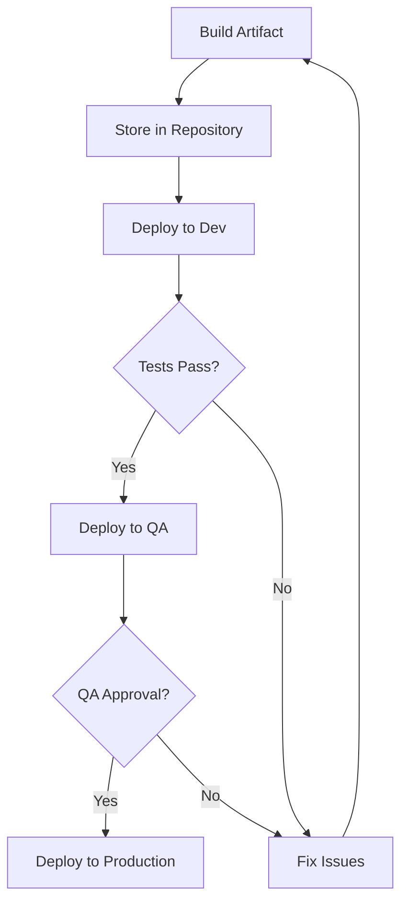

# CI/CD Artifacts

## Introduction

In the world of Continuous Integration and Continuous Delivery (CI/CD), artifacts are essential components that help streamline the software development process. But what exactly are CI/CD artifacts?

**CI/CD artifacts** are the files and packages produced during the build and testing stages of your CI/CD pipeline. These can include compiled applications, container images, documentation, test results, and other deliverables generated throughout the development lifecycle.

Think of artifacts as the tangible outputs of your build process—the files that move from one stage of your pipeline to another, eventually reaching deployment.

## Understanding CI/CD Artifacts

### What Are Artifacts?

Artifacts in CI/CD pipelines can take many forms:

- Compiled binaries or executables
- JAR, WAR, or EAR files (Java applications)
- Container images (Docker)
- Packages (npm, NuGet, PyPI)
- Static websites (HTML, CSS, JavaScript)
- Documentation files
- Test reports and coverage data

Artifacts represent the state of your code at various stages of the development pipeline, providing consistency and traceability throughout the delivery process.

### Why Are Artifacts Important?

Artifacts play several crucial roles in CI/CD workflows:

1. **Consistency**: Using the same artifact across environments ensures that what you test is what you deploy
2. **Reproducibility**: Artifacts allow you to recreate specific versions of your application
3. **Auditing**: Stored artifacts provide a history of builds for troubleshooting and compliance
4. **Versioning**: Artifacts can be tagged with version information for tracking and rollbacks
5. **Dependency Management**: Artifacts help manage dependencies between different components

### The Artifact Lifecycle


## Creating Artifacts in CI/CD Pipelines

Let's look at how artifacts are created in common CI/CD tools:

### GitHub Actions Example

GitHub Actions can produce and store artifacts with a few simple steps:

```yaml
jobs:
  build:
    runs-on: ubuntu-latest
    steps:
      - uses: actions/checkout@v3
      
      - name: Build application
        run: |
          npm install
          npm run build
      
      - name: Upload artifact
        uses: actions/upload-artifact@v3
        with:
          name: my-app-build
          path: build/
```

This workflow builds a JavaScript application and uploads the `build/` directory as an artifact that can be downloaded or used in subsequent jobs.

### Jenkins Example

Jenkins provides built-in artifact archiving:

```groovy
pipeline {
    agent any
    stages {
        stage('Build') {
            steps {
                sh 'mvn package'
            }
        }
    }
    post {
        success {
            archiveArtifacts artifacts: 'target/*.jar', fingerprint: true
        }
    }
}
```

This Jenkinsfile builds a Java application with Maven and archives the resulting JAR files as artifacts.

## Managing Artifacts

### Artifact Repositories

Artifact repositories are specialized storage systems designed to manage artifacts. Popular options include:

- **JFrog Artifactory**: Supports many package formats (Maven, npm, Docker, etc.)
- **Nexus Repository**: Similar to Artifactory with support for multiple formats
- **Docker Registry**: Specifically for container images
- **AWS S3/Azure Blob Storage**: Cloud storage options for artifacts
- **GitHub Packages**: Integrated with GitHub for various package types

### Versioning Strategies

Proper versioning is crucial for artifact management. Common approaches include:

1. **Semantic Versioning**: Using MAJOR.MINOR.PATCH format (e.g., 1.2.3)
2. **Date-based Versioning**: Using dates in version (e.g., 2023.03.15)
3. **Build Number**: Incrementing a counter for each build (e.g., Build #237)
4. **Git SHA**: Using Git commit hashes for precise tracking

Example of embedding version information in a Maven project:

```xml
<project>
    <modelVersion>4.0.0</modelVersion>
    <groupId>com.example</groupId>
    <artifactId>my-app</artifactId>
    <version>1.2.3</version>
</project>
```

## Artifacts and Environment Promotion

One of the key principles of CI/CD is to build artifacts once and deploy them to different environments. This ensures consistency across your development, testing, and production environments.

### Promotion Workflow



### Example: Docker Image Promotion

```bash
# Build the image
docker build -t myapp:latest .

# Tag with specific version
docker tag myapp:latest myapp:1.0.3

# Push to registry
docker push registry.example.com/myapp:1.0.3

# Deploy to development
kubectl apply -f k8s/dev/deployment.yaml

# After testing, deploy same image to production
kubectl apply -f k8s/prod/deployment.yaml
```

## Best Practices for CI/CD Artifacts

### 1. Immutable Artifacts

Treat artifacts as immutable—once created, they should not be modified. This ensures that the same artifact is used across all environments.

### 2. Metadata and Labeling

Include comprehensive metadata with your artifacts:

```json
{
  "name": "my-application",
  "version": "1.2.3",
  "buildDate": "2023-03-15T14:30:00Z",
  "gitCommit": "a1b2c3d4e5f6",
  "buildNumber": "42",
  "createdBy": "CI Pipeline #1234"
}
```

### 3. Cleanup Policies

Implement retention policies to manage artifact storage costs:

```yaml
# GitLab CI/CD example
artifacts:
  paths:
    - build/
  expire_in: 1 week
```

### 4. Security Scanning

Scan artifacts for vulnerabilities before promotion:

```yaml
# GitHub Actions example with Trivy scanner
- name: Scan Docker image
  uses: aquasecurity/trivy-action@master
  with:
    image-ref: 'myapp:latest'
    format: 'sarif'
    output: 'trivy-results.sarif'
```

### 5. Artifact Caching

Use caching to speed up builds:

```yaml
# GitHub Actions example with caching
- name: Cache dependencies
  uses: actions/cache@v3
  with:
    path: ~/.npm
    key: ${{ runner.os }}-node-${{ hashFiles('**/package-lock.json') }}
    restore-keys: |
      ${{ runner.os }}-node-
```

## Real-world Example: Full CI/CD Pipeline with Artifacts

Let's create a complete pipeline for a Node.js web application that produces and uses artifacts:

```yaml
name: CI/CD Pipeline

on:
  push:
    branches: [ main ]
  pull_request:
    branches: [ main ]

jobs:
  build:
    runs-on: ubuntu-latest
    
    steps:
      - uses: actions/checkout@v3
      
      - name: Setup Node.js
        uses: actions/setup-node@v3
        with:
          node-version: '16'
          
      - name: Install dependencies
        run: npm ci
      
      - name: Run tests
        run: npm test
      
      - name: Build application
        run: npm run build
      
      - name: Create test report
        run: npm run test:report
      
      - name: Upload build artifact
        uses: actions/upload-artifact@v3
        with:
          name: app-build
          path: build/
          
      - name: Upload test report
        uses: actions/upload-artifact@v3
        with:
          name: test-report
          path: test-report/
  
  deploy-dev:
    needs: build
    runs-on: ubuntu-latest
    
    steps:
      - name: Download build artifact
        uses: actions/download-artifact@v3
        with:
          name: app-build
          path: build
      
      - name: Deploy to development
        run: |
          # Deploy commands here
          echo "Deploying to development environment"
  
  deploy-prod:
    needs: deploy-dev
    if: github.ref == 'refs/heads/main'
    runs-on: ubuntu-latest
    
    steps:
      - name: Download build artifact
        uses: actions/download-artifact@v3
        with:
          name: app-build
          path: build
      
      - name: Deploy to production
        run: |
          # Deploy commands here
          echo "Deploying to production environment"
```

This pipeline:
1. Builds the application and runs tests
2. Creates and stores two artifacts: the application build and test reports
3. Downloads the build artifact for deployment to development
4. After successful development deployment, deploys the same artifact to production

## Troubleshooting Artifact Issues

Common issues with artifacts and how to resolve them:

### Missing Dependencies

**Problem**: Artifact fails in deployment but worked in build.

**Solution**: Ensure all dependencies are properly packaged with the artifact or available in the deployment environment.

```yaml
# Package.json example ensuring dependencies are included
"dependencies": {
  "express": "^4.17.1"
},
"devDependencies": {
  "jest": "^27.0.0"
}
```

### Inconsistent Environments

**Problem**: Artifacts behave differently across environments.

**Solution**: Use containerization to ensure consistency.

```dockerfile
FROM node:16-alpine

WORKDIR /app
COPY package*.json ./
RUN npm ci --only=production
COPY build/ ./

CMD ["node", "server.js"]
```

### Storage Issues

**Problem**: Running out of artifact storage space.

**Solution**: Implement retention policies and clean up old artifacts.

```groovy
// Jenkins example with cleanup
options {
    buildDiscarder(logRotator(numToKeepStr: '5', artifactNumToKeepStr: '3'))
}
```

## Summary

CI/CD artifacts are the tangible outputs of your build processes that enable consistent, reliable software delivery. By properly creating, versioning, storing, and promoting artifacts, you ensure that your applications are deployed consistently across environments.

Key takeaways:
- Artifacts provide consistency and reproducibility in software delivery
- Building once and deploying the same artifact to multiple environments is a CI/CD best practice
- Proper artifact repositories and versioning strategies are essential for effective artifact management
- Treating artifacts as immutable ensures reliability in your deployment process
- Including comprehensive metadata with artifacts improves traceability and debugging

## Exercises

1. Set up a simple CI/CD pipeline that creates and uses artifacts for a basic web application.
2. Implement a versioning strategy for your artifacts using semantic versioning.
3. Configure an artifact repository (like JFrog Artifactory or Nexus) and integrate it with your CI/CD pipeline.
4. Create a promotion workflow that moves the same artifact through development, testing, and production environments.
5. Implement artifact cleanup policies to manage storage efficiently.

## Additional Resources

- [Martin Fowler's Article on Continuous Delivery](https://martinfowler.com/bliki/ContinuousDelivery.html)
- [The Twelve-Factor App](https://12factor.net/)
- JFrog Artifactory Documentation
- Jenkins Pipeline Documentation
- GitHub Actions Artifacts Documentation