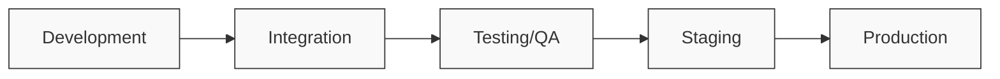
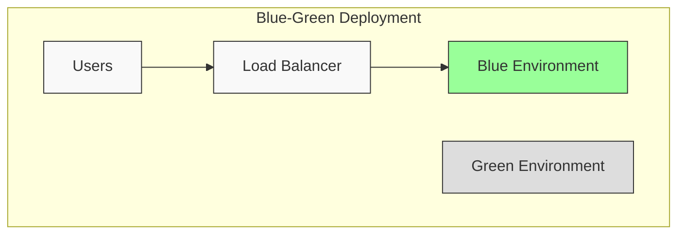

# CI/CD Environment Management

## Introduction

Environment management is a critical aspect of Continuous Integration and Continuous Deployment (CI/CD) pipelines. In software development, an "environment" refers to the specific configuration of hardware, software, and network resources where an application runs. Effective environment management ensures that your application behaves consistently as it moves through different stages of your pipeline, from development to production.

In this guide, we'll explore the fundamentals of environment management within CI/CD practices, why it's important, common strategies, and best practices to help you build reliable, repeatable deployment pipelines.

## Why Environment Management Matters

Imagine this scenario: A developer writes code that works perfectly on their laptop. The code passes all tests in the test environment but mysteriously breaks when deployed to production. Sound familiar? This is often the result of inconsistent environments—the classic "it works on my machine" problem.

Proper environment management aims to solve this by:

1. **Ensuring consistency** across all environments
2. **Reducing deployment failures** caused by environment discrepancies
3. **Speeding up onboarding** for new team members
4. **Improving security** through proper isolation and access controls
5. **Facilitating reproducibility** of builds and deployments

## Types of Environments in CI/CD Pipelines

A typical CI/CD pipeline includes several environments, each serving a specific purpose:

### Development Environment
- Where developers write and test code locally
- Often personalized to individual developer preferences
- May include tools specific to development tasks

### Integration Environment
- Where code from multiple developers is combined
- Used for automated tests of integrated components
- Often refreshed frequently (daily or after each merge)

### Testing/QA Environment
- Closely resembles production
- Used for comprehensive testing (functional, performance, security)
- May be used for user acceptance testing (UAT)

### Staging Environment
- Nearly identical to production
- Final verification before production deployment
- Used for pre-release validation

### Production Environment
- Hosts the live application used by end-users
- Requires highest level of stability and security
- Changes are carefully controlled and monitored



## Environment Management Strategies

Let's explore some common approaches to managing environments in CI/CD pipelines:

### 1. Environment Configuration Files

Using separate configuration files for each environment allows you to maintain environment-specific settings.

```javascript
// config.js - Example configuration file approach
const config = {
  development: {
    database: {
      host: "localhost",
      port: 5432,
      name: "myapp_dev"
    },
    apiUrl: "http://localhost:3000/api"
  },
  production: {
    database: {
      host: "db.example.com",
      port: 5432,
      name: "myapp_prod"
    },
    apiUrl: "https://api.example.com/v1"
  }
};

// Usage
const currentEnv = process.env.NODE_ENV || "development";
module.exports = config[currentEnv];
```

### 2. Environment Variables

Environment variables provide a way to configure applications without changing code.

```bash
# .env.development
DATABASE_HOST=localhost
DATABASE_PORT=5432
DATABASE_NAME=myapp_dev
API_URL=http://localhost:3000/api

# .env.production
DATABASE_HOST=db.example.com
DATABASE_PORT=5432
DATABASE_NAME=myapp_prod
API_URL=https://api.example.com/v1
```

Accessing these variables in your application:

```javascript
// Node.js example with dotenv package
require('dotenv').config();

const dbConfig = {
  host: process.env.DATABASE_HOST,
  port: process.env.DATABASE_PORT,
  database: process.env.DATABASE_NAME
};

console.log(`Connecting to database at ${dbConfig.host}`);
```

### 3. Infrastructure as Code (IaC)

IaC tools like Terraform, AWS CloudFormation, or Pulumi allow you to define your infrastructure in code, making environments reproducible and consistent.

```hcl
# Terraform example for defining a database in different environments
resource "aws_db_instance" "database" {
  allocated_storage    = 20
  storage_type         = "gp2"
  engine               = "postgres"
  engine_version       = "13.4"
  instance_class       = var.environment == "production" ? "db.t3.large" : "db.t3.small"
  name                 = "myapp_${var.environment}"
  username             = "dbuser"
  password             = var.db_password
  parameter_group_name = "default.postgres13"
  skip_final_snapshot  = var.environment != "production"
  
  tags = {
    Environment = var.environment
  }
}
```

### 4. Containerization

Containers (like Docker) package applications with their dependencies, ensuring consistency across environments.

```dockerfile
# Dockerfile example
FROM node:16-alpine

WORKDIR /app

COPY package*.json ./
RUN npm install

COPY . .

# Set default environment to development
ENV NODE_ENV=development

# This will be overridden when running in different environments
CMD ["npm", "start"]
```

When deploying to different environments:

```bash
# Development
docker run -e NODE_ENV=development -p 3000:3000 myapp

# Production
docker run -e NODE_ENV=production -p 80:3000 myapp
```

## Implementing Environment Management in CI/CD

Let's look at how to implement environment management in a practical CI/CD pipeline:

### GitHub Actions Example

```yaml
name: CI/CD Pipeline

on:
  push:
    branches: [ main, develop ]
  pull_request:
    branches: [ main, develop ]

jobs:
  build_and_test:
    runs-on: ubuntu-latest
    
    steps:
    - uses: actions/checkout@v3
    
    - name: Set up Node.js
      uses: actions/setup-node@v3
      with:
        node-version: '16'
        
    - name: Install dependencies
      run: npm ci
      
    - name: Run tests
      run: npm test
      
    - name: Build application
      run: npm run build
      
    - name: Upload build artifact
      uses: actions/upload-artifact@v3
      with:
        name: build
        path: build/
        
  deploy_to_dev:
    needs: build_and_test
    if: github.ref == 'refs/heads/develop'
    runs-on: ubuntu-latest
    
    steps:
    - name: Download build artifact
      uses: actions/download-artifact@v3
      with:
        name: build
        path: build/
        
    - name: Configure AWS credentials
      uses: aws-actions/configure-aws-credentials@v1
      with:
        aws-access-key-id: ${{ secrets.AWS_ACCESS_KEY_ID }}
        aws-secret-access-key: ${{ secrets.AWS_SECRET_ACCESS_KEY }}
        aws-region: us-west-2
        
    - name: Deploy to development environment
      run: |
        aws s3 sync build/ s3://myapp-development-bucket/ --delete
        aws cloudfront create-invalidation --distribution-id ${{ secrets.DEV_DISTRIBUTION_ID }} --paths "/*"
      env:
        NODE_ENV: development
        
  deploy_to_production:
    needs: build_and_test
    if: github.ref == 'refs/heads/main'
    runs-on: ubuntu-latest
    environment: production  # Requires approval in GitHub
    
    steps:
    - name: Download build artifact
      uses: actions/download-artifact@v3
      with:
        name: build
        path: build/
        
    - name: Configure AWS credentials
      uses: aws-actions/configure-aws-credentials@v1
      with:
        aws-access-key-id: ${{ secrets.AWS_ACCESS_KEY_ID }}
        aws-secret-access-key: ${{ secrets.AWS_SECRET_ACCESS_KEY }}
        aws-region: us-west-2
        
    - name: Deploy to production environment
      run: |
        aws s3 sync build/ s3://myapp-production-bucket/ --delete
        aws cloudfront create-invalidation --distribution-id ${{ secrets.PROD_DISTRIBUTION_ID }} --paths "/*"
      env:
        NODE_ENV: production
```

## Best Practices for CI/CD Environment Management

### 1. Keep Environments as Similar as Possible

Minimize differences between environments to reduce "works on my machine" issues. Use containerization or Infrastructure as Code to ensure consistency.

### 2. Automate Environment Setup

Manual environment configuration leads to errors and inconsistencies. Automate environment provisioning with tools like Terraform, Ansible, or Kubernetes.

```yaml
# Kubernetes example deployment with environment variables
apiVersion: apps/v1
kind: Deployment
metadata:
  name: myapp
  labels:
    app: myapp
    env: ${ENVIRONMENT}
spec:
  replicas: ${ENVIRONMENT == 'production' ? 3 : 1}
  selector:
    matchLabels:
      app: myapp
  template:
    metadata:
      labels:
        app: myapp
    spec:
      containers:
      - name: myapp
        image: myapp:${VERSION}
        ports:
        - containerPort: 3000
        env:
        - name: NODE_ENV
          value: ${ENVIRONMENT}
        - name: DATABASE_URL
          valueFrom:
            secretKeyRef:
              name: myapp-${ENVIRONMENT}-secrets
              key: database-url
```

### 3. Use Environment-Specific Branches or Tags

Implement a branching strategy that corresponds to your environments:
- `develop` branch → development environment
- `staging` branch → staging environment
- `main` branch → production environment

### 4. Secure Environment Secrets

Never store sensitive information like API keys, passwords, or tokens in your code. Use your CI/CD platform's secret management features.

```bash
# BAD: Hardcoded secrets in code
const apiKey = "1234567890abcdef";

# GOOD: Use environment variables
const apiKey = process.env.API_KEY;
```

### 5. Implement Feature Flags

Feature flags allow you to enable/disable features in different environments without deploying new code.

```javascript
// Feature flag example
const features = {
  development: {
    newUserInterface: true,
    experimentalFeature: true
  },
  production: {
    newUserInterface: false,
    experimentalFeature: false
  }
};

// Usage
const currentEnv = process.env.NODE_ENV || "development";
const isFeatureEnabled = (featureName) => {
  return features[currentEnv][featureName] || false;
};

if (isFeatureEnabled('newUserInterface')) {
  // Render new UI
} else {
  // Render old UI
}
```

### 6. Implement Blue-Green Deployments

Blue-green deployment involves maintaining two identical production environments, with only one active at a time. This reduces downtime and risk.



### 7. Document Environment Setup and Differences

Maintain clear documentation of environment configurations to help team members understand differences and troubleshoot issues.

### 8. Monitor All Environments

Implement monitoring and logging across all environments to quickly identify and fix issues.

```javascript
// Example logging configuration with environment-specific settings
const winston = require('winston');

const logger = winston.createLogger({
  level: process.env.NODE_ENV === 'production' ? 'info' : 'debug',
  format: winston.format.json(),
  defaultMeta: { service: 'user-service', environment: process.env.NODE_ENV },
  transports: [
    new winston.transports.File({ filename: 'error.log', level: 'error' }),
    new winston.transports.File({ filename: 'combined.log' }),
  ],
});

// In production, also send logs to a centralized service
if (process.env.NODE_ENV === 'production') {
  logger.add(new winston.transports.Console({
    format: winston.format.simple(),
  }));
}
```

## Practical Example: Complete Environment Management Workflow

Let's put everything together with a practical example of managing environments in a Node.js application:

### 1. Project Structure

```
my-app/
├── .github/
│   └── workflows/
│       └── ci-cd.yml
├── config/
│   ├── default.js
│   ├── development.js
│   ├── test.js
│   ├── staging.js
│   └── production.js
├── src/
│   ├── index.js
│   └── ...
├── package.json
└── Dockerfile
```

### 2. Environment Configuration using config Package

```javascript
// config/default.js - Base configuration
module.exports = {
  app: {
    name: 'MyApp',
    port: 3000
  },
  logging: {
    level: 'info'
  },
  database: {
    client: 'postgresql'
  }
};

// config/development.js - Development-specific overrides
module.exports = {
  app: {
    port: 3001
  },
  logging: {
    level: 'debug'
  },
  database: {
    connection: {
      host: 'localhost',
      user: 'dev_user',
      password: 'dev_password',
      database: 'myapp_dev'
    }
  }
};

// config/production.js - Production-specific overrides
module.exports = {
  logging: {
    level: 'warn'
  },
  database: {
    connection: {
      host: process.env.DB_HOST,
      user: process.env.DB_USER,
      password: process.env.DB_PASSWORD,
      database: process.env.DB_NAME,
      ssl: true
    }
  }
};
```

### 3. Application Code Using Configuration

```javascript
// src/index.js
const config = require('config');
const express = require('express');
const knex = require('knex');

// Initialize database connection
const db = knex({
  client: config.get('database.client'),
  connection: config.get('database.connection')
});

// Set up Express app
const app = express();
const port = config.get('app.port');

app.get('/', (req, res) => {
  res.send(`Hello from ${config.get('app.name')} in ${process.env.NODE_ENV} environment!`);
});

app.listen(port, () => {
  console.log(`Server running on port ${port} in ${process.env.NODE_ENV} mode`);
});
```

### 4. Dockerfile with Environment Awareness

```dockerfile
FROM node:16-alpine

WORKDIR /app

COPY package*.json ./
RUN npm ci --only=production

COPY . .

# Default to development environment
ENV NODE_ENV=development
ENV NODE_CONFIG_ENV=development

# Expose the port from our config
EXPOSE 3000

CMD ["node", "src/index.js"]
```

### 5. CI/CD Pipeline with Environment Deployment

```yaml
name: CI/CD Pipeline

on:
  push:
    branches: [ main, develop ]
  pull_request:
    branches: [ main ]

jobs:
  test:
    runs-on: ubuntu-latest
    
    steps:
    - uses: actions/checkout@v3
    
    - name: Set up Node.js
      uses: actions/setup-node@v3
      with:
        node-version: '16'
        
    - name: Install dependencies
      run: npm ci
      
    - name: Run tests
      run: |
        NODE_ENV=test npm test
        
  build:
    needs: test
    runs-on: ubuntu-latest
    
    steps:
    - uses: actions/checkout@v3
    
    - name: Set up Docker Buildx
      uses: docker/setup-buildx-action@v2
      
    - name: Login to DockerHub
      uses: docker/login-action@v2
      with:
        username: ${{ secrets.DOCKER_USERNAME }}
        password: ${{ secrets.DOCKER_PASSWORD }}
        
    - name: Build and push Docker image
      uses: docker/build-push-action@v3
      with:
        push: true
        tags: myorg/myapp:${{ github.sha }}
        
  deploy_to_development:
    if: github.ref == 'refs/heads/develop'
    needs: build
    runs-on: ubuntu-latest
    
    steps:
    - name: Deploy to Development Environment
      uses: appleboy/ssh-action@master
      with:
        host: ${{ secrets.DEV_HOST }}
        username: ${{ secrets.SSH_USERNAME }}
        key: ${{ secrets.SSH_PRIVATE_KEY }}
        script: |
          docker pull myorg/myapp:${{ github.sha }}
          docker stop myapp-dev || true
          docker rm myapp-dev || true
          docker run -d --name myapp-dev \
            -p 3001:3000 \
            -e NODE_ENV=development \
            -e NODE_CONFIG_ENV=development \
            -e DB_HOST=${{ secrets.DEV_DB_HOST }} \
            -e DB_USER=${{ secrets.DEV_DB_USER }} \
            -e DB_PASSWORD=${{ secrets.DEV_DB_PASSWORD }} \
            -e DB_NAME=${{ secrets.DEV_DB_NAME }} \
            myorg/myapp:${{ github.sha }}
            
  deploy_to_production:
    if: github.ref == 'refs/heads/main'
    needs: build
    runs-on: ubuntu-latest
    environment: production  # Requires approval
    
    steps:
    - name: Deploy to Production Environment
      uses: appleboy/ssh-action@master
      with:
        host: ${{ secrets.PROD_HOST }}
        username: ${{ secrets.SSH_USERNAME }}
        key: ${{ secrets.SSH_PRIVATE_KEY }}
        script: |
          docker pull myorg/myapp:${{ github.sha }}
          docker stop myapp-prod-blue || true
          docker rm myapp-prod-blue || true
          docker run -d --name myapp-prod-blue \
            -p 3002:3000 \
            -e NODE_ENV=production \
            -e NODE_CONFIG_ENV=production \
            -e DB_HOST=${{ secrets.PROD_DB_HOST }} \
            -e DB_USER=${{ secrets.PROD_DB_USER }} \
            -e DB_PASSWORD=${{ secrets.PROD_DB_PASSWORD }} \
            -e DB_NAME=${{ secrets.PROD_DB_NAME }} \
            myorg/myapp:${{ github.sha }}
          
          # Health check before switching traffic
          sleep 10
          if curl -s http://localhost:3002/health | grep -q "ok"; then
            # Update load balancer to point to the new deployment
            /usr/local/bin/switch-to-blue.sh
          else
            docker stop myapp-prod-blue
            docker rm myapp-prod-blue
            echo "Deployment failed health check"
            exit 1
          fi
```

## Troubleshooting Common Environment Issues

### "It works on my machine"
- **Cause**: Different environment configurations
- **Solution**: Use containers or IaC to ensure environment parity

### Environment-specific bugs
- **Cause**: Code that behaves differently in different environments
- **Solution**: Use feature flags and comprehensive testing across environments

### Secrets management problems
- **Cause**: Insecure handling of environment-specific secrets
- **Solution**: Use a secrets management service or your CI/CD platform's secret storage

### Database connection issues
- **Cause**: Incorrect database configuration between environments
- **Solution**: Validate database connections during deployment and implement proper error handling

## Summary

Effective CI/CD environment management is crucial for reliable software delivery. By implementing the strategies and best practices covered in this guide, you can:

- Ensure consistent behavior across all environments
- Reduce the "it works on my machine" syndrome
- Improve deployment reliability and speed
- Enhance security through proper secrets management
- Make your development process more efficient

Remember that environment management is not a one-time setup but an ongoing process. As your application evolves, so should your approach to managing environments.

## Additional Resources

Here are some exercises to help you practice environment management in CI/CD:

1. **Basic Exercise**: Create a simple application with different configuration files for development, testing, and production environments.

2. **Intermediate Exercise**: Set up a containerized application with Docker and deploy it to different environments using a CI/CD pipeline.

3. **Advanced Exercise**: Implement Infrastructure as Code using Terraform or AWS CloudFormation to provision consistent environments for your application.

4. **Challenge**: Set up a blue-green deployment strategy for zero-downtime deployments of your application.

## Further Learning

Consider exploring these related CI/CD topics:

- Containerization with Docker and Kubernetes
- Infrastructure as Code with Terraform or CloudFormation
- Feature flag implementation for safe releases
- Monitoring and observability across environments
- Database migration strategies between environments