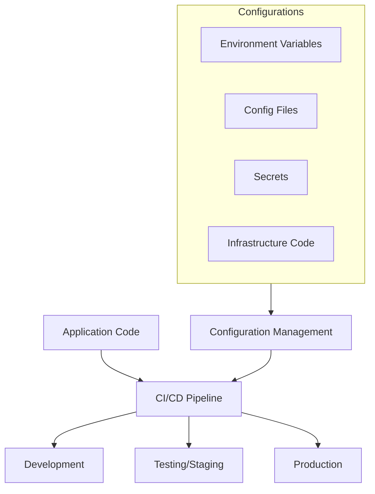

# CI/CD Configuration Management

## Introduction

Configuration management is a critical aspect of CI/CD (Continuous Integration/Continuous Deployment) practices that helps teams maintain consistent environments across development, testing, and production. In modern software development, applications often rely on numerous configurations—from database connections to API endpoints, feature flags, and environment variables. Properly managing these configurations ensures that your applications behave consistently regardless of where they're deployed.

In this guide, we'll explore how to effectively implement configuration management within your CI/CD pipelines, why it matters, and best practices for beginners to follow.

## What is Configuration Management in CI/CD?

Configuration management in CI/CD refers to the practice of organizing, tracking, and controlling changes to the various settings and parameters that define how your application behaves in different environments.

### Key Components:

- **Environment Variables**: Values that change between environments (dev, staging, production)
- **Configuration Files**: Structured files containing application settings
- **Secrets Management**: Secure storage and access to sensitive information
- **Infrastructure as Code**: Defining your infrastructure configurations in code
- **Version Control**: Tracking changes to configurations over time

## Why Configuration Management Matters

Without proper configuration management, teams often face challenges like:

- Debugging issues that only occur in specific environments
- Security breaches due to exposed credentials
- Deployment failures because of configuration mismatches
- Lack of traceability when configurations change
- Inconsistent application behavior across environments

Let's visualize the relationship between configurations and environments:



## Environment-Specific Configurations

One of the foundational concepts in CI/CD configuration management is maintaining different configurations for different environments while using the same codebase.

### Example: Environment Variables

Here's how you might structure environment variables for different environments:

```bash
# Development (.env.development)
API_URL=http://dev-api.example.com
DEBUG=true
LOG_LEVEL=verbose

# Staging (.env.staging)
API_URL=http://staging-api.example.com
DEBUG=false
LOG_LEVEL=info

# Production (.env.production)
API_URL=https://api.example.com
DEBUG=false
LOG_LEVEL=error
```

In your CI/CD pipeline, you'd load the appropriate file based on the target environment:

```yaml
# Example GitHub Actions workflow section
jobs:
  deploy:
    runs-on: ubuntu-latest
    steps:
      - uses: actions/checkout@v3
      
      - name: Set environment variables
        run: |
          if [ "${{ github.ref }}" = "refs/heads/main" ]; then
            echo "Loading production environment variables"
            cp .env.production .env
          elif [ "${{ github.ref }}" = "refs/heads/staging" ]; then
            echo "Loading staging environment variables"
            cp .env.staging .env
          else
            echo "Loading development environment variables"
            cp .env.development .env
          fi
```

## Configuration Management Tools

Several tools can help you manage configurations effectively in your CI/CD pipeline:

### 1. Docker with Environment Variables

Docker allows you to inject environment variables at runtime:

```dockerfile
FROM node:14-alpine

WORKDIR /app

COPY package*.json ./
RUN npm install

COPY . .

# Configuration is passed at runtime
CMD ["node", "app.js"]
```

When running the container:

```bash
docker run -e API_URL=https://api.example.com -e LOG_LEVEL=info myapp
```

### 2. Kubernetes ConfigMaps and Secrets

For Kubernetes deployments, you can use ConfigMaps for non-sensitive data and Secrets for sensitive information:

```yaml
# ConfigMap example
apiVersion: v1
kind: ConfigMap
metadata:
  name: app-config
data:
  API_URL: "https://api.example.com"
  LOG_LEVEL: "info"
---
# Secret example
apiVersion: v1
kind: Secret
metadata:
  name: app-secrets
type: Opaque
data:
  DATABASE_PASSWORD: cGFzc3dvcmQxMjM= # base64 encoded "password123"
```

In your deployment:

```yaml
apiVersion: apps/v1
kind: Deployment
metadata:
  name: myapp
spec:
  replicas: 3
  template:
    spec:
      containers:
      - name: myapp
        image: myapp:latest
        envFrom:
        - configMapRef:
            name: app-config
        - secretRef:
            name: app-secrets
```

### 3. HashiCorp Vault

For enterprise-grade secrets management:

```javascript
// Node.js example using Vault
const vault = require('node-vault')({
  apiVersion: 'v1',
  endpoint: 'https://vault.example.com:8200'
});

async function getSecrets() {
  try {
    await vault.tokenRenewSelf();
    const { data } = await vault.read('secret/data/myapp/database');
    
    return {
      dbUser: data.data.username,
      dbPassword: data.data.password,
      dbHost: data.data.host
    };
  } catch (error) {
    console.error('Failed to retrieve secrets:', error);
    process.exit(1);
  }
}
```

## Best Practices for CI/CD Configuration Management

### 1. Keep Sensitive Information Secure

Never commit secrets directly to your repository. Instead:

- Use environment variables for CI/CD systems
- Implement secrets management tools
- Use encryption for sensitive values

### 2. Validate Configurations

Include validation in your CI/CD pipeline to catch configuration errors early:

```javascript
// config-validator.js
const Joi = require('joi');

const schema = Joi.object({
  API_URL: Joi.string().uri().required(),
  PORT: Joi.number().default(3000),
  LOG_LEVEL: Joi.string().valid('error', 'warn', 'info', 'verbose', 'debug').required(),
  DATABASE_URL: Joi.string().required()
});

const config = {
  API_URL: process.env.API_URL,
  PORT: process.env.PORT,
  LOG_LEVEL: process.env.LOG_LEVEL,
  DATABASE_URL: process.env.DATABASE_URL
};

const { error } = schema.validate(config);

if (error) {
  console.error('Configuration validation failed:', error.message);
  process.exit(1);
}

console.log('Configuration validation successful');
```

In your CI/CD pipeline:

```yaml
- name: Validate configuration
  run: node config-validator.js
```

### 3. Use Infrastructure as Code (IaC)

Define your infrastructure configurations using tools like Terraform or AWS CloudFormation:

```terraform
# Terraform example
resource "aws_ssm_parameter" "api_url" {
  name  = "/myapp/${var.environment}/api_url"
  type  = "String"
  value = var.api_url
  tier  = "Standard"
}

resource "aws_ssm_parameter" "database_password" {
  name  = "/myapp/${var.environment}/database_password"
  type  = "SecureString"
  value = var.database_password
  key_id = aws_kms_key.parameter_key.key_id
}
```

### 4. Implement Feature Flags

Use feature flags to control feature availability across environments:

```javascript
const featureFlags = {
  newUserInterface: process.env.FEATURE_NEW_UI === 'true',
  betaFeature: process.env.FEATURE_BETA === 'true',
  experimentalApi: process.env.FEATURE_EXP_API === 'true'
};

function renderButton() {
  if (featureFlags.newUserInterface) {
    return renderNewButton();
  }
  return renderOldButton();
}
```

Your CI/CD pipeline can set these flags per environment:

```yaml
- name: Set feature flags
  run: |
    if [ "$ENVIRONMENT" = "production" ]; then
      echo "FEATURE_NEW_UI=false" >> .env
      echo "FEATURE_BETA=false" >> .env
    else
      echo "FEATURE_NEW_UI=true" >> .env
      echo "FEATURE_BETA=true" >> .env
    fi
```

### 5. Implement Configuration as Code

Treat your configuration files as code with proper version control:

```
project/
  ├── src/
  ├── configs/
  │   ├── development/
  │   │   ├── app.json
  │   │   └── database.json
  │   ├── staging/
  │   │   ├── app.json
  │   │   └── database.json
  │   └── production/
  │       ├── app.json
  │       └── database.json
  └── scripts/
      └── apply-config.js
```

## Real-World CI/CD Configuration Management Example

Let's walk through a complete example of configuration management in a CI/CD pipeline for a Node.js application:

### 1. Project Structure

```
myapp/
  ├── src/
  │   ├── index.js
  │   └── config.js
  ├── configs/
  │   ├── development.json
  │   ├── staging.json
  │   └── production.json
  ├── .github/
  │   └── workflows/
  │       └── deploy.yml
  └── Dockerfile
```

### 2. Configuration Loader

```javascript
// src/config.js
const fs = require('fs');
const path = require('path');

// Default to development if not specified
const environment = process.env.NODE_ENV || 'development';

// Load environment-specific config file
let configPath = path.join(__dirname, '../configs', `${environment}.json`);
let configFile = {};

try {
  const configData = fs.readFileSync(configPath, 'utf8');
  configFile = JSON.parse(configData);
  console.log(`Loaded configuration for ${environment} environment`);
} catch (error) {
  console.error(`Failed to load config from ${configPath}:`, error.message);
  process.exit(1);
}

// Override with environment variables if present
const config = {
  server: {
    port: process.env.PORT || configFile.server.port || 3000,
    host: process.env.HOST || configFile.server.host || 'localhost'
  },
  database: {
    url: process.env.DATABASE_URL || configFile.database.url,
    poolSize: parseInt(process.env.DB_POOL_SIZE || configFile.database.poolSize || 5)
  },
  api: {
    url: process.env.API_URL || configFile.api.url,
    timeout: parseInt(process.env.API_TIMEOUT || configFile.api.timeout || 5000)
  },
  logging: {
    level: process.env.LOG_LEVEL || configFile.logging.level || 'info'
  }
};

module.exports = config;
```

### 3. Environment-Specific Configuration Files

```json
// configs/development.json
{
  "server": {
    "port": 3000,
    "host": "localhost"
  },
  "database": {
    "url": "mongodb://localhost:27017/myapp_dev",
    "poolSize": 5
  },
  "api": {
    "url": "http://dev-api.example.com",
    "timeout": 5000
  },
  "logging": {
    "level": "debug"
  }
}
```

```json
// configs/production.json
{
  "server": {
    "port": 8080,
    "host": "0.0.0.0"
  },
  "database": {
    "url": "mongodb://db.example.com:27017/myapp_prod",
    "poolSize": 20
  },
  "api": {
    "url": "https://api.example.com",
    "timeout": 3000
  },
  "logging": {
    "level": "error"
  }
}
```

### 4. CI/CD Pipeline Configuration

```yaml
# .github/workflows/deploy.yml
name: Deploy Application

on:
  push:
    branches: [main, staging]

jobs:
  build-and-deploy:
    runs-on: ubuntu-latest
    
    steps:
      - uses: actions/checkout@v3
      
      - name: Set environment name
        run: |
          if [ "${{ github.ref }}" = "refs/heads/main" ]; then
            echo "ENVIRONMENT=production" >> $GITHUB_ENV
          else
            echo "ENVIRONMENT=staging" >> $GITHUB_ENV
          fi
      
      - name: Build Docker image
        run: |
          docker build \
            --build-arg NODE_ENV=${{ env.ENVIRONMENT }} \
            -t myapp:${{ github.sha }} .
      
      - name: Log in to container registry
        uses: docker/login-action@v2
        with:
          registry: ghcr.io
          username: ${{ github.actor }}
          password: ${{ secrets.GITHUB_TOKEN }}
      
      - name: Push Docker image
        run: |
          docker tag myapp:${{ github.sha }} ghcr.io/${{ github.repository }}/myapp:${{ github.sha }}
          docker push ghcr.io/${{ github.repository }}/myapp:${{ github.sha }}
      
      - name: Deploy to environment
        uses: some-deployment-action@v1
        with:
          environment: ${{ env.ENVIRONMENT }}
          image: ghcr.io/${{ github.repository }}/myapp:${{ github.sha }}
          secrets: |
            DATABASE_URL=${{ secrets[format('DATABASE_URL_{0}', env.ENVIRONMENT)] }}
            API_KEY=${{ secrets[format('API_KEY_{0}', env.ENVIRONMENT)] }}
```

### 5. Dockerfile

```dockerfile
FROM node:16-alpine

# Accept build argument for environment
ARG NODE_ENV=development
ENV NODE_ENV=$NODE_ENV

WORKDIR /app

COPY package*.json ./
RUN npm ci --only=production

COPY . .

# We don't copy sensitive info into the image
# Environment-specific configs are included, but secrets come from ENV
CMD ["node", "src/index.js"]
```

## Advanced Techniques

### Configuration Versioning

As your application evolves, you may need to version your configurations:

```javascript
// config-migrations.js
const migrations = [
  {
    version: 1,
    migrate: (config) => {
      // Original config structure
      return config;
    }
  },
  {
    version: 2,
    migrate: (config) => {
      // Move logging settings under a new structure
      return {
        ...config,
        logging: {
          settings: {
            level: config.logging.level,
            format: config.logging.format || 'json'
          },
          targets: ['console']
        }
      };
    }
  }
];

module.exports = function migrateConfig(config, targetVersion) {
  let currentConfig = { ...config };
  const currentVersion = config.version || 1;
  
  if (currentVersion === targetVersion) {
    return currentConfig;
  }
  
  for (let i = currentVersion; i < targetVersion; i++) {
    const migration = migrations.find(m => m.version === i);
    if (migration) {
      currentConfig = migration.migrate(currentConfig);
    }
  }
  
  currentConfig.version = targetVersion;
  return currentConfig;
};
```

### Configuration Auditing

Track who changed what configuration and when:

```javascript
// config-auditor.js
const fs = require('fs');
const path = require('path');

function auditConfigChange(environment, changedBy, changes) {
  const timestamp = new Date().toISOString();
  const auditEntry = {
    timestamp,
    environment,
    changedBy,
    changes
  };
  
  const auditFile = path.join(__dirname, '../logs/config-audit.jsonl');
  
  // Append to audit log
  fs.appendFileSync(
    auditFile,
    JSON.stringify(auditEntry) + '
',
    'utf8'
  );
  
  console.log(`Audited configuration change to ${environment} by ${changedBy}`);
}

module.exports = { auditConfigChange };
```

In your CI/CD pipeline:

```yaml
- name: Audit configuration change
  run: |
    node scripts/audit-config.js \
      --environment=${{ env.ENVIRONMENT }} \
      --changed-by="${{ github.actor }}" \
      --changes="Deployment from commit ${{ github.sha }}"
```

## Summary

Effective configuration management is a cornerstone of successful CI/CD practices. By properly implementing configuration management in your pipelines, you can:

- Ensure consistency across environments
- Improve security by protecting sensitive information
- Increase deployment reliability
- Enable easier debugging when issues arise
- Support rapid iterations without breaking existing functionality

Remember these key principles:

1. Separate code from configuration
2. Use environment-specific configurations
3. Never store secrets in code repositories
4. Validate configurations as part of your CI/CD process
5. Treat configuration as code with proper version control
6. Use infrastructure as code to manage cloud resources
7. Implement feature flags for controlled feature rollouts

## Additional Resources

To deepen your understanding of CI/CD configuration management, explore these resources:

- [12-Factor App Methodology](https://12factor.net/) - Specifically the sections on configuration and backing services
- [GitOps](https://www.gitops.tech/) - An approach to continuous delivery with a focus on configuration management
- Configuration management tools documentation:
  - [HashiCorp Vault](https://www.vaultproject.io/docs)
  - [AWS Parameter Store](https://docs.aws.amazon.com/systems-manager/latest/userguide/systems-manager-parameter-store.html)
  - [Kubernetes ConfigMaps and Secrets](https://kubernetes.io/docs/concepts/configuration/)

## Practice Exercises

1. **Basic Exercise**: Create a Node.js application that loads different configurations based on the environment.

2. **Intermediate Exercise**: Implement a configuration validation system that verifies all required settings are present before your application starts.

3. **Advanced Exercise**: Build a complete CI/CD pipeline that:
   - Validates configurations
   - Securely manages secrets
   - Deploys to different environments
   - Includes configuration versioning
   - Maintains an audit log of configuration changes