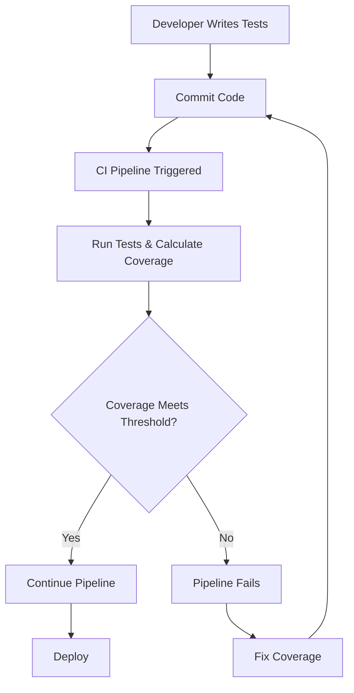

# CI/CD Test Coverage

## Introduction

Test coverage is a critical metric in modern software development pipelines. In the context of Continuous Integration and Continuous Deployment (CI/CD), test coverage measures how much of your codebase is exercised by your automated tests. It helps teams understand the effectiveness of their testing strategy and identify areas of code that might need additional testing.

In this guide, you'll learn what test coverage is, why it matters in CI/CD pipelines, how to measure it, and how to integrate coverage metrics into your workflow for better code quality.

## What is Test Coverage?

Test coverage is a measurement of how much of your code is executed when your test suite runs. It's typically expressed as a percentage:

```
Test Coverage (%) = (Number of code lines executed / Total number of code lines) × 100
```

However, coverage isn't just about lines of code. There are several types of coverage metrics:

- **Line Coverage**: Percentage of code lines executed during testing
- **Branch Coverage**: Percentage of branches (like if/else statements) executed
- **Function Coverage**: Percentage of functions called during testing
- **Statement Coverage**: Percentage of statements executed

Each of these metrics provides different insights into your testing strategy.

## Why Test Coverage Matters in CI/CD

In a CI/CD pipeline, integrating test coverage serves several important purposes:

1. **Quality Assurance**: Higher coverage often correlates with fewer bugs in production
2. **Regression Prevention**: Ensures changes don't break existing functionality
3. **Documentation**: Acts as living documentation of expected system behavior
4. **Guidance**: Helps identify undertested parts of your codebase
5. **Confidence**: Provides confidence for developers to make changes

When combined with other quality metrics, test coverage becomes a powerful tool for maintaining and improving code quality throughout the development lifecycle.

## Setting Up Test Coverage in CI/CD

Let's explore how to integrate test coverage into your CI/CD pipeline with a practical example.

### Step 1: Choose a Coverage Tool

Different programming languages have different tools for measuring test coverage:

- JavaScript: Jest, Istanbul, NYC
- Python: Coverage.py, pytest-cov
- Java: JaCoCo, Cobertura
- Ruby: SimpleCov
- Go: go test -cover

For our example, we'll use Jest for a JavaScript project.

### Step 2: Configure Your Testing Framework

First, install Jest and its coverage reporter:

```bash
npm install --save-dev jest
```

Then in your `package.json`, add:

```json
{
  "scripts": {
    "test": "jest",
    "test:coverage": "jest --coverage"
  },
  "jest": {
    "collectCoverageFrom": [
      "src/**/*.{js,jsx}",
      "!**/node_modules/**",
      "!**/vendor/**"
    ],
    "coverageThreshold": {
      "global": {
        "branches": 80,
        "functions": 80,
        "lines": 80,
        "statements": 80
      }
    }
  }
}
```

This configuration:
- Collects coverage from all JavaScript files in your src directory
- Excludes node_modules and vendor directories
- Sets a coverage threshold of 80% for branches, functions, lines, and statements

### Step 3: Write Tests That Maximize Coverage

Let's look at a simple example. Consider this JavaScript function:

```javascript
// math.js
function calculateDiscount(price, discountPercent) {
  if (typeof price !== 'number' || typeof discountPercent !== 'number') {
    throw new Error('Price and discount must be numbers');
  }
  
  if (price < 0 || discountPercent < 0 || discountPercent > 100) {
    throw new Error('Invalid price or discount values');
  }
  
  const discountAmount = (price * discountPercent) / 100;
  return price - discountAmount;
}

module.exports = { calculateDiscount };
```

A test file with good coverage would be:

```javascript
// math.test.js
const { calculateDiscount } = require('./math');

describe('calculateDiscount', () => {
  test('calculates discount correctly', () => {
    expect(calculateDiscount(100, 20)).toBe(80);
    expect(calculateDiscount(50, 10)).toBe(45);
  });
  
  test('handles zero discount', () => {
    expect(calculateDiscount(100, 0)).toBe(100);
  });
  
  test('handles zero price', () => {
    expect(calculateDiscount(0, 20)).toBe(0);
  });
  
  test('throws error for non-numeric inputs', () => {
    expect(() => calculateDiscount('100', 20)).toThrow();
    expect(() => calculateDiscount(100, '20')).toThrow();
  });
  
  test('throws error for invalid values', () => {
    expect(() => calculateDiscount(-100, 20)).toThrow();
    expect(() => calculateDiscount(100, -20)).toThrow();
    expect(() => calculateDiscount(100, 120)).toThrow();
  });
});
```

This test suite exercises all branches and conditions in our function, achieving high coverage.

### Step 4: Integrate Coverage Reports in CI/CD

Now, let's add this to a CI/CD pipeline. Here's an example using GitHub Actions:

```yaml
# .github/workflows/ci.yml
name: CI

on:
  push:
    branches: [ main ]
  pull_request:
    branches: [ main ]

jobs:
  test:
    runs-on: ubuntu-latest
    
    steps:
    - uses: actions/checkout@v3
    - name: Set up Node.js
      uses: actions/setup-node@v3
      with:
        node-version: '16'
        cache: 'npm'
    
    - name: Install dependencies
      run: npm ci
    
    - name: Run tests with coverage
      run: npm run test:coverage
    
    - name: Upload coverage reports
      uses: codecov/codecov-action@v3
      with:
        token: ${{ secrets.CODECOV_TOKEN }}
```

This workflow:
1. Runs on pushes to main and pull requests
2. Sets up Node.js
3. Installs dependencies
4. Runs tests with coverage
5. Uploads the coverage report to Codecov (a popular coverage reporting service)

## Visualizing Test Coverage

Let's look at how we can visualize test coverage in a CI/CD pipeline:



## Best Practices for Test Coverage

While aiming for high test coverage, it's important to follow these best practices:

1. **Focus on Quality, Not Quantity**: 100% coverage with poor assertions is worse than 80% coverage with meaningful tests.

2. **Use Coverage Thresholds**: Set minimum coverage requirements that must be met for the CI/CD pipeline to succeed.

   ```javascript
   // jest.config.js
   module.exports = {
     coverageThreshold: {
       global: {
         branches: 80,
         functions: 80,
         lines: 80,
         statements: 80
       }
     }
   };
   ```

3. **Prioritize Critical Areas**: Aim for higher coverage in core business logic and lower coverage in UI or infrastructure code.

4. **Don't Exclude Code**: Instead of excluding code from coverage reports, make it testable.

5. **Review Coverage Reports**: Regularly review reports to identify gaps and improvement opportunities.

## Real-World Example: React Component Testing

Let's look at a more complex example involving a React component:

```jsx
// Counter.jsx
import React, { useState } from 'react';

function Counter() {
  const [count, setCount] = useState(0);
  
  const increment = () => setCount(count + 1);
  const decrement = () => {
    if (count > 0) {
      setCount(count - 1);
    }
  };
  const reset = () => setCount(0);
  
  return (
    <div>
      <h2>Count: {count}</h2>
      <button onClick={increment}>Increment</button>
      <button onClick={decrement}>Decrement</button>
      <button onClick={reset}>Reset</button>
    </div>
  );
}

export default Counter;
```

Here's how we might test it with good coverage:

```jsx
// Counter.test.jsx
import React from 'react';
import { render, screen, fireEvent } from '@testing-library/react';
import Counter from './Counter';

describe('Counter', () => {
  test('renders initial count of 0', () => {
    render(<Counter />);
    expect(screen.getByText('Count: 0')).toBeInTheDocument();
  });
  
  test('increments count when increment button is clicked', () => {
    render(<Counter />);
    fireEvent.click(screen.getByText('Increment'));
    expect(screen.getByText('Count: 1')).toBeInTheDocument();
  });
  
  test('decrements count when decrement button is clicked', () => {
    render(<Counter />);
    // First increment to 1
    fireEvent.click(screen.getByText('Increment'));
    // Then decrement back to 0
    fireEvent.click(screen.getByText('Decrement'));
    expect(screen.getByText('Count: 0')).toBeInTheDocument();
  });
  
  test('does not decrement below 0', () => {
    render(<Counter />);
    // Try to decrement at 0
    fireEvent.click(screen.getByText('Decrement'));
    expect(screen.getByText('Count: 0')).toBeInTheDocument();
  });
  
  test('resets count to 0', () => {
    render(<Counter />);
    // Increment a few times
    fireEvent.click(screen.getByText('Increment'));
    fireEvent.click(screen.getByText('Increment'));
    // Then reset
    fireEvent.click(screen.getByText('Reset'));
    expect(screen.getByText('Count: 0')).toBeInTheDocument();
  });
});
```

This test suite exercises all the component's functionality, providing good coverage.

## Common Test Coverage Pitfalls

While working with test coverage, be aware of these common pitfalls:

1. **Coverage Obsession**: Focusing too much on hitting 100% coverage can lead to meaningless tests.

2. **Missing Edge Cases**: High coverage doesn't guarantee all edge cases are covered.

3. **Ignoring Integration Testing**: Unit test coverage alone doesn't ensure components work together.

4. **False Confidence**: Coverage only tells you code was executed, not that it was tested properly.

5. **Untested Error Handling**: Error paths are often overlooked in coverage.

## Integrating Coverage Reports with Pull Requests

Modern CI/CD systems can comment on pull requests with coverage information:

```yaml
# .github/workflows/coverage-comment.yml
name: Code Coverage Comment

on:
  pull_request:
    branches: [ main ]

jobs:
  coverage:
    runs-on: ubuntu-latest
    steps:
      - uses: actions/checkout@v3
      - name: Set up Node.js
        uses: actions/setup-node@v3
        with:
          node-version: '16'
          cache: 'npm'
      
      - name: Install dependencies
        run: npm ci
      
      - name: Run tests with coverage
        run: npm run test:coverage
      
      - name: Comment coverage on PR
        uses: romeovs/lcov-reporter-action@v0.3.1
        with:
          github-token: ${{ secrets.GITHUB_TOKEN }}
          lcov-file: ./coverage/lcov.info
```

This workflow adds a comment to pull requests showing coverage changes, helping reviewers see if the changes are adequately tested.

## Summary

Test coverage is an essential aspect of a robust CI/CD pipeline. When implemented correctly, it provides:

- Confidence in code changes
- Early detection of untested code
- A quality gate in your deployment process
- Guidance for test improvement efforts

Remember that coverage is just one metric among many for code quality. It works best when combined with other practices like code reviews, static analysis, and integration testing.

## Additional Resources

- [Jest Documentation on Coverage](https://jestjs.io/docs/configuration#collectcoveragefrom-array)
- [Istanbul Coverage Tool](https://istanbul.js.org/)
- [Codecov Documentation](https://docs.codecov.io/)
- [Testing Library Best Practices](https://testing-library.com/docs/react-testing-library/intro/)

## Exercises

1. Set up Jest coverage reporting in a simple JavaScript project and achieve at least 90% line coverage.
2. Configure a CI/CD pipeline that fails if coverage drops below a threshold.
3. Add test coverage reporting to an existing project and identify areas with low coverage.
4. Write tests that achieve 100% branch coverage for a function with multiple conditional paths.
5. Create a GitHub workflow that comments coverage statistics on pull requests.