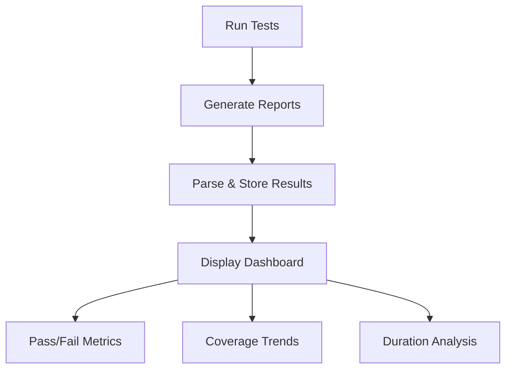

# CI/CD Test Reports

## Introduction

Test reports are a crucial component of any Continuous Integration and Continuous Deployment (CI/CD) pipeline. They provide tangible evidence of your application's quality, help identify problems early, and create a historical record of your testing process. In this guide, we'll explore how test reports work in CI/CD environments, how to generate them, and how to interpret them to make informed decisions about your software releases.

## What Are CI/CD Test Reports?

Test reports in CI/CD are structured documents that capture the results of automated tests executed during the pipeline. They typically include:

- Summary of passed, failed, and skipped tests
- Execution time for individual tests and test suites
- Details of test failures with stack traces
- Code coverage metrics
- Trends over time

These reports transform raw test outputs into actionable insights that help teams maintain and improve software quality.

## Why Test Reports Matter

Test reports serve several critical functions in a CI/CD workflow:

1. **Quality Verification**: They provide objective evidence that the software meets quality standards
2. **Early Problem Detection**: They help identify issues before they reach production
3. **Developer Feedback**: They give immediate feedback to developers about their changes
4. **Release Decision Support**: They inform go/no-go decisions for deployments
5. **Compliance**: They offer documentation for regulatory or audit requirements

## Types of Test Reports in CI/CD

### 1. Unit Test Reports

Unit test reports document the testing of individual components or functions. They focus on verifying that each piece of code works as expected in isolation.

```javascript
// Example unit test for a simple calculator function
test('adds 1 + 2 to equal 3', () => {
  expect(add(1, 2)).toBe(3);
});
```

A typical unit test report might look like:

```
PASS  src/calculator.test.js
  ✓ adds 1 + 2 to equal 3 (3ms)
  ✓ subtracts 5 - 3 to equal 2 (1ms)
  ✓ multiplies 4 * 3 to equal 12 (1ms)

Test Suites: 1 passed, 1 total
Tests:       3 passed, 3 total
Snapshots:   0 total
Time:        1.234s
```

### 2. Integration Test Reports

Integration test reports show how components work together. They're essential for identifying issues that only appear when different parts of your application interact.

```javascript
// Example integration test for API and database interaction
test('saves user to database via API', async () => {
  const user = { name: 'John Doe', email: 'john@example.com' };
  const response = await api.post('/users', user);
  
  expect(response.status).toBe(201);
  
  // Verify user was saved to database
  const savedUser = await db.findUserByEmail('john@example.com');
  expect(savedUser.name).toBe('John Doe');
});
```

### 3. End-to-End Test Reports

E2E test reports document tests that simulate real user interactions with your application. They verify that the entire system works correctly from a user's perspective.

```javascript
// Example E2E test using Cypress
describe('Login Flow', () => {
  it('should allow a user to log in', () => {
    cy.visit('/login');
    cy.get('input[name="username"]').type('testuser');
    cy.get('input[name="password"]').type('password123');
    cy.get('button[type="submit"]').click();
    cy.url().should('include', '/dashboard');
    cy.contains('Welcome, Test User').should('be.visible');
  });
});
```

### 4. Code Coverage Reports

Coverage reports show how much of your code was executed during tests, highlighting areas that might need additional testing.

```
-------------------|---------|----------|---------|---------|-------------------
File               | % Stmts | % Branch | % Funcs | % Lines | Uncovered Line #s 
-------------------|---------|----------|---------|---------|-------------------
All files          |   85.71 |      75 |     100 |   85.71 |                   
 calculator.js     |     100 |     100 |     100 |     100 |                   
 userService.js    |   77.78 |      50 |     100 |   77.78 | 15,32             
-------------------|---------|----------|---------|---------|-------------------
```

## Generating Test Reports in CI/CD Pipelines

Most CI/CD platforms offer built-in support for test reporting. Here's how to set it up in some popular systems:

### GitHub Actions

```yaml
jobs:
  test:
    runs-on: ubuntu-latest
    steps:
      - uses: actions/checkout@v3
      - name: Set up Node.js
        uses: actions/setup-node@v3
        with:
          node-version: '18'
      - run: npm install
      - run: npm test -- --ci --coverage
      
      # Publish Test Report
      - name: Publish Test Report
        uses: mikepenz/action-junit-report@v3
        if: always() # Always run even if tests fail
        with:
          report_paths: 'junit.xml'
          
      # Publish Coverage Report
      - name: Publish Coverage Report
        uses: codecov/codecov-action@v3
        with:
          file: ./coverage/coverage-final.json
```

### Jenkins

```groovy
pipeline {
    agent any
    stages {
        stage('Test') {
            steps {
                sh 'npm install'
                sh 'npm test -- --ci --reporters=default --reporters=jest-junit'
            }
            post {
                always {
                    junit 'junit.xml'
                    publishHTML(target: [
                        allowMissing: false,
                        alwaysLinkToLastBuild: true,
                        keepAll: true,
                        reportDir: 'coverage/lcov-report',
                        reportFiles: 'index.html',
                        reportName: 'Code Coverage Report'
                    ])
                }
            }
        }
    }
}
```

### GitLab CI

```yaml
test:
  stage: test
  script:
    - npm install
    - npm test -- --ci --reporters=default --reporters=jest-junit
  artifacts:
    when: always
    reports:
      junit: junit.xml
      coverage_report:
        coverage_format: cobertura
        path: coverage/cobertura-coverage.xml
```

## Configuring Test Runners for Report Generation

To generate reports, you'll need to configure your test runner appropriately:

### Jest (JavaScript)

```javascript
// jest.config.js
module.exports = {
  reporters: [
    'default',
    ['jest-junit', {
      outputDirectory: 'reports',
      outputName: 'jest-junit.xml',
    }],
  ],
  collectCoverage: true,
  coverageReporters: ['text', 'lcov', 'cobertura'],
};
```

### JUnit (Java)

```xml
<!-- pom.xml -->
<plugin>
  <groupId>org.apache.maven.plugins</groupId>
  <artifactId>maven-surefire-plugin</artifactId>
  <version>3.0.0</version>
  <configuration>
    <reportFormat>xml</reportFormat>
    <outputDirectory>${project.build.directory}/surefire-reports</outputDirectory>
  </configuration>
</plugin>
```

### pytest (Python)

```ini
# pytest.ini
[pytest]
addopts = --junitxml=reports/junit.xml --cov=app --cov-report=xml:reports/coverage.xml
```

## Interpreting Test Reports

Understanding your test reports is as important as generating them. Here's what to look for:

### Key Metrics to Monitor

1. **Pass Rate**: The percentage of tests that pass
2. **Test Coverage**: How much of your code is being tested
3. **Failure Trends**: Are the same tests failing consistently?
4. **Execution Time**: Are your tests getting slower over time?
5. **Flaky Tests**: Tests that sometimes pass and sometimes fail without code changes

### Visualizing Test Data

Most CI/CD platforms provide dashboards to visualize test results:



## Best Practices for CI/CD Test Reporting

### 1. Fail Fast, Fail Early

Configure your pipeline to fail as soon as critical tests fail. This provides faster feedback to developers.

```yaml
# GitHub Actions example with fail-fast strategy
jobs:
  test:
    runs-on: ubuntu-latest
    strategy:
      fail-fast: true
    steps:
      - uses: actions/checkout@v3
      - name: Run Critical Tests First
        run: npm run test:critical
      - name: Run Remaining Tests
        run: npm run test:full
```

### 2. Categorize Tests by Importance

Not all tests are equally important. Consider categorizing them:

- **Smoke Tests**: Quick tests to verify basic functionality
- **Critical Path Tests**: Tests for core business flows
- **Regression Tests**: Tests that verify fixed bugs don't reappear
- **Performance Tests**: Tests that verify system performance meets requirements

### 3. Store Historical Test Data

Keeping historical test data allows you to:
- Track improvements over time
- Identify trends
- Correlate failures with code changes

### 4. Automate Response to Test Failures

Set up automated notifications for test failures:

```javascript
// Example notification webhook in Node.js
function notifyTestFailure(testReport) {
  const failedTests = testReport.filter(test => test.status === 'failed');
  
  if (failedTests.length > 0) {
    const message = {
      channel: '#ci-alerts',
      text: `⚠️ ${failedTests.length} tests failed in the latest build`,
      attachments: failedTests.map(test => ({
        title: test.name,
        text: test.errorMessage,
        color: 'danger'
      }))
    };
    
    return fetch('https://your-webhook-url.com', {
      method: 'POST',
      headers: { 'Content-Type': 'application/json' },
      body: JSON.stringify(message)
    });
  }
}
```

## Real-World Example: Setting Up a Complete Test Reporting Pipeline

Let's walk through setting up a complete test reporting pipeline for a Node.js application:

### Step 1: Configure Your Test Runner

```javascript
// jest.config.js
module.exports = {
  testEnvironment: 'node',
  collectCoverage: true,
  coverageReporters: ['text', 'lcov', 'cobertura'],
  reporters: [
    'default',
    ['jest-junit', {
      outputDirectory: './reports/junit',
      outputName: 'results.xml',
    }],
    ['jest-html-reporter', {
      pageTitle: 'Test Report',
      outputPath: './reports/html/test-report.html',
    }]
  ],
};
```

### Step 2: Create a CI/CD Pipeline Configuration

```yaml
# .github/workflows/ci.yml
name: CI Pipeline

on:
  push:
    branches: [ main ]
  pull_request:
    branches: [ main ]

jobs:
  test:
    runs-on: ubuntu-latest
    steps:
      - uses: actions/checkout@v3
      - name: Use Node.js
        uses: actions/setup-node@v3
        with:
          node-version: '18'
          cache: 'npm'
      - run: npm ci
      - run: npm test
      
      - name: Publish Test Results
        uses: EnricoMi/publish-unit-test-result-action@v2
        if: always()
        with:
          files: reports/junit/results.xml
          
      - name: Upload coverage to Codecov
        uses: codecov/codecov-action@v3
        with:
          directory: ./coverage/
      
      - name: Upload HTML Report
        uses: actions/upload-artifact@v3
        if: always()
        with:
          name: test-report
          path: reports/html/test-report.html
```

### Step 3: Set Up a Dashboard to Visualize Results

Many tools can help visualize test results over time:
- GitHub's built-in Actions Insights
- Jenkins Test Results Analyzer plugin
- Standalone tools like Allure Report

### Step 4: Create a Policy for Handling Test Failures

Define clear policies for how to handle test failures:

1. **Critical failures**: Block deployment and require immediate attention
2. **Non-critical failures**: May allow deployment with review
3. **Flaky tests**: Quarantine and investigate

## Troubleshooting Common Issues

### Issue: Tests Pass Locally But Fail in CI

**Potential Causes**:
- Environment differences
- Race conditions
- Resource limitations

**Solution**:
```javascript
// Add more logging to identify issues
test('user registration', async () => {
  console.log('Starting test with environment:', process.env.NODE_ENV);
  try {
    const result = await registerUser('test@example.com', 'password');
    console.log('Registration result:', result);
    expect(result.success).toBe(true);
  } catch (error) {
    console.error('Test failed with error:', error);
    throw error;
  }
});
```

### Issue: Flaky Tests

**Solution**: Implement retries for non-deterministic tests:

```javascript
// jest.config.js
module.exports = {
  // ...other config
  retry: 3, // Retry failed tests up to 3 times
};
```

## Summary

CI/CD test reports are vital tools for maintaining software quality in modern development workflows. They provide:

- Visibility into the health of your application
- Early detection of quality issues
- Historical data to track improvements
- Documentation for compliance and auditing

By implementing robust test reporting in your CI/CD pipeline, you create a feedback loop that continuously improves your software's quality and reliability.

## Exercises

1. Set up a basic test reporting pipeline using GitHub Actions or another CI/CD platform
2. Configure your test runner to generate both XML and HTML reports
3. Implement a notification system that alerts your team when critical tests fail
4. Create a dashboard to visualize test trends over time
5. Add custom metrics to your test reports that are specific to your application

## Additional Resources

- [Jest Documentation](https://jestjs.io/docs/configuration)
- [GitHub Actions Documentation](https://docs.github.com/en/actions)
- [Jenkins Test Reporting](https://www.jenkins.io/doc/pipeline/tour/tests-and-artifacts/)
- [GitLab CI/CD Testing](https://docs.gitlab.com/ee/ci/testing/)
- [Test-Driven Development: By Example](https://www.amazon.com/Test-Driven-Development-Kent-Beck/dp/0321146530) by Kent Beck