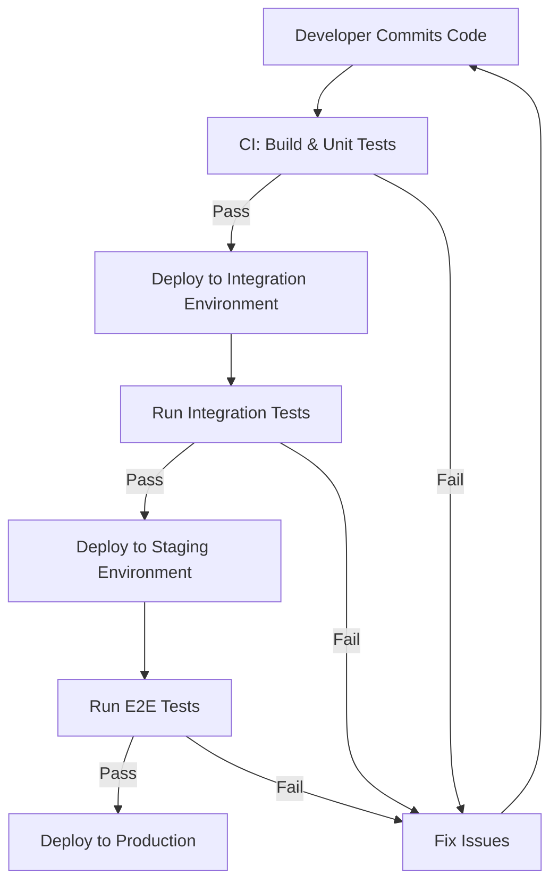

# CICD Test Environments

## Introduction

Test environments are a critical component of any CI/CD (Continuous Integration/Continuous Deployment) pipeline. They provide isolated spaces where code can be tested before it moves to production, ensuring that new changes don't break existing functionality. In this guide, we'll explore different types of test environments, how to set them up, and best practices for managing them effectively.

## What Are CICD Test Environments?

Test environments in CI/CD are dedicated spaces that mirror your production environment (to varying degrees) where automated tests can be run against your code. They help catch bugs and issues early in the development process, reducing the risk of problems in production.

### Key Characteristics

- **Isolation**: Test environments should be isolated from production to prevent any impact on real users
- **Reproducibility**: Environments should be consistent and reproducible to ensure reliable test results
- **Automation**: Setting up, testing in, and tearing down environments should be automated
- **Scalability**: The environment strategy should scale with your team and application

## Types of Test Environments in CI/CD

Let's explore the common types of test environments used in CI/CD pipelines:

### 1. Development Environment

This is where developers write and test their code locally before pushing changes.

- **Purpose**: Initial development and testing
- **Users**: Individual developers
- **When used**: Before code is committed to the repository

### 2. Integration Environment

After individual components pass unit tests, they're combined and tested together.

- **Purpose**: Testing how different components work together
- **When used**: After code is committed but before it's merged to the main branch

### 3. Staging/Pre-production Environment

This environment closely mimics production and is used for final testing before deployment.

- **Purpose**: Final validation of features and performance
- **When used**: After passing all previous tests, before deploying to production

### 4. Production Environment

The live environment where real users interact with your application.

- **Purpose**: Serving the application to end users
- **When used**: After passing all tests in previous environments

## Setting Up Test Environments in CI/CD

Let's look at how to set up test environments for your CI/CD pipeline:

### Using Docker Containers

Docker containers provide lightweight, consistent environments that are perfect for CI/CD testing.

```bash
# Example Docker Compose file for a test environment
version: '3'
services:
  web:
    image: my-app:${VERSION}
    ports:
      - "8080:80"
    environment:
      - DB_HOST=db
      - ENVIRONMENT=test
  db:
    image: postgres:13
    environment:
      - POSTGRES_PASSWORD=test_password
      - POSTGRES_USER=test_user
      - POSTGRES_DB=test_db
```

### Infrastructure as Code (IaC)

Using infrastructure as code tools like Terraform allows you to define and provision test environments consistently.

```hcl
# Example Terraform configuration for an AWS test environment
provider "aws" {
  region = "us-west-2"
}

resource "aws_instance" "test_server" {
  ami           = "ami-0c55b159cbfafe1f0"
  instance_type = "t2.micro"
  tags = {
    Name = "test-environment"
    Environment = "testing"
  }
}

resource "aws_db_instance" "test_db" {
  allocated_storage    = 10
  engine               = "mysql"
  engine_version       = "5.7"
  instance_class       = "db.t2.micro"
  name                 = "test_db"
  username             = "test_user"
  password             = var.db_password
  parameter_group_name = "default.mysql5.7"
  skip_final_snapshot  = true
  tags = {
    Environment = "testing"
  }
}
```

### Using Kubernetes

Kubernetes can be used to orchestrate and manage test environments.

```yaml
# Example Kubernetes configuration for a test environment
apiVersion: apps/v1
kind: Deployment
metadata:
  name: test-app
  namespace: test-env
spec:
  replicas: 1
  selector:
    matchLabels:
      app: test-app
  template:
    metadata:
      labels:
        app: test-app
    spec:
      containers:
      - name: app
        image: my-app:${VERSION}
        ports:
        - containerPort: 80
        env:
        - name: ENVIRONMENT
          value: "test"
---
apiVersion: v1
kind: Service
metadata:
  name: test-app-service
  namespace: test-env
spec:
  selector:
    app: test-app
  ports:
  - port: 80
    targetPort: 80
  type: ClusterIP
```

## Test Environment Workflows in CI/CD

Let's visualize a typical workflow that uses different test environments:



### Example CI/CD Pipeline with Test Environments

Here's how this might look in a GitHub Actions workflow:

```yaml
name: CI/CD Pipeline

on:
  push:
    branches: [ main ]
  pull_request:
    branches: [ main ]

jobs:
  build_and_test:
    runs-on: ubuntu-latest
    steps:
    - uses: actions/checkout@v2
    - name: Set up Node.js
      uses: actions/setup-node@v2
      with:
        node-version: '16'
    - name: Install dependencies
      run: npm ci
    - name: Run unit tests
      run: npm test
  
  deploy_to_integration:
    needs: build_and_test
    runs-on: ubuntu-latest
    steps:
    - uses: actions/checkout@v2
    - name: Deploy to integration
      run: |
        echo "Setting up integration environment..."
        # Scripts to deploy to your integration environment
    - name: Run integration tests
      run: |
        echo "Running integration tests..."
        # Run integration test suite
  
  deploy_to_staging:
    needs: deploy_to_integration
    runs-on: ubuntu-latest
    steps:
    - uses: actions/checkout@v2
    - name: Deploy to staging
      run: |
        echo "Setting up staging environment..."
        # Scripts to deploy to your staging environment
    - name: Run E2E tests
      run: |
        echo "Running end-to-end tests..."
        # Run E2E test suite
  
  deploy_to_production:
    needs: deploy_to_staging
    if: github.event_name == 'push' && github.ref == 'refs/heads/main'
    runs-on: ubuntu-latest
    steps:
    - uses: actions/checkout@v2
    - name: Deploy to production
      run: |
        echo "Deploying to production..."
        # Scripts to deploy to your production environment
```

## Best Practices for CICD Test Environments

### 1. Ephemeral Environments

Create disposable environments that can be easily spun up and torn down for each test run.

```bash
# Example script to create an ephemeral test environment
#!/bin/bash

# Generate a unique ID for this test environment
ENV_ID=$(uuidgen | cut -d'-' -f1)

# Create the environment
echo "Creating test environment with ID: $ENV_ID"
docker-compose -p test-$ENV_ID up -d

# Run tests
echo "Running tests in environment $ENV_ID"
npm run test:e2e -- --url http://localhost:8080

# Tear down the environment
echo "Destroying test environment $ENV_ID"
docker-compose -p test-$ENV_ID down -v
```

### 2. Environment Parity

Ensure test environments closely resemble production to catch environment-specific issues.

### 3. Configuration Management

Use environment variables or configuration files to manage environment-specific settings.

```javascript
// Example configuration handling in Node.js
const config = {
  development: {
    database: {
      host: 'localhost',
      port: 5432,
      name: 'dev_db'
    },
    apiUrl: 'http://localhost:3000/api'
  },
  test: {
    database: {
      host: 'test-db',
      port: 5432,
      name: 'test_db'
    },
    apiUrl: 'http://test-api:3000/api'
  },
  production: {
    database: {
      host: process.env.DB_HOST,
      port: parseInt(process.env.DB_PORT || '5432'),
      name: process.env.DB_NAME
    },
    apiUrl: process.env.API_URL
  }
};

// Export the configuration for the current environment
const env = process.env.NODE_ENV || 'development';
module.exports = config[env];
```

### 4. Database Management

Handle test data properly to ensure tests are reliable and repeatable.

```javascript
// Example of setting up a test database in Jest
beforeAll(async () => {
  // Connect to test database
  await db.connect();
  
  // Reset to a known state
  await db.reset();
  
  // Seed with test data
  await db.seed();
});

afterAll(async () => {
  // Clean up
  await db.clean();
  await db.disconnect();
});
```

### 5. Parallel Environments

Set up your CI/CD pipeline to run tests in parallel environments to speed up testing.

### 6. Security Considerations

Secure your test environments, especially if they contain sensitive data.

```yaml
# Example of security settings for a test environment in Kubernetes
apiVersion: networking.k8s.io/v1
kind: NetworkPolicy
metadata:
  name: test-env-network-policy
  namespace: test-env
spec:
  podSelector: {}
  policyTypes:
  - Ingress
  - Egress
  ingress:
  - from:
    - namespaceSelector:
        matchLabels:
          name: ci-system
  egress:
  - to:
    - namespaceSelector:
        matchLabels:
          name: test-dependencies
```

## Real-World Example: E-commerce Application

Let's walk through how test environments might be used in an e-commerce application CI/CD pipeline:

1. **Local Development Environment**:
   - Developer implements a new feature for product recommendations
   - Runs unit tests locally to verify basic functionality

2. **Integration Environment**:
   - Code is pushed and automatically deployed to the integration environment
   - Integration tests verify that the recommendation engine works with the product catalog service

3. **Staging Environment**:
   - After passing integration tests, code is deployed to staging
   - End-to-end tests simulate user flows, including viewing recommendations and adding products to cart
   - Performance tests verify the recommendation engine doesn't slow down page load times

4. **Production Environment**:
   - After all tests pass, the feature is deployed to production
   - Monitoring confirms the feature works correctly for real users

## Common Challenges and Solutions

### Challenge 1: Environment Drift

**Problem**: Test environments gradually become different from production.

**Solution**: Use infrastructure as code to ensure all environments are defined consistently.

### Challenge 2: Test Data Management

**Problem**: Tests need realistic data but shouldn't impact real systems.

**Solution**: Create anonymized copies of production data or generate synthetic test data.

```python
# Example of generating synthetic test data
def generate_test_users(count=100):
    users = []
    for i in range(count):
        users.append({
            "id": f"test-user-{i}",
            "name": f"Test User {i}",
            "email": f"test-user-{i}@example.com",
            "registration_date": datetime.now() - timedelta(days=random.randint(1, 365))
        })
    return users

# Generate and save test data
test_users = generate_test_users()
with open('test_data/users.json', 'w') as f:
    json.dump(test_users, f)
```

### Challenge 3: Resource Constraints

**Problem**: Maintaining multiple environments can be resource-intensive.

**Solution**: Use ephemeral environments that are created only when needed and destroyed after tests complete.

## Summary

CICD test environments are essential for ensuring software quality and reliability in modern development workflows. By implementing the right types of environments and following best practices, you can catch issues early, reduce risks, and deliver high-quality software more confidently.

Key takeaways:

- Different types of test environments serve different purposes in the CI/CD pipeline
- Automation is crucial for maintaining consistent and reliable test environments
- Infrastructure as code helps ensure environment consistency
- Ephemeral environments can save resources while providing isolation
- Environment parity between testing and production reduces "works on my machine" issues

## Additional Resources

- Learn more about Docker containerization for test environments
- Explore Kubernetes for orchestrating complex test environments
- Investigate infrastructure as code tools like Terraform or Pulumi
- Study database strategies for test environments

## Exercises

1. Set up a local development environment using Docker Compose for a simple web application
2. Create a CI/CD pipeline that deploys to at least two different test environments before production
3. Implement a strategy for managing test data in your test environments
4. Design an ephemeral environment setup that creates and destroys environments automatically
5. Configure environment-specific settings for development, testing, and production environments