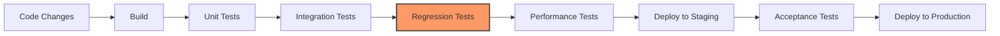

# CICD Regression Testing

## Introduction

Regression testing is a critical component of the Continuous Integration and Continuous Deployment (CI/CD) pipeline. As developers continuously integrate new code and deploy changes to production, it's essential to ensure that these changes don't break existing functionality. This is exactly what regression testing accomplishes.

In this guide, we'll explore how regression testing fits into the CI/CD workflow, why it's important, and how to implement effective regression testing strategies in your CI/CD pipeline.

## What is Regression Testing?

Regression testing is the process of re-running previously executed tests to ensure that existing functionality still works after code changes. The name "regression" refers to the fact that we're checking that our software hasn't regressed—or gone backward—in terms of functionality.

### Key Concepts

- **Regression bugs**: Defects that appear in existing features after code changes
- **Test suites**: Collections of test cases that verify specific application functionality
- **Test automation**: Running tests automatically to detect regressions without manual effort

## Why Regression Testing is Essential in CI/CD

In a CI/CD environment, code changes happen frequently—sometimes multiple times per day. Without proper regression testing:

1. New features might break existing functionality
2. Bug fixes could introduce new bugs
3. Code refactoring might cause unexpected side effects
4. Performance improvements might degrade other aspects of the application

Regression testing provides a safety net that catches these issues before they reach production.

## Integrating Regression Testing in CI/CD Pipeline

Let's look at how regression testing fits into a typical CI/CD pipeline:



### When to Run Regression Tests

Regression tests can be executed at different stages of the CI/CD pipeline:

1. **After each build**: Run a subset of critical regression tests
2. **After integration tests**: Run more comprehensive regression test suites
3. **Before deployment**: Run full regression test suites
4. **After deployment**: Run smoke tests to verify functionality in production

## Implementing Regression Testing in CI/CD

Now, let's explore how to implement regression testing in your CI/CD pipeline:

### 1. Identify Critical Functionality

First, identify the core features and critical paths in your application that must always work correctly:

```javascript
// Example of critical functionality to prioritize in regression testing
function userAuthentication(username, password) {
  // Authentication logic that should never break
  if (validateCredentials(username, password)) {
    return generateAuthToken(username);
  }
  return null;
}
```

### 2. Create Automated Test Cases

Develop automated test cases for the critical functionality:

```javascript
// Jest test example for the authentication functionality
test('user authentication with valid credentials returns token', () => {
  const username = 'testuser';
  const password = 'validPassword123';
  
  const result = userAuthentication(username, password);
  
  expect(result).not.toBeNull();
  expect(typeof result).toBe('string');
  expect(result.length).toBeGreaterThan(0);
});

test('user authentication with invalid credentials returns null', () => {
  const username = 'testuser';
  const password = 'wrongPassword';
  
  const result = userAuthentication(username, password);
  
  expect(result).toBeNull();
});
```

### 3. Configure CI/CD Tool to Run Regression Tests

Here's an example of configuring GitHub Actions to run regression tests:

```yaml
# .github/workflows/regression-tests.yml
name: Regression Tests

on:
  push:
    branches: [ main, develop ]
  pull_request:
    branches: [ main, develop ]

jobs:
  test:
    runs-on: ubuntu-latest
    steps:
      - uses: actions/checkout@v3
      - name: Use Node.js
        uses: actions/setup-node@v3
        with:
          node-version: '16.x'
      - run: npm ci
      - run: npm run build --if-present
      - name: Run regression tests
        run: npm run test:regression
```

### 4. Implement Test Selection Strategies

Rather than running all tests for every change, use test selection strategies:

```javascript
// Example of test selection based on code changes
function selectRegressionTests(changedFiles) {
  const testSuites = [];
  
  if (changedFiles.some(file => file.includes('/auth/'))) {
    testSuites.push('auth-regression-suite');
  }
  
  if (changedFiles.some(file => file.includes('/payment/'))) {
    testSuites.push('payment-regression-suite');
  }
  
  // If no specific test suite is selected, run the core regression suite
  if (testSuites.length === 0) {
    testSuites.push('core-regression-suite');
  }
  
  return testSuites;
}
```

## Testing Framework Examples

Here are examples of setting up regression tests with popular testing frameworks:

### Jest (JavaScript/TypeScript)

```javascript
// jest.config.js - Configuration for regression tests
module.exports = {
  // Specify test match pattern for regression tests
  testMatch: ['**/__tests__/**/*regression*.js?(x)', '**/?(*.)+(regression-spec|regression-test).js?(x)'],
  // Configure test environment
  testEnvironment: 'node',
  // Setup and teardown files
  setupFilesAfterEnv: ['<rootDir>/setup-regression-tests.js'],
  // Generate test coverage reports
  collectCoverage: true,
  coverageDirectory: 'coverage/regression',
};
```

### JUnit (Java)

```java
// Example of a JUnit regression test class
@Category(RegressionTest.class)
public class PaymentProcessingRegressionTest {
    
    @Before
    public void setUp() {
        // Set up test data and dependencies
    }
    
    @Test
    public void testPaymentProcessingWithValidCard() {
        // Test implementation
        PaymentProcessor processor = new PaymentProcessor();
        PaymentResult result = processor.processPayment(
            new PaymentRequest("4111111111111111", "12/25", "123", 100.00)
        );
        
        assertEquals(PaymentStatus.APPROVED, result.getStatus());
    }
    
    @After
    public void tearDown() {
        // Clean up resources
    }
}
```

### pytest (Python)

```python
# Example of pytest regression test with markers
import pytest

@pytest.mark.regression
def test_user_registration():
    # Test implementation
    from user_service import UserService
    
    service = UserService()
    result = service.register_user("newuser@example.com", "Password123!")
    
    assert result.success == True
    assert result.user_id is not None

# Run with: pytest -m regression
```

## Best Practices for CI/CD Regression Testing

For effective regression testing in your CI/CD pipeline, follow these best practices:

### 1. Maintain a Stable Test Environment

Ensure your regression tests run in consistent environments to avoid false positives/negatives:

```javascript
// Example of environment setup in a test
beforeAll(async () => {
  // Reset database to known state
  await resetTestDatabase();
  
  // Start with clean caches
  await clearCaches();
  
  // Configure environment variables
  process.env.API_ENDPOINT = 'http://test-api.example.com';
  process.env.FEATURE_FLAGS = 'regression-test-mode=true';
  
  // Start test server
  testServer = await startTestServer();
});
```

### 2. Implement Test Prioritization

Run the most critical tests first to get faster feedback:

```javascript
// Example of test suite with priority annotations
/**
 * @priority HIGH
 */
describe('Payment Processing Tests', () => {
  // Critical payment tests
});

/**
 * @priority MEDIUM
 */
describe('User Profile Tests', () => {
  // Less critical functionality
});

// Custom test runner that sorts tests by priority
```

### 3. Set Time Constraints

Ensure regression tests don't slow down your CI/CD pipeline excessively:

```javascript
// Example of test timeout settings
jest.setTimeout(30000); // 30 seconds maximum per test

test('database query performance remains acceptable', async () => {
  const startTime = Date.now();
  
  const results = await runDatabaseQuery();
  
  const duration = Date.now() - startTime;
  expect(duration).toBeLessThan(1000); // Should complete within 1 second
  expect(results.length).toBeGreaterThan(0);
});
```

### 4. Handle Flaky Tests

Address tests that sometimes pass and sometimes fail:

```javascript
// Example of handling potentially flaky tests
const MAX_RETRIES = 3;

function runWithRetry(testFn, retries = MAX_RETRIES) {
  try {
    return testFn();
  } catch (error) {
    if (retries > 0) {
      console.warn(`Test failed, retrying (${MAX_RETRIES - retries + 1}/${MAX_RETRIES})...`);
      return runWithRetry(testFn, retries - 1);
    }
    throw error;
  }
}

test('network-dependent test', () => {
  runWithRetry(() => {
    // Test implementation that might be flaky due to network
    const response = fetchExternalResource();
    expect(response.status).toBe(200);
  });
});
```

## Real-World Example: E-commerce Application

Let's look at a complete example for an e-commerce application:

### Regression Test Suite Organization

```
tests/
  regression/
    product/
      product-listing.test.js
      product-detail.test.js
      product-search.test.js
    cart/
      add-to-cart.test.js
      update-quantity.test.js
      remove-item.test.js
    checkout/
      payment-processing.test.js
      order-confirmation.test.js
    user/
      authentication.test.js
      profile-management.test.js
```

### Example Test Implementation

```javascript
// tests/regression/cart/add-to-cart.test.js
import { ShoppingCart } from '../../../src/cart/shopping-cart';
import { ProductCatalog } from '../../../src/product/product-catalog';

describe('Shopping Cart - Add to Cart Regression Tests', () => {
  let cart;
  let catalog;
  
  beforeEach(() => {
    cart = new ShoppingCart();
    catalog = new ProductCatalog();
    // Seed the catalog with test products
    catalog.addProduct({ id: 'prod-1', name: 'Test Product 1', price: 19.99, inStock: true });
    catalog.addProduct({ id: 'prod-2', name: 'Test Product 2', price: 29.99, inStock: false });
  });
  
  test('adding an in-stock product to cart increases item count', () => {
    const initialCount = cart.getItemCount();
    const product = catalog.getProductById('prod-1');
    
    cart.addItem(product, 1);
    
    expect(cart.getItemCount()).toBe(initialCount + 1);
  });
  
  test('cannot add out-of-stock products to cart', () => {
    const initialCount = cart.getItemCount();
    const product = catalog.getProductById('prod-2');
    
    // This should throw an exception or return false
    expect(() => cart.addItem(product, 1)).toThrow('Product is out of stock');
    expect(cart.getItemCount()).toBe(initialCount); // Count should not change
  });
  
  test('adding product twice increases quantity instead of adding new line item', () => {
    const product = catalog.getProductById('prod-1');
    
    cart.addItem(product, 1);
    cart.addItem(product, 2);
    
    expect(cart.getItemCount()).toBe(1); // Only one unique item
    expect(cart.getItemQuantity(product.id)).toBe(3); // But quantity is 3
  });
});
```

### CI/CD Pipeline Configuration

```yaml
# .github/workflows/regression-tests.yml for an e-commerce application
name: E-commerce Regression Tests

on:
  push:
    branches: [ main, develop ]
  pull_request:
    branches: [ main, develop ]

jobs:
  regression-test:
    runs-on: ubuntu-latest
    steps:
      - uses: actions/checkout@v3
      - name: Set up Node.js
        uses: actions/setup-node@v3
        with:
          node-version: '16.x'
      - name: Install dependencies
        run: npm ci
      - name: Set up test database
        run: |
          npm run db:setup
          npm run db:seed-test-data
      - name: Run critical path regression tests
        run: npm run test:regression:critical
        # These tests must pass quickly to give fast feedback
      - name: Run remaining regression tests
        run: npm run test:regression:full
      - name: Generate regression test report
        run: npm run test:generate-report
      - name: Upload test results
        uses: actions/upload-artifact@v3
        with:
          name: regression-test-results
          path: test-results/
```

## Monitoring and Analysis

Set up monitoring for your regression tests to identify patterns over time:

```javascript
// Example of test performance tracking
afterEach((testInfo) => {
  // Record test execution time
  const testDuration = testInfo.endTime - testInfo.startTime;
  
  // Log to a metrics system
  metrics.recordTestExecution({
    testName: testInfo.name,
    duration: testDuration,
    passed: testInfo.status === 'passed',
    timestamp: new Date(),
    branch: process.env.CI_BRANCH || 'local'
  });
});
```

## Summary

CICD Regression Testing is a vital component of modern software development that helps ensure new code changes don't break existing functionality. By implementing automated regression tests in your CI/CD pipeline, you can catch potential issues early, maintain software quality, and deploy with confidence.

We've covered:
- What regression testing is and why it's important in CI/CD
- How to integrate regression testing into your CI/CD pipeline
- Strategies for implementing effective regression tests
- Real-world examples and best practices
- Monitoring and analyzing test results

Remember that effective regression testing is an ongoing process. Regularly review your regression test suite, update tests as your application evolves, and continuously improve your testing strategy to maximize the value of your CI/CD pipeline.

## Additional Exercises

1. **Set up a basic CI/CD pipeline** with GitHub Actions or Jenkins that includes regression testing for a simple web application.
2. **Create a regression test strategy** for your current project, identifying critical functionality and test priorities.
3. **Implement test selection logic** that runs different regression test suites based on which files have changed.
4. **Design a flaky test detection system** that identifies tests that frequently fail then pass when re-run.
5. **Analyze your existing test coverage** and identify gaps in regression testing.

## Further Reading

- Test-Driven Development methodologies
- Continuous Testing strategies
- Test coverage analysis tools
- Advanced test selection and prioritization algorithms
- Containerization for consistent test environments