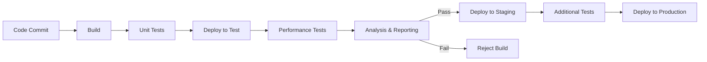
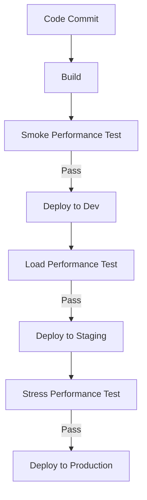

# CI/CD Performance Testing

## Introduction

Performance testing is a critical aspect of the software development lifecycle that ensures your applications can handle expected loads, respond quickly, and scale effectively. When integrated into a Continuous Integration/Continuous Deployment (CI/CD) pipeline, performance testing becomes an automated, consistent part of your development process, allowing teams to catch performance issues early before they reach production.

In this guide, we'll explore how to effectively incorporate performance testing into your CI/CD workflow, the tools that make this possible, and best practices to ensure your applications perform reliably under various conditions.

## What is CI/CD Performance Testing?

CI/CD Performance Testing refers to the practice of automatically running performance tests as part of your continuous integration and continuous deployment processes. Rather than treating performance testing as a separate, manual activity that happens infrequently, this approach makes it a regular, automated part of your development workflow.

### Key Benefits

- **Early detection of performance issues**: Identify bottlenecks and performance regressions before they reach production
- **Consistent testing environment**: Run tests in standardized environments for reliable results
- **Automated analysis**: Compare results against established baselines automatically
- **Integration with deployment decisions**: Use performance metrics as deployment gates
- **Historical tracking**: Monitor performance trends over time

## Setting Up CI/CD Performance Testing

### Prerequisites

Before implementing performance testing in your CI/CD pipeline, ensure you have:

1. A functional CI/CD pipeline (e.g., using Jenkins, GitLab CI, GitHub Actions, etc.)
2. Performance testing tools selected (e.g., JMeter, k6, Gatling, Locust)
3. Defined performance criteria and baselines
4. Testing environments that adequately represent production

### Basic Pipeline Architecture



## Implementing Performance Tests in CI/CD

Let's walk through a step-by-step implementation using k6, a modern load testing tool, integrated with GitHub Actions.

### Step 1: Create a Performance Test Script

First, create a performance test script that simulates the user behavior you want to test. Here's an example using k6:

```javascript
import http from 'k6/http';
import { sleep, check } from 'k6';

export const options = {
  vus: 10,           // Number of virtual users
  duration: '30s',   // Test duration
  thresholds: {
    http_req_duration: ['p95<500'], // 95% of requests must complete below 500ms
    http_req_failed: ['rate<0.01'],  // Less than 1% of requests should fail
  }
};

export default function() {
  const response = http.get('https://test-api.example.com/products');
  
  check(response, {
    'status is 200': (r) => r.status === 200,
    'response time < 200ms': (r) => r.timings.duration < 200,
  });
  
  sleep(1);
}
```

Save this as `performance-test.js` in your repository.

### Step 2: Configure Your CI/CD Pipeline

Create a GitHub Actions workflow file to run the performance tests after deploying to a test environment:

```yaml
name: CI/CD Pipeline with Performance Testing

on:
  push:
    branches: [ main ]
  pull_request:
    branches: [ main ]

jobs:
  build-and-test:
    runs-on: ubuntu-latest
    
    steps:
    - uses: actions/checkout@v3
    
    - name: Set up Node.js
      uses: actions/setup-node@v3
      with:
        node-version: '16'
        
    - name: Install dependencies
      run: npm ci
      
    - name: Run unit tests
      run: npm test
      
    - name: Build application
      run: npm run build
      
    - name: Deploy to test environment
      run: ./deploy-to-test.sh
      
    - name: Run performance tests
      uses: grafana/k6-action@v0.2.0
      with:
        filename: performance-test.js
        flags: --out json=results.json
        
    - name: Analyze performance results
      run: node ./analyze-performance.js
      
    - name: Upload performance results
      uses: actions/upload-artifact@v3
      with:
        name: performance-results
        path: results.json
```

### Step 3: Create an Analysis Script

The analysis script will process the test results and determine if they meet your performance criteria:

```javascript
const fs = require('fs');

// Read the k6 results
const results = JSON.parse(fs.readFileSync('results.json', 'utf8'));

// Extract metrics
const metrics = results.metrics;
const p95 = metrics.http_req_duration.values['p(95)'];
const errorRate = metrics.http_req_failed.values.rate;

console.log(`Response Time (p95): ${p95}ms`);
console.log(`Error Rate: ${errorRate * 100}%`);

// Check against thresholds
if (p95 > 500) {
  console.error('❌ Performance test failed: p95 response time exceeds 500ms');
  process.exit(1);
}

if (errorRate > 0.01) {
  console.error('❌ Performance test failed: Error rate exceeds 1%');
  process.exit(1);
}

console.log('✅ Performance tests passed!');
```

Save this as `analyze-performance.js` in your repository.

## Advanced CI/CD Performance Testing Patterns

### Baseline Comparison

Instead of fixed thresholds, compare current results against a baseline from a previous successful build:

```javascript
const currentResults = JSON.parse(fs.readFileSync('results.json', 'utf8'));
const baselineResults = JSON.parse(fs.readFileSync('baseline.json', 'utf8'));

const p95Current = currentResults.metrics.http_req_duration.values['p(95)'];
const p95Baseline = baselineResults.metrics.http_req_duration.values['p(95)'];

// Allow up to 10% degradation from baseline
const maxDegradation = 1.1;
if (p95Current > p95Baseline * maxDegradation) {
  console.error(`❌ Performance regression detected: 
    Current p95: ${p95Current}ms
    Baseline p95: ${p95Baseline}ms
    Degradation: ${((p95Current - p95Baseline) / p95Baseline * 100).toFixed(2)}%`);
  process.exit(1);
}
```

### Progressive Performance Testing

Implement a progressive approach to performance testing in your pipeline:

1. **Smoke Tests**: Quick, minimal load tests after each commit
2. **Load Tests**: Moderate load tests for feature branches and PRs
3. **Stress Tests**: Heavy load tests before production releases



### Parameterized Testing

Create tests that can be adjusted based on the environment or pipeline stage:

```javascript
import http from 'k6/http';
import { sleep } from 'k6';

// Read environment variables set by CI/CD pipeline
const VUS = __ENV.VUS || 10;
const DURATION = __ENV.DURATION || '30s';
const TARGET_URL = __ENV.TARGET_URL || 'https://test-api.example.com';

export const options = {
  vus: parseInt(VUS),
  duration: DURATION,
};

export default function() {
  http.get(`${TARGET_URL}/products`);
  sleep(1);
}
```

Then in your CI config:

```yaml
- name: Run performance tests
  uses: grafana/k6-action@v0.2.0
  with:
    filename: performance-test.js
  env:
    VUS: 50
    DURATION: '2m'
    TARGET_URL: 'https://staging-api.example.com'
```

## Real-World Example: E-commerce API Testing

Let's look at a complete example of testing an e-commerce API with different scenarios:

```javascript
import http from 'k6/http';
import { sleep, check, group } from 'k6';

export const options = {
  stages: [
    { duration: '2m', target: 100 }, // Ramp up to 100 users over 2 minutes
    { duration: '5m', target: 100 }, // Stay at 100 users for 5 minutes
    { duration: '2m', target: 0 },   // Ramp down to 0 users
  ],
  thresholds: {
    'http_req_duration{scenario:browse}': ['p95<400'],
    'http_req_duration{scenario:search}': ['p95<600'],
    'http_req_duration{scenario:checkout}': ['p95<1000'],
    'http_req_failed': ['rate<0.01'],
  },
};

const BASE_URL = 'https://api.example.com';

export default function() {
  const sessionToken = login();
  
  group('browse', function() {
    const categoryId = '12345';
    const response = http.get(`${BASE_URL}/categories/${categoryId}/products`, {
      headers: { 'Authorization': `Bearer ${sessionToken}` }
    });
    
    check(response, {
      'products retrieved successfully': (r) => r.status === 200,
      'response has products': (r) => JSON.parse(r.body).products.length > 0,
    });
    
    sleep(Math.random() * 3 + 2); // Random sleep between 2-5 seconds
  });
  
  group('search', function() {
    const searchTerm = 'smartphone';
    const response = http.get(`${BASE_URL}/search?q=${searchTerm}`, {
      headers: { 'Authorization': `Bearer ${sessionToken}` }
    });
    
    check(response, {
      'search successful': (r) => r.status === 200,
      'search has results': (r) => JSON.parse(r.body).results.length > 0,
    });
    
    sleep(Math.random() * 2 + 1); // Random sleep between 1-3 seconds
  });
  
  if (Math.random() < 0.3) { // 30% of users proceed to checkout
    group('checkout', function() {
      const cartId = createCart(sessionToken);
      addToCart(cartId, sessionToken);
      const response = checkout(cartId, sessionToken);
      
      check(response, {
        'checkout successful': (r) => r.status === 200,
        'order created': (r) => JSON.parse(r.body).orderId !== undefined,
      });
    });
  }
}

function login() {
  const response = http.post(`${BASE_URL}/auth/login`, JSON.stringify({
    username: 'testuser',
    password: 'testpassword'
  }), {
    headers: { 'Content-Type': 'application/json' }
  });
  
  return JSON.parse(response.body).token;
}

function createCart(token) {
  const response = http.post(`${BASE_URL}/carts`, {}, {
    headers: { 
      'Authorization': `Bearer ${token}`,
      'Content-Type': 'application/json'
    }
  });
  
  return JSON.parse(response.body).cartId;
}

function addToCart(cartId, token) {
  return http.post(`${BASE_URL}/carts/${cartId}/items`, JSON.stringify({
    productId: '54321',
    quantity: 1
  }), {
    headers: { 
      'Authorization': `Bearer ${token}`,
      'Content-Type': 'application/json'
    }
  });
}

function checkout(cartId, token) {
  return http.post(`${BASE_URL}/carts/${cartId}/checkout`, JSON.stringify({
    paymentMethod: 'credit_card',
    shippingAddress: {
      street: '123 Test St',
      city: 'Test City',
      zipCode: '12345'
    }
  }), {
    headers: { 
      'Authorization': `Bearer ${token}`,
      'Content-Type': 'application/json'
    }
  });
}
```

## Best Practices for CI/CD Performance Testing

### 1. Keep Tests Focused

Design your performance tests to validate specific aspects of your application rather than trying to test everything at once. This makes it easier to identify and fix issues when they occur.

### 2. Use Realistic Data

Generate realistic test data that resembles your production environment. Random or static test data may not reveal real-world performance issues.

### 3. Set Appropriate Thresholds

Define realistic performance thresholds based on:
- Business requirements
- User expectations
- Current system capabilities
- Technical constraints

### 4. Isolate Test Environments

Ensure your test environment is isolated from other environments to prevent interference that could affect test results.

### 5. Monitor Resource Utilization

Track CPU, memory, disk I/O, and network usage during tests to identify resource bottlenecks:

```javascript
import http from 'k6/http';
import { sleep } from 'k6';
import exec from 'k6/execution';

export default function() {
  console.log(`VU: ${exec.vu.idInTest}, Iteration: ${exec.vu.iterationInInstance}`);
  
  const response = http.get('https://test-api.example.com/');
  console.log(`Response time: ${response.timings.duration}ms`);
  
  sleep(1);
}
```

### 6. Gradually Increase Complexity

Start with simple smoke tests and gradually add more complex scenarios as your pipeline matures.

### 7. Store Historical Results

Save test results to track performance over time and identify trends or gradual degradations:

```javascript
const fs = require('fs');
const path = require('path');

// Current test results
const currentResults = JSON.parse(fs.readFileSync('results.json', 'utf8'));

// Create a directory for historical results if it doesn't exist
const historyDir = path.join(__dirname, 'performance-history');
if (!fs.existsSync(historyDir)) {
  fs.mkdirSync(historyDir);
}

// Save current results with timestamp
const timestamp = new Date().toISOString().replace(/[:.]/g, '-');
fs.writeFileSync(
  path.join(historyDir, `results-${timestamp}.json`),
  JSON.stringify(currentResults, null, 2)
);
```

## Common Tools for CI/CD Performance Testing

### Open Source Tools

1. **k6**: Modern load testing tool with a JavaScript API
2. **JMeter**: Traditional, feature-rich performance testing tool
3. **Gatling**: Scala-based load testing tool with good reporting
4. **Locust**: Python-based load testing tool designed for distributed testing
5. **Artillery**: Node.js-based load testing tool with YAML configurations

### Commercial Tools

1. **LoadRunner**: Enterprise-grade performance testing suite
2. **BlazeMeter**: Cloud-based load testing platform (JMeter in the cloud)
3. **Flood.io**: Cloud load testing platform supporting multiple tools
4. **NeoLoad**: Performance testing platform with CI/CD integrations

## Performance Metrics to Track

### 1. Response Time Metrics

- **Average Response Time**: The mean time to receive a response
- **Percentiles (p90, p95, p99)**: Response time at the 90th, 95th, and 99th percentiles
- **Max Response Time**: The longest response time recorded

### 2. Throughput Metrics

- **Requests per Second (RPS)**: Number of requests processed per second
- **Transactions per Second (TPS)**: Number of completed transactions per second

### 3. Error Metrics

- **Error Rate**: Percentage of failed requests
- **Error Types**: Categorization of different error types

### 4. Resource Utilization

- **CPU Usage**: Percentage of CPU utilization
- **Memory Usage**: Amount of memory consumed
- **Network I/O**: Network throughput
- **Disk I/O**: Disk read/write operations

## Visualizing Performance Test Results

Many CI/CD tools offer integrations with dashboarding solutions. Here's an example of how to export results to Grafana:

```javascript
import http from 'k6/http';
import { sleep } from 'k6';

// Import the InfluxDB exporter
import { InfluxDBEmitter } from 'k6/x/influxdb';

// Configure the exporter
const influxdb = new InfluxDBEmitter({
  addr: 'http://influxdb:8086',
  database: 'k6',
  username: 'admin',
  password: 'admin',
});

export const options = {
  vus: 10,
  duration: '30s',
};

export default function() {
  const response = http.get('https://test-api.example.com/');
  sleep(1);
}

// Send metrics to InfluxDB
export function teardown() {
  influxdb.close();
}
```

## Handling Performance Test Failures

When performance tests fail in your CI/CD pipeline, follow these steps:

1. **Identify the issue**: Analyze which metrics violated thresholds
2. **Determine the cause**: Was it code changes, environment issues, or data problems?
3. **Fix the issue**: Address the root cause based on your findings
4. **Re-run tests**: Verify the fix resolves the performance issue
5. **Update baselines**: If necessary, update your performance baselines

Example failure handling in a CI/CD pipeline:

```yaml
- name: Run performance tests
  id: performance_tests
  continue-on-error: true  # Allow pipeline to continue even if tests fail
  uses: grafana/k6-action@v0.2.0
  with:
    filename: performance-test.js
    
- name: Report performance issues
  if: steps.performance_tests.outcome == 'failure'
  run: |
    echo "::warning ::Performance tests failed! See results below:"
    cat results.json
    
    # Notify team via webhook
    curl -X POST -H "Content-Type: application/json" \
      -d '{"text":"⚠️ Performance tests failed in pipeline ${{ github.run_id }}"}' \
      ${{ secrets.SLACK_WEBHOOK_URL }}
    
    # Create a GitHub issue
    gh issue create --title "Performance regression detected" \
      --body "Pipeline: ${{ github.run_id }}
See results for details." \
      --assignee ${{ github.actor }}
```

## Summary

CI/CD performance testing transforms performance validation from an occasional manual activity to a continuous, automated process. By implementing performance tests in your CI/CD pipeline, you can:

- Detect performance issues early in the development cycle
- Establish a performance-focused development culture
- Track performance trends over time
- Make data-driven decisions about releases
- Prevent performance regressions from reaching your users

The key to successful CI/CD performance testing is choosing the right tools, defining appropriate thresholds, and creating a testing strategy that balances thoroughness with execution speed.

## Additional Resources

- [k6 Documentation](https://k6.io/docs/)
- [JMeter User Manual](https://jmeter.apache.org/usermanual/index.html)
- [Gatling Documentation](https://gatling.io/docs/current/)
- [Web Performance Testing in CI/CD Pipelines](https://www.blazemeter.com/blog/performance-testing-in-cicd)
- [Performance Testing in DevOps](https://www.thoughtworks.com/insights/blog/performance-testing-devops-world)

## Exercises

1. Set up a basic k6 performance test for a simple API and integrate it with GitHub Actions.
2. Create a performance test that simulates realistic user behavior for a web application, including login, browsing, and form submission.
3. Implement a comparison mechanism that shows performance trends over multiple builds.
4. Design a performance testing strategy that includes smoke tests, load tests, and stress tests at different stages of your pipeline.
5. Create a dashboard to visualize performance metrics from your CI/CD pipeline.