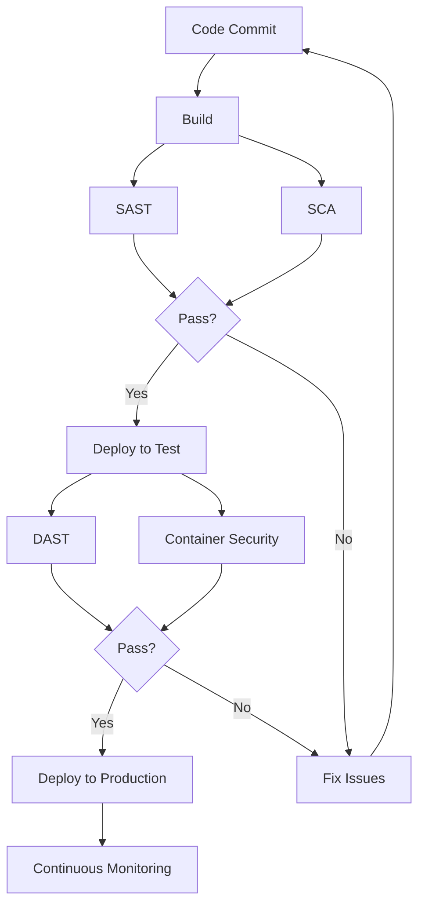

# CI/CD Security Testing

## Introduction

Security testing is a critical component of modern software development. By integrating security tests into your Continuous Integration and Continuous Deployment (CI/CD) pipeline, you can identify vulnerabilities early in the development process, before they reach production. This approach, often called "shifting left," helps teams build security into their applications from the beginning rather than treating it as an afterthought.

In this guide, we'll explore how to implement security testing in your CI/CD pipeline, the different types of security tests you can run, and best practices for creating a robust security testing strategy.

## What is CI/CD Security Testing?

CI/CD security testing involves automating security checks and tests as part of your continuous integration and continuous deployment processes. Instead of performing security testing manually or only at the end of development cycles, these tests run automatically when code changes are submitted.

### Why is CI/CD Security Testing Important?

- **Early Detection**: Finds security issues early when they're cheaper and easier to fix
- **Continuous Validation**: Ensures every code change is checked for security issues
- **Reduced Manual Effort**: Automates repetitive security checks
- **Compliance**: Helps maintain regulatory compliance through consistent testing
- **Security Awareness**: Builds security consciousness among developers

## Types of Security Tests for CI/CD

Let's explore the various types of security tests you can integrate into your CI/CD pipeline:

### 1. Static Application Security Testing (SAST)

SAST tools analyze your source code without executing it, looking for security vulnerabilities, coding errors, and compliance issues.

#### Example: Using ESLint with security plugins for JavaScript

First, install the necessary packages:

```bash
npm install eslint eslint-plugin-security --save-dev
```

Create a `.eslintrc.js` configuration file:

```javascript
module.exports = {
  plugins: ['security'],
  extends: [
    'plugin:security/recommended',
  ],
  rules: {
    'security/detect-eval-with-expression': 'error',
    'security/detect-non-literal-regexp': 'error',
    'security/detect-possible-timing-attacks': 'warn'
  }
};
```

Add this to your CI/CD pipeline:

```yaml
security_scan:
  stage: test
  script:
    - npm install
    - npx eslint .
  only:
    - merge_requests
```

### 2. Software Composition Analysis (SCA)

SCA tools analyze your dependencies to identify known vulnerabilities in third-party packages.

#### Example: Using OWASP Dependency-Check

```bash
# Install Dependency-Check
wget https://github.com/jeremylong/DependencyCheck/releases/download/v7.3.0/dependency-check-7.3.0-release.zip
unzip dependency-check-7.3.0-release.zip

# Run the scan
./dependency-check/bin/dependency-check.sh --scan /path/to/your/application --format "HTML" --out /reports
```

Adding to your CI/CD pipeline (GitLab example):

```yaml
dependency_scan:
  stage: test
  script:
    - ./dependency-check/bin/dependency-check.sh --scan . --format "JSON" --out dependency-check-report.json
  artifacts:
    paths:
      - dependency-check-report.json
```

### 3. Dynamic Application Security Testing (DAST)

DAST tools test your running application by simulating attacks to identify vulnerabilities that might not be apparent in static code.

#### Example: Using OWASP ZAP in a CI/CD pipeline

```yaml
dast:
  stage: test
  image: owasp/zap2docker-stable
  script:
    - mkdir -p /zap/wrk/
    - zap-baseline.py -t https://your-staging-app.example.com -g gen.conf -r zap-report.html
  artifacts:
    paths:
      - zap-report.html
```

### 4. Container Security Scanning

For applications deployed in containers, scan your container images for vulnerabilities.

#### Example: Using Trivy for container scanning

```yaml
container_scan:
  stage: test
  image: aquasec/trivy
  script:
    - trivy image your-app:latest --output trivy-report.json --format json
  artifacts:
    paths:
      - trivy-report.json
```

### 5. Infrastructure as Code (IaC) Security Testing

Check your infrastructure definitions for security issues and misconfigurations.

#### Example: Using Checkov to scan Terraform files

```yaml
iac_security:
  stage: test
  image: bridgecrew/checkov
  script:
    - checkov -d terraform/ --output-file-path checkov-report.json
  artifacts:
    paths:
      - checkov-report.json
```

## Building a Complete CI/CD Security Pipeline

Now, let's put everything together to create a comprehensive security testing pipeline. Here's a visualization of what this might look like:



### Example CI/CD Pipeline Configuration (GitLab CI)

```yaml
stages:
  - build
  - security_testing
  - deploy_staging
  - dast
  - deploy_production

build:
  stage: build
  script:
    - npm install
    - npm run build
  artifacts:
    paths:
      - dist/

sast:
  stage: security_testing
  script:
    - npm install
    - npx eslint . --format json --output-file eslint-report.json
  artifacts:
    paths:
      - eslint-report.json

dependency_check:
  stage: security_testing
  script:
    - ./dependency-check/bin/dependency-check.sh --scan . --format "JSON" --out dependency-check-report.json
  artifacts:
    paths:
      - dependency-check-report.json

container_scan:
  stage: security_testing
  image: aquasec/trivy
  script:
    - trivy image $CI_REGISTRY_IMAGE:$CI_COMMIT_SHA --output trivy-report.json --format json
  artifacts:
    paths:
      - trivy-report.json

deploy_staging:
  stage: deploy_staging
  script:
    - echo "Deploying to staging..."
    # Deployment scripts here
  environment:
    name: staging
  only:
    - main

zap_scan:
  stage: dast
  image: owasp/zap2docker-stable
  script:
    - mkdir -p /zap/wrk/
    - zap-baseline.py -t https://staging-app.example.com -g gen.conf -r zap-report.html
  artifacts:
    paths:
      - zap-report.html
  only:
    - main

deploy_production:
  stage: deploy_production
  script:
    - echo "Deploying to production..."
    # Deployment scripts here
  environment:
    name: production
  when: manual
  only:
    - main
```

## Security Testing Best Practices

To maximize the effectiveness of your CI/CD security testing:

1. **Set Appropriate Thresholds**: Define what constitutes a build failure (e.g., high severity vulnerabilities only).

2. **Minimize False Positives**: Tune your security tools to reduce noise and focus on real issues.

3. **Use Security Gates**: Implement approval gates that prevent code with critical vulnerabilities from proceeding to the next stage.

4. **Monitor Test Performance**: Ensure security tests don't slow down your pipeline too much.

5. **Integrate Results**: Feed security findings back to developers through their regular tools (IDE, issue tracker).

6. **Track Security Metrics**: Follow trends in security findings to measure improvement over time.

### Example Security Gate Implementation

```javascript
// Example script to analyze security results and decide whether to proceed
const fs = require('fs');

// Read security reports
const sastReport = JSON.parse(fs.readFileSync('./eslint-report.json', 'utf8'));
const scaReport = JSON.parse(fs.readFileSync('./dependency-check-report.json', 'utf8'));

// Count high severity issues
const highSeverityCount = countHighSeverityIssues(sastReport, scaReport);

// Set threshold for build failure
const THRESHOLD = 0;

if (highSeverityCount > THRESHOLD) {
  console.error(`Build failed: ${highSeverityCount} high severity security issues found`);
  process.exit(1);
} else {
  console.log('Security gate passed!');
}

function countHighSeverityIssues(sast, sca) {
  // Implementation depends on the specific format of your reports
  let count = 0;
  
  // Count high severity SAST issues
  sast.forEach(file => {
    file.messages.forEach(msg => {
      if (msg.severity === 2 && msg.ruleId.startsWith('security/')) {
        count++;
      }
    });
  });
  
  // Count high severity SCA issues
  sca.dependencies.forEach(dep => {
    dep.vulnerabilities.forEach(vuln => {
      if (vuln.severity === 'HIGH' || vuln.severity === 'CRITICAL') {
        count++;
      }
    });
  });
  
  return count;
}
```

## Common Security Testing Tools

Here's a summary of popular security testing tools you can integrate into your CI/CD pipeline:

| Type | Tool | Language/Platform Support | Open Source |
|------|------|---------------------------|------------|
| SAST | SonarQube | Multi-language | Yes (Community Edition) |
| SAST | ESLint Security | JavaScript | Yes |
| SAST | Bandit | Python | Yes |
| SCA | OWASP Dependency-Check | Java, .NET, JavaScript, etc. | Yes |
| SCA | Snyk | Multi-language | Freemium |
| DAST | OWASP ZAP | Any web application | Yes |
| DAST | Burp Suite | Any web application | Freemium |
| Container | Trivy | Docker, Kubernetes | Yes |
| Container | Clair | Docker | Yes |
| IaC | Checkov | Terraform, CloudFormation, etc. | Yes |
| IaC | Terrascan | Terraform, Kubernetes, etc. | Yes |

## Real-World Example: Implementing Security Testing for a Node.js Application

Let's walk through setting up security testing for a typical Node.js web application:

### 1. Set Up SAST with ESLint and Security Plugins

First, install the necessary packages:

```bash
npm install eslint eslint-plugin-security eslint-plugin-node --save-dev
```

Create a `.eslintrc.js` configuration:

```javascript
module.exports = {
  plugins: ['security', 'node'],
  extends: [
    'eslint:recommended',
    'plugin:security/recommended',
    'plugin:node/recommended'
  ],
  rules: {
    'security/detect-object-injection': 'warn',
    'security/detect-non-literal-fs-filename': 'error',
    'security/detect-eval-with-expression': 'error',
    'node/no-unsupported-features/es-syntax': 'off'
  }
};
```

### 2. Add Software Composition Analysis with npm audit

```bash
# Run npm audit as part of your CI/CD process
npm audit --json > npm-audit-report.json

# To fail the build on high severity issues:
npm audit --audit-level=high || exit 1
```

### 3. Implement Container Scanning (if using Docker)

Create a Dockerfile:

```dockerfile
FROM node:18-alpine
WORKDIR /app
COPY package*.json ./
RUN npm ci --only=production
COPY . .
EXPOSE 3000
CMD ["node", "app.js"]
```

Add container scanning to your CI/CD pipeline:

```yaml
container_scan:
  image: aquasec/trivy
  script:
    - trivy image myapp:latest --severity HIGH,CRITICAL
```

### 4. Add a Security Testing Job to Your CI/CD Configuration

GitHub Actions example:

```yaml
name: Security Testing

on:
  push:
    branches: [ main ]
  pull_request:
    branches: [ main ]

jobs:
  security-testing:
    runs-on: ubuntu-latest
    steps:
      - uses: actions/checkout@v3
      - name: Set up Node.js
        uses: actions/setup-node@v3
        with:
          node-version: '18'
      
      - name: Install dependencies
        run: npm ci
      
      - name: Run SAST (ESLint)
        run: npx eslint . --format json --output-file eslint-report.json
      
      - name: Run SCA (npm audit)
        run: npm audit --json > npm-audit-report.json || true
      
      - name: Analyze security reports
        run: node .github/scripts/analyze-security-reports.js
      
      - name: Upload security reports
        uses: actions/upload-artifact@v3
        with:
          name: security-reports
          path: |
            eslint-report.json
            npm-audit-report.json
```

## Addressing Security Findings

When security issues are discovered, it's important to have a clear process for addressing them:

1. **Prioritize issues** based on severity and exploitability
2. **Document findings** in your issue tracking system
3. **Assign ownership** to specific team members
4. **Establish timelines** for remediation based on severity
5. **Verify fixes** through retesting
6. **Track metrics** on time-to-fix and recurring issues

## Summary

CI/CD security testing is an essential practice for modern software development. By integrating security testing throughout your CI/CD pipeline, you can:

- Detect security vulnerabilities early in the development process
- Reduce the cost and effort of fixing security issues
- Build a security-first culture among your development team
- Deliver more secure software to your users

Remember that security testing is not a one-time activity but an ongoing process. As your application evolves and new security threats emerge, your security testing strategy should adapt accordingly.

## Exercises

1. Set up SAST testing with ESLint and security plugins in a simple Node.js project.
2. Configure dependency scanning using OWASP Dependency-Check or npm audit.
3. Create a GitHub Actions or GitLab CI workflow that implements at least two types of security testing.
4. Write a script that analyzes security results and makes a pass/fail decision based on defined thresholds.
5. Research and document three security vulnerabilities that were discovered through automated security testing.

## Additional Resources

- [OWASP DevSecOps Guideline](https://owasp.org/www-project-devsecops-guideline/)
- [NIST Secure Software Development Framework](https://csrc.nist.gov/Projects/ssdf)
- [DevSecOps: Integrating Security into DevOps](https://www.devsecops.org/)
- [The DevSecOps Playbook](https://github.com/TaptuIT/awesome-devsecops)
- Join security communities like OWASP to stay updated on the latest security testing techniques and tools

Remember that while automated security testing is powerful, it should be part of a broader security strategy that includes manual penetration testing, security code reviews, and developer security training.