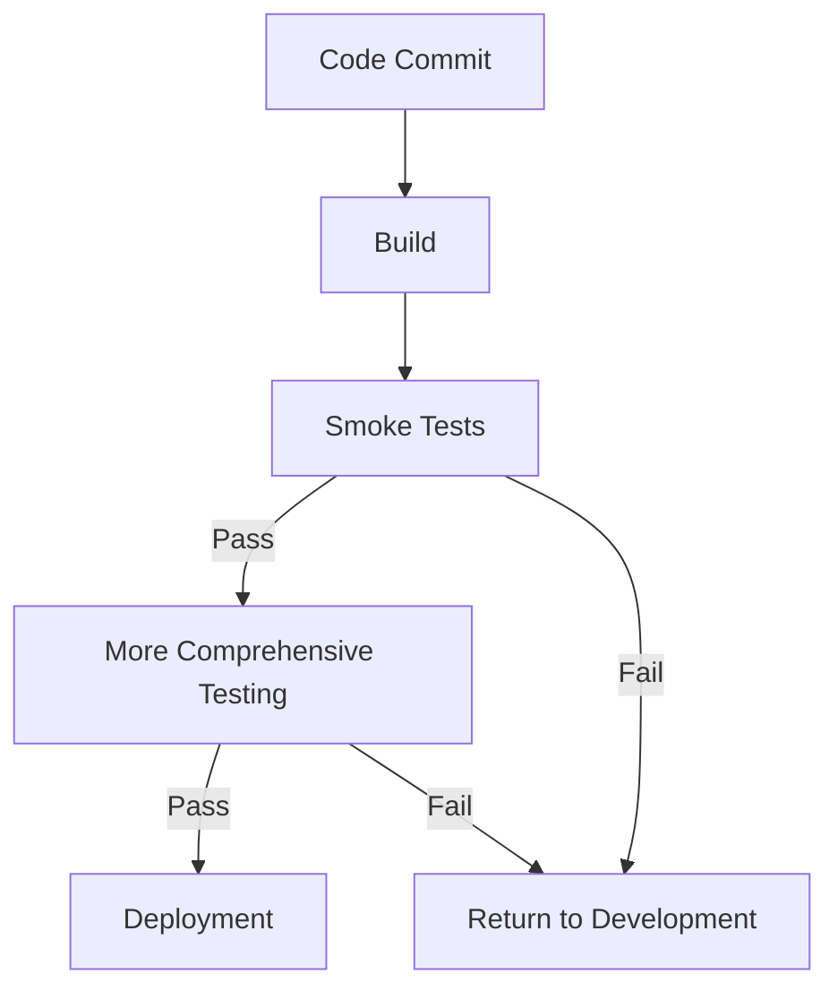

# CICD Smoke Testing

## Introduction

Smoke testing is a critical component of the Continuous Integration and Continuous Deployment (CI/CD) pipeline that helps development teams quickly identify major issues before investing time in more comprehensive testing. The term "smoke testing" comes from hardware testing: if a device emits smoke the first time it's turned on, it's obviously not working properly. Similarly, in software development, smoke tests check if the basic functionality of an application works before proceeding with more intensive testing.

In this guide, we'll explore what smoke testing is in the context of CI/CD pipelines, why it's essential for efficient development workflows, and how to implement effective smoke tests in your projects.

## What is Smoke Testing?

Smoke testing is a preliminary testing technique that verifies whether the most critical functions of an application work as expected. It's a subset of testing that covers the core functionality without diving into details.

### Key Characteristics of Smoke Tests

- **Quick to execute**: Typically runs in minutes, not hours
- **Broad but shallow**: Covers major functionality without deep testing
- **Early in pipeline**: Runs before more comprehensive test suites
- **Binary result**: Either passes (proceed) or fails (stop and fix)
- **Non-destructive**: Doesn't alter production data or environments

## Smoke Testing in the CI/CD Pipeline

Smoke tests play a specific role in the CI/CD workflow:



In this workflow, smoke tests act as an early quality gate that prevents obviously broken code from progressing further in the pipeline, saving time and computational resources.

## Why Smoke Testing Matters

Smoke testing provides several key benefits in the CI/CD process:

1. **Early Detection**: Catches major issues before they move deeper into testing phases
2. **Resource Efficiency**: Prevents wasting time and computational resources on comprehensive testing of obviously broken builds
3. **Faster Feedback**: Developers get quick feedback on critical issues
4. **Build Verification**: Ensures the application has been built correctly and is stable enough for further testing
5. **Confidence**: Provides baseline assurance that core functionality works

## Implementing Effective Smoke Tests

Let's explore how to implement smoke tests in your CI/CD pipeline:

### Example Smoke Test Suite Structure

A typical smoke test suite might include tests for:

- Application startup and shutdown
- User login/authentication
- Core business workflows
- Basic data operations
- Critical integrations

### Code Example: Simple Smoke Test in JavaScript

Here's a basic example of a smoke test suite using Jest for a Node.js application:

```javascript
const request = require('supertest');
const app = require('../app');

describe('Smoke Tests', () => {
  test('Server starts successfully', async () => {
    const response = await request(app).get('/health');
    expect(response.status).toBe(200);
    expect(response.body.status).toBe('ok');
  });

  test('User can log in', async () => {
    const response = await request(app)
      .post('/api/login')
      .send({ username: 'test_user', password: 'test_password' });
    
    expect(response.status).toBe(200);
    expect(response.body.token).toBeDefined();
  });

  test('Can fetch product list', async () => {
    const response = await request(app).get('/api/products');
    expect(response.status).toBe(200);
    expect(Array.isArray(response.body)).toBe(true);
  });
});
```

### Example CI/CD Configuration with Smoke Tests

Here's how you might configure smoke tests in a GitHub Actions workflow:

```yaml
name: CI Pipeline

on:
  push:
    branches: [ main, develop ]
  pull_request:
    branches: [ main, develop ]

jobs:
  build:
    runs-on: ubuntu-latest
    
    steps:
    - uses: actions/checkout@v3
    
    - name: Set up Node.js
      uses: actions/setup-node@v3
      with:
        node-version: '16'
        
    - name: Install dependencies
      run: npm ci
      
    - name: Build application
      run: npm run build
      
    - name: Run smoke tests
      run: npm run test:smoke
      
    - name: Run full test suite
      if: success()
      run: npm test
```

### Python Example: API Smoke Test

For a Python application using pytest:

```python
import pytest
import requests

BASE_URL = "http://localhost:5000"

def test_server_is_up():
    response = requests.get(f"{BASE_URL}/health")
    assert response.status_code == 200
    assert response.json()["status"] == "healthy"

def test_basic_auth():
    response = requests.post(
        f"{BASE_URL}/api/auth",
        json={"username": "smoke_test_user", "password": "test1234"}
    )
    assert response.status_code == 200
    assert "token" in response.json()

def test_can_retrieve_user_profile():
    # First authenticate
    auth_response = requests.post(
        f"{BASE_URL}/api/auth",
        json={"username": "smoke_test_user", "password": "test1234"}
    )
    token = auth_response.json()["token"]
    
    # Then try to access protected resource
    profile_response = requests.get(
        f"{BASE_URL}/api/profile",
        headers={"Authorization": f"Bearer {token}"}
    )
    assert profile_response.status_code == 200
    assert "id" in profile_response.json()
```

## Best Practices for CICD Smoke Testing

To get the most value from smoke testing, follow these best practices:

1. **Keep tests focused**: Test only critical paths, not edge cases
2. **Maintain independence**: Each smoke test should run independently
3. **Fast execution**: Smoke test suite should complete in minutes
4. **Stable tests**: Avoid flaky tests that sometimes pass and sometimes fail
5. **Clear failure messages**: Make it easy to understand why a test failed
6. **Automated setup and teardown**: Tests should set up their prerequisites and clean up after themselves
7. **Environment similarity**: Run tests in an environment similar to production
8. **Version control**: Keep smoke tests in version control alongside application code

## Real-World Example: E-commerce Website

Let's consider how smoke testing might apply to an e-commerce website:

### Smoke Test Scenarios

1. **Homepage loads**: Verify the main page loads with products displayed
2. **Search works**: Confirm search functionality returns results
3. **User login**: Test that users can log in successfully
4. **Add to cart**: Verify products can be added to shopping cart
5. **Checkout process**: Ensure the basic checkout flow works
6. **Order confirmation**: Check that orders are confirmed after submission

### Example Implementation in Cypress

```javascript
describe('E-commerce Smoke Tests', () => {
  beforeEach(() => {
    cy.visit('https://example-shop.com');
  });

  it('Homepage loads with products', () => {
    cy.get('.product-card').should('have.length.at.least', 1);
    cy.get('.site-navigation').should('be.visible');
  });

  it('Search functionality works', () => {
    cy.get('.search-input').type('shirt');
    cy.get('.search-button').click();
    cy.get('.search-results').should('contain', 'shirt');
  });

  it('User can log in', () => {
    cy.get('.login-link').click();
    cy.get('#username').type('test_user');
    cy.get('#password').type('test_password');
    cy.get('.login-button').click();
    cy.get('.user-profile').should('contain', 'test_user');
  });

  it('Can add product to cart', () => {
    cy.get('.product-card').first().click();
    cy.get('.add-to-cart').click();
    cy.get('.cart-count').should('contain', '1');
  });
});
```

## Integrating Smoke Tests Into Different CI/CD Platforms

Here are examples of how to configure smoke tests in various CI/CD platforms:

### Jenkins Pipeline

```groovy
pipeline {
    agent any
    
    stages {
        stage('Build') {
            steps {
                sh 'npm install'
                sh 'npm run build'
            }
        }
        
        stage('Smoke Test') {
            steps {
                sh 'npm run test:smoke'
            }
        }
        
        stage('Full Tests') {
            when {
                expression { currentBuild.resultIsBetterOrEqualTo('SUCCESS') }
            }
            steps {
                sh 'npm test'
            }
        }
        
        stage('Deploy') {
            when {
                expression { currentBuild.resultIsBetterOrEqualTo('SUCCESS') }
            }
            steps {
                sh 'npm run deploy'
            }
        }
    }
}
```

### GitLab CI

```yaml
stages:
  - build
  - smoke_test
  - test
  - deploy

build:
  stage: build
  script:
    - npm install
    - npm run build
  artifacts:
    paths:
      - dist/

smoke_test:
  stage: smoke_test
  script:
    - npm run test:smoke
  dependencies:
    - build

test:
  stage: test
  script:
    - npm test
  dependencies:
    - build
  when: on_success

deploy:
  stage: deploy
  script:
    - npm run deploy
  dependencies:
    - build
  when: on_success
  only:
    - main
```

## Common Challenges and Solutions

While implementing smoke tests, teams often face these challenges:

| Challenge | Solution |
|-----------|----------|
| Test environment setup | Use containers or infrastructure-as-code to create consistent environments |
| Test data management | Create specific test data during setup phase |
| Flaky tests | Implement retry mechanisms and improve test stability |
| Slow tests | Focus only on critical paths and optimize test execution |
| Maintaining tests | Keep smoke tests simple and review them regularly |

## Summary

Smoke testing is a vital early validation step in the CI/CD pipeline that helps teams quickly identify major issues before investing time in more comprehensive testing. By implementing effective smoke tests, you can:

- Catch critical problems early in the development process
- Save time and resources by preventing obviously broken builds from proceeding
- Provide faster feedback to developers
- Increase confidence in your software releases

Smoke tests should be fast, reliable, and focused on the most critical functionality of your application. When implemented properly, they serve as an excellent first line of defense in your testing strategy.

## Additional Resources

To learn more about smoke testing and CI/CD practices, consider these resources:

- **Books**:
  - "Continuous Delivery" by Jez Humble and David Farley
  - "DevOps Handbook" by Gene Kim, Jez Humble, Patrick Debois, and John Willis

- **Online Learning**:
  - Explore testing frameworks specific to your programming language
  - Study CI/CD platform documentation for advanced configuration options

## Practice Exercises

1. Identify the core functionality of an application you're working with and design a smoke test suite for it
2. Implement smoke tests for a simple web application using a testing framework of your choice
3. Configure a CI/CD pipeline that runs smoke tests on each commit
4. Compare the time required for smoke tests versus full test suites and calculate the time savings
5. Refactor an existing smoke test suite to improve its execution speed while maintaining coverage of critical functionality