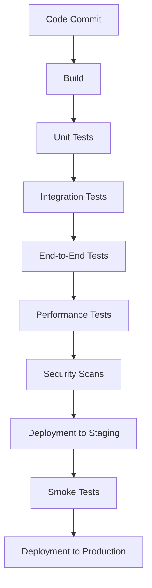

# CICD End-to-End Testing

## Introduction

End-to-End (E2E) testing is a critical component of any robust Continuous Integration/Continuous Deployment (CI/CD) pipeline. Unlike unit or integration tests that focus on individual components or specific interactions, E2E tests validate the entire application workflow from start to finish, simulating real user behavior. 

In this guide, we'll explore how to implement E2E testing within your CI/CD pipeline, the tools you can use, and best practices to ensure your application works correctly in production-like environments before deploying to your users.

## Why End-to-End Testing in CI/CD?

E2E testing in a CI/CD context provides several key benefits:

1. **Catches integration issues early**: Identifies problems that only appear when all system components work together
2. **Validates user workflows**: Ensures critical user journeys function as expected
3. **Tests in production-like environments**: Catches environment-specific issues before they reach production
4. **Builds confidence in releases**: Provides assurance that new code won't break existing functionality
5. **Automates regression testing**: Prevents previously fixed bugs from reappearing

## Where E2E Testing Fits in the CI/CD Pipeline

Let's visualize where E2E testing typically sits in a CI/CD pipeline:



E2E tests usually run after unit and integration tests but before deployment to staging. This strategic placement ensures that your application's core components work individually before testing the full system, saving time and resources.

## Setting Up E2E Testing in Your CI/CD Pipeline

### Step 1: Choose Your E2E Testing Framework

Several popular frameworks exist for E2E testing:

| Framework | Language | Key Features |
|-----------|----------|-------------|
| Cypress | JavaScript | Real-time browser testing with time-travel debugging |
| Selenium | Multiple | Cross-browser testing with wide language support |
| Playwright | JavaScript/TypeScript | Multi-browser support with modern API |
| TestCafe | JavaScript | No WebDriver dependency, works across browsers |
| Robot Framework | Python | Keyword-driven testing with clear syntax |

For our examples, we'll use Cypress, as it's particularly well-suited for web applications and CI/CD integration.

### Step 2: Create Your First E2E Test

Let's create a simple E2E test for a login workflow:

```javascript
// cypress/integration/login.spec.js
describe('Login Flow', () => {
  beforeEach(() => {
    cy.visit('/login')
  })

  it('should login with valid credentials', () => {
    cy.get('[data-cy=username]').type('testuser')
    cy.get('[data-cy=password]').type('password123')
    cy.get('[data-cy=login-button]').click()
    
    // Assert we reached the dashboard
    cy.url().should('include', '/dashboard')
    cy.get('[data-cy=welcome-message]').should('contain', 'Welcome, Test User')
  })

  it('should show error with invalid credentials', () => {
    cy.get('[data-cy=username]').type('wronguser')
    cy.get('[data-cy=password]').type('wrongpass')
    cy.get('[data-cy=login-button]').click()
    
    // Assert error message appears
    cy.get('[data-cy=error-message]').should('be.visible')
    cy.get('[data-cy=error-message]').should('contain', 'Invalid username or password')
  })
})
```

This test verifies two critical scenarios in your login flow:
1. Successfully logging in with valid credentials
2. Showing appropriate errors for invalid credentials

### Step 3: Integrate with Your CI/CD Pipeline

Now let's configure our CI/CD pipeline to run these tests automatically. Here's a GitHub Actions workflow example:

```yaml
# .github/workflows/e2e-tests.yml
name: E2E Tests

on:
  push:
    branches: [main, develop]
  pull_request:
    branches: [main, develop]

jobs:
  cypress-run:
    runs-on: ubuntu-latest
    steps:
      - name: Checkout
        uses: actions/checkout@v3
        
      - name: Setup Node.js
        uses: actions/setup-node@v3
        with:
          node-version: 16
          
      - name: Install dependencies
        run: npm ci
        
      - name: Build app
        run: npm run build
        
      - name: Start server
        run: npm run start:ci &
        
      - name: Run Cypress tests
        uses: cypress-io/github-action@v4
        with:
          browser: chrome
          headless: true
          
      - name: Upload screenshots if test fails
        uses: actions/upload-artifact@v3
        if: failure()
        with:
          name: cypress-screenshots
          path: cypress/screenshots
```

This workflow:
1. Runs whenever code is pushed to the main or develop branches
2. Sets up the testing environment
3. Builds and starts your application
4. Runs the Cypress tests in headless Chrome
5. Uploads screenshots of failures for debugging

### Step 4: Handle Test Data and Environment Variables

E2E tests often require test data and environment-specific configuration. Here's how to handle this in CI/CD:

```javascript
// cypress.config.js
const { defineConfig } = require('cypress')

module.exports = defineConfig({
  env: {
    apiUrl: process.env.API_URL || 'http://localhost:3000/api',
    testUserEmail: process.env.TEST_USER_EMAIL || 'test@example.com',
    testUserPassword: process.env.TEST_USER_PASSWORD || 'testPassword123',
  },
  e2e: {
    setupNodeEvents(on, config) {
      // implement node event listeners here
      // dynamically modify config based on environment
      config.baseUrl = process.env.BASE_URL || 'http://localhost:3000'
      return config
    },
    specPattern: 'cypress/e2e/**/*.{js,jsx,ts,tsx}',
  },
})
```

In your CI/CD configuration, you would set these environment variables:

```yaml
# Additional section for your GitHub Actions workflow
      - name: Run Cypress tests
        uses: cypress-io/github-action@v4
        with:
          browser: chrome
          headless: true
        env:
          API_URL: 'https://staging-api.example.com'
          BASE_URL: 'https://staging.example.com'
          TEST_USER_EMAIL: ${{ secrets.TEST_USER_EMAIL }}
          TEST_USER_PASSWORD: ${{ secrets.TEST_USER_PASSWORD }}
```

## Real-World Example: E-Commerce Checkout Flow

Let's look at a more comprehensive E2E test for an e-commerce checkout flow:

```javascript
// cypress/e2e/checkout.spec.js
describe('E-Commerce Checkout Flow', () => {
  beforeEach(() => {
    // Login before each test
    cy.login(Cypress.env('testUserEmail'), Cypress.env('testUserPassword'))
    
    // Custom command to add a specific product to cart
    cy.addProductToCart('product-123')
    
    // Navigate to cart
    cy.visit('/cart')
  })

  it('should complete checkout with valid payment information', () => {
    // Verify product is in cart
    cy.get('[data-cy=cart-item]').should('have.length', 1)
    cy.get('[data-cy=product-title]').should('contain', 'Test Product')
    
    // Proceed to checkout
    cy.get('[data-cy=checkout-button]').click()
    
    // Fill shipping information
    cy.get('[data-cy=shipping-form]').within(() => {
      cy.get('[data-cy=address-line1]').type('123 Test Street')
      cy.get('[data-cy=city]').type('Test City')
      cy.get('[data-cy=state]').select('California')
      cy.get('[data-cy=zip]').type('90210')
      cy.get('[data-cy=continue-button]').click()
    })
    
    // Fill payment information
    cy.get('[data-cy=payment-form]').within(() => {
      cy.get('[data-cy=card-number]').type('4242424242424242')
      cy.get('[data-cy=card-expiry]').type('1230')
      cy.get('[data-cy=card-cvc]').type('123')
      cy.get('[data-cy=pay-button]').click()
    })
    
    // Verify order confirmation
    cy.url().should('include', '/order-confirmation')
    cy.get('[data-cy=order-number]').should('be.visible')
    cy.get('[data-cy=success-message]').should('contain', 'Your order has been placed successfully')
  })

  it('should show error with invalid payment information', () => {
    // Proceed to checkout
    cy.get('[data-cy=checkout-button]').click()
    
    // Fill shipping information
    cy.get('[data-cy=shipping-form]').within(() => {
      cy.get('[data-cy=address-line1]').type('123 Test Street')
      cy.get('[data-cy=city]').type('Test City')
      cy.get('[data-cy=state]').select('California')
      cy.get('[data-cy=zip]').type('90210')
      cy.get('[data-cy=continue-button]').click()
    })
    
    // Fill invalid payment information
    cy.get('[data-cy=payment-form]').within(() => {
      cy.get('[data-cy=card-number]').type('4000000000000002') // Decline code
      cy.get('[data-cy=card-expiry]').type('1230')
      cy.get('[data-cy=card-cvc]').type('123')
      cy.get('[data-cy=pay-button]').click()
    })
    
    // Verify error message
    cy.get('[data-cy=payment-error]').should('be.visible')
    cy.get('[data-cy=payment-error]').should('contain', 'Your card was declined')
  })
})
```

This test covers:
1. The full checkout process from cart to order confirmation
2. Validation of payment processing
3. Error handling for declined payments

### Custom Commands for E2E Testing

To keep your tests clean and maintainable, create custom commands for repetitive actions:

```javascript
// cypress/support/commands.js
Cypress.Commands.add('login', (email, password) => {
  cy.session([email, password], () => {
    cy.visit('/login')
    cy.get('[data-cy=username]').type(email)
    cy.get('[data-cy=password]').type(password)
    cy.get('[data-cy=login-button]').click()
    cy.url().should('include', '/dashboard')
  })
})

Cypress.Commands.add('addProductToCart', (productId) => {
  cy.request({
    method: 'POST',
    url: `${Cypress.env('apiUrl')}/cart/add`,
    body: { productId },
    headers: { 'Content-Type': 'application/json' }
  }).then((response) => {
    expect(response.status).to.eq(200)
  })
})
```

## Best Practices for E2E Testing in CI/CD

1. **Test critical user flows first**: Prioritize testing the most important user journeys
2. **Keep tests independent**: Each test should be able to run in isolation
3. **Use data attributes for selectors**: Add `data-cy` attributes to make your tests more resilient to UI changes
4. **Create isolated test environments**: Test against dedicated environments to avoid affecting production data
5. **Parallel testing**: Run tests in parallel to save time in your CI/CD pipeline
6. **Visual testing**: Consider adding visual regression testing for UI-heavy applications
7. **Monitor test flakiness**: Track flaky tests and fix them promptly to maintain pipeline reliability
8. **Set appropriate timeouts**: Configure timeouts appropriate for your application to prevent false negatives

### Handling Flaky Tests

Flaky tests (tests that sometimes pass and sometimes fail without code changes) can undermine confidence in your CI/CD pipeline. Here's how to handle them:

```javascript
// Retry flaky tests up to 2 times
// cypress.config.js
const { defineConfig } = require('cypress')

module.exports = defineConfig({
  retries: {
    runMode: 2,
    openMode: 0,
  },
  e2e: {
    // other configuration...
  },
})
```

## Implementing Visual Testing

For UI-heavy applications, adding visual testing to your E2E suite can catch unexpected visual regressions:

```javascript
// Visual testing example with Cypress and Percy
// cypress/e2e/visual.spec.js
describe('Visual Testing', () => {
  it('should display the product page correctly', () => {
    cy.visit('/products/featured')
    cy.get('[data-cy=product-grid]').should('be.visible')
    cy.percySnapshot('Featured Products Page')
  })

  it('should display the checkout form correctly', () => {
    cy.login(Cypress.env('testUserEmail'), Cypress.env('testUserPassword'))
    cy.addProductToCart('product-123')
    cy.visit('/checkout')
    cy.percySnapshot('Checkout Page')
  })
})
```

To integrate this with your CI/CD pipeline, add the Percy steps to your workflow:

```yaml
# Addition to your GitHub Actions workflow
      - name: Install Percy CLI
        run: npm install --save-dev @percy/cli
        
      - name: Run Cypress tests with Percy
        uses: cypress-io/github-action@v4
        with:
          browser: chrome
          headless: true
        env:
          PERCY_TOKEN: ${{ secrets.PERCY_TOKEN }}
```

## Optimizing CI/CD Run Time with Test Parallelization

As your test suite grows, running tests in parallel becomes essential to keep your CI/CD pipeline efficient:

```yaml
# GitHub Actions workflow with parallelization
jobs:
  e2e-tests:
    runs-on: ubuntu-latest
    strategy:
      fail-fast: false
      matrix:
        containers: [1, 2, 3, 4]
    steps:
      # Setup steps...
      
      - name: Run Cypress tests in parallel
        uses: cypress-io/github-action@v4
        with:
          browser: chrome
          headless: true
          record: true
          parallel: true
          group: 'UI Tests'
        env:
          CYPRESS_RECORD_KEY: ${{ secrets.CYPRESS_RECORD_KEY }}
```

This setup runs your tests across 4 containers in parallel, significantly reducing test execution time.

## Summary

End-to-end testing is a vital component of a modern CI/CD pipeline, providing confidence that your application works correctly from a user's perspective before deployment. By integrating E2E tests into your pipeline, you can catch critical issues early, validate complete user workflows, and ensure a smooth user experience.

In this guide, we've covered:
- The role and importance of E2E testing in CI/CD pipelines
- Setting up E2E testing with Cypress
- Creating meaningful tests for critical user flows
- Integrating tests with CI/CD platforms like GitHub Actions
- Best practices for maintaining reliable test suites
- Advanced topics like visual testing and test parallelization

## Exercises to Reinforce Learning

1. **Basic E2E Test Setup**: Create a simple login test for your application and run it locally.
2. **CI Integration**: Configure a CI/CD pipeline (GitHub Actions, GitLab CI, etc.) to run your tests automatically.
3. **Custom Commands**: Identify repetitive actions in your tests and refactor them into custom commands.
4. **Visual Testing**: Add visual testing to at least one critical page in your application.
5. **Performance Optimization**: Implement test parallelization to reduce your CI/CD pipeline execution time.
6. **Test Reporting**: Set up a reporting mechanism to track test results over time.

## Additional Resources

- [Cypress Documentation](https://docs.cypress.io/)
- [GitHub Actions for CI/CD](https://docs.github.com/en/actions)
- [Percy Visual Testing](https://percy.io/docs)
- [TestingJavaScript.com](https://testingjavascript.com/)
- [Martin Fowler on Continuous Integration](https://martinfowler.com/articles/continuousIntegration.html)