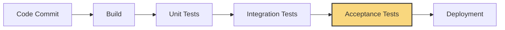
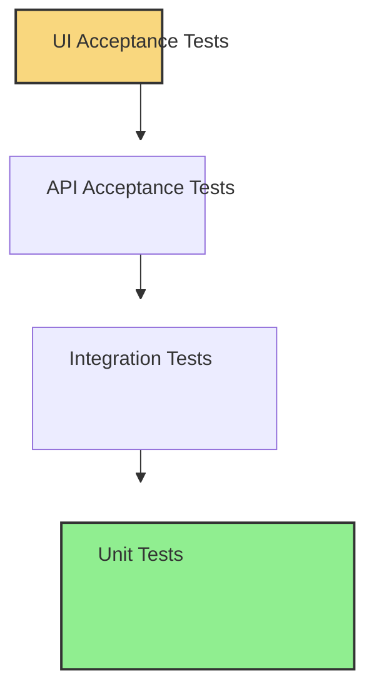

# CICD Acceptance Testing

## Introduction

Acceptance testing is a critical part of the Continuous Integration/Continuous Deployment (CI/CD) pipeline that validates whether a software system meets the business requirements and is ready for delivery. Unlike unit or integration tests that focus on code correctness, acceptance tests evaluate the system from an end-user perspective to ensure it delivers the expected functionality.

In a CI/CD context, automated acceptance tests act as the final quality gate before software is deployed to production, providing confidence that the system works as intended and meets stakeholder expectations.

## What is Acceptance Testing?

Acceptance testing verifies that a software system fulfills its business requirements and is acceptable for delivery. It answers the fundamental question: "Does the software do what the users need it to do?"

### Key Characteristics

- **User-centric**: Tests the system from an end-user perspective
- **Business-focused**: Validates business requirements rather than technical implementation
- **Black-box**: Tests the system as a whole without focusing on internal structures
- **Final verification**: Often the last testing phase before deployment

## Acceptance Testing in the CI/CD Pipeline

In a CI/CD workflow, acceptance tests are typically executed after unit and integration tests have passed. Here's where they fit in a typical pipeline:



### Benefits of Automated Acceptance Testing in CI/CD

1. **Faster Feedback**: Identifies user-facing issues early in the development cycle
2. **Confidence in Releases**: Ensures the software meets business requirements before deployment
3. **Documentation**: Serves as living documentation of system behavior
4. **Regression Prevention**: Catches regressions that might impact user experience
5. **Reduced Manual Testing**: Decreases the need for time-consuming manual testing

## Types of Acceptance Tests in CI/CD

### 1. User Acceptance Testing (UAT)

UAT involves actual users testing the software to ensure it meets their needs. In a CI/CD context, this can be automated using scenarios derived from user stories.

```javascript
// Example using Cucumber.js for behavior-driven UAT
Feature: User Registration
  As a website visitor
  I want to register for an account
  So that I can access member features

  Scenario: Successful registration
    Given I am on the registration page
    When I enter valid registration details
    And I submit the form
    Then I should see a confirmation message
    And I should receive a welcome email
```

### 2. Functional Acceptance Tests

These tests verify that the system functions correctly according to specifications.

```javascript
// Example using Jest and Puppeteer for functional testing
test('User can add item to shopping cart', async () => {
  await page.goto('https://example-shop.com/products');
  
  // Find and click on a product
  await page.click('.product-item:first-child');
  
  // Add to cart
  await page.click('#add-to-cart-button');
  
  // Verify cart updated
  const cartCount = await page.$eval('.cart-count', el => el.textContent);
  expect(cartCount).toBe('1');
});
```

### 3. API Acceptance Tests

For service-oriented applications, API acceptance tests verify that APIs meet their specifications.

```javascript
// Example using Supertest for API testing
const request = require('supertest');
const app = require('../app');

describe('Product API', () => {
  it('should return product details', async () => {
    const response = await request(app)
      .get('/api/products/1')
      .expect(200);
    
    expect(response.body).toHaveProperty('name');
    expect(response.body).toHaveProperty('price');
    expect(response.body).toHaveProperty('description');
  });
});
```

### 4. Performance Acceptance Tests

These tests verify that the system meets performance requirements under expected load.

```javascript
// Example using k6 for performance testing
import http from 'k6/http';
import { check, sleep } from 'k6';

export const options = {
  vus: 100,
  duration: '30s',
};

export default function() {
  const res = http.get('https://example.com/api/products');
  
  check(res, {
    'status is 200': (r) => r.status === 200,
    'response time < 200ms': (r) => r.timings.duration < 200,
  });
  
  sleep(1);
}
```

## Implementing Acceptance Testing in a CI/CD Pipeline

### Step 1: Define Acceptance Criteria

Start by clearly defining the acceptance criteria for your features, ideally in a format that can be automated.

**Example in Gherkin syntax:**

```gherkin
Feature: User Login
  
  Scenario: Successful login
    Given I am on the login page
    When I enter valid credentials
    Then I should be redirected to the dashboard
  
  Scenario: Failed login
    Given I am on the login page
    When I enter invalid credentials
    Then I should see an error message
```

### Step 2: Choose Appropriate Testing Tools

Select testing frameworks and tools based on your application type:

- **Web Applications**: Selenium, Cypress, Playwright, TestCafe
- **API Services**: Postman, Rest-assured, Supertest
- **Mobile Applications**: Appium, Espresso, XCTest
- **BDD Frameworks**: Cucumber, SpecFlow, Behave

### Step 3: Configure Test Environment

Set up a dedicated environment for acceptance testing that closely resembles production.

```yaml
# Example GitHub Actions workflow configuration
name: CI/CD Pipeline

on:
  push:
    branches: [ main ]
  pull_request:
    branches: [ main ]

jobs:
  test:
    runs-on: ubuntu-latest
    steps:
      - uses: actions/checkout@v3
      - name: Set up Node.js
        uses: actions/setup-node@v3
        with:
          node-version: '16'
      - name: Install dependencies
        run: npm ci
      - name: Run unit tests
        run: npm run test:unit
      - name: Run integration tests
        run: npm run test:integration
      - name: Set up acceptance test environment
        run: docker-compose up -d
      - name: Run acceptance tests
        run: npm run test:acceptance
```

### Step 4: Integrate Acceptance Tests into CI/CD Pipeline

Configure your CI/CD pipeline to run acceptance tests after integration tests and before deployment.

```yaml
# Example Jenkins pipeline configuration
pipeline {
    agent any
    stages {
        stage('Build') {
            steps {
                sh 'npm install'
                sh 'npm run build'
            }
        }
        stage('Unit Tests') {
            steps {
                sh 'npm run test:unit'
            }
        }
        stage('Integration Tests') {
            steps {
                sh 'npm run test:integration'
            }
        }
        stage('Acceptance Tests') {
            steps {
                sh 'docker-compose up -d test-environment'
                sh 'npm run test:acceptance'
            }
        }
        stage('Deploy') {
            when {
                expression { currentBuild.resultIsBetterOrEqualTo('SUCCESS') }
            }
            steps {
                sh 'npm run deploy'
            }
        }
    }
}
```

### Step 5: Set Up Reporting and Monitoring

Implement comprehensive reporting to quickly identify test failures and their causes.

```javascript
// Example using Cucumber reporter
const reporter = require('cucumber-html-reporter');

const options = {
  theme: 'bootstrap',
  jsonFile: 'test/reports/cucumber_report.json',
  output: 'test/reports/cucumber_report.html',
  reportSuiteAsScenarios: true,
  launchReport: true,
};

reporter.generate(options);
```

## Best Practices for CICD Acceptance Testing

### 1. Follow the Test Pyramid

Maintain a balance of tests with more unit tests than integration tests, and more integration tests than acceptance tests.



### 2. Keep Acceptance Tests Focused

Test only what matters from a user or business perspective—avoid testing implementation details.

### 3. Make Tests Independent and Idempotent

Ensure tests can run in any order and multiple times without interference.

```javascript
// Before each test, reset to a known state
beforeEach(async () => {
  await db.resetDatabase();
  await page.goto('https://example.com');
});
```

### 4. Handle Flaky Tests

Identify and fix flaky tests that randomly fail to maintain pipeline reliability.

```javascript
// Example of retry logic for flaky tests
jest.retryTimes(3);

test('sometimes flaky UI interaction', async () => {
  await page.waitForSelector('.dynamic-element', { timeout: 5000 });
  await page.click('.dynamic-element');
  
  const result = await page.$eval('.result', el => el.textContent);
  expect(result).toContain('Success');
});
```

### 5. Use Data Management Strategies

Implement strategies for test data management to ensure consistency.

```javascript
// Example using a test data factory
const createTestUser = async () => {
  return await db.users.create({
    username: `test-user-${Date.now()}`,
    email: `test-${Date.now()}@example.com`,
    password: 'secure-password-for-testing'
  });
};

test('User profile update', async () => {
  const user = await createTestUser();
  await loginAs(user);
  
  // Test profile update functionality
});
```

## Real-world Example: E-commerce Checkout Process

Let's walk through implementing acceptance tests for an e-commerce checkout process.

### 1. Define Acceptance Criteria

```gherkin
Feature: Checkout Process
  
  Scenario: Successful checkout
    Given I have items in my shopping cart
    And I am logged in
    When I proceed to checkout
    And I enter valid shipping information
    And I enter valid payment information
    And I confirm my order
    Then I should see an order confirmation
    And I should receive an order confirmation email
```

### 2. Implement Automated Tests

```javascript
// Using Cypress for E2E testing
describe('Checkout Process', () => {
  beforeEach(() => {
    // Set up test state - create user, add items to cart
    cy.createTestUser().then(user => {
      cy.loginAs(user);
      cy.addItemsToCart(['product-1', 'product-2']);
    });
  });

  it('should complete checkout successfully', () => {
    // Navigate to cart
    cy.visit('/cart');
    cy.contains('Proceed to Checkout').click();
    
    // Fill shipping information
    cy.get('#shipping-form').within(() => {
      cy.get('input[name="address"]').type('123 Test Street');
      cy.get('input[name="city"]').type('Test City');
      cy.get('input[name="zip"]').type('12345');
      cy.get('button[type="submit"]').click();
    });
    
    // Fill payment information
    cy.get('#payment-form').within(() => {
      cy.get('input[name="cardNumber"]').type('4111111111111111');
      cy.get('input[name="expiry"]').type('12/25');
      cy.get('input[name="cvv"]').type('123');
      cy.get('button[type="submit"]').click();
    });
    
    // Confirm order
    cy.contains('Confirm Order').click();
    
    // Verify order confirmation
    cy.url().should('include', '/order-confirmation');
    cy.contains('Thank you for your order').should('be.visible');
    
    // Verify email (using a test email API)
    cy.task('checkEmailReceived', {
      to: 'test@example.com',
      subject: /Order Confirmation/
    }).should('be.true');
  });
});
```

### 3. Integrate in CI/CD Pipeline

```yaml
# GitLab CI configuration example
stages:
  - build
  - test
  - acceptance
  - deploy

build:
  stage: build
  script:
    - npm install
    - npm run build
  artifacts:
    paths:
      - dist/

unit_tests:
  stage: test
  script:
    - npm run test:unit

integration_tests:
  stage: test
  script:
    - npm run test:integration

acceptance_tests:
  stage: acceptance
  services:
    - name: postgres:latest
      alias: db
    - name: redis:latest
      alias: cache
  script:
    - npm run db:migrate
    - npm run seed:test-data
    - npm run serve:test &
    - sleep 5
    - npm run test:acceptance
  artifacts:
    when: always
    paths:
      - cypress/videos/
      - cypress/screenshots/
    reports:
      junit: cypress/results/junit.xml

deploy_staging:
  stage: deploy
  only:
    - main
  script:
    - npm run deploy:staging
```

## Troubleshooting Common Issues

### Issue 1: Flaky Tests

**Problem**: Tests that intermittently fail without code changes.

**Solution**:
- Add explicit waits for dynamic elements
- Increase timeouts for network operations
- Implement retry mechanisms for unreliable operations

```javascript
// Example of improved waiting
cy.get('.dynamic-content', { timeout: 10000 }).should('be.visible');

// Instead of this, which might be flaky
cy.get('.dynamic-content').should('be.visible');
```

### Issue 2: Slow Test Execution

**Problem**: Acceptance tests taking too long to run.

**Solution**:
- Run tests in parallel
- Use test sharding
- Implement smart test selection

```javascript
// Example of parallel execution configuration in Jest
// jest.config.js
module.exports = {
  maxWorkers: 4, // Run tests in 4 parallel processes
  // Other configurations...
};
```

### Issue 3: Environment Dependencies

**Problem**: Tests failing due to environment differences.

**Solution**:
- Use containerization (Docker) for consistent environments
- Mock external services
- Use environment-specific configuration

```javascript
// Example of environment configuration
const config = {
  apiUrl: process.env.TEST_API_URL || 'http://localhost:3000/api',
  timeout: parseInt(process.env.TEST_TIMEOUT) || 5000,
  // Other configurations...
};

// Use in tests
test('API Communication', async () => {
  const response = await fetch(`${config.apiUrl}/users`, {
    timeout: config.timeout
  });
  // Test assertions...
});
```

## Summary

Acceptance testing in a CI/CD pipeline provides the crucial final validation that your software meets business requirements before deployment. By automating these tests, you can:

- Ensure software delivers value to users
- Catch critical issues before they reach production
- Build confidence in your release process
- Reduce manual testing effort
- Create living documentation of system behavior

Implementing effective acceptance testing requires careful planning, appropriate tooling, and a focus on testing what matters to users. When done well, it becomes an invaluable part of a robust CI/CD pipeline that delivers high-quality software consistently and efficiently.

## Additional Resources

Here are some resources to deepen your understanding of acceptance testing in CI/CD:

- **Testing Frameworks and Tools**:
  - [Cypress](https://www.cypress.io/) for web application testing
  - [REST Assured](https://rest-assured.io/) for API testing
  - [Cucumber](https://cucumber.io/) for behavior-driven testing

- **Learning Exercises**:
  1. Implement acceptance tests for a simple web application
  2. Create a CI/CD pipeline that includes automated acceptance tests
  3. Convert manual test cases to automated acceptance tests
  4. Set up a test reporting system to visualize test results

- **Advanced Topics**:
  - Contract testing for microservices
  - Visual regression testing
  - Acceptance test-driven development (ATDD)
  - Performance acceptance testing