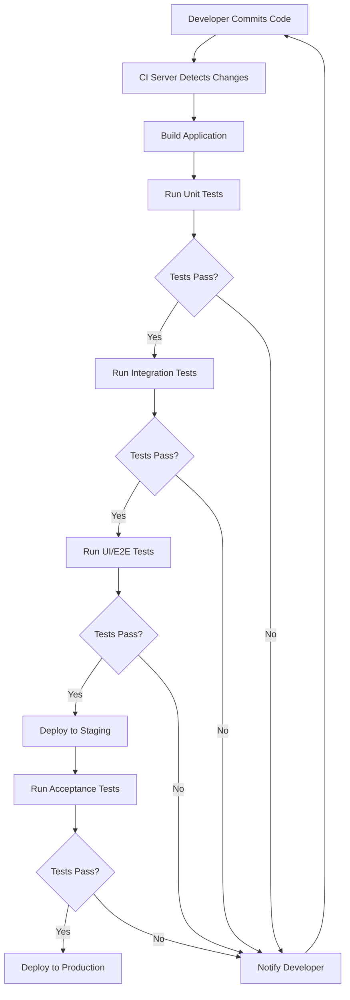

# CI/CD Test Automation

## Introduction

Continuous Integration/Continuous Deployment (CI/CD) test automation combines the power of automated testing with the efficiency of CI/CD pipelines. When properly implemented, it ensures that code changes are automatically tested before they are integrated and deployed to production environments, reducing bugs and improving overall software quality.

In this guide, we'll explore how to implement test automation within your CI/CD pipeline, focusing on practical examples that beginners can understand and apply to their own projects.

## What is CI/CD Test Automation?

CI/CD test automation refers to the practice of automatically running tests whenever new code is committed to a repository as part of a continuous integration and continuous deployment workflow. 

Let's break down the key components:

1. **Continuous Integration (CI)**: The practice of frequently merging code changes into a shared repository, with automated builds and tests to detect problems early.

2. **Continuous Deployment (CD)**: The practice of automatically deploying code changes to production after they pass all tests in the CI stage.

3. **Test Automation**: The use of software tools to execute pre-written tests automatically and compare actual outcomes with expected outcomes.

When these components work together, you create a robust pipeline that catches issues early and ensures high-quality software delivery.

## CI/CD Testing Flow

Here's a typical flow of how tests are integrated into a CI/CD pipeline:



## Types of Tests in CI/CD Pipelines

### 1. Unit Tests

Unit tests verify that individual components work as expected in isolation.

```javascript
// Example: A simple function to test
function add(a, b) {
  return a + b;
}

// Unit test for the add function
test('adds 1 + 2 to equal 3', () => {
  expect(add(1, 2)).toBe(3);
});
```

Unit tests are typically the first tests that run in your pipeline because they're fast and help catch basic errors early.

### 2. Integration Tests

Integration tests verify that different components work together correctly.

```javascript
// Example: Testing a user registration API endpoint
test('POST /api/users should create a new user', async () => {
  const response = await request(app)
    .post('/api/users')
    .send({
      username: 'testuser',
      email: 'test@example.com',
      password: 'password123'
    });
  
  expect(response.status).toBe(201);
  expect(response.body).toHaveProperty('id');
  expect(response.body.username).toBe('testuser');
});
```

### 3. End-to-End (E2E) Tests

E2E tests verify that complete user flows work as expected from start to finish.

```javascript
// Example: Cypress E2E test for login flow
describe('Login Flow', () => {
  it('should allow a user to log in', () => {
    cy.visit('/login');
    cy.get('input[name="username"]').type('testuser');
    cy.get('input[name="password"]').type('password123');
    cy.get('button[type="submit"]').click();
    cy.url().should('include', '/dashboard');
    cy.contains('Welcome, testuser').should('be.visible');
  });
});
```

### 4. Performance Tests

Performance tests verify that your application meets performance criteria.

```javascript
// Example: k6 performance test script
import http from 'k6/http';
import { check, sleep } from 'k6';

export const options = {
  vus: 100,
  duration: '30s',
};

export default function() {
  const res = http.get('https://test-api.example.com/users');
  check(res, {
    'status is 200': (r) => r.status === 200,
    'response time is less than 200ms': (r) => r.timings.duration < 200,
  });
  sleep(1);
}
```

## Setting Up CI/CD Test Automation

Let's walk through setting up a basic CI/CD pipeline with test automation using GitHub Actions.

### 1. Create a Workflow File

Create a file at `.github/workflows/ci-cd.yml` in your repository:

```yaml
name: CI/CD Pipeline

on:
  push:
    branches: [ main ]
  pull_request:
    branches: [ main ]

jobs:
  test:
    runs-on: ubuntu-latest
    
    steps:
    - uses: actions/checkout@v3
    
    - name: Set up Node.js
      uses: actions/setup-node@v3
      with:
        node-version: '16'
        
    - name: Install dependencies
      run: npm ci
      
    - name: Run unit tests
      run: npm test
      
    - name: Run integration tests
      run: npm run test:integration
      
    - name: Run E2E tests
      run: npm run test:e2e
```

### 2. Configure Test Commands in package.json

Define your test commands in your `package.json` file:

```json
{
  "scripts": {
    "test": "jest",
    "test:integration": "jest --config jest.integration.config.js",
    "test:e2e": "cypress run"
  }
}
```

### 3. Add Test-Specific Configuration

For integration tests, create a `jest.integration.config.js` file:

```javascript
module.exports = {
  testMatch: ['**/*.integration.test.js'],
  setupFilesAfterEnv: ['./jest.integration.setup.js']
};
```

## Real-World Example: CI/CD Test Automation for a Node.js App

Let's look at a complete example of setting up test automation for a simple Node.js API:

### Project Structure

```
my-api/
├── src/
│   ├── app.js
│   ├── routes/
│   │   └── users.js
│   └── models/
│       └── user.js
├── tests/
│   ├── unit/
│   │   └── user.test.js
│   ├── integration/
│   │   └── users-api.test.js
│   └── e2e/
│       └── user-flow.test.js
├── .github/
│   └── workflows/
│       └── ci-cd.yml
├── package.json
└── jest.config.js
```

### Example User Model Test (Unit Test)

```javascript
// tests/unit/user.test.js
const User = require('../../src/models/user');

describe('User Model', () => {
  test('should validate a valid user', () => {
    const validUser = new User({
      username: 'testuser',
      email: 'test@example.com',
      password: 'password123'
    });
    
    const validation = validUser.validateSync();
    expect(validation).toBeUndefined();
  });
  
  test('should invalidate a user without username', () => {
    const invalidUser = new User({
      email: 'test@example.com',
      password: 'password123'
    });
    
    const validation = invalidUser.validateSync();
    expect(validation.errors.username).toBeDefined();
  });
});
```

### Example API Test (Integration Test)

```javascript
// tests/integration/users-api.test.js
const request = require('supertest');
const app = require('../../src/app');
const mongoose = require('mongoose');
const User = require('../../src/models/user');

beforeAll(async () => {
  await mongoose.connect(process.env.TEST_MONGODB_URI);
});

afterAll(async () => {
  await User.deleteMany({});
  await mongoose.connection.close();
});

describe('Users API', () => {
  test('POST /api/users should create a new user', async () => {
    const response = await request(app)
      .post('/api/users')
      .send({
        username: 'testuser',
        email: 'test@example.com',
        password: 'password123'
      });
    
    expect(response.status).toBe(201);
    expect(response.body).toHaveProperty('id');
    expect(response.body.username).toBe('testuser');
  });
  
  test('GET /api/users should return a list of users', async () => {
    const response = await request(app).get('/api/users');
    
    expect(response.status).toBe(200);
    expect(Array.isArray(response.body)).toBe(true);
    expect(response.body.length).toBeGreaterThan(0);
  });
});
```

### GitHub Actions Workflow (CI/CD Pipeline)

```yaml
name: Node.js API CI/CD

on:
  push:
    branches: [ main ]
  pull_request:
    branches: [ main ]

jobs:
  test:
    runs-on: ubuntu-latest
    
    services:
      mongodb:
        image: mongo:4.4
        ports:
          - 27017:27017
    
    steps:
    - uses: actions/checkout@v3
    
    - name: Set up Node.js
      uses: actions/setup-node@v3
      with:
        node-version: '16'
        
    - name: Install dependencies
      run: npm ci
      
    - name: Run unit tests
      run: npm test
      
    - name: Run integration tests
      run: npm run test:integration
      env:
        TEST_MONGODB_URI: mongodb://localhost:27017/test-db
      
    - name: Run E2E tests
      run: npm run test:e2e
      env:
        TEST_MONGODB_URI: mongodb://localhost:27017/test-db
        
  deploy:
    needs: test
    if: github.ref == 'refs/heads/main' && github.event_name == 'push'
    runs-on: ubuntu-latest
    
    steps:
    - uses: actions/checkout@v3
    
    - name: Deploy to production
      run: |
        echo "Deploying to production..."
        # Add your deployment script or command here
```

## Best Practices for CI/CD Test Automation

1. **Keep Tests Fast**: Slow tests can bottleneck your CI/CD pipeline. Optimize tests to run quickly.

2. **Isolate Test Environments**: Ensure each test runs in an isolated environment to prevent interference.

3. **Use Parallelization**: Run tests in parallel to speed up the testing process.

4. **Implement Test Pyramids**: Follow the test pyramid approach with more unit tests than integration tests, and more integration tests than E2E tests.

```mermaid
pyramid-chart
    UI/E2E Tests: 20
    Integration Tests: 50
    Unit Tests: 100
```

5. **Monitor Test Reliability**: Track flaky tests and fix them promptly to maintain pipeline reliability.

6. **Set Appropriate Timeouts**: Configure reasonable timeouts for tests to prevent hanging pipelines.

7. **Create Focused Tests**: Each test should focus on a specific functionality or behavior.

8. **Use Mocks and Stubs**: Mock external dependencies to ensure tests are deterministic and focused.

```javascript
// Example: Mocking a database call
jest.mock('../../src/database');
const database = require('../../src/database');

test('getUser should return user data', async () => {
  // Setup mock
  database.findUser.mockResolvedValue({ id: 1, name: 'Test User' });
  
  // Call the function that uses the database
  const result = await userService.getUser(1);
  
  // Assert on the result
  expect(result).toEqual({ id: 1, name: 'Test User' });
  
  // Verify the mock was called correctly
  expect(database.findUser).toHaveBeenCalledWith(1);
});
```

## Common Challenges and Solutions

### Challenge 1: Flaky Tests

**Problem**: Tests that sometimes pass and sometimes fail without code changes.

**Solution**: 
- Identify and fix race conditions
- Add appropriate waiting mechanisms
- Isolate tests from each other
- Implement retry mechanisms for external services

```javascript
// Example: Adding retry logic to a test
test('should connect to the external API', async () => {
  const maxRetries = 3;
  let attempt = 0;
  let response;
  
  while (attempt < maxRetries) {
    try {
      response = await api.connect();
      break;
    } catch (error) {
      attempt++;
      if (attempt === maxRetries) throw error;
      await new Promise(resolve => setTimeout(resolve, 1000)); // Wait before retry
    }
  }
  
  expect(response.status).toBe('connected');
});
```

### Challenge 2: Slow CI/CD Pipeline

**Problem**: Tests take too long to run, slowing down development.

**Solution**:
- Implement test parallelization
- Use selective testing based on changed files
- Optimize test execution environment
- Split test suites across multiple jobs

```yaml
# Example: Parallel test execution in GitHub Actions
jobs:
  test:
    strategy:
      matrix:
        test-group: [unit, integration, e2e]
    runs-on: ubuntu-latest
    steps:
      - uses: actions/checkout@v3
      - name: Run ${{ matrix.test-group }} tests
        run: npm run test:${{ matrix.test-group }}
```

## Summary

CI/CD test automation is essential for maintaining high-quality software while enabling rapid development and deployment. By understanding the different types of tests and implementing them at appropriate stages of your CI/CD pipeline, you can catch issues early and deliver more reliable software.

Remember these key points:
- Different types of tests serve different purposes in your pipeline
- Properly configured CI/CD workflows automate the testing process
- Following best practices ensures efficient and reliable test automation
- Addressing common challenges improves the overall developer experience

## Additional Resources

1. Learn more about test frameworks:
   - Jest: [https://jestjs.io/](https://jestjs.io/)
   - Cypress: [https://www.cypress.io/](https://www.cypress.io/)
   - Playwright: [https://playwright.dev/](https://playwright.dev/)

2. CI/CD platforms:
   - GitHub Actions: [https://github.com/features/actions](https://github.com/features/actions)
   - Jenkins: [https://www.jenkins.io/](https://www.jenkins.io/)
   - CircleCI: [https://circleci.com/](https://circleci.com/)

## Exercises

1. Set up a basic CI/CD pipeline with GitHub Actions for a simple JavaScript project.
2. Implement unit tests for a function that calculates shipping costs based on weight and destination.
3. Create an integration test for an API endpoint that processes user registrations.
4. Implement an E2E test for a login-logout workflow in a web application.
5. Modify an existing CI/CD pipeline to include performance testing.