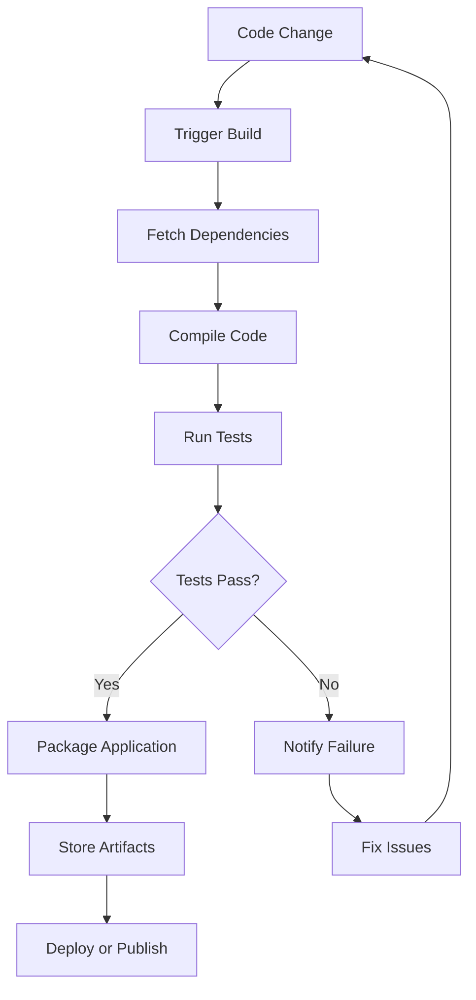

# CICD Build Automation

## Introduction

Build automation is a foundational component of CI/CD (Continuous Integration/Continuous Deployment) pipelines. It transforms the manual, error-prone process of building software into an automated, consistent, and reliable workflow. For beginners entering the world of software development, understanding build automation will help you create more reliable software and collaborate more effectively with teams.

In this guide, we'll explore what build automation is, why it's crucial for modern software development, and how to implement it in your CI/CD pipeline.

## What is Build Automation?

Build automation is the process of scripting or automating the compilation, testing, and packaging of software code. Instead of manually executing these steps, developers set up systems to automatically trigger and execute them whenever code changes are made.

A typical build automation workflow includes:

1. **Code Compilation**: Converting source code into executable programs
2. **Running Tests**: Executing unit tests, integration tests, and other automated checks
3. **Generating Documentation**: Creating or updating technical documentation
4. **Packaging**: Bundling code and dependencies into deployable packages
5. **Generating Reports**: Creating reports on code quality, test coverage, etc.

## Why Build Automation Matters

For beginners, it might seem easier to just build and test your code manually. However, as your projects grow in complexity, build automation becomes essential for several reasons:

- **Consistency**: Builds are performed the same way every time
- **Error Reduction**: Eliminates human error in the build process
- **Time Savings**: Developers focus on coding rather than building
- **Fast Feedback**: Quickly identifies issues in the code
- **Traceability**: Keeps track of what was built, when, and from which code

## Build Automation Tools

Several tools can help you implement build automation. Here are some popular ones:

| Tool | Primary Language/Platform | Key Features |
|------|---------------------------|--------------|
| Make | Language-agnostic | Simple, widely used |
| Gradle | Java, Kotlin, Android | Flexible, performance-oriented |
| Maven | Java | Convention-based, declarative |
| npm | JavaScript, Node.js | Package management, scripts |
| MSBuild | .NET | Visual Studio integration |
| Jenkins | Multiple | Extensible automation server |

## Basic Build Automation Example

Let's start with a simple example using npm for a JavaScript project:

```javascript
// package.json
{
  "name": "my-app",
  "version": "1.0.0",
  "scripts": {
    "build": "webpack --mode production",
    "test": "jest",
    "lint": "eslint src/**/*.js"
  },
  "dependencies": {
    // dependencies here
  },
  "devDependencies": {
    // dev dependencies here
  }
}
```

With this configuration, you can run commands like `npm run build` to build your project, `npm test` to run tests, and `npm run lint` to check code quality.

## Integrating Build Automation into CI/CD

Now, let's see how build automation fits into a CI/CD pipeline using GitHub Actions as an example:

```yaml
# .github/workflows/build.yml
name: Build and Test

on:
  push:
    branches: [ main ]
  pull_request:
    branches: [ main ]

jobs:
  build:
    runs-on: ubuntu-latest
    
    steps:
    - uses: actions/checkout@v3
    
    - name: Setup Node.js
      uses: actions/setup-node@v3
      with:
        node-version: 16
        
    - name: Install dependencies
      run: npm ci
      
    - name: Lint code
      run: npm run lint
      
    - name: Run tests
      run: npm test
      
    - name: Build
      run: npm run build
      
    - name: Archive production artifacts
      uses: actions/upload-artifact@v3
      with:
        name: dist
        path: dist
```

This workflow:
1. Triggers whenever code is pushed to the main branch or a pull request is created
2. Sets up the environment with Node.js
3. Installs dependencies
4. Runs linting to check code quality
5. Executes tests
6. Builds the application
7. Archives the build artifacts for later use

## Real-World Application: Multi-Stage Build Pipeline

Let's look at a more complex, real-world example using a multi-stage build pipeline for a Java application with Maven and Docker:

```yaml
# .github/workflows/ci-cd.yml
name: CI/CD Pipeline

on:
  push:
    branches: [ main, develop ]
  pull_request:
    branches: [ main, develop ]

jobs:
  build:
    runs-on: ubuntu-latest
    
    steps:
    - uses: actions/checkout@v3
    
    - name: Set up JDK 17
      uses: actions/setup-java@v3
      with:
        java-version: '17'
        distribution: 'temurin'
        cache: maven
        
    - name: Build with Maven
      run: mvn -B package --file pom.xml
      
    - name: Run tests
      run: mvn test
      
    - name: Code quality analysis
      run: mvn sonar:sonar -Dsonar.projectKey=my-project -Dsonar.host.url=${{ secrets.SONAR_URL }} -Dsonar.login=${{ secrets.SONAR_TOKEN }}
      
    - name: Build and push Docker image
      uses: docker/build-push-action@v4
      with:
        context: .
        push: ${{ github.event_name != 'pull_request' }}
        tags: myorg/myapp:${{ github.sha }}
        
    - name: Save test results
      uses: actions/upload-artifact@v3
      with:
        name: test-results
        path: target/surefire-reports
        
    - name: Save build artifacts
      uses: actions/upload-artifact@v3
      with:
        name: app
        path: target/*.jar
```

This advanced pipeline:
1. Builds a Java application with Maven
2. Runs tests
3. Performs code quality analysis with SonarQube
4. Builds and pushes a Docker image
5. Saves test results and build artifacts

## Build Automation Flow

Let's visualize the build automation process with a Mermaid diagram:



## Build Automation Best Practices

As you implement build automation in your projects, keep these best practices in mind:

1. **Keep builds fast**: Optimize for speed to provide quick feedback
2. **Make builds reproducible**: Ensure the same inputs produce the same outputs
3. **Version control your build scripts**: Track changes to your build configuration
4. **Parallelize when possible**: Run independent build steps concurrently
5. **Fail early**: Run quick checks before time-consuming operations
6. **Manage dependencies carefully**: Use lockfiles and version pinning
7. **Use caching wisely**: Cache dependencies and intermediate build artifacts
8. **Set up notifications**: Alert team members about build failures

## Common Build Automation Challenges

When implementing build automation, be aware of these common challenges:

1. **Environment differences**: Builds that work on one machine but fail on another
2. **Flaky tests**: Tests that intermittently fail without code changes
3. **Long build times**: Builds that take too long to complete
4. **Dependency management**: Handling complex or conflicting dependencies
5. **Resource constraints**: Running out of memory or disk space during builds

## Practical Example: Setting Up a Basic Build Script

Let's create a simple build script for a Python project:

```python
# build.py
import os
import subprocess
import shutil

# Clean previous build artifacts
if os.path.exists("dist"):
    shutil.rmtree("dist")
os.makedirs("dist", exist_ok=True)

# Run linting
print("Running linting...")
result = subprocess.run(["flake8", "src"])
if result.returncode != 0:
    print("Linting failed!")
    exit(1)

# Run tests
print("Running tests...")
result = subprocess.run(["pytest", "tests", "--junitxml=test-results.xml"])
if result.returncode != 0:
    print("Tests failed!")
    exit(1)

# Build package
print("Building package...")
result = subprocess.run(["python", "setup.py", "sdist", "bdist_wheel"])
if result.returncode != 0:
    print("Build failed!")
    exit(1)

print("Build completed successfully!")
```

You can run this script manually with `python build.py`, or integrate it into a CI/CD pipeline.

## Summary

Build automation is a critical component of modern software development and a cornerstone of CI/CD practices. By automating the build process, you can:

- Ensure consistent, reliable builds
- Catch errors early
- Save time and reduce manual work
- Improve code quality
- Enable continuous integration and deployment

As you grow as a developer, investing time in setting up proper build automation will pay dividends in productivity and code quality.

## Additional Resources

To further your understanding of build automation, explore these resources:

- **Books**:
  - "Continuous Delivery" by Jez Humble and David Farley
  - "DevOps Handbook" by Gene Kim, et al.

- **Online Courses**:
  - "CI/CD with Jenkins" on Udemy
  - "GitHub Actions" on GitHub Learning Lab

- **Documentation**:
  - Jenkins User Documentation
  - GitHub Actions Documentation
  - GitLab CI Documentation

## Exercises

1. Set up a basic build script for a simple project in your preferred language.
2. Implement a GitHub Actions workflow that builds and tests your code.
3. Add code quality checks (linting, static analysis) to your build process.
4. Create a multi-stage build pipeline that includes testing, building, and deploying.
5. Configure notifications to alert you when builds fail.