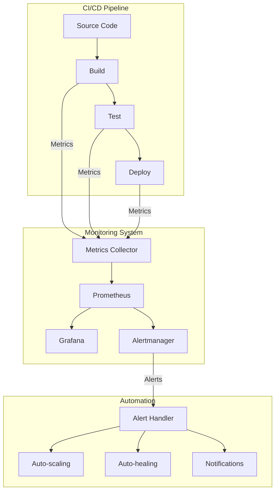

# CICD Monitoring Automation

## Introduction

Continuous Integration and Continuous Deployment (CI/CD) pipelines are essential components of modern software development practices. However, without proper monitoring, these pipelines can become black boxes that fail silently or degrade in performance over time. CICD Monitoring Automation refers to the practice of implementing automated monitoring systems that track, analyze, and report on the health and performance of your CI/CD pipelines.

In this guide, we'll explore how to set up monitoring automation for your CI/CD processes, helping you detect issues early, improve reliability, and optimize your development workflow.

## Why Monitor Your CI/CD Pipeline?

Before diving into implementation, let's understand why monitoring your pipeline is crucial:

1. **Detect failures early** - Catch build, test, or deployment issues as they happen
2. **Track performance trends** - Identify slowdowns before they become bottlenecks
3. **Ensure reliability** - Verify that your pipeline is consistently delivering as expected
4. **Optimize resource usage** - Identify opportunities to improve efficiency
5. **Enable data-driven improvements** - Make decisions based on actual usage patterns

## Key Metrics to Monitor

Effective CI/CD monitoring starts with tracking the right metrics:

### Pipeline Health Metrics

- **Build success rate** - Percentage of successful builds
- **Test pass rate** - Percentage of tests that pass
- **Deployment success rate** - Percentage of successful deployments
- **Pipeline uptime** - Availability of your CI/CD infrastructure

### Performance Metrics

- **Build duration** - Time taken to complete builds
- **Test execution time** - Time taken to run test suites
- **Deployment time** - Time taken to deploy code to environments
- **Queue time** - How long jobs wait before starting

### Resource Utilization

- **CPU/Memory usage** - Resource consumption during pipeline execution
- **Concurrent jobs** - Number of jobs running simultaneously
- **Executor utilization** - How efficiently your build agents are being used

## Setting Up Basic Monitoring

Let's start with a simple monitoring setup using a popular CI/CD platform. We'll use GitHub Actions as an example, but similar principles apply to Jenkins, GitLab CI, or other systems.

### 1. Add Status Checks

First, let's add a simple status check that reports on pipeline health:

```yaml
name: Pipeline Status Check

on:
  workflow_run:
    workflows: ["Main CI Pipeline"]
    types:
      - completed

jobs:
  monitor:
    runs-on: ubuntu-latest
    steps:
      - name: Check pipeline status
        run: |
          if [[ "${{ github.event.workflow_run.conclusion }}" != "success" ]]; then
            echo "Pipeline failed! Sending notification..."
            # Notification logic here
            exit 1
          else
            echo "Pipeline succeeded!"
          fi
```

This simple workflow runs after your main CI pipeline and checks if it succeeded. If not, it can trigger notifications or other actions.

### 2. Measuring Build Duration

Let's add timing measurements to track how long our builds take:

```yaml
name: Build Time Monitoring

on:
  push:
    branches: [ main ]

jobs:
  build:
    runs-on: ubuntu-latest
    steps:
      - uses: actions/checkout@v3
      
      - name: Record start time
        run: echo "START_TIME=$(date +%s)" >> $GITHUB_ENV
      
      - name: Build project
        run: |
          # Your build commands here
          npm ci
          npm run build
      
      - name: Calculate build duration
        run: |
          END_TIME=$(date +%s)
          DURATION=$((END_TIME - $START_TIME))
          echo "Build completed in $DURATION seconds"
          echo "BUILD_DURATION=$DURATION" >> $GITHUB_ENV
      
      - name: Log metrics
        run: |
          # Here you would typically send this data to a monitoring system
          echo "Logging build duration: $BUILD_DURATION seconds"
```

This workflow measures and reports the time taken to build your project.

## Implementing Advanced Monitoring

For more comprehensive monitoring, we can integrate specialized tools. Let's explore how to set up monitoring with Prometheus and Grafana, popular open-source monitoring tools.

### Setting Up Prometheus for CI/CD Monitoring

First, you'll need to instrument your CI/CD pipeline to expose metrics that Prometheus can scrape. Here's how to create a simple exporter in Python:

```python
from prometheus_client import start_http_server, Summary, Counter, Gauge
import time
import random
import os

# Create metrics
BUILD_DURATION = Summary('ci_build_duration_seconds', 'Time spent in build')
BUILD_COUNTER = Counter('ci_builds_total', 'Total number of builds', ['result'])
QUEUE_GAUGE = Gauge('ci_queue_length', 'Number of jobs in queue')

# Simulate data collection from CI/CD system
def process_build_data():
    while True:
        # Simulate a build completing
        duration = random.uniform(30, 300)  # between 30s and 5m
        with BUILD_DURATION.time():
            # In reality, this would be the actual build time
            time.sleep(1)  # Just for demonstration

        # Record if the build succeeded or failed
        result = random.choice(['success', 'failure'])
        BUILD_COUNTER.labels(result=result).inc()
        
        # Update queue length
        QUEUE_GAUGE.set(random.randint(0, 10))
        
        time.sleep(5)  # Check for new data every 5 seconds

if __name__ == '__main__':
    # Start up the server to expose the metrics.
    start_http_server(8000)
    # Generate some metrics
    process_build_data()
```

In a real implementation, you would replace the simulated data with actual metrics from your CI/CD system.

### Connecting Prometheus to Your CI/CD System

To deploy this exporter alongside your CI/CD system, you can use a Docker container:

```yaml
version: '3'

services:
  ci-metrics-exporter:
    build: ./metrics-exporter
    ports:
      - "8000:8000"
    restart: always
    
  prometheus:
    image: prom/prometheus
    ports:
      - "9090:9090"
    volumes:
      - ./prometheus.yml:/etc/prometheus/prometheus.yml
    depends_on:
      - ci-metrics-exporter
    
  grafana:
    image: grafana/grafana
    ports:
      - "3000:3000"
    depends_on:
      - prometheus
```

Your `prometheus.yml` configuration would look like:

```yaml
global:
  scrape_interval: 15s

scrape_configs:
  - job_name: 'ci_metrics'
    static_configs:
      - targets: ['ci-metrics-exporter:8000']
```

## Visualizing CI/CD Metrics with Grafana

Once you have your metrics in Prometheus, you can create dashboards in Grafana. Here's how a simple dashboard configuration might look:

```json
{
  "annotations": {
    "list": []
  },
  "editable": true,
  "fiscalYearStartMonth": 0,
  "graphTooltip": 0,
  "links": [],
  "panels": [
    {
      "datasource": "Prometheus",
      "fieldConfig": {
        "defaults": {
          "color": {
            "mode": "palette-classic"
          },
          "mappings": [],
          "thresholds": {
            "mode": "absolute",
            "steps": []
          }
        },
        "overrides": []
      },
      "gridPos": {
        "h": 8,
        "w": 12,
        "x": 0,
        "y": 0
      },
      "options": {
        "displayMode": "gradient",
        "minVizWidth": 0,
        "orientation": "auto",
        "reduceOptions": {
          "calcs": [
            "lastNotNull"
          ],
          "fields": "",
          "values": false
        },
        "showUnfilled": true
      },
      "pluginVersion": "9.3.6",
      "targets": [
        {
          "datasource": "Prometheus",
          "expr": "ci_builds_total",
          "format": "time_series",
          "intervalFactor": 1,
          "refId": "A"
        }
      ],
      "title": "Total Builds",
      "type": "bargauge"
    }
  ],
  "refresh": "",
  "schemaVersion": 38,
  "style": "dark",
  "time": {
    "from": "now-6h",
    "to": "now"
  },
  "timepicker": {},
  "title": "CI/CD Monitoring Dashboard",
  "uid": "ci-cd-monitoring",
  "version": 1
}
```

## Setting Up Alerting

Monitoring is most useful when it can proactively alert you to problems. Let's set up some basic alerts in Prometheus:

```yaml
groups:
- name: ci_alerts
  rules:
  - alert: BuildFailureRateHigh
    expr: rate(ci_builds_total{result="failure"}[1h]) / rate(ci_builds_total[1h]) > 0.1
    for: 15m
    labels:
      severity: warning
    annotations:
      summary: "Build failure rate is high"
      description: "Build failure rate is above 10% for the last 15 minutes"
      
  - alert: LongBuildDuration
    expr: histogram_quantile(0.95, rate(ci_build_duration_seconds_bucket[1h])) > 600
    for: 30m
    labels:
      severity: warning
    annotations:
      summary: "Build duration is too long"
      description: "95th percentile of build duration is above 10 minutes"
```

## Automating Remediation Actions

The real power of monitoring comes when you can automatically fix issues. Let's create a simple example of how to automatically scale your CI/CD resources based on queue length:

```python
import requests
import time
import os

# Configuration (in a real scenario, this would come from environment variables or a config file)
PROMETHEUS_URL = "http://prometheus:9090"
CI_PROVIDER_API = "https://api.your-ci-provider.com"
API_TOKEN = os.environ.get("CI_API_TOKEN")

def get_current_queue_length():
    response = requests.get(
        f"{PROMETHEUS_URL}/api/v1/query",
        params={"query": "ci_queue_length"}
    )
    result = response.json()
    if result["status"] == "success" and len(result["data"]["result"]) > 0:
        return float(result["data"]["result"][0]["value"][1])
    return 0

def scale_runners(count):
    headers = {"Authorization": f"Bearer {API_TOKEN}"}
    data = {"runner_count": count}
    response = requests.post(f"{CI_PROVIDER_API}/scale", json=data, headers=headers)
    return response.status_code == 200

def autoscaling_loop():
    while True:
        queue_length = get_current_queue_length()
        
        # Simple scaling logic
        if queue_length > 5:
            print(f"Queue length {queue_length} is high, scaling up")
            scale_runners(5)
        elif queue_length < 2:
            print(f"Queue length {queue_length} is low, scaling down")
            scale_runners(2)
        else:
            print(f"Queue length {queue_length} is optimal")
            
        time.sleep(60)  # Check every minute

if __name__ == "__main__":
    autoscaling_loop()
```

This script would check the current queue length and automatically scale your CI/CD runners up or down accordingly.

## Creating a CI/CD Monitoring Pipeline Diagram

Let's visualize the monitoring flow with a Mermaid diagram:



## Practical Example: Monitoring a Node.js Application Build Pipeline

Let's put everything together in a practical example for a Node.js application:

1. First, we'll define our CI pipeline in GitHub Actions:

```yaml
name: Node.js CI Pipeline

on:
  push:
    branches: [ main ]
  pull_request:
    branches: [ main ]

jobs:
  build:
    runs-on: ubuntu-latest
    steps:
    - uses: actions/checkout@v3
    - name: Setup Node.js
      uses: actions/setup-node@v3
      with:
        node-version: '16'
        cache: 'npm'
    - name: Install dependencies
      run: npm ci
    - name: Lint code
      run: npm run lint
    - name: Run tests
      run: npm test
    - name: Build application
      run: npm run build
```

2. Next, we'll add a monitoring job that runs after the main pipeline:

```yaml
  monitor:
    needs: build
    runs-on: ubuntu-latest
    steps:
    - name: Record metrics
      run: |
        # Extract timing information
        BUILD_DURATION="${{ steps.build.outputs.duration }}"
        TEST_DURATION="${{ steps.test.outputs.duration }}"
        
        # Send metrics to our monitoring system
        curl -X POST https://monitoring.example.com/api/metrics \
          -H "Content-Type: application/json" \
          -d '{
            "build_duration": "'"$BUILD_DURATION"'",
            "test_duration": "'"$TEST_DURATION"'",
            "build_result": "'"${{ job.status }}"'",
            "repository": "'"${{ github.repository }}"'",
            "branch": "'"${{ github.ref }}"'"
          }'
```

3. We'll also set up a separate workflow that regularly checks our pipeline health:

```yaml
name: CI Health Check

on:
  schedule:
    - cron: '*/30 * * * *'  # Run every 30 minutes

jobs:
  health-check:
    runs-on: ubuntu-latest
    steps:
    - name: Check pipeline stats
      run: |
        # Query our monitoring API for the last 24 hours
        STATS=$(curl -s https://monitoring.example.com/api/stats/24h)
        
        # Extract success rates
        BUILD_SUCCESS_RATE=$(echo $STATS | jq -r .build_success_rate)
        DEPLOYMENT_SUCCESS_RATE=$(echo $STATS | jq -r .deployment_success_rate)
        
        # Check if they're below thresholds
        if (( $(echo "$BUILD_SUCCESS_RATE < 0.9" | bc -l) )); then
          echo "::warning::Build success rate is below 90%: $BUILD_SUCCESS_RATE"
        fi
        
        if (( $(echo "$DEPLOYMENT_SUCCESS_RATE < 0.95" | bc -l) )); then
          echo "::warning::Deployment success rate is below 95%: $DEPLOYMENT_SUCCESS_RATE"
        fi
```

## Best Practices for CI/CD Monitoring

As you implement monitoring for your CI/CD pipelines, keep these best practices in mind:

1. **Start simple** - Begin with basic metrics and expand as needed
2. **Focus on actionable metrics** - Monitor what you can actually act on
3. **Set clear baselines** - Establish what "normal" looks like for your pipelines
4. **Implement meaningful alerts** - Alert on conditions that truly require attention
5. **Reduce alert fatigue** - Too many alerts will be ignored; focus on critical issues
6. **Document your monitoring setup** - Make sure your team understands what's being monitored and why
7. **Regularly review and refine** - As your CI/CD processes evolve, so should your monitoring
8. **Correlate with application monitoring** - Connect CI/CD metrics with application performance metrics

## Integration with Existing Tools

Most CI/CD platforms provide some level of monitoring capabilities out of the box. Here's how to leverage them:

### GitHub Actions

GitHub provides insights into workflow runs that you can access programmatically:

```javascript
// Using the GitHub REST API to fetch workflow run data
const getWorkflowStats = async (owner, repo, workflowId) => {
  const response = await fetch(
    `https://api.github.com/repos/${owner}/${repo}/actions/workflows/${workflowId}/runs`,
    {
      headers: {
        Authorization: `token ${process.env.GITHUB_TOKEN}`,
      },
    }
  );
  
  const data = await response.json();
  
  // Calculate success rate
  const totalRuns = data.total_count;
  const successfulRuns = data.workflow_runs.filter(run => run.conclusion === 'success').length;
  const successRate = totalRuns > 0 ? successfulRuns / totalRuns : 0;
  
  // Calculate average duration
  const durations = data.workflow_runs.map(run => {
    const start = new Date(run.created_at);
    const end = new Date(run.updated_at);
    return (end - start) / 1000; // duration in seconds
  });
  
  const avgDuration = durations.length > 0 
    ? durations.reduce((sum, duration) => sum + duration, 0) / durations.length 
    : 0;
  
  return {
    successRate,
    avgDuration,
    totalRuns,
  };
};
```

### Jenkins

Jenkins provides a metrics plugin that exposes various statistics as Prometheus metrics:

```yaml
# Prometheus scrape config for Jenkins metrics
scrape_configs:
  - job_name: 'jenkins'
    metrics_path: '/prometheus'
    static_configs:
      - targets: ['jenkins:8080']
```

### GitLab CI

GitLab provides detailed metrics about pipeline performance through its API:

```bash
# Fetch pipeline statistics for a project
curl --header "PRIVATE-TOKEN: <your_access_token>" \
     "https://gitlab.example.com/api/v4/projects/1/pipelines/statistics"
```

## Summary

CI/CD Monitoring Automation is a critical practice for maintaining healthy, efficient development pipelines. By tracking key metrics, visualizing trends, setting up alerts, and implementing automated remediation, you can ensure your CI/CD processes remain reliable and performant.

Remember these key takeaways:

1. Start with basic metrics like build success rates and durations
2. Use specialized tools like Prometheus and Grafana for more advanced monitoring
3. Set up alerts for critical issues
4. Implement automated remediation when possible
5. Continuously refine your monitoring approach based on your team's needs

By applying these principles, you'll gain better visibility into your CI/CD pipeline health, detect issues early, and ensure smoother software delivery.

## Additional Resources

- [Prometheus Documentation](https://prometheus.io/docs/introduction/overview/)
- [Grafana Tutorials](https://grafana.com/tutorials/)
- [GitHub Actions Documentation](https://docs.github.com/en/actions)
- [Jenkins Metrics Plugin](https://plugins.jenkins.io/metrics/)
- [GitLab CI/CD Monitoring](https://docs.gitlab.com/ee/user/analytics/ci_cd_analytics.html)

## Exercises

1. Set up a basic monitoring system for an existing CI/CD pipeline using GitHub Actions
2. Create a Prometheus exporter that collects metrics from your CI system
3. Design a Grafana dashboard with key CI/CD performance indicators
4. Implement an alert for build failures and test it with a deliberately failing build
5. Write a script that automatically scales your CI/CD resources based on queue length