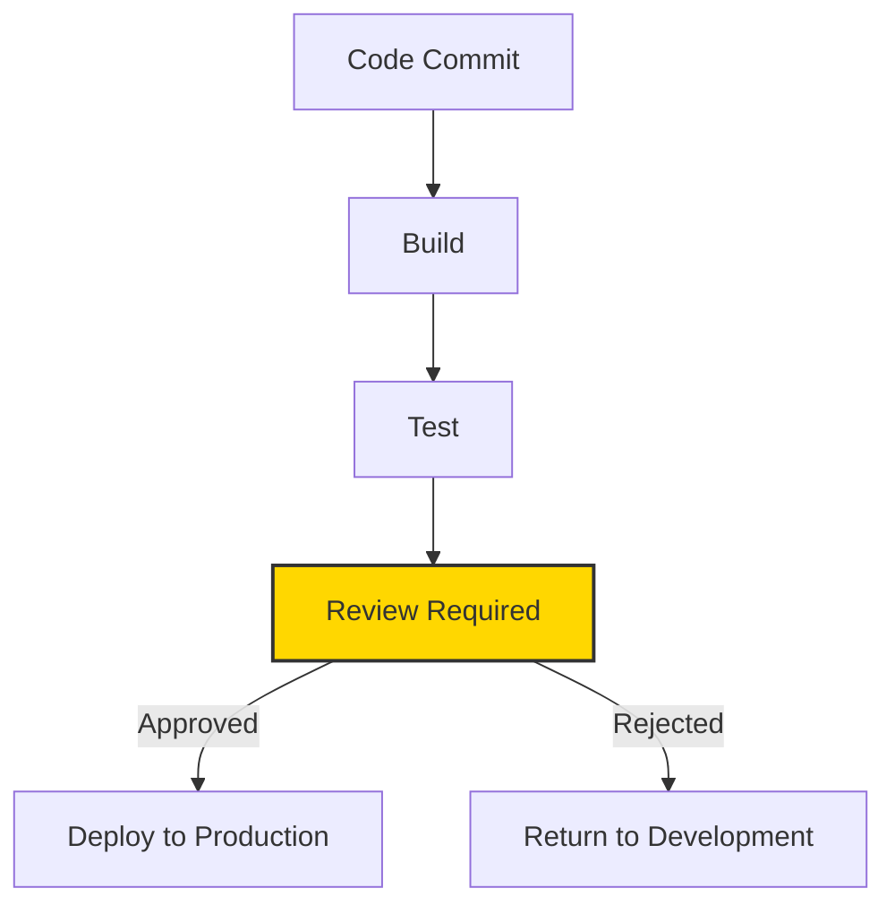

# CICD Approval Automation

## Introduction

Continuous Integration and Continuous Deployment (CI/CD) pipelines have revolutionized software development by automating the build, test, and deployment processes. However, in many organizations, completely automatic deployments to production environments might pose risks. This is where **approval automation** comes into play - a middle ground that maintains automation while incorporating human judgment at critical stages.

Approval automation in CI/CD allows teams to:

- Maintain control over sensitive deployments
- Enforce compliance and security policies
- Provide visibility into the deployment process
- Balance speed with governance

In this guide, we'll explore how to implement approval workflows in CI/CD pipelines while keeping the process as automated as possible.

## Understanding Approval Workflows

Approval workflows insert manual checkpoints into otherwise automated pipelines. These checkpoints require designated team members to review and approve changes before the pipeline continues.



### When to Use Approval Gates

Approval workflows are most beneficial in these scenarios:

1. **Production deployments**: Before changes reach end users
2. **Regulated environments**: When compliance requirements mandate reviews
3. **Critical infrastructure changes**: For updates that might impact system availability
4. **Cost-intensive operations**: For actions that could incur significant costs

## Implementing Approval Automation in Different CI/CD Systems

Let's look at how to implement approval automation in some popular CI/CD platforms.

### GitHub Actions

GitHub Actions allows you to implement approval workflows using environments with required reviewers.

First, set up an environment with protection rules:

1. In your GitHub repository, go to Settings > Environments
2. Create a new environment (e.g., "production")
3. Enable "Required reviewers" and add team members who can approve deployments

Then, in your workflow file:

```yaml
name: Deploy with Approval

on:
  push:
    branches: [ main ]

jobs:
  build-and-test:
    runs-on: ubuntu-latest
    steps:
      - uses: actions/checkout@v3
      - name: Setup Node.js
        uses: actions/setup-node@v3
        with:
          node-version: '16'
      - run: npm ci
      - run: npm test

  deploy-to-production:
    needs: build-and-test
    runs-on: ubuntu-latest
    environment: production  # This environment requires approval
    steps:
      - uses: actions/checkout@v3
      - name: Deploy
        run: ./deploy.sh
```

When this workflow runs, it will pause at the `deploy-to-production` job and wait for approval from one of the designated reviewers.

### GitLab CI/CD

GitLab provides manual jobs for implementing approvals:

```yaml
stages:
  - build
  - test
  - approve
  - deploy

build:
  stage: build
  script:
    - echo "Building the application..."
    - npm install
    - npm run build

test:
  stage: test
  script:
    - echo "Running tests..."
    - npm test

production_approval:
  stage: approve
  script:
    - echo "Deployment has been approved!"
  when: manual  # This makes the job a manual approval gate
  allow_failure: false  # Pipeline will stop here until approved

deploy_production:
  stage: deploy
  script:
    - echo "Deploying to production..."
    - ./deploy.sh
  needs:
    - production_approval  # This job only runs after approval
```

### Jenkins

Jenkins offers several options for approvals:

1. **Pipeline Input Step**: The simplest method is using the `input` step:

```groovy
pipeline {
    agent any
    stages {
        stage('Build') {
            steps {
                echo 'Building..'
                sh 'npm install'
                sh 'npm run build'
            }
        }
        stage('Test') {
            steps {
                echo 'Testing..'
                sh 'npm test'
            }
        }
        stage('Approval') {
            steps {
                input message: 'Deploy to production?', ok: 'Deploy'
            }
        }
        stage('Deploy') {
            steps {
                echo 'Deploying to production...'
                sh './deploy.sh'
            }
        }
    }
}
```

2. **Role-Based Approvals**: For more control, specify who can approve:

```groovy
stage('Approval') {
    steps {
        input message: 'Deploy to production?', 
               ok: 'Deploy',
               submitter: 'product-manager,team-lead,devops-engineer',
               submitterParameter: 'APPROVER'
    }
}
```

The `submitterParameter` saves the approver's ID to a variable for audit purposes.

## Best Practices for Approval Automation

### 1. Keep Approvals Meaningful

Don't require approvals for every change. Focus on:
- Changes to critical or customer-facing systems
- Updates that affect security or compliance
- Changes during sensitive business periods

### 2. Provide Context for Approvers

Ensure approvers have enough information to make informed decisions:

```yaml
# GitHub Actions example
deploy-to-production:
  environment:
    name: production
    url: https://deployment-preview-url.example.com  # Preview URL
  needs: build-and-test
  runs-on: ubuntu-latest
  steps:
    - name: Summarize changes
      run: |
        echo "## Deployment Summary" >> $GITHUB_STEP_SUMMARY
        echo "* Changes by: ${{ github.actor }}" >> $GITHUB_STEP_SUMMARY
        echo "* Commit message: ${{ github.event.head_commit.message }}" >> $GITHUB_STEP_SUMMARY
```

### 3. Set Up Automated Timeouts

Implement timeouts to prevent pipelines from waiting indefinitely:

```groovy
// Jenkins example
stage('Approval') {
    steps {
        timeout(time: 24, unit: 'HOURS') {
            input message: 'Deploy to production?', ok: 'Deploy'
        }
    }
}
```

### 4. Implement Fallback Procedures

Define what happens when approvals expire or are rejected:

```yaml
# GitLab example
production_approval:
  stage: approve
  script:
    - echo "Deployment has been approved!"
  when: manual
  allow_failure: true  # Pipeline continues if approval times out
  timeout: 24h  # Approval must happen within 24 hours

notify_approval_timeout:
  stage: approve
  script:
    - echo "Sending notification that approval timed out"
    - ./notify_team.sh "Deployment approval timed out"
  when: on_failure
  needs:
    - production_approval
```

## Implementing Approval Notifications

Notifications are crucial for an effective approval process. Here's how to implement them:

### Slack Notifications in GitHub Actions

```yaml
notify-approvers:
  runs-on: ubuntu-latest
  needs: build-and-test
  steps:
    - name: Send Slack notification
      uses: slackapi/slack-github-action@v1.23.0
      with:
        payload: |
          {
            "text": "Deployment to production requires approval: ${{ github.server_url }}/${{ github.repository }}/actions/runs/${{ github.run_id }}"
          }
      env:
        SLACK_WEBHOOK_URL: ${{ secrets.SLACK_WEBHOOK_URL }}
```

### Email Notifications in Jenkins

```groovy
stage('Notify Approvers') {
  steps {
    mail to: 'approvers@example.com',
         subject: "Deployment Approval Required: ${env.JOB_NAME} #${env.BUILD_NUMBER}",
         body: """
           A new deployment requires your approval.
           
           Job: ${env.JOB_NAME}
           Build Number: ${env.BUILD_NUMBER}
           
           Review and approve at: ${env.BUILD_URL}input
         """
  }
}
```

## Implementing Conditional Approvals

Sometimes you may want to automate the decision about whether an approval is needed:

```yaml
# GitHub Actions example for conditional approvals
jobs:
  analyze_changes:
    runs-on: ubuntu-latest
    outputs:
      needs_approval: ${{ steps.check.outputs.needs_approval }}
    steps:
      - uses: actions/checkout@v3
        with:
          fetch-depth: 0
      - id: check
        name: Check if sensitive files changed
        run: |
          if git diff --name-only ${{ github.event.before }} ${{ github.sha }} | grep -q "config/production\|security"; then
            echo "needs_approval=true" >> $GITHUB_OUTPUT
          else
            echo "needs_approval=false" >> $GITHUB_OUTPUT
          fi
  
  request_approval:
    needs: analyze_changes
    if: needs.analyze_changes.outputs.needs_approval == 'true'
    environment: production
    runs-on: ubuntu-latest
    steps:
      - run: echo "Approval required and received"
  
  skip_approval:
    needs: analyze_changes
    if: needs.analyze_changes.outputs.needs_approval == 'false'
    runs-on: ubuntu-latest
    steps:
      - run: echo "No approval needed, proceeding"
  
  deploy:
    needs: [analyze_changes, request_approval, skip_approval]
    if: |
      always() && 
      (needs.analyze_changes.outputs.needs_approval == 'false' || needs.request_approval.result == 'success')
    runs-on: ubuntu-latest
    steps:
      - run: echo "Deploying to production"
```

This workflow:
1. Analyzes changed files
2. Requires approval only if sensitive files were modified
3. Deploys automatically for routine changes

## Auditing and Compliance

For regulated environments, maintain detailed records of approvals:

```groovy
// Jenkins example with approval auditing
stage('Approval') {
    steps {
        script {
            def approver = input message: 'Deploy to production?',
                                ok: 'Approve',
                                submitterParameter: 'APPROVER'
            
            // Log approval details
            sh """
            echo "Deployment approved at $(date)" >> approvals.log
            echo "Approved by: ${approver}" >> approvals.log
            echo "Build: ${env.BUILD_NUMBER}" >> approvals.log
            echo "----------------------------------------" >> approvals.log
            """
            
            // Archive the approval logs
            archiveArtifacts artifacts: 'approvals.log', onlyIfSuccessful: true
        }
    }
}
```

## Real-World Example: Multi-Stage Approval Process

For critical systems, you might implement a multi-stage approval process:

```yaml
# GitLab multi-stage approval example
stages:
  - build
  - test
  - security-review
  - qa-approval
  - management-approval
  - deploy

# Build and test stages omitted for brevity

security_review:
  stage: security-review
  script:
    - echo "Security review completed"
  when: manual
  allow_failure: false

qa_approval:
  stage: qa-approval
  script:
    - echo "QA approved the deployment"
  when: manual
  allow_failure: false
  needs:
    - security_review

management_approval:
  stage: management-approval
  script:
    - echo "Management approved the deployment"
  when: manual
  allow_failure: false
  needs:
    - qa_approval

deploy_production:
  stage: deploy
  script:
    - echo "Deploying to production..."
    - ./deploy.sh
  needs:
    - management_approval
```

This pipeline requires sequential approvals from different stakeholders before deployment.

## Summary

Approval automation in CI/CD pipelines allows teams to balance automation with control. By strategically placing approval gates in your pipelines, you can:

1. Maintain automated workflows for most changes
2. Insert human judgment for critical deployments
3. Create audit trails for compliance purposes
4. Notify stakeholders about pending approvals
5. Conditionally require approvals based on risk assessment

Implementing effective approval workflows requires careful consideration of your team's structure, security requirements, and deployment frequency. When done correctly, approval automation brings the best of both worlds: the speed and reliability of automation with the security and governance of manual oversight.

## Exercises

1. Set up a GitHub Actions workflow with an approval gate for a sample application.
2. Implement conditional approvals that trigger only when specific files are changed.
3. Create a Jenkins pipeline that sends Slack notifications when a deployment needs approval.
4. Design a multi-stage approval workflow for a hypothetical financial application.

## Additional Resources

- [GitHub Environments Documentation](https://docs.github.com/en/actions/deployment/targeting-different-environments/using-environments-for-deployment)
- [GitLab Manual Jobs and Approvals](https://docs.gitlab.com/ee/ci/jobs/job_control.html#create-a-job-that-must-be-run-manually)
- [Jenkins Pipeline Input Step](https://www.jenkins.io/doc/pipeline/steps/pipeline-input-step/)
- [Azure DevOps Approvals and Checks](https://docs.microsoft.com/en-us/azure/devops/pipelines/process/approvals)