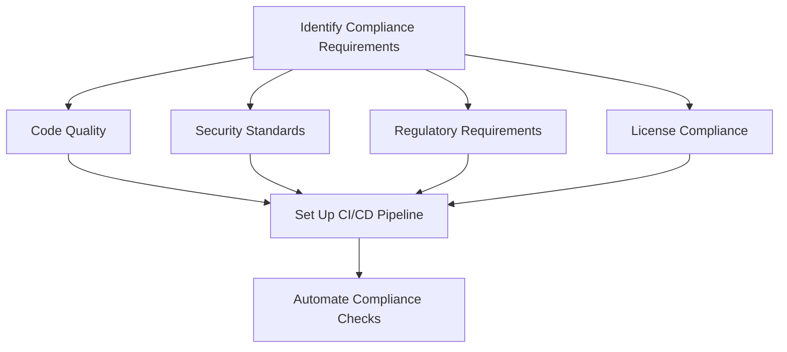

# CICD Compliance Automation

## Introduction

When building software applications, ensuring that your code meets quality, security, and regulatory standards is just as important as making sure it works. However, manually checking for compliance issues can be time-consuming and prone to human error. This is where **CI/CD Compliance Automation** comes in.

Compliance automation integrates regulatory and security checks directly into your Continuous Integration and Continuous Deployment (CI/CD) pipeline. It allows you to automatically validate that your code meets all necessary standards before it's deployed to production.

## What is Compliance in Software Development?

Before diving into automation, let's understand what compliance means in software development:

- **Code Quality Standards**: Following best practices in coding styles, patterns, and documentation
- **Security Requirements**: Ensuring code is free from vulnerabilities and follows security protocols
- **Regulatory Compliance**: Meeting industry-specific regulations (like HIPAA for healthcare or PCI DSS for payment processing)
- **License Compliance**: Tracking and managing open source dependencies and their licenses

## Benefits of Automating Compliance Checks

Automating compliance within your CI/CD pipeline offers several advantages:

1. **Consistency**: Every code change undergoes the same checks, eliminating human oversight
2. **Early Detection**: Issues are identified early in the development cycle when they're easier to fix
3. **Documentation**: Automated checks create an audit trail that can be used to demonstrate compliance
4. **Developer Productivity**: Reduces the manual effort needed for compliance checking
5. **Faster Releases**: Compliance validation becomes part of the pipeline, not a separate phase

## Setting Up Compliance Automation in Your CI/CD Pipeline

Let's walk through how to implement compliance automation in your CI/CD pipeline with practical examples.

### Step 1: Identify Your Compliance Requirements

Start by documenting the compliance standards your project needs to meet:



### Step 2: Select Appropriate Tools

Choose tools that can automate your compliance checks. Here are some popular options:

#### Code Quality

- **SonarQube**: Analyzes code quality and security
- **ESLint/Pylint**: Enforce coding standards
- **Prettier/Black**: Ensure consistent code formatting

#### Security

- **OWASP Dependency-Check**: Identifies known vulnerabilities in dependencies
- **Snyk**: Scans for security issues
- **Trivy**: Container image vulnerability scanner

#### Regulatory Compliance

- **Checkov**: Infrastructure as Code (IaC) security scanner
- **Terrascan**: IaC compliance scanner
- **Compliance-Checker**: Custom scripts for regulation-specific checks

#### License Compliance

- **FOSSA**: License compliance automation
- **WhiteSource**: Open source license management
- **Black Duck**: Software composition analysis

### Step 3: Integrate Tools into CI/CD Pipeline

Here's an example of integrating SonarQube into a GitHub Actions workflow:

```yaml
name: CI Compliance Checks

on:
  push:
    branches: [ main ]
  pull_request:
    branches: [ main ]

jobs:
  sonarqube:
    name: SonarQube Scan
    runs-on: ubuntu-latest
    steps:
      - uses: actions/checkout@v3
        with:
          fetch-depth: 0
      
      - name: SonarQube Scan
        uses: SonarSource/sonarqube-scan-action@master
        env:
          SONAR_TOKEN: ${{ secrets.SONAR_TOKEN }}
          SONAR_HOST_URL: ${{ secrets.SONAR_HOST_URL }}
          
  dependency-check:
    name: Dependency Security Check
    runs-on: ubuntu-latest
    steps:
      - uses: actions/checkout@v3
      
      - name: OWASP Dependency Check
        uses: dependency-check/Dependency-Check_Action@main
        with:
          project: 'My Project'
          path: '.'
          format: 'HTML'
          out: 'reports'
          
      - name: Upload Report
        uses: actions/upload-artifact@v3
        with:
          name: dependency-check-report
          path: reports/dependency-check-report.html
```

### Step 4: Define Compliance Policies

Create policies that define what constitutes a compliance failure. For example:

```javascript
// sonar-project.properties
sonar.projectKey=my-project
sonar.projectName=My Project

# Compliance thresholds
sonar.qualitygate.wait=true
sonar.coverage.exclusions=**/test/**/*
sonar.test.exclusions=**/test/**/*

# Quality Gates
sonar.qualitygate.condition.1.metric=new_reliability_rating
sonar.qualitygate.condition.1.op=GT
sonar.qualitygate.condition.1.value=1
sonar.qualitygate.condition.1.error=true

sonar.qualitygate.condition.2.metric=new_security_rating
sonar.qualitygate.condition.2.op=GT
sonar.qualitygate.condition.2.value=1
sonar.qualitygate.condition.2.error=true

sonar.qualitygate.condition.3.metric=new_maintainability_rating
sonar.qualitygate.condition.3.op=GT
sonar.qualitygate.condition.3.value=1
sonar.qualitygate.condition.3.error=true
```

### Step 5: Create Compliance Reports

Configure your tools to generate readable reports that document compliance status:

```yaml
# .github/workflows/compliance-report.yml
name: Weekly Compliance Report

on:
  schedule:
    - cron: '0 0 * * 1'  # Every Monday at midnight

jobs:
  generate-compliance-report:
    runs-on: ubuntu-latest
    steps:
      - uses: actions/checkout@v3
      
      - name: Run All Compliance Checks
        run: ./scripts/run-compliance-checks.sh
        
      - name: Generate Compliance Report
        run: ./scripts/generate-report.sh
        
      - name: Email Report
        uses: dawidd6/action-send-mail@v3
        with:
          server_address: ${{secrets.MAIL_SERVER}}
          server_port: ${{secrets.MAIL_PORT}}
          username: ${{secrets.MAIL_USERNAME}}
          password: ${{secrets.MAIL_PASSWORD}}
          subject: Weekly Compliance Report
          body: Please see the attached compliance report.
          to: compliance-team@example.com
          from: CI System
          attachments: ./reports/compliance-report.pdf
```

## Real-World Example: Implementing PCI DSS Compliance in a Payment Processing Application

Let's look at how CI/CD compliance automation might be implemented for a payment processing application that needs to comply with the Payment Card Industry Data Security Standard (PCI DSS).

### 1. Define PCI DSS Requirements in Code

```javascript
// pci-compliance-config.js
module.exports = {
  requirements: {
    'req-1.2.1': {
      description: 'Restrict inbound and outbound traffic to only necessary communications',
      automationMethod: 'terraform-check',
      checkScript: './checks/check-network-rules.js',
    },
    'req-6.5.1': {
      description: 'Address common coding vulnerabilities in software-development processes',
      automationMethod: 'static-analysis',
      tools: ['sonarqube', 'snyk'],
    },
    'req-6.6': {
      description: 'For public-facing web applications, address new threats and vulnerabilities on an ongoing basis',
      automationMethod: 'dynamic-analysis',
      tools: ['owasp-zap'],
    },
    // More requirements...
  }
};
```

### 2. Create a Compliance Testing Pipeline

```yaml
# .github/workflows/pci-compliance.yml
name: PCI DSS Compliance

on:
  push:
    branches: [ main, develop ]
  pull_request:
    branches: [ main ]

jobs:
  req-1-2-1:
    name: Network Configuration Check
    runs-on: ubuntu-latest
    steps:
      - uses: actions/checkout@v3
      - name: Run Network Rules Check
        run: node ./checks/check-network-rules.js
        
  req-6-5-1:
    name: Code Vulnerability Check
    runs-on: ubuntu-latest
    steps:
      - uses: actions/checkout@v3
      - name: SonarQube Scan
        uses: SonarSource/sonarqube-scan-action@master
        env:
          SONAR_TOKEN: ${{ secrets.SONAR_TOKEN }}
          SONAR_HOST_URL: ${{ secrets.SONAR_HOST_URL }}
      - name: Snyk Security Scan
        uses: snyk/actions/node@master
        env:
          SNYK_TOKEN: ${{ secrets.SNYK_TOKEN }}
          
  req-6-6:
    name: Dynamic Web Application Scanning
    runs-on: ubuntu-latest
    steps:
      - uses: actions/checkout@v3
      - name: Start Application
        run: npm start & sleep 10
      - name: OWASP ZAP Scan
        uses: zaproxy/action-baseline@v0.9.0
        with:
          target: 'http://localhost:3000'
```

### 3. Implement a Compliance Dashboard

Create a dashboard using tools like Grafana or a custom app to visualize compliance status:

```javascript
// Simple Express.js compliance dashboard (server.js)
const express = require('express');
const fs = require('fs');
const app = express();
const port = 3000;

app.get('/api/compliance-status', (req, res) => {
  // In a real app, this would query your CI system or a database
  const complianceData = JSON.parse(fs.readFileSync('./data/compliance-status.json'));
  res.json(complianceData);
});

app.use(express.static('public'));
app.listen(port, () => {
  console.log(`Compliance dashboard running at http://localhost:${port}`);
});
```

## Handling Compliance Failures

When a compliance check fails, you need a clear process for handling the failure:

1. **Block Deployment**: Configure your CI/CD pipeline to prevent deployment of non-compliant code
2. **Notify Developers**: Automatically notify the relevant team members
3. **Provide Context**: Give detailed information about what failed and why
4. **Suggest Fixes**: Where possible, provide guidance on how to resolve the issue

Here's an example of a Slack notification for a compliance failure:

```javascript
// scripts/notify-compliance-failure.js
const { WebClient } = require('@slack/web-api');
const slack = new WebClient(process.env.SLACK_TOKEN);

async function notifyComplianceFailure(check, details) {
  await slack.chat.postMessage({
    channel: 'dev-team',
    text: `:warning: Compliance Check Failed: ${check}`,
    blocks: [
      {
        type: 'section',
        text: {
          type: 'mrkdwn',
          text: `:warning: *Compliance Check Failed: ${check}*`
        }
      },
      {
        type: 'section',
        text: {
          type: 'mrkdwn',
          text: `*Details:* ${details.message}
*Failed in:* ${details.location}
*Suggested Fix:* ${details.suggestion}`
        }
      },
      {
        type: 'section',
        text: {
          type: 'mrkdwn',
          text: `<${details.buildUrl}|View Build Log>`
        }
      }
    ]
  });
}

// Example usage
notifyComplianceFailure(
  'PCI-DSS Req 6.5.1', 
  {
    message: 'SQL Injection vulnerability detected',
    location: 'src/controllers/payment.js:42',
    suggestion: 'Use parameterized queries instead of string concatenation',
    buildUrl: 'https://ci.example.com/builds/1234'
  }
);
```

## Compliance as Code

"Compliance as Code" is a modern approach that treats compliance requirements as code, just like your application code. This allows you to:

1. **Version Control**: Track changes to compliance requirements over time
2. **Automated Testing**: Test compliance rules just like you test your application
3. **Reusability**: Reuse compliance checks across multiple projects
4. **Self-Documentation**: Make compliance rules explicit and self-documenting

Here's an example of implementing compliance as code for security headers:

```javascript
// compliance/rules/security-headers.js
module.exports = {
  name: 'HTTP Security Headers',
  description: 'Ensures all HTTP responses include required security headers',
  check: async (url) => {
    const response = await fetch(url);
    const headers = response.headers;
    
    const results = {
      'Content-Security-Policy': headers.has('Content-Security-Policy'),
      'X-Content-Type-Options': headers.get('X-Content-Type-Options') === 'nosniff',
      'X-Frame-Options': headers.has('X-Frame-Options'),
      'Strict-Transport-Security': headers.has('Strict-Transport-Security')
    };
    
    const passed = Object.values(results).every(result => result === true);
    
    return {
      passed,
      results,
      remediation: passed ? null : 'Add missing security headers in your application middleware'
    };
  }
};
```

## Advanced Compliance Automation Techniques

As you get more comfortable with basic compliance automation, consider these advanced techniques:

### 1. Policy as Code with Open Policy Agent (OPA)

OPA allows you to define compliance policies as code and evaluate them against your resources:

```rego
# policy.rego
package compliance

# Deny deployments with containers that don't have resource limits
deny[msg] {
  input.kind == "Deployment"
  container := input.spec.template.spec.containers[_]
  not container.resources.limits.memory
  
  msg := sprintf("Container '%s' is missing memory limits", [container.name])
}

deny[msg] {
  input.kind == "Deployment"
  container := input.spec.template.spec.containers[_]
  not container.resources.limits.cpu
  
  msg := sprintf("Container '%s' is missing CPU limits", [container.name])
}
```

### 2. Continuous Compliance Monitoring

Don't just check compliance during CI/CD — continuously monitor your deployed applications:

```yaml
# .github/workflows/compliance-monitoring.yml
name: Continuous Compliance Monitoring

on:
  schedule:
    - cron: '0 */6 * * *'  # Every 6 hours

jobs:
  security-scan:
    runs-on: ubuntu-latest
    steps:
      - name: Scan Production Environment
        uses: aquasecurity/trivy-action@master
        with:
          scan-type: 'image'
          image-ref: 'myapp:production'
          format: 'sarif'
          output: 'trivy-results.sarif'
          
      - name: Upload Scan Results
        uses: github/codeql-action/upload-sarif@v2
        with:
          sarif_file: 'trivy-results.sarif'
```

### 3. Automated Remediation

For certain compliance issues, you can implement automated fixes:

```javascript
// scripts/auto-remediate.js
const fs = require('fs');
const path = require('path');

// Example: Automatically fix package.json to use exact versions
function fixPackageJsonVersions() {
  const packageJsonPath = path.join(process.cwd(), 'package.json');
  const packageJson = JSON.parse(fs.readFileSync(packageJsonPath, 'utf8'));
  
  Object.keys(packageJson.dependencies || {}).forEach(dep => {
    const version = packageJson.dependencies[dep];
    if (version.startsWith('^') || version.startsWith('~')) {
      packageJson.dependencies[dep] = version.substring(1);
    }
  });
  
  fs.writeFileSync(packageJsonPath, JSON.stringify(packageJson, null, 2));
  console.log('Automatically fixed package.json dependency versions to use exact versions');
}

fixPackageJsonVersions();
```

## Summary

CI/CD Compliance Automation is a powerful approach that integrates compliance checks directly into your development workflow. By automating these checks, you can:

1. Detect compliance issues early in the development cycle
2. Maintain consistent standards across your codebase
3. Create an audit trail for regulatory requirements
4. Increase developer productivity by reducing manual checks
5. Accelerate software delivery without sacrificing compliance

Remember that compliance automation is an ongoing process. As regulations change and new security threats emerge, your compliance automation needs to evolve as well.

## Exercises

1. **Basic Implementation**: Set up a simple CI/CD pipeline with linting and security scanning for one of your projects.
2. **Policy Creation**: Write three compliance policies for your team's most important quality or security standards.
3. **Reporting Dashboard**: Create a simple dashboard to display compliance status across your repositories.
4. **Advanced Challenge**: Implement a "Compliance as Code" solution for a specific regulation relevant to your industry.

## Additional Resources

- **DevSecOps Guides**: Learn more about integrating security into your development process
- **Cloud Provider Compliance Tools**: Explore AWS Config, Azure Policy, or Google Cloud Security Command Center
- **Open Source Compliance Tools**: SonarQube, Checkov, OWASP Dependency-Check, and Trivy
- **Compliance Frameworks**: NIST Cybersecurity Framework, ISO 27001, and CIS Benchmarks