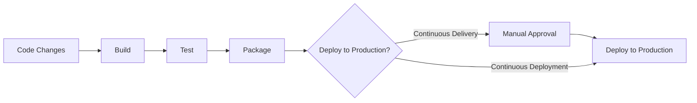
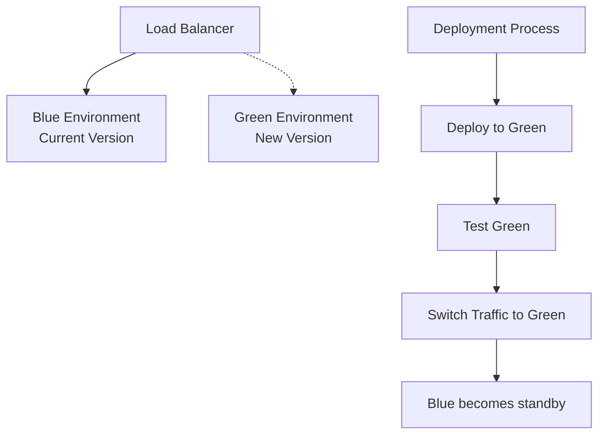
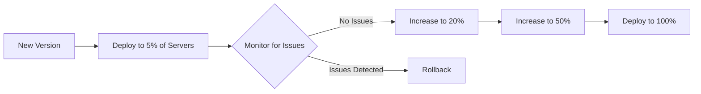

# CI/CD Deployment Automation

## Introduction

Deployment automation is a critical component of the CI/CD (Continuous Integration/Continuous Delivery) process that enables development teams to deliver applications more efficiently and reliably. In traditional software development, deploying applications was often a manual, error-prone process that required significant coordination and could lead to downtime. CI/CD deployment automation changes this by making deployments consistent, repeatable, and much less risky.

In this guide, you'll learn how deployment automation fits into the CI/CD pipeline, the tools and techniques you can use to implement it, and best practices to ensure your automated deployments are reliable and efficient.

## What is Deployment Automation?

Deployment automation is the process of using scripts, tools, and workflows to automatically deploy applications to various environments (development, staging, production) without manual intervention. It's the "CD" part of CI/CD, representing both Continuous Delivery and Continuous Deployment.

### Continuous Delivery vs. Continuous Deployment

Before diving deeper, let's clarify two terms that are often confused:

- **Continuous Delivery**: Automatically preparing code for release to production, but requiring manual approval for the actual deployment.
- **Continuous Deployment**: Automatically deploying every change that passes all stages of the production pipeline, without explicit approval.



## Key Components of Deployment Automation

### 1. Environment Configuration

Automated deployments require well-defined environments with consistent configuration. This includes:

- Infrastructure definitions (servers, networking, storage)
- Application dependencies
- Environment variables
- Security configurations

### 2. Artifact Management

Artifacts are the packages or containers that hold your application code. Key aspects include:

- Building consistent artifacts (JARs, WARs, Docker images, etc.)
- Versioning artifacts properly
- Storing artifacts in repositories (Docker Registry, Artifactory, etc.)

### 3. Deployment Scripts and Tools

These are the actual mechanisms that move your application from a repository to a running state:

- Deployment scripts (Bash, PowerShell, Python)
- Configuration management tools (Ansible, Chef, Puppet)
- Container orchestration platforms (Kubernetes, Docker Swarm)
- Cloud provider deployment services (AWS CodeDeploy, Azure DevOps)

### 4. Release Strategies

Different strategies for minimizing risk and downtime during deployments:

- Blue/Green deployments
- Canary releases
- Feature flags
- Rolling updates

## Setting Up Your First Automated Deployment Pipeline

Let's create a simple deployment pipeline for a Node.js application using GitHub Actions and deploying to a cloud provider.

### Step 1: Create a Workflow File

In your repository, create a file at `.github/workflows/deploy.yml`:

```yaml
name: Deploy Application

on:
  push:
    branches: [ main ]

jobs:
  deploy:
    runs-on: ubuntu-latest
    
    steps:
    - uses: actions/checkout@v2
    
    - name: Setup Node.js
      uses: actions/setup-node@v2
      with:
        node-version: '16'
        
    - name: Install dependencies
      run: npm ci
      
    - name: Run tests
      run: npm test
      
    - name: Build application
      run: npm run build
      
    - name: Deploy to production
      uses: some-deployment-action@v1
      with:
        api-key: ${{ secrets.DEPLOY_API_KEY }}
        app-name: 'my-awesome-app'
        artifact-path: './build'
```

This workflow will:
1. Trigger when code is pushed to the main branch
2. Set up Node.js
3. Install dependencies
4. Run tests
5. Build the application
6. Deploy to your chosen platform

### Step 2: Set Up Environment Secrets

In your GitHub repository:
1. Go to Settings > Secrets
2. Add a new secret called `DEPLOY_API_KEY` with your deployment platform's API key

### Step 3: Enable the Workflow

Commit this file to your repository, and GitHub Actions will automatically run the workflow when you push to main.

## Common Deployment Strategies

### Blue/Green Deployment

Blue/Green deployment involves maintaining two identical production environments, only one of which is live at any time.



**Implementation Example:**

```yaml
# AWS CLI commands for blue/green deployment
# 1. Create new deployment
aws deploy create-deployment \
  --application-name my-application \
  --deployment-group-name my-deployment-group \
  --revision "{\"revisionType\":\"S3\",\"s3Location\":{\"bucket\":\"my-bucket\",\"key\":\"my-app.zip\",\"bundleType\":\"zip\"}}" \
  --deployment-config-name CodeDeployDefault.AllAtOnce

# 2. Wait for deployment completion
aws deploy wait deployment-successful --deployment-id $DEPLOYMENT_ID

# 3. Switch traffic (in AWS CodeDeploy, this happens automatically based on config)
```

### Canary Releases

Canary releases involve gradually rolling out changes to a small subset of users before making them available to everyone.



**Implementation Example with Kubernetes:**

```yaml
apiVersion: networking.istio.io/v1alpha3
kind: VirtualService
metadata:
  name: my-service
spec:
  hosts:
  - my-service
  http:
  - route:
    - destination:
        host: my-service
        subset: v1
      weight: 80
    - destination:
        host: my-service
        subset: v2
      weight: 20
```

### Feature Flags

Feature flags allow you to toggle features on or off without deploying new code.

**Implementation Example:**

```javascript
// Using a feature flag service like LaunchDarkly
import { LDClient } from 'launchdarkly-node-server-sdk';

const client = LDClient.initialize('sdk-key');

async function checkFeatureFlag(user) {
  // Wait for the client to connect
  await client.waitForInitialization();
  
  // Check if the feature flag is enabled for this user
  const showNewFeature = await client.variation('new-feature', user, false);
  
  if (showNewFeature) {
    // Show the new feature
    return renderNewFeature();
  } else {
    // Show the old feature
    return renderOldFeature();
  }
}
```

## Monitoring and Rollbacks

Automated deployments must include monitoring and the ability to quickly roll back when issues are detected.

### Monitoring

Monitor key metrics after deployment:

```javascript
// Example Node.js monitoring with Prometheus
const client = require('prom-client');
const counter = new client.Counter({
  name: 'http_requests_total',
  help: 'Total HTTP requests',
  labelNames: ['method', 'route', 'status_code']
});

app.use((req, res, next) => {
  const end = res.end;
  res.end = function() {
    counter.inc({
      method: req.method,
      route: req.route?.path || 'unknown',
      status_code: res.statusCode
    });
    return end.apply(this, arguments);
  };
  next();
});
```

### Automated Rollbacks

Add rollback logic to your deployment scripts:

```bash
#!/bin/bash
# Simple rollback script

deploy_version() {
  echo "Deploying version $1"
  # Deployment commands here
  
  # Check if deployment was successful
  if [ $? -ne 0 ]; then
    echo "Deployment failed, rolling back"
    rollback_to_previous_version
    exit 1
  fi
  
  # Monitor the application for 5 minutes
  echo "Monitoring deployment..."
  for i in {1..30}; do
    sleep 10
    health_check
    if [ $? -ne 0 ]; then
      echo "Health check failed, rolling back"
      rollback_to_previous_version
      exit 1
    fi
  done
  
  echo "Deployment successful!"
}

health_check() {
  curl -f http://myapp.example.com/health
  return $?
}

rollback_to_previous_version() {
  echo "Rolling back to previous version"
  # Rollback commands here
}

# Main execution
deploy_version "1.2.3"
```

## Best Practices for Deployment Automation

1. **Infrastructure as Code (IaC)**: Define your infrastructure using code (Terraform, CloudFormation).

   ```hcl
   # Example Terraform configuration
   resource "aws_instance" "web" {
     ami           = "ami-0c55b159cbfafe1f0"
     instance_type = "t2.micro"
     
     tags = {
       Name = "WebServer"
       Environment = "Production"
     }
   }
   ```

2. **Idempotent Deployments**: Ensure running the same deployment multiple times has the same result.

3. **Environment Parity**: Keep development, staging, and production environments as similar as possible.

4. **Containerization**: Use Docker to ensure consistent environments.

   ```dockerfile
   FROM node:16-alpine
   WORKDIR /app
   COPY package*.json ./
   RUN npm ci
   COPY . .
   RUN npm run build
   EXPOSE 3000
   CMD ["npm", "start"]
   ```

5. **Automated Testing**: Include automated tests before deployment.

6. **Secrets Management**: Never hardcode secrets; use a secure vault.

   ```yaml
   # Using environment variables from GitHub Secrets
   env:
     DATABASE_URL: ${{ secrets.DATABASE_URL }}
     API_KEY: ${{ secrets.API_KEY }}
   ```

7. **Progressive Deployment**: Use strategies like blue/green or canary.

8. **Observability**: Include logging, monitoring, and alerting.

## Common Tools for Deployment Automation

### CI/CD Platforms
- Jenkins
- GitHub Actions
- GitLab CI/CD
- CircleCI
- Travis CI

### Deployment Tools
- Ansible
- Terraform
- Kubernetes
- AWS CloudFormation
- Spinnaker

### Container Services
- Docker
- Amazon ECS
- Google Kubernetes Engine (GKE)
- Azure Kubernetes Service (AKS)

### Monitoring & Observability
- Prometheus
- Grafana
- Datadog
- New Relic

## Real-world Example: Full CI/CD Pipeline for a Web Application

Let's put it all together with a more comprehensive example that combines various tools and best practices:

```mermaid
graph LR
    A[Developer Push] --> B[GitHub Repository]
    B --> C[GitHub Actions CI]
    C --> D[Run Tests]
    D --> E[Build Docker Image]
    E --> F[Push to Container Registry]
    F --> G[Deploy to Staging]
    G --> H[Automated Tests in Staging]
    H --> I[Manual Approval]
    I --> J[Blue/Green Deployment to Production]
    J --> K[Health Checks]
    K --> L[Switch Traffic]
    L --> M[Monitor for Issues]
```



**Implementation Steps:**

1. **Set up GitHub Actions workflow:**

```yaml
name: CI/CD Pipeline

on:
  push:
    branches: [ main ]
  pull_request:
    branches: [ main ]

jobs:
  build-and-test:
    runs-on: ubuntu-latest
    
    steps:
    - uses: actions/checkout@v2
    
    - name: Setup Node.js
      uses: actions/setup-node@v2
      with:
        node-version: '16'
        
    - name: Install dependencies
      run: npm ci
      
    - name: Lint code
      run: npm run lint
      
    - name: Run unit tests
      run: npm test
      
    - name: Build application
      run: npm run build
    
    - name: Build Docker image
      run: |
        docker build -t myapp:${{ github.sha }} .
        docker tag myapp:${{ github.sha }} myregistry.example.com/myapp:${{ github.sha }}
        
    - name: Push Docker image
      run: |
        echo ${{ secrets.REGISTRY_PASSWORD }} | docker login myregistry.example.com -u ${{ secrets.REGISTRY_USERNAME }} --password-stdin
        docker push myregistry.example.com/myapp:${{ github.sha }}
  
  deploy-to-staging:
    needs: build-and-test
    runs-on: ubuntu-latest
    if: github.event_name == 'push' && github.ref == 'refs/heads/main'
    
    steps:
    - name: Deploy to staging
      uses: some-kubernetes-deploy-action@v1
      with:
        kubeconfig: ${{ secrets.KUBE_CONFIG_STAGING }}
        image: myregistry.example.com/myapp:${{ github.sha }}
        namespace: staging
        deployment: myapp-deployment
        
    - name: Run integration tests
      run: |
        sleep 30  # Wait for deployment to stabilize
        npm run test:integration -- --baseUrl=https://staging.myapp.example.com
  
  deploy-to-production:
    needs: deploy-to-staging
    runs-on: ubuntu-latest
    if: github.event_name == 'push' && github.ref == 'refs/heads/main'
    
    environment:
      name: production
      url: https://myapp.example.com
    
    steps:
    - name: Deploy to production (blue/green)
      uses: some-kubernetes-deploy-action@v1
      with:
        kubeconfig: ${{ secrets.KUBE_CONFIG_PRODUCTION }}
        image: myregistry.example.com/myapp:${{ github.sha }}
        namespace: production
        deployment: myapp-green  # Deploy to the "green" environment
        
    - name: Health check
      run: |
        for i in {1..12}; do
          status=$(curl -s -o /dev/null -w "%{http_code}" https://green.myapp.example.com/health)
          if [ $status -eq 200 ]; then
            echo "Health check passed"
            exit 0
          fi
          echo "Health check failed, retrying in 10 seconds..."
          sleep 10
        done
        echo "Health check failed after 2 minutes, aborting"
        exit 1
        
    - name: Switch traffic
      run: |
        kubectl --kubeconfig <(echo ${{ secrets.KUBE_CONFIG_PRODUCTION }}) patch service myapp-service -n production -p '{"spec":{"selector":{"deployment":"myapp-green"}}}'
        
    - name: Monitor for issues
      run: |
        for i in {1..30}; do
          error_rate=$(curl -s https://metrics.myapp.example.com/api/error-rate)
          if (( $(echo "$error_rate > 0.01" | bc -l) )); then
            echo "Error rate too high: $error_rate, rolling back"
            kubectl --kubeconfig <(echo ${{ secrets.KUBE_CONFIG_PRODUCTION }}) patch service myapp-service -n production -p '{"spec":{"selector":{"deployment":"myapp-blue"}}}'
            exit 1
          fi
          sleep 10
        done
```

2. **Kubernetes deployment configuration:**

```yaml
# deployment.yaml
apiVersion: apps/v1
kind: Deployment
metadata:
  name: myapp-green
  namespace: production
spec:
  replicas: 3
  selector:
    matchLabels:
      app: myapp
      deployment: myapp-green
  template:
    metadata:
      labels:
        app: myapp
        deployment: myapp-green
    spec:
      containers:
      - name: myapp
        image: myregistry.example.com/myapp:latest
        ports:
        - containerPort: 3000
        readinessProbe:
          httpGet:
            path: /health
            port: 3000
          initialDelaySeconds: 5
          periodSeconds: 10
        livenessProbe:
          httpGet:
            path: /health
            port: 3000
          initialDelaySeconds: 15
          periodSeconds: 20
        resources:
          limits:
            cpu: "500m"
            memory: "512Mi"
          requests:
            cpu: "100m"
            memory: "256Mi"
        env:
        - name: NODE_ENV
          value: "production"
        - name: DATABASE_URL
          valueFrom:
            secretKeyRef:
              name: myapp-secrets
              key: database-url
```

3. **Service configuration for traffic routing:**

```yaml
# service.yaml
apiVersion: v1
kind: Service
metadata:
  name: myapp-service
  namespace: production
spec:
  selector:
    app: myapp
    deployment: myapp-blue  # Currently pointing to blue
  ports:
  - port: 80
    targetPort: 3000
  type: LoadBalancer
```

## Summary

CI/CD deployment automation is a critical part of modern software development that enables teams to deliver applications more efficiently, consistently, and with lower risk. By implementing automated deployments, you can:

- Reduce manual errors and inconsistencies
- Deploy faster and more frequently
- Roll back quickly when issues arise
- Gain confidence in your release process
- Focus more on developing features rather than troubleshooting deployments

As you implement CI/CD deployment automation, remember that it's a journey. Start small with simple scripts, then gradually build up to more sophisticated pipelines with strategies like blue/green deployments and canary releases.

## Exercises

1. **Basic Deployment Script**: Create a simple bash script that deploys a web application to a server using SSH.

2. **GitHub Actions Workflow**: Set up a GitHub Actions workflow that builds and tests a Node.js application when pull requests are created.

3. **Docker Containerization**: Create a Dockerfile for a simple web application and test it locally.

4. **Blue/Green Deployment**: Implement a basic blue/green deployment strategy for a simple API service.

5. **Deployment Monitoring**: Add monitoring to your deployment process that checks application health and alerts on issues.

## Additional Resources

- [The Practical Guide to Continuous Delivery](https://continuousdelivery.com/)
- [Kubernetes Documentation](https://kubernetes.io/docs/home/)
- [GitHub Actions Documentation](https://docs.github.com/en/actions)
- [Terraform Getting Started](https://learn.hashicorp.com/terraform)
- [Ansible User Guide](https://docs.ansible.com/ansible/latest/user_guide/index.html)