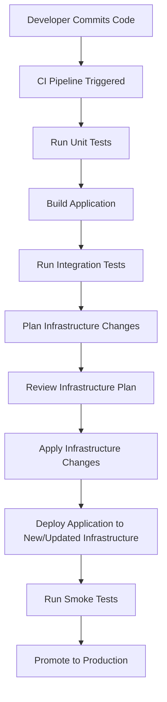

# CICD Infrastructure Automation

## Introduction

Infrastructure automation is a critical component of modern CI/CD (Continuous Integration/Continuous Deployment) pipelines. While traditional CI/CD focuses on automating code testing and deployment, infrastructure automation extends these benefits to the underlying computing resources that run your applications.

In this guide, we'll explore how to automate infrastructure provisioning, configuration, and management as part of your CI/CD workflow. This approach, often called "Infrastructure as Code" (IaC), allows you to treat your infrastructure with the same practices you apply to application code.

## What is Infrastructure Automation?

Infrastructure automation refers to the practice of using scripts or declarative definitions to set up, configure, and manage computing resources automatically. When combined with CI/CD, it enables:

- **Consistent environments**: Eliminate "it works on my machine" problems
- **Rapid provisioning**: Create new environments in minutes instead of days
- **Version control**: Track changes to infrastructure just like application code
- **Self-documenting systems**: Your code becomes the documentation
- **Disaster recovery**: Quickly rebuild infrastructure if necessary

## Infrastructure as Code Tools

Let's examine the most popular tools for infrastructure automation:

### Terraform

Terraform by HashiCorp is a declarative IaC tool that supports multiple cloud providers.

```hcl
# Example Terraform configuration for AWS
provider "aws" {
  region = "us-west-2"
}

resource "aws_instance" "web_server" {
  ami           = "ami-0c55b159cbfafe1f0"
  instance_type = "t2.micro"
  
  tags = {
    Name = "WebServer"
    Environment = "Development"
  }
}
```

### Ansible

Ansible is a configuration management tool that uses YAML to define infrastructure state.

```yaml
# Example Ansible playbook to install Nginx
- name: Install and configure Nginx
  hosts: web_servers
  become: yes
  
  tasks:
    - name: Install Nginx package
      apt:
        name: nginx
        state: present
        
    - name: Start Nginx service
      service:
        name: nginx
        state: started
        enabled: yes
```

### AWS CloudFormation/Azure Resource Manager

Cloud-specific IaC tools for managing resources in their respective platforms.

```json
// Example AWS CloudFormation template
{
  "AWSTemplateFormatVersion": "2010-09-09",
  "Resources": {
    "S3Bucket": {
      "Type": "AWS::S3::Bucket",
      "Properties": {
        "BucketName": "my-application-logs",
        "AccessControl": "Private"
      }
    }
  }
}
```

## Integrating Infrastructure Automation in CI/CD Pipelines

Now, let's explore how to incorporate infrastructure automation into your CI/CD workflow:

### CI/CD Infrastructure Automation Workflow



### Example: GitLab CI Pipeline for Terraform

Here's a practical example of a GitLab CI pipeline that incorporates Terraform for infrastructure automation:

```yaml
stages:
  - validate
  - plan
  - apply
  - deploy

variables:
  TF_ROOT: ${CI_PROJECT_DIR}/terraform
  TF_STATE_NAME: ${CI_PROJECT_NAME}-${CI_ENVIRONMENT_NAME}

validate:
  stage: validate
  script:
    - cd ${TF_ROOT}
    - terraform init
    - terraform validate

plan:
  stage: plan
  script:
    - cd ${TF_ROOT}
    - terraform init
    - terraform plan -out=tfplan
  artifacts:
    paths:
      - ${TF_ROOT}/tfplan

apply:
  stage: apply
  script:
    - cd ${TF_ROOT}
    - terraform init
    - terraform apply -auto-approve tfplan
  dependencies:
    - plan
  when: manual
  environment:
    name: staging

deploy_app:
  stage: deploy
  script:
    - echo "Deploying application to infrastructure..."
    - ./deploy_script.sh
  dependencies:
    - apply
```

## Running Terraform in GitHub Actions

GitHub Actions is another popular CI/CD platform. Here's how you can automate infrastructure using Terraform within a GitHub workflow:

```yaml
name: 'Terraform CI/CD'

on:
  push:
    branches: [ main ]
  pull_request:
    branches: [ main ]

jobs:
  terraform:
    name: 'Terraform'
    runs-on: ubuntu-latest
    
    steps:
    - name: Checkout
      uses: actions/checkout@v2
    
    - name: Setup Terraform
      uses: hashicorp/setup-terraform@v1
      
    - name: Terraform Init
      run: terraform init
      
    - name: Terraform Format
      run: terraform fmt -check
      
    - name: Terraform Plan
      run: terraform plan -out=tfplan
      
    - name: Terraform Apply
      if: github.event_name == 'push'
      run: terraform apply -auto-approve tfplan
```

## Infrastructure Testing

An important aspect of infrastructure automation is testing. Here are some approaches:

### Example: Testing Terraform with Terratest

Terratest is a Go library that makes it easier to test Terraform code:

```go
package test

import (
  "testing"
  "github.com/gruntwork-io/terratest/modules/terraform"
  "github.com/stretchr/testify/assert"
)

func TestTerraformAwsExample(t *testing.T) {
  terraformOptions := &terraform.Options{
    TerraformDir: "../examples/aws",
    VarFiles:     []string{"varfile.tfvars"},
  }

  defer terraform.Destroy(t, terraformOptions)
  terraform.InitAndApply(t, terraformOptions)

  output := terraform.Output(t, terraformOptions, "instance_ip")
  assert.NotEmpty(t, output)
}
```

## Best Practices for Infrastructure Automation

1. **Immutable Infrastructure**: Rather than modifying existing resources, replace them with new ones.

2. **Environment Parity**: Use the same infrastructure code across development, staging, and production, with only configuration differences:

```hcl
# Parameterize environments
variable "environment" {
  description = "Environment (dev, staging, prod)"
  type        = string
}

resource "aws_instance" "app_server" {
  ami           = "ami-0c55b159cbfafe1f0"
  instance_type = var.environment == "prod" ? "t2.medium" : "t2.micro"
  
  tags = {
    Environment = var.environment
  }
}
```

3. **State Management**: Store infrastructure state securely and enable collaboration:

```hcl
# Remote state configuration
terraform {
  backend "s3" {
    bucket = "company-terraform-states"
    key    = "myapp/terraform.tfstate"
    region = "us-west-2"
    encrypt = true
  }
}
```

4. **Modularization**: Break infrastructure into reusable modules:

```hcl
module "web_app" {
  source = "./modules/web-app"
  
  app_name = "my-application"
  environment = "staging"
  instance_count = 2
}
```

## Practical Example: Complete CI/CD Infrastructure Pipeline

Let's put it all together with a complete example of a CI/CD pipeline that includes infrastructure automation for a web application:

### Directory Structure

```
project/
├── .github/
│   └── workflows/
│       └── main.yml
├── terraform/
│   ├── main.tf
│   ├── variables.tf
│   └── outputs.tf
├── src/
│   └── [application code]
└── tests/
    └── [test code]
```

### GitHub Workflow (main.yml)

```yaml
name: 'Application CI/CD with Infrastructure'

on:
  push:
    branches: [ main ]
  pull_request:
    branches: [ main ]

jobs:
  test:
    name: 'Test Application'
    runs-on: ubuntu-latest
    steps:
    - uses: actions/checkout@v2
    - name: Set up Node.js
      uses: actions/setup-node@v2
      with:
        node-version: '14'
    - name: Install dependencies
      run: npm ci
    - name: Run tests
      run: npm test
  
  infrastructure:
    name: 'Deploy Infrastructure'
    needs: test
    if: github.event_name == 'push' && github.ref == 'refs/heads/main'
    runs-on: ubuntu-latest
    steps:
    - uses: actions/checkout@v2
    - name: Setup Terraform
      uses: hashicorp/setup-terraform@v1
    - name: Configure AWS credentials
      uses: aws-actions/configure-aws-credentials@v1
      with:
        aws-access-key-id: ${{ secrets.AWS_ACCESS_KEY_ID }}
        aws-secret-access-key: ${{ secrets.AWS_SECRET_ACCESS_KEY }}
        aws-region: us-west-2
    - name: Terraform Init
      run: |
        cd terraform
        terraform init
    - name: Terraform Apply
      run: |
        cd terraform
        terraform apply -auto-approve
    - name: Save infrastructure outputs
      id: tf-outputs
      run: |
        cd terraform
        echo "::set-output name=app_url::$(terraform output -raw app_url)"

  deploy:
    name: 'Deploy Application'
    needs: infrastructure
    runs-on: ubuntu-latest
    steps:
    - uses: actions/checkout@v2
    - name: Set up Node.js
      uses: actions/setup-node@v2
      with:
        node-version: '14'
    - name: Install dependencies
      run: npm ci
    - name: Build application
      run: npm run build
    - name: Deploy to infrastructure
      env:
        APP_URL: ${{ needs.infrastructure.outputs.app_url }}
      run: |
        # Deploy application to the newly provisioned infrastructure
        ./deploy.sh ${APP_URL}
    - name: Run smoke tests
      run: |
        # Verify deployment was successful
        curl -f ${APP_URL}/health
```

### Terraform Infrastructure (main.tf)

```hcl
provider "aws" {
  region = "us-west-2"
}

resource "aws_s3_bucket" "app_bucket" {
  bucket = "my-app-${var.environment}-static"
  acl    = "public-read"
  
  website {
    index_document = "index.html"
    error_document = "error.html"
  }
}

resource "aws_cloudfront_distribution" "app_distribution" {
  origin {
    domain_name = aws_s3_bucket.app_bucket.website_endpoint
    origin_id   = "S3-${aws_s3_bucket.app_bucket.bucket}"
    
    custom_origin_config {
      http_port              = 80
      https_port             = 443
      origin_protocol_policy = "http-only"
      origin_ssl_protocols   = ["TLSv1.2"]
    }
  }
  
  enabled             = true
  is_ipv6_enabled     = true
  default_root_object = "index.html"
  
  default_cache_behavior {
    allowed_methods  = ["GET", "HEAD"]
    cached_methods   = ["GET", "HEAD"]
    target_origin_id = "S3-${aws_s3_bucket.app_bucket.bucket}"
    
    forwarded_values {
      query_string = false
      cookies {
        forward = "none"
      }
    }
    
    viewer_protocol_policy = "redirect-to-https"
    min_ttl                = 0
    default_ttl            = 3600
    max_ttl                = 86400
  }
  
  restrictions {
    geo_restriction {
      restriction_type = "none"
    }
  }
  
  viewer_certificate {
    cloudfront_default_certificate = true
  }
  
  tags = {
    Environment = var.environment
  }
}

output "app_url" {
  value = "https://${aws_cloudfront_distribution.app_distribution.domain_name}"
}
```

## Benefits and Challenges

### Benefits

- **Consistency**: Every environment is created from the same code.
- **Speed**: Provisioning infrastructure takes minutes, not days or weeks.
- **Security**: Infrastructure vulnerabilities can be patched across all environments quickly.
- **Cost Management**: Resources can be created when needed and destroyed when not in use.
- **Auditability**: All changes to infrastructure are tracked in version control.

### Challenges

- **Learning Curve**: Teams need to learn IaC tools and practices.
- **State Management**: Managing infrastructure state requires careful consideration.
- **Testing Complexity**: Testing infrastructure changes can be more complicated than application code.

## Summary

Infrastructure automation within CI/CD pipelines brings the benefits of DevOps practices to your entire technology stack. By treating infrastructure as code, you gain consistency, speed, and reliability in how you provision and manage computing resources.

The key steps to implementing infrastructure automation in your CI/CD workflow are:

1. Choose appropriate IaC tools for your environment (Terraform, Ansible, CloudFormation, etc.)
2. Define your infrastructure in code and store it in version control
3. Integrate infrastructure provisioning into your CI/CD pipeline
4. Test your infrastructure code just like you test application code
5. Apply best practices like immutability, modularity, and proper state management

As you grow more confident with infrastructure automation, you'll find opportunities to optimize costs, improve security, and accelerate delivery of your applications.

## Additional Resources

- Learn more about Infrastructure as Code concepts
- Explore advanced Terraform techniques
- Study CI/CD pipeline optimization strategies
- Practice creating and managing cloud resources through code

## Exercises

1. Create a basic Terraform configuration to provision a web server in your preferred cloud platform.
2. Set up a GitHub Actions workflow that applies Terraform changes when code is pushed.
3. Modify your infrastructure code to support multiple environments (dev, staging, prod).
4. Implement a module structure for your infrastructure code to promote reuse.
5. Add automated tests for your infrastructure using a tool like Terratest.