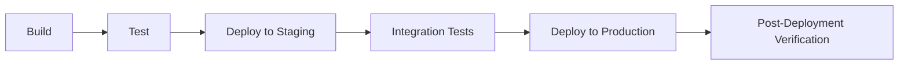
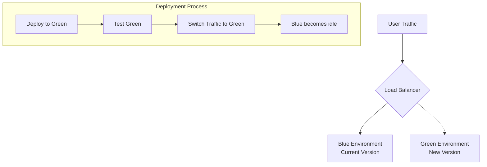
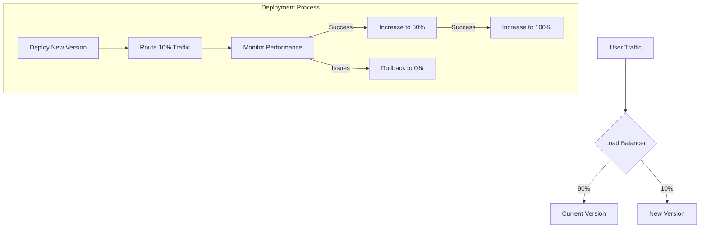
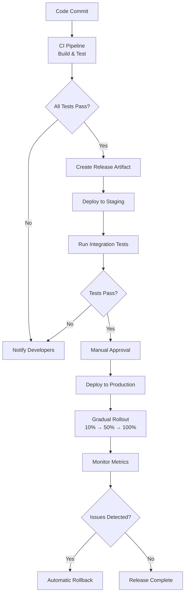

# CI/CD Release Automation

## Introduction

Release automation is a critical component of modern software development that streamlines the process of deploying code to production environments. It's the final piece of the CI/CD (Continuous Integration/Continuous Deployment) puzzle, ensuring that software can be delivered to users quickly, consistently, and reliably.

In traditional development workflows, releasing software was often a manual, error-prone process that could take hours or even days. With CI/CD release automation, these processes are codified and automated, allowing teams to deploy multiple times per day with confidence.

## What is CI/CD Release Automation?

CI/CD Release Automation refers to the practice of using automated pipelines to handle the entire software release process—from building and testing code to deploying it to production environments. It eliminates manual intervention, reduces human error, and accelerates the delivery of software updates.

### Key Components of Release Automation

1. **Release Pipelines**: Predefined sequences of steps that code changes must pass through before reaching production
2. **Environment Management**: Automated provisioning and configuration of deployment environments
3. **Deployment Strategies**: Techniques like blue-green, canary, or rolling deployments to minimize risk
4. **Approval Gates**: Optional manual or automated approval steps for critical releases
5. **Rollback Mechanisms**: Automated processes to revert to previous versions if issues arise

## Benefits of Release Automation

- **Speed**: Automated releases dramatically reduce deployment time
- **Consistency**: Every release follows the same process, eliminating variability
- **Reliability**: Automated testing and verification reduce production issues
- **Traceability**: Every change is tracked, making it easier to identify and fix issues
- **Developer Experience**: Developers can focus on writing code rather than managing deployments

## Creating a Basic Release Pipeline

Let's start by building a simple release pipeline. Most CI/CD tools (like Jenkins, GitHub Actions, GitLab CI, or CircleCI) follow similar concepts.

### Step 1: Define Your Pipeline Stages

A typical release pipeline includes these stages:



### Step 2: Configure Your CI/CD Tool

Here's an example of a simple GitHub Actions workflow file for a Node.js application:

```yaml
name: Release Pipeline

on:
  push:
    branches: [ main ]

jobs:
  build:
    runs-on: ubuntu-latest
    steps:
      - uses: actions/checkout@v3
      - name: Use Node.js
        uses: actions/setup-node@v3
        with:
          node-version: '16.x'
      - name: Install dependencies
        run: npm ci
      - name: Build
        run: npm run build --if-present
      - name: Test
        run: npm test
      - name: Archive build artifacts
        uses: actions/upload-artifact@v3
        with:
          name: build-artifacts
          path: build/

  deploy-staging:
    needs: build
    runs-on: ubuntu-latest
    steps:
      - uses: actions/checkout@v3
      - name: Download build artifacts
        uses: actions/download-artifact@v3
        with:
          name: build-artifacts
          path: build/
      - name: Deploy to staging
        run: |
          echo "Deploying to staging environment"
          # Add your deployment commands here
      - name: Integration tests
        run: |
          echo "Running integration tests"
          # Add your integration test commands here

  deploy-production:
    needs: deploy-staging
    runs-on: ubuntu-latest
    environment:
      name: production
      url: https://yourapp.com
    steps:
      - uses: actions/checkout@v3
      - name: Download build artifacts
        uses: actions/download-artifact@v3
        with:
          name: build-artifacts
          path: build/
      - name: Deploy to production
        run: |
          echo "Deploying to production environment"
          # Add your production deployment commands here
      - name: Verify deployment
        run: |
          echo "Verifying production deployment"
          # Add your verification steps here
```

## Advanced Deployment Strategies

Now let's explore some sophisticated deployment strategies that minimize risk and downtime.

### Blue-Green Deployment

Blue-green deployment involves maintaining two identical production environments: one active (blue) and one idle (green). New releases are deployed to the idle environment, tested, and then traffic is switched over.



#### Implementation Example (AWS with Terraform):

```hcl
resource "aws_lb_target_group" "blue" {
  name     = "blue-target-group"
  port     = 80
  protocol = "HTTP"
  vpc_id   = aws_vpc.main.id
}

resource "aws_lb_target_group" "green" {
  name     = "green-target-group"
  port     = 80
  protocol = "HTTP"
  vpc_id   = aws_vpc.main.id
}

resource "aws_lb_listener" "front_end" {
  load_balancer_arn = aws_lb.front_end.arn
  port              = "80"
  protocol          = "HTTP"
  
  default_action {
    type             = "forward"
    target_group_arn = var.active_environment == "blue" ? aws_lb_target_group.blue.arn : aws_lb_target_group.green.arn
  }
}
```

### Canary Deployment

Canary deployment involves gradually routing a small percentage of traffic to the new version, monitoring it, and then slowly increasing the percentage until 100% of traffic is on the new version.



#### Implementation in Kubernetes:

```yaml
apiVersion: networking.istio.io/v1alpha3
kind: VirtualService
metadata:
  name: my-service-vs
spec:
  hosts:
  - my-service
  http:
  - route:
    - destination:
        host: my-service
        subset: v1
      weight: 90
    - destination:
        host: my-service
        subset: v2
      weight: 10
```

## Feature Flags for Safer Releases

Feature flags (or feature toggles) allow you to enable or disable features at runtime without deploying new code. They're an excellent complement to CI/CD release automation.

### Example of a Feature Flag in JavaScript:

```javascript
// Import a feature flag service
import { featureFlags } from './featureFlags';

function renderButton() {
  // Check if the new button design is enabled
  if (featureFlags.isEnabled('new-button-design')) {
    return <NewFancyButton />;
  } else {
    return <OldButton />;
  }
}
```

Feature flags can be managed through configuration files, databases, or dedicated services like LaunchDarkly, Split, or Unleash.

## Automating Database Migrations

Database changes can be tricky to automate, but they're an essential part of release automation.

### Basic Migration Script Example (using Flyway):

```sql
-- V1_1__Create_users_table.sql
CREATE TABLE users (
  id SERIAL PRIMARY KEY,
  username VARCHAR(100) NOT NULL,
  email VARCHAR(100) NOT NULL,
  created_at TIMESTAMP NOT NULL DEFAULT NOW()
);

-- V1_2__Add_status_to_users.sql
ALTER TABLE users ADD COLUMN status VARCHAR(20) NOT NULL DEFAULT 'active';
```

Integration with CI/CD pipeline:

```yaml
# In your CI/CD pipeline configuration
- name: Database migration
  run: |
    flyway -url=jdbc:postgresql://db-host:5432/mydb \
    -user=$DB_USER -password=$DB_PASSWORD \
    -locations=filesystem:./migrations migrate
```

## Building a Complete Release Automation Workflow

Now that we understand the key components, let's integrate them into a comprehensive workflow:



## Best Practices for CI/CD Release Automation

1. **Immutable Infrastructure**: Treat servers as disposable and rebuild rather than update
2. **Infrastructure as Code**: Define all infrastructure in version-controlled code
3. **Environment Parity**: Keep all environments as similar as possible
4. **Secrets Management**: Never hardcode credentials; use a secure vault
5. **Observability**: Build robust monitoring and logging into your pipeline
6. **Test Automation**: Automate all testing, including performance and security tests
7. **Incremental Rollouts**: Use techniques like canary deployments to reduce risk
8. **Automated Rollbacks**: Be prepared to revert quickly if issues arise

## Implementing Release Automation in a Team

Transitioning to automated releases requires both technical and cultural changes:

1. **Start Small**: Begin with a simple application or microservice
2. **Document Everything**: Create clear runbooks and documentation
3. **Train the Team**: Ensure everyone understands the new processes
4. **Define Roles**: Clarify who can approve and initiate releases
5. **Measure Success**: Track deployment frequency, lead time, and failure rate

## Real-World Example: E-commerce Site Deployment

Let's consider a practical example of a release pipeline for an e-commerce website:

1. Developers commit code to the main branch
2. CI system runs unit and integration tests
3. A staging deployment occurs automatically
4. QA team performs exploratory testing
5. Performance tests verify the site can handle expected load
6. Security scans check for vulnerabilities
7. Product manager approves the release
8. Deployment occurs during a low-traffic window
9. 5% of users are directed to the new version
10. Monitoring systems track error rates and performance
11. Gradually increase traffic to 100% over 2 hours
12. Post-deployment review occurs the next day

## Troubleshooting Common Issues

Even the best release automation can encounter problems. Here are some common issues and solutions:

| Issue | Possible Causes | Solutions |
|-------|-----------------|-----------|
| Deployment fails | Missing dependencies, environment differences | Use containerization, improve environment parity |
| Performance degradation | Inefficient code, database issues | Add performance tests to pipeline, set performance budgets |
| Unexpected behavior | Inadequate testing, configuration issues | Improve test coverage, validate configurations |
| Rollback failures | Incompatible database changes | Plan migrations that support rollback, use feature flags |

## Summary

CI/CD Release Automation transforms the software delivery process from a manual, error-prone operation into a streamlined, reliable system. By automating builds, tests, and deployments, development teams can:

- Release software more frequently and with higher quality
- Respond quickly to market changes and user feedback
- Reduce stress and manual effort during deployments
- Build confidence in the reliability of their systems

As you implement release automation in your projects, remember that it's not just about the tools—it's about creating a culture of continuous improvement and confidence in your deployment process.

## Exercises

1. **Basic Pipeline**: Create a simple CI/CD pipeline for a Hello World application using GitHub Actions or GitLab CI.
2. **Deployment Strategies**: Implement a blue-green deployment for a simple web application.
3. **Feature Flags**: Add a feature flag system to an existing application and toggle features via configuration.
4. **Database Migrations**: Create an automated database migration process that runs as part of your deployment pipeline.
5. **Monitoring**: Set up basic monitoring that would automatically roll back a deployment if error rates increase.

## Further Learning

- Explore advanced CI/CD tools like ArgoCD, Spinnaker, or Flagger
- Learn more about GitOps approaches to deployment
- Dive deeper into infrastructure as code with Terraform or CloudFormation
- Study site reliability engineering (SRE) practices for maintaining high-reliability systems
- Investigate chaos engineering to build more resilient deployment processes