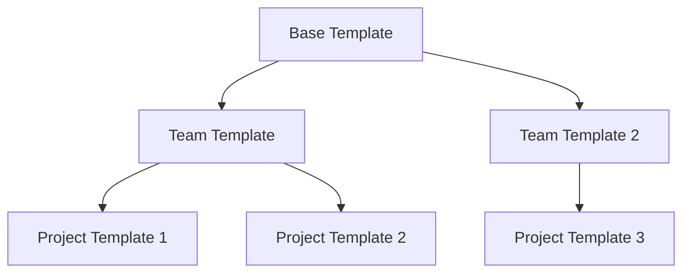
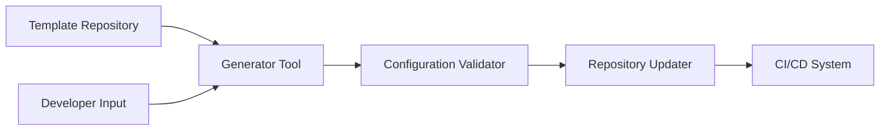

# CICD Configuration Automation

## Introduction

In modern software development, Continuous Integration and Continuous Deployment (CI/CD) pipelines have become essential for delivering high-quality code efficiently. However, as projects grow in complexity, maintaining these pipelines manually becomes time-consuming and error-prone. This is where **CI/CD Configuration Automation** comes into play.

CI/CD Configuration Automation refers to the practice of programmatically managing and generating your pipeline configurations instead of writing them by hand. This approach treats your pipeline configurations as code, making them more maintainable, version-controlled, and consistent across projects.

## Why Automate CI/CD Configurations?

Before diving into how to automate CI/CD configurations, let's understand why it's beneficial:

1. **Consistency**: Ensure all projects follow the same standards and best practices
2. **Scalability**: Easily apply changes across multiple pipelines at once
3. **Reduced errors**: Minimize human errors in configuration
4. **Time-saving**: Quickly set up new pipelines without starting from scratch
5. **Knowledge sharing**: Centralize expertise in templates rather than tribal knowledge

## Approaches to CI/CD Configuration Automation

### 1. Template-Based Approach

The simplest form of configuration automation uses templates as a starting point for your pipeline configurations.

```yaml
# template-ci-pipeline.yml
name: $(Build.DefinitionName)_$(Date:yyyyMMdd)$(Rev:.r)

trigger:
  branches:
    include:
      - main
      - feature/*

stages:
  - stage: Build
    jobs:
      - job: BuildJob
        pool:
          vmImage: 'ubuntu-latest'
        steps:
          - script: echo "Your build steps here"
```

With this template, developers can copy it to their project and customize only what's necessary, maintaining consistency while allowing for project-specific adjustments.

### 2. Generator Scripts

A more advanced approach is to use scripts that generate pipeline configurations dynamically based on project characteristics.

```javascript
// generate-pipeline.js
const fs = require('fs');

function generatePipeline(projectType, language) {
  const template = {
    name: '$(Build.DefinitionName)',
    trigger: {
      branches: {
        include: ['main', 'feature/*']
      }
    },
    stages: [
      {
        stage: 'Build',
        jobs: [
          {
            job: 'BuildJob',
            pool: {
              vmImage: 'ubuntu-latest'
            },
            steps: []
          }
        ]
      }
    ]
  };
  
  // Add language-specific build steps
  if (language === 'node') {
    template.stages[0].jobs[0].steps.push(
      { task: 'NodeTool@0', inputs: { versionSpec: '14.x' } },
      { script: 'npm install' },
      { script: 'npm test' }
    );
  } else if (language === 'python') {
    template.stages[0].jobs[0].steps.push(
      { task: 'UsePythonVersion@0', inputs: { versionSpec: '3.8' } },
      { script: 'pip install -r requirements.txt' },
      { script: 'pytest' }
    );
  }
  
  // Add project type specific configurations
  if (projectType === 'web') {
    template.stages.push({
      stage: 'Deploy',
      jobs: [
        {
          job: 'DeployJob',
          steps: [
            { script: 'echo "Deploying web application"' }
          ]
        }
      ]
    });
  }
  
  return template;
}

// Generate and save pipeline
const pipeline = generatePipeline('web', 'node');
fs.writeFileSync('azure-pipelines.yml', JSON.stringify(pipeline, null, 2));
console.log('Pipeline configuration generated successfully!');
```

With this script, you can generate pipeline configurations tailored to specific project types and technologies.

### 3. Configuration as Code Libraries

Several tools and libraries have emerged to help manage CI/CD configurations as code:

#### Example: Jenkins Job DSL

Jenkins Job DSL allows you to define Jenkins jobs using a Groovy-based DSL:

```groovy
// jobDSL.groovy
folder('project-a') {
    description('Project A Pipeline Jobs')
}

pipelineJob('project-a/build') {
    definition {
        cpsScm {
            scm {
                git {
                    remote {
                        url('https://github.com/company/project-a.git')
                        credentials('github-credentials')
                    }
                    branch('*/main')
                }
            }
            scriptPath('Jenkinsfile')
        }
    }
    triggers {
        scm('H/15 * * * *')
    }
}
```

#### Example: GitLab CI Generator

```javascript
// gitlab-ci-generator.js
class GitLabCIGenerator {
  constructor(config) {
    this.config = config;
  }
  
  generate() {
    return {
      image: this.config.defaultImage || 'alpine:latest',
      stages: ['build', 'test', 'deploy'],
      variables: this.config.variables || {},
      ...this.generateJobs()
    };
  }
  
  generateJobs() {
    const jobs = {};
    
    // Build job
    jobs.build = {
      stage: 'build',
      script: this.getBuildCommands(),
      artifacts: {
        paths: ['dist/']
      }
    };
    
    // Test job
    jobs.test = {
      stage: 'test',
      script: this.getTestCommands(),
      dependencies: ['build']
    };
    
    // Deploy job (only for production branch)
    if (this.config.enableDeployment) {
      jobs.deploy = {
        stage: 'deploy',
        script: this.getDeployCommands(),
        only: ['main'],
        dependencies: ['test']
      };
    }
    
    return jobs;
  }
  
  getBuildCommands() {
    const commands = [];
    switch(this.config.language) {
      case 'node':
        commands.push('npm install', 'npm run build');
        break;
      case 'python':
        commands.push('pip install -r requirements.txt', 'python setup.py build');
        break;
      default:
        commands.push('echo "No specific build steps defined"');
    }
    return commands;
  }
  
  getTestCommands() {
    const commands = [];
    switch(this.config.language) {
      case 'node':
        commands.push('npm test');
        break;
      case 'python':
        commands.push('pytest');
        break;
      default:
        commands.push('echo "No specific test steps defined"');
    }
    return commands;
  }
  
  getDeployCommands() {
    return ['echo "Deploying application"', 'deploy-script.sh'];
  }
}

// Usage
const generator = new GitLabCIGenerator({
  language: 'node',
  enableDeployment: true,
  variables: {
    NODE_ENV: 'production'
  }
});

const config = generator.generate();
console.log(JSON.stringify(config, null, 2));
```

This generates a complete `.gitlab-ci.yml` configuration based on the project's requirements.

## Practical Implementation: Building a CI/CD Config Generator

Let's build a simple but practical CI/CD configuration generator for GitHub Actions that can be used across multiple projects.

### Step 1: Create a Base Template Structure

First, we'll define a base template structure that can be customized:

```javascript
// github-actions-generator.js
const fs = require('fs');
const yaml = require('js-yaml');

class GitHubActionsGenerator {
  constructor(options) {
    this.options = {
      language: 'javascript',
      testing: true,
      linting: true,
      deployment: false,
      ...options
    };
  }
  
  generate() {
    const workflow = {
      name: `${this.options.projectName || 'Project'} CI/CD`,
      on: {
        push: {
          branches: ['main']
        },
        pull_request: {
          branches: ['main']
        }
      },
      jobs: this._generateJobs()
    };
    
    return yaml.dump(workflow);
  }
  
  _generateJobs() {
    const jobs = {
      build: this._getBuildJob(),
    };
    
    if (this.options.testing) {
      jobs.test = this._getTestJob();
    }
    
    if (this.options.linting) {
      jobs.lint = this._getLintJob();
    }
    
    if (this.options.deployment) {
      jobs.deploy = this._getDeployJob();
    }
    
    return jobs;
  }
  
  _getBuildJob() {
    const job = {
      'runs-on': 'ubuntu-latest',
      steps: [
        {
          name: 'Checkout repository',
          uses: 'actions/checkout@v2'
        }
      ]
    };
    
    // Add language-specific build steps
    switch (this.options.language) {
      case 'javascript':
      case 'typescript':
        job.steps.push(
          {
            name: 'Set up Node.js',
            uses: 'actions/setup-node@v2',
            with: {
              'node-version': this.options.nodeVersion || '14.x'
            }
          },
          {
            name: 'Install dependencies',
            run: 'npm ci'
          },
          {
            name: 'Build',
            run: 'npm run build --if-present'
          }
        );
        break;
        
      case 'python':
        job.steps.push(
          {
            name: 'Set up Python',
            uses: 'actions/setup-python@v2',
            with: {
              'python-version': this.options.pythonVersion || '3.9'
            }
          },
          {
            name: 'Install dependencies',
            run: 'pip install -r requirements.txt'
          },
          {
            name: 'Build',
            run: 'python setup.py build'
          }
        );
        break;
    }
    
    return job;
  }
  
  _getTestJob() {
    const job = {
      'runs-on': 'ubuntu-latest',
      needs: ['build'],
      steps: [
        {
          name: 'Checkout repository',
          uses: 'actions/checkout@v2'
        }
      ]
    };
    
    // Add language-specific test steps
    switch (this.options.language) {
      case 'javascript':
      case 'typescript':
        job.steps.push(
          {
            name: 'Set up Node.js',
            uses: 'actions/setup-node@v2',
            with: {
              'node-version': this.options.nodeVersion || '14.x'
            }
          },
          {
            name: 'Install dependencies',
            run: 'npm ci'
          },
          {
            name: 'Run tests',
            run: 'npm test'
          }
        );
        break;
        
      case 'python':
        job.steps.push(
          {
            name: 'Set up Python',
            uses: 'actions/setup-python@v2',
            with: {
              'python-version': this.options.pythonVersion || '3.9'
            }
          },
          {
            name: 'Install dependencies',
            run: 'pip install -r requirements.txt'
          },
          {
            name: 'Run tests',
            run: 'pytest'
          }
        );
        break;
    }
    
    return job;
  }
  
  _getLintJob() {
    const job = {
      'runs-on': 'ubuntu-latest',
      steps: [
        {
          name: 'Checkout repository',
          uses: 'actions/checkout@v2'
        }
      ]
    };
    
    // Add language-specific lint steps
    switch (this.options.language) {
      case 'javascript':
        job.steps.push(
          {
            name: 'Set up Node.js',
            uses: 'actions/setup-node@v2',
            with: {
              'node-version': this.options.nodeVersion || '14.x'
            }
          },
          {
            name: 'Install dependencies',
            run: 'npm ci'
          },
          {
            name: 'Lint',
            run: 'npm run lint'
          }
        );
        break;
        
      case 'python':
        job.steps.push(
          {
            name: 'Set up Python',
            uses: 'actions/setup-python@v2',
            with: {
              'python-version': this.options.pythonVersion || '3.9'
            }
          },
          {
            name: 'Install dependencies',
            run: 'pip install flake8'
          },
          {
            name: 'Lint',
            run: 'flake8 .'
          }
        );
        break;
    }
    
    return job;
  }
  
  _getDeployJob() {
    return {
      'runs-on': 'ubuntu-latest',
      needs: this.options.testing ? ['test'] : ['build'],
      if: "github.ref == 'refs/heads/main'",
      steps: [
        {
          name: 'Checkout repository',
          uses: 'actions/checkout@v2'
        },
        {
          name: 'Deploy',
          run: '# Add your deployment commands here'
        }
      ]
    };
  }
  
  saveToFile(filePath) {
    const yaml = this.generate();
    fs.mkdirSync('.github/workflows', { recursive: true });
    fs.writeFileSync(filePath, yaml);
    console.log(`Workflow file created at: ${filePath}`);
  }
}

// Usage example
const generator = new GitHubActionsGenerator({
  projectName: 'My Web App',
  language: 'javascript',
  nodeVersion: '16.x',
  testing: true,
  linting: true,
  deployment: true
});

generator.saveToFile('.github/workflows/ci-cd.yml');
```

### Step 2: Create a Command-Line Interface

Let's add a CLI to make our generator more user-friendly:

```javascript
// cli.js
#!/usr/bin/env node
const { GitHubActionsGenerator } = require('./github-actions-generator');
const inquirer = require('inquirer');

async function promptUser() {
  const answers = await inquirer.prompt([
    {
      type: 'input',
      name: 'projectName',
      message: 'Project name:',
      default: 'My Project'
    },
    {
      type: 'list',
      name: 'language',
      message: 'Programming language:',
      choices: ['javascript', 'typescript', 'python'],
      default: 'javascript'
    },
    {
      type: 'confirm',
      name: 'testing',
      message: 'Include testing job?',
      default: true
    },
    {
      type: 'confirm',
      name: 'linting',
      message: 'Include linting job?',
      default: true
    },
    {
      type: 'confirm',
      name: 'deployment',
      message: 'Include deployment job?',
      default: false
    },
    {
      type: 'input',
      name: 'outputPath',
      message: 'Output file path:',
      default: '.github/workflows/ci-cd.yml'
    }
  ]);
  
  return answers;
}

async function main() {
  console.log('GitHub Actions Workflow Generator');
  console.log('--------------------------------');
  
  const options = await promptUser();
  const generator = new GitHubActionsGenerator(options);
  
  generator.saveToFile(options.outputPath);
}

main().catch(error => {
  console.error('Error:', error);
  process.exit(1);
});
```

## Advanced Concepts: Configuration Inheritance and Composition

For more complex organizations with many projects, we can implement inheritance and composition patterns.



### Example: Base Template with Inheritance

```javascript
// base-templates.js
class BaseTemplate {
  getConfig() {
    return {
      version: 2,
      jobs: {
        build: {
          docker: {
            image: 'cimg/base:2021.04'
          },
          steps: [
            'checkout',
            {
              run: {
                name: 'Install dependencies',
                command: 'echo "Installing dependencies"'
              }
            }
          ]
        }
      }
    };
  }
}

class JavaScriptTemplate extends BaseTemplate {
  getConfig() {
    const config = super.getConfig();
    
    // Override the docker image
    config.jobs.build.docker.image = 'cimg/node:16.0';
    
    // Add JavaScript-specific steps
    config.jobs.build.steps.push(
      {
        run: {
          name: 'Install npm dependencies',
          command: 'npm install'
        }
      },
      {
        run: {
          name: 'Run tests',
          command: 'npm test'
        }
      }
    );
    
    return config;
  }
}

class ReactTemplate extends JavaScriptTemplate {
  getConfig() {
    const config = super.getConfig();
    
    // Add React-specific steps
    config.jobs.build.steps.push(
      {
        run: {
          name: 'Build React app',
          command: 'npm run build'
        }
      }
    );
    
    // Add deployment job
    config.jobs.deploy = {
      docker: {
        image: 'cimg/node:16.0'
      },
      steps: [
        'checkout',
        {
          run: {
            name: 'Deploy to hosting service',
            command: 'npm run deploy'
          }
        }
      ],
      requires: ['build']
    };
    
    return config;
  }
}

// Usage
const template = new ReactTemplate();
console.log(JSON.stringify(template.getConfig(), null, 2));
```

## Best Practices for CI/CD Configuration Automation

1. **Start simple**: Begin with templates and gradually move to more complex automation
2. **Version control your generators**: Keep your configuration automation code in version control
3. **Test your configurations**: Validate generated configurations before applying them
4. **Document assumptions**: Clearly document what each template or generator expects
5. **Centralize common patterns**: Identify and centralize patterns used across multiple projects
6. **Parameterize, don't duplicate**: Use parameters instead of duplicating similar configurations
7. **Keep it maintainable**: Don't over-engineer; it should save time, not create maintenance headaches

## Setting Up a CI/CD Configuration Automation Workflow

Let's look at a real-world workflow for implementing CI/CD configuration automation in an organization:

1. **Audit existing pipelines** to identify common patterns and variations
2. **Create a base template** that captures core requirements
3. **Develop a generator** that can produce configurations for different project types
4. **Create a validation tool** to check configurations for best practices
5. **Implement a workflow** for updating configurations across repositories
6. **Document the system** for team members

### Example: Full-cycle CI/CD Configuration Management



## Summary

CI/CD Configuration Automation is a powerful approach to managing pipeline configurations at scale. By treating your CI/CD configurations as code and applying software development principles like DRY (Don't Repeat Yourself), inheritance, and composition, you can make your development workflow more efficient and less error-prone.

In this guide, we've explored:
- Why CI/CD configuration automation is important
- Different approaches to automation, from simple templates to complex generators
- How to build a practical configuration generator
- Advanced concepts like inheritance and composition
- Best practices for implementing configuration automation

By implementing these techniques, you can significantly reduce the overhead of managing CI/CD pipelines across multiple projects, ensuring consistency and allowing your team to focus on writing code rather than tweaking configurations.

## Additional Resources

- Practice building a configuration generator for your favorite CI/CD platform
- Explore tools like:
  - [Jsonnet](https://jsonnet.org/) for JSON templating
  - [ytt](https://carvel.dev/ytt/) for YAML templating
  - [Dhall](https://dhall-lang.org/) for generating configurations

## Exercises

1. Create a simple template for a CI/CD pipeline using your preferred platform (GitHub Actions, GitLab CI, etc.)
2. Extend the template generator in this guide to support a different language or CI/CD platform
3. Implement the inheritance pattern to create specialized templates for different project types
4. Build a validation tool that checks generated configurations against your organization's best practices
5. Create a command-line tool that can apply generated configurations to multiple repositories