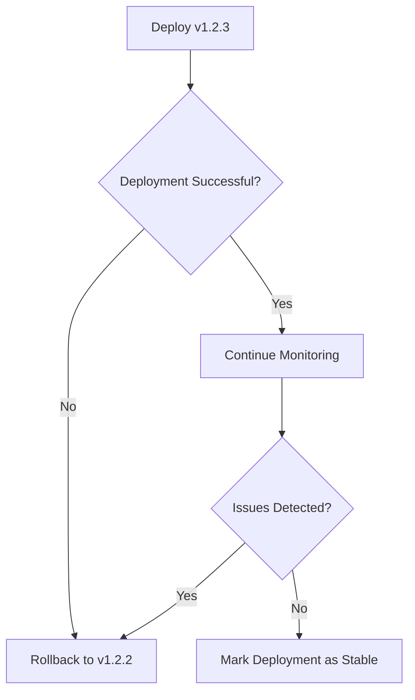
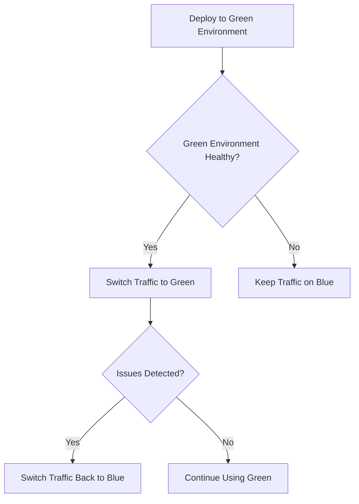
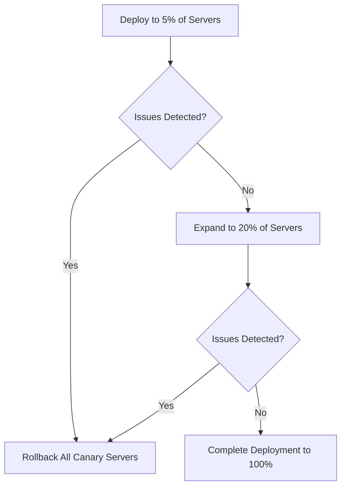
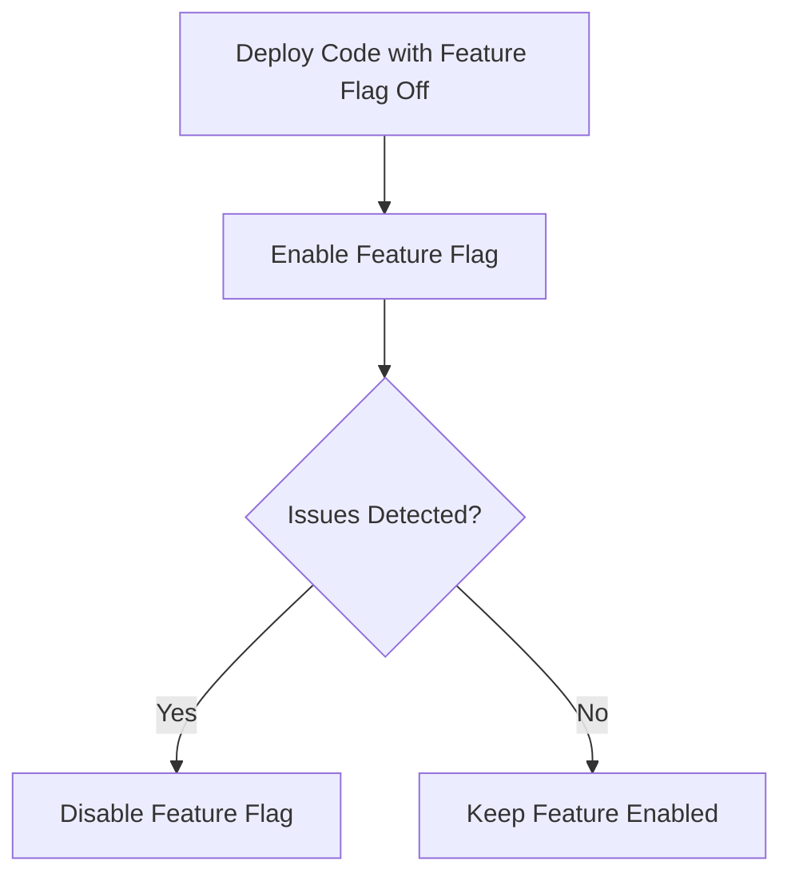

# CICD Rollback Automation

In the world of continuous integration and continuous deployment (CI/CD), failures can happen despite our best efforts with testing and validation. When a deployment goes wrong in production, every minute counts. This is where rollback automation becomes a critical component of your CI/CD pipeline.

## What is Rollback Automation?

Rollback automation is the process of automatically reverting to a previous working version of your application when a deployment fails or causes issues in production. Instead of manually intervening during a crisis, automated rollbacks provide a safety net that can minimize downtime and reduce the impact on users.

## Why Automated Rollbacks Matter

- **Reduced Mean Time to Recovery (MTTR)** - Automated rollbacks can happen in seconds or minutes, compared to potentially hours for manual intervention
- **Lower Risk** - Encourages more frequent deployments by providing a reliable safety net
- **Improved User Experience** - Minimizes the time users are exposed to bugs or service disruptions
- **Less Pressure on Development Teams** - Removes the stress of perfect deployments and provides peace of mind

## Types of Rollback Strategies

Let's explore the common rollback strategies you can implement in your CI/CD pipeline:

### 1. Version-Based Rollbacks

This strategy involves keeping track of application versions and reverting to a previous known-good version when issues are detected.



### 2. Blue-Green Deployments

In this approach, you maintain two identical production environments (Blue and Green). Only one serves production traffic at a time, allowing instant rollbacks by switching traffic routing.



### 3. Canary Deployments

Canary deployments gradually roll out changes to a small subset of users before a full deployment, allowing for early detection of issues and minimizing impact.



### 4. Feature Flags/Toggles

Feature flags allow you to enable or disable features without redeploying code, providing a quick way to "roll back" problematic features.



## Implementing Rollback Automation in Your CI/CD Pipeline

Now let's look at how to implement rollback automation in a CI/CD pipeline. We'll use GitHub Actions as an example.

### Step 1: Define Health Checks

First, establish clear criteria for what constitutes a healthy deployment:

```yaml
# health-check.yml
name: Health Check

on:
  workflow_dispatch:
    inputs:
      environment:
        description: 'Environment to check'
        required: true
        default: 'production'
      endpoint:
        description: 'Health check endpoint'
        required: true
        default: '/api/health'

jobs:
  health-check:
    runs-on: ubuntu-latest
    steps:
      - name: Check endpoint health
        id: health
        run: |
          RESPONSE=$(curl -s -o /dev/null -w "%{http_code}" https://${{ inputs.environment }}.example.com${{ inputs.endpoint }})
          echo "Response code: $RESPONSE"
          if [ "$RESPONSE" -ne 200 ]; then
            echo "::set-output name=status::failure"
            exit 1
          else
            echo "::set-output name=status::success"
          fi
```

### Step 2: Create a Deployment Workflow with Rollback Support

Here's an example GitHub Actions workflow that includes automated rollback:

```yaml
# deploy-with-rollback.yml
name: Deploy with Rollback

on:
  push:
    branches:
      - main

jobs:
  deploy:
    runs-on: ubuntu-latest
    steps:
      - uses: actions/checkout@v3
      
      - name: Set version
        id: version
        run: echo "::set-output name=version::$(date +'%Y%m%d%H%M%S')"
      
      - name: Build application
        run: |
          npm ci
          npm run build
      
      - name: Store previous version for potential rollback
        run: |
          CURRENT_VERSION=$(curl -s https://api.example.com/version)
          echo "PREVIOUS_VERSION=$CURRENT_VERSION" >> $GITHUB_ENV
      
      - name: Deploy to production
        id: deploy
        run: |
          echo "Deploying version ${{ steps.version.outputs.version }}"
          # Your deployment commands here
          # For example:
          aws s3 sync ./build s3://my-app-bucket/
          aws cloudfront create-invalidation --distribution-id ${{ secrets.CF_DISTRIBUTION_ID }} --paths "/*"
      
      - name: Run health checks
        id: health
        run: |
          echo "Running health checks..."
          for i in {1..5}; do
            RESPONSE=$(curl -s -o /dev/null -w "%{http_code}" https://example.com/health)
            if [ "$RESPONSE" -eq 200 ]; then
              echo "Health check passed!"
              echo "::set-output name=status::success"
              exit 0
            fi
            echo "Attempt $i failed, waiting 10 seconds..."
            sleep 10
          done
          echo "Health checks failed after 5 attempts"
          echo "::set-output name=status::failure"
          exit 1
      
      - name: Rollback if deployment failed
        if: failure() && steps.deploy.outcome == 'success' && steps.health.outcome == 'failure'
        run: |
          echo "Deployment failed health checks, rolling back to version ${{ env.PREVIOUS_VERSION }}"
          # Your rollback commands here
          # For example:
          aws s3 cp s3://my-app-bucket-versions/${{ env.PREVIOUS_VERSION }}/ s3://my-app-bucket/ --recursive
          aws cloudfront create-invalidation --distribution-id ${{ secrets.CF_DISTRIBUTION_ID }} --paths "/*"
          echo "Rollback complete"
```

### Step 3: Implement Monitoring and Alerting

Automated rollbacks should integrate with your monitoring systems to detect issues not caught by simple health checks:

```yaml
# monitor-deployment.yml
name: Monitor New Deployment

on:
  workflow_dispatch:
    inputs:
      duration:
        description: 'Monitoring duration in minutes'
        required: true
        default: '15'

jobs:
  monitor:
    runs-on: ubuntu-latest
    steps:
      - name: Monitor error rates
        run: |
          start_time=$(date +%s)
          end_time=$((start_time + ${{ inputs.duration }} * 60))
          threshold=5  # 5% error rate threshold
          
          while [ $(date +%s) -lt $end_time ]; do
            # Get error rate from monitoring system
            # This is just an example - replace with your actual monitoring API
            error_rate=$(curl -s https://monitoring.example.com/api/error-rate)
            
            echo "Current error rate: $error_rate%"
            
            if (( $(echo "$error_rate > $threshold" | bc -l) )); then
              echo "Error rate exceeds threshold! Triggering rollback..."
              gh workflow run rollback.yml
              exit 1
            fi
            
            sleep 60  # Check every minute
          done
          
          echo "Deployment stable after ${{ inputs.duration }} minutes"
```

## Real-World Example: Kubernetes-Based Rollback

Kubernetes provides built-in rollback capabilities for deployments. Here's how to leverage them in your CI/CD pipeline:

### Automated Rollback with Kubernetes

```yaml
# kubernetes-deploy-with-rollback.yml
name: Kubernetes Deploy with Rollback

on:
  push:
    branches:
      - main

jobs:
  deploy:
    runs-on: ubuntu-latest
    steps:
      - uses: actions/checkout@v3
      
      - name: Set up kubectl
        uses: azure/setup-kubectl@v3
        
      - name: Configure AWS credentials
        uses: aws-actions/configure-aws-credentials@v1
        with:
          aws-access-key-id: ${{ secrets.AWS_ACCESS_KEY_ID }}
          aws-secret-access-key: ${{ secrets.AWS_SECRET_ACCESS_KEY }}
          aws-region: us-west-2
          
      - name: Update kubeconfig
        run: aws eks update-kubeconfig --name my-cluster --region us-west-2
        
      - name: Deploy to Kubernetes
        id: deploy
        run: |
          # Record the current revision for potential rollback
          CURRENT_REVISION=$(kubectl rollout history deployment/my-app -o jsonpath='{.metadata.annotations.deployment\.kubernetes\.io/revision}')
          echo "CURRENT_REVISION=$CURRENT_REVISION" >> $GITHUB_ENV
          
          # Apply new deployment
          kubectl apply -f k8s/deployment.yaml
          
          # Wait for rollout to complete (with timeout)
          kubectl rollout status deployment/my-app --timeout=5m
          
      - name: Verify deployment
        id: verify
        run: |
          # Wait for a moment to let the application start
          sleep 30
          
          # Run health checks
          HEALTH_CHECK=$(curl -s -o /dev/null -w "%{http_code}" https://api.example.com/health)
          
          if [ "$HEALTH_CHECK" -ne 200 ]; then
            echo "Health check failed with status $HEALTH_CHECK"
            exit 1
          fi
          
          # Check error rates from Prometheus
          ERROR_RATE=$(curl -s 'http://prometheus.example.com:9090/api/v1/query?query=rate(http_requests_total{status=~"5.."}[5m])/rate(http_requests_total[5m])*100' | jq '.data.result[0].value[1]')
          
          if (( $(echo "$ERROR_RATE > 5.0" | bc -l) )); then
            echo "Error rate too high: $ERROR_RATE%"
            exit 1
          fi
          
          echo "Deployment verification passed!"
          
      - name: Rollback if verification failed
        if: failure() && steps.deploy.outcome == 'success' && steps.verify.outcome == 'failure'
        run: |
          echo "Verification failed, rolling back to revision ${{ env.CURRENT_REVISION }}"
          kubectl rollout undo deployment/my-app --to-revision=${{ env.CURRENT_REVISION }}
          kubectl rollout status deployment/my-app
          echo "Rollback complete"
```

## Best Practices for Rollback Automation

To ensure your rollback automation is reliable and effective, follow these best practices:

1. **Make Rollbacks Easy and Reliable**
   - Test your rollback mechanism regularly to ensure it works when needed
   - Include rollback testing in your deployment validation process

2. **Maintain Backward Compatibility**
   - Ensure database schemas support both current and previous application versions
   - Consider using schema migration tools that support rollbacks

3. **Implement Circuit Breakers**
   - Automatically detect and respond to issues before they require a full rollback
   - Set clear thresholds for when automated rollbacks should be triggered

4. **Keep Deployment Artifacts**
   - Store all deployment artifacts with proper versioning
   - Ensure previous versions can be quickly deployed when needed

5. **Document Rollback Procedures**
   - Even with automation, maintain clear documentation for manual rollback procedures
   - Ensure the team knows how to monitor the automated rollback process

## Common Rollback Challenges and Solutions

### Database Migrations

One of the trickiest aspects of rollbacks is handling database schema changes.

**Challenge**: Rolling back application code while database schema has changed.

**Solution**: Implement reversible migrations and keep them separate from code deployments:

```javascript
// Example using Node.js with Sequelize migrations

// Up migration (applied during deployment)
module.exports = {
  up: async (queryInterface, Sequelize) => {
    await queryInterface.addColumn('Users', 'phoneNumber', {
      type: Sequelize.STRING,
      allowNull: true
    });
  },

  // Down migration (applied during rollback)
  down: async (queryInterface, Sequelize) => {
    await queryInterface.removeColumn('Users', 'phoneNumber');
  }
};
```

### Stateful Applications

Stateful applications present special challenges for rollbacks.

**Challenge**: Rolling back when user data has been created in the new version format.

**Solution**: Design data models to be backward compatible and implement data transformation during rollbacks:

```python
# Example rollback handler for a Python application

def transform_data_for_rollback(data):
    """Transform data from v2 format back to v1 format during rollback"""
    if 'new_field' in data:
        # Store the new field data somewhere for later recovery
        store_for_future_upgrade(data['user_id'], 'new_field', data['new_field'])
        # Remove the field for compatibility with previous version
        del data['new_field']
    
    return data

def rollback_data_migration():
    """Execute during rollback process"""
    all_records = database.get_all_records()
    for record in all_records:
        transformed_record = transform_data_for_rollback(record)
        database.update_record(record['id'], transformed_record)
```

## Measuring Rollback Effectiveness

To ensure your rollback system is effective, track these key metrics:

1. **MTTR (Mean Time to Recovery)** - How quickly your system recovers from failures
2. **Rollback Frequency** - How often rollbacks are triggered
3. **Failed Rollbacks** - When the rollback process itself fails
4. **Rollback Impact** - User-facing effects of rollbacks

Implement monitoring for these metrics with dashboards and alerts:

```javascript
// Example Prometheus query to track rollback frequency
sum(increase(deployment_rollbacks_total[30d])) by (service, environment)

// Example alert rule for failed rollbacks
alert FailedRollback {
  expr: deployment_rollback_status{status="failed"} == 1
  for: 5m
  labels:
    severity: critical
  annotations:
    summary: "Rollback failed for {{ $labels.service }} in {{ $labels.environment }}"
    description: "The automated rollback process failed and requires immediate attention"
}
```

## Summary

Automated rollbacks are a critical safety net for modern CI/CD pipelines. By implementing proper rollback automation, you can:

- Deploy with greater confidence and frequency
- Recover quickly from failures with minimal impact
- Reduce stress on development and operations teams
- Improve overall system reliability and user experience

Remember that rollback automation is not just a technical implementation—it's a fundamental part of a healthy deployment culture. Teams should feel comfortable deploying frequently, knowing that the safety net will catch them if something goes wrong.

## Exercises

1. Implement a simple GitHub Actions workflow with automated rollback for a sample application
2. Set up a Kubernetes deployment with rollback capabilities and test the rollback process
3. Design a database migration strategy that supports automatic rollbacks
4. Create a monitoring dashboard to track rollback-related metrics
5. Develop a post-deployment verification script that checks various health indicators before considering a deployment successful