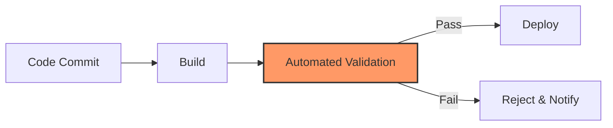
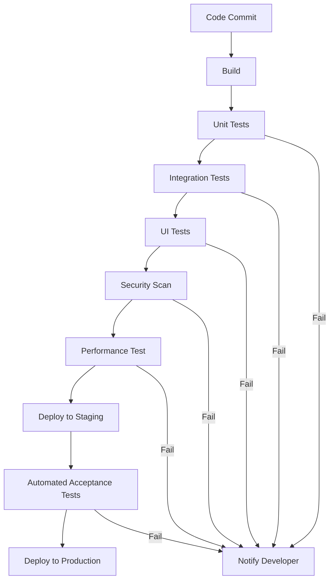

# CICD Validation Automation

## Introduction

Continuous Integration and Continuous Deployment (CI/CD) pipelines have revolutionized software development by automating the build, test, and deployment processes. An essential component of these pipelines is **validation automation**, which ensures that code changes meet quality standards before reaching production.

In this article, we'll explore how to implement automated validation in your CI/CD pipelines, making your software delivery process more reliable and efficient.

## What is CICD Validation Automation?

CICD Validation Automation refers to the process of automatically verifying that code changes satisfy predefined quality criteria within a CI/CD pipeline. Rather than manually checking code quality, automated validation tools perform these checks consistently and reliably.



Validation automation typically includes:

- Code quality checks
- Unit and integration testing
- Security scanning
- Performance testing
- Compliance verification

## Why Implement Validation Automation?

Integrating automated validation into your CI/CD pipeline offers numerous benefits:

- **Catches issues early**: Identifies problems before they reach production
- **Consistency**: Applies the same quality standards to all code changes
- **Efficiency**: Reduces manual review effort
- **Confidence**: Provides assurance that changes are safe to deploy
- **Documentation**: Creates audit trails of validation results

## Setting Up Basic Validation Automation

Let's implement a simple validation automation setup using popular tools.

### 1. Configure a CI/CD Pipeline

First, we'll create a basic CI/CD pipeline using GitHub Actions. Create a `.github/workflows/main.yml` file:

```yaml
name: CI/CD Pipeline with Validation

on:
  push:
    branches: [ main ]
  pull_request:
    branches: [ main ]

jobs:
  validate:
    runs-on: ubuntu-latest
    steps:
      - uses: actions/checkout@v3
      - name: Set up Node.js
        uses: actions/setup-node@v3
        with:
          node-version: '18'
      - name: Install dependencies
        run: npm ci
      - name: Lint code
        run: npm run lint
      - name: Run tests
        run: npm test
      - name: Security scan
        run: npm audit
```

### 2. Implement Code Quality Checks

Let's add ESLint for code quality validation. First, install ESLint:

```bash
npm install eslint --save-dev
npx eslint --init
```

Create a basic `.eslintrc.js` configuration:

```javascript
module.exports = {
  env: {
    browser: true,
    es2021: true,
    node: true,
  },
  extends: 'eslint:recommended',
  parserOptions: {
    ecmaVersion: 'latest',
    sourceType: 'module',
  },
  rules: {
    'no-unused-vars': 'warn',
    'no-console': 'warn',
  },
};
```

Add a lint script to your `package.json`:

```json
{
  "scripts": {
    "lint": "eslint . --ext .js"
  }
}
```

### 3. Set Up Automated Testing

For automated testing, we'll use Jest. Install Jest:

```bash
npm install --save-dev jest
```

Create a sample function in `calculator.js`:

```javascript
function add(a, b) {
  return a + b;
}

function subtract(a, b) {
  return a - b;
}

module.exports = { add, subtract };
```

Write a test in `calculator.test.js`:

```javascript
const { add, subtract } = require('./calculator');

test('adds 1 + 2 to equal 3', () => {
  expect(add(1, 2)).toBe(3);
});

test('subtracts 2 from 5 to equal 3', () => {
  expect(subtract(5, 2)).toBe(3);
});
```

Add a test script to your `package.json`:

```json
{
  "scripts": {
    "test": "jest"
  }
}
```

## Advanced Validation Techniques

Now that we have a basic setup, let's explore more advanced validation techniques.

### Integration Testing

Integration tests verify that different parts of your application work together correctly.

Create an `api.js` file:

```javascript
const calculator = require('./calculator');

function handleAddRequest(req, res) {
  const { a, b } = req.body;
  const result = calculator.add(Number(a), Number(b));
  res.json({ result });
}

module.exports = { handleAddRequest };
```

Write an integration test using Supertest in `api.test.js`:

```javascript
const request = require('supertest');
const express = require('express');
const bodyParser = require('body-parser');
const { handleAddRequest } = require('./api');

const app = express();
app.use(bodyParser.json());
app.post('/add', handleAddRequest);

test('API returns correct sum', async () => {
  const response = await request(app)
    .post('/add')
    .send({ a: 5, b: 3 })
    .expect('Content-Type', /json/)
    .expect(200);
  
  expect(response.body.result).toBe(8);
});
```

### Security Scanning

For security scanning, we'll use npm audit and add a step to block deployment if high-severity issues are found:

```yaml
- name: Security scan
  run: |
    npm audit --audit-level=high
    if [ $? -ne 0 ]; then
      echo "High severity security issues found!"
      exit 1
    fi
```

### Performance Testing

For a simple performance test, we can use Apache Benchmark (ab):

```yaml
- name: Performance test
  run: |
    npm start & # Start your server
    sleep 5 # Wait for server to start
    ab -n 100 -c 10 http://localhost:3000/
    kill $(lsof -t -i:3000) # Stop the server
```

## Real-World Example: E-commerce Application Validation

Let's examine a real-world validation scenario for an e-commerce application:



### Key Validation Points

1. **Cart Functionality**:
   - Test that items can be added and removed
   - Validate quantity updates
   - Check price calculations

2. **Payment Processing**:
   - Verify credit card validation
   - Test transaction processing
   - Ensure proper error handling
   
3. **Security Checks**:
   - Scan for SQL injection vulnerabilities
   - Test for XSS protection
   - Verify secure handling of personal data

### Implementation Example

```yaml
name: E-commerce CI/CD Pipeline

on:
  push:
    branches: [ main ]
  pull_request:
    branches: [ main ]

jobs:
  validate:
    runs-on: ubuntu-latest
    steps:
      - uses: actions/checkout@v3
      
      - name: Set up Node.js
        uses: actions/setup-node@v3
        with:
          node-version: '18'
          
      - name: Install dependencies
        run: npm ci
        
      - name: Lint code
        run: npm run lint
        
      - name: Unit tests
        run: npm test
        
      - name: Integration tests
        run: npm run test:integration
        
      - name: UI tests
        run: |
          npm start &
          sleep 5
          npm run test:ui
          
      - name: Security scan
        run: npm audit --audit-level=moderate
        
      - name: Performance test
        run: npm run test:performance
        
      - name: Deploy to staging
        if: success() && github.ref == 'refs/heads/main'
        run: npm run deploy:staging
        
      - name: Acceptance tests
        if: success() && github.ref == 'refs/heads/main'
        run: npm run test:acceptance
        
      - name: Deploy to production
        if: success() && github.ref == 'refs/heads/main'
        run: npm run deploy:production
```

## Best Practices for CICD Validation Automation

To make the most of your validation automation, follow these best practices:

1. **Start small and expand**: Begin with basic checks and add more as your team matures
2. **Fast feedback loops**: Ensure validations run quickly to maintain developer productivity
3. **Prioritize critical tests**: Run the most important validations first
4. **Balance thoroughness with speed**: Not all changes need to pass every test
5. **Monitor false positives**: Regularly review and refine validations to reduce false alarms
6. **Define clear quality gates**: Establish which validations are blocking vs. informational
7. **Version control your validation config**: Track changes to validation rules
8. **Provide clear failure information**: Help developers quickly understand and fix issues

## Common Validation Tools

Here's a list of popular tools for different validation aspects:

| Validation Type | Popular Tools |
|-----------------|---------------|
| Code Quality | ESLint, SonarQube, Prettier |
| Unit Testing | Jest, Mocha, Pytest |
| Integration Testing | Supertest, Postman, REST Assured |
| UI Testing | Cypress, Selenium, Playwright |
| Security Scanning | OWASP ZAP, npm audit, Snyk |
| Performance Testing | JMeter, k6, Gatling |
| Accessibility | axe, Lighthouse, Pa11y |

## Implementing Validation in Different CI/CD Platforms

### GitHub Actions Example

We've already seen a GitHub Actions example above.

### Jenkins Pipeline Example

```groovy
pipeline {
    agent any
    
    stages {
        stage('Build') {
            steps {
                sh 'npm ci'
            }
        }
        
        stage('Validate') {
            parallel {
                stage('Lint') {
                    steps {
                        sh 'npm run lint'
                    }
                }
                
                stage('Unit Test') {
                    steps {
                        sh 'npm test'
                    }
                }
                
                stage('Security Scan') {
                    steps {
                        sh 'npm audit'
                    }
                }
            }
        }
        
        stage('Deploy') {
            when {
                expression { currentBuild.resultIsBetterOrEqualTo('SUCCESS') }
            }
            steps {
                sh 'npm run deploy'
            }
        }
    }
    
    post {
        failure {
            mail to: 'team@example.com',
                 subject: "Failed Pipeline: ${currentBuild.fullDisplayName}",
                 body: "The validation pipeline failed. Check the logs at ${env.BUILD_URL}"
        }
    }
}
```

### GitLab CI Example

```yaml
stages:
  - build
  - validate
  - deploy

build:
  stage: build
  script:
    - npm ci
  artifacts:
    paths:
      - node_modules/

lint:
  stage: validate
  script:
    - npm run lint

test:
  stage: validate
  script:
    - npm test

security:
  stage: validate
  script:
    - npm audit

deploy:
  stage: deploy
  script:
    - npm run deploy
  only:
    - main
  when: on_success
```

## Troubleshooting Common Validation Issues

When implementing validation automation, you might encounter these common issues:

### 1. Flaky Tests

**Problem**: Tests sometimes pass and sometimes fail with the same code.

**Solution**:
```javascript
// Bad approach - timing dependent
test('async operation completes', async () => {
  const result = startOperation();
  await wait(1000); // Arbitrary wait
  expect(isOperationComplete()).toBe(true);
});

// Better approach - wait for the actual condition
test('async operation completes', async () => {
  const result = startOperation();
  await waitForCondition(() => isOperationComplete());
  expect(isOperationComplete()).toBe(true);
});
```

### 2. Slow Validation Pipeline

**Problem**: The validation takes too long to complete.

**Solution**:
- Run tests in parallel
- Implement test sharding
- Use caching for dependencies
- Optimize the most time-consuming validations

```yaml
# Example of parallel test execution in GitHub Actions
jobs:
  test:
    runs-on: ubuntu-latest
    strategy:
      matrix:
        shard: [1, 2, 3, 4]
    steps:
      - uses: actions/checkout@v3
      - uses: actions/setup-node@v3
      - run: npm ci
      - run: npm test -- --shard=${{ matrix.shard }}/4
```

### 3. Environment-Specific Failures

**Problem**: Tests pass locally but fail in CI.

**Solution**:
- Use containerization to ensure consistent environments
- Mock external dependencies
- Add more logging to identify differences

## Summary

CICD Validation Automation is a crucial component of modern software delivery pipelines. By implementing automated validations, you can:

- Catch issues earlier in the development cycle
- Maintain consistent quality standards
- Reduce manual testing effort
- Increase confidence in your deployments
- Create a more efficient development workflow

Start with simple validations and gradually expand to more comprehensive checks as your team and processes mature.

## Practice Exercises

1. **Basic Setup Exercise**: Create a simple GitHub Actions workflow that runs linting and unit tests for a JavaScript project.

2. **Integration Challenge**: Implement an integration test for a RESTful API endpoint that validates both successful and error responses.

3. **Security Exercise**: Add a security scanning step to your CI/CD pipeline that fails the build if high-severity vulnerabilities are found.

4. **Performance Validation**: Create a simple performance test that verifies a critical operation completes within an acceptable time limit.

5. **Advanced Challenge**: Design a complete validation strategy for a web application, including unit, integration, UI, security, and performance tests.

## Additional Resources

- [Martin Fowler's article on Continuous Integration](https://martinfowler.com/articles/continuousIntegration.html)
- [The DevOps Handbook](https://itrevolution.com/book/the-devops-handbook/)
- [Web.dev Testing Guide](https://web.dev/guides/testing/)
- [OWASP Automated Security Testing](https://owasp.org/www-project-web-security-testing-guide/)

By implementing robust validation automation in your CI/CD pipeline, you'll build higher quality software and deliver it with greater confidence and efficiency.