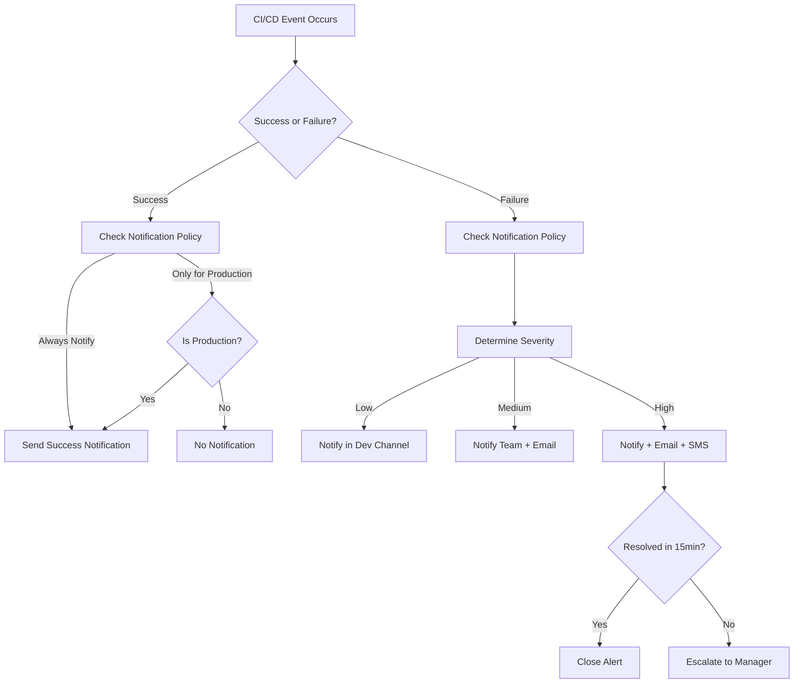

# CICD Notification Automation

## Introduction

In the world of continuous integration and continuous deployment (CI/CD), maintaining clear communication across development teams is crucial. CICD Notification Automation refers to the practice of automatically sending alerts and updates about the status of your build, test, and deployment processes to relevant stakeholders. These notifications ensure everyone stays informed about the health and progress of your software delivery pipeline without manual intervention.

Implementing notification automation in your CI/CD pipeline provides several benefits:

- **Real-time awareness**: Team members get instant updates on build failures, successful deployments, or pipeline blockages
- **Faster response times**: Issues are addressed more quickly when the right people are notified immediately
- **Improved accountability**: Clear visibility into who needs to take action when problems arise
- **Reduced context switching**: Developers don't need to constantly check dashboards or logs to stay informed

## Common Notification Channels

Before diving into implementation, let's explore the common channels used for CI/CD notifications:

| Channel | Best For | Considerations |
|---------|----------|----------------|
| Email | Detailed reports, non-urgent notifications | May be overlooked in busy inboxes |
| Slack/Teams | Team-wide updates, immediate attention | Can create noise if overused |
| SMS | Critical alerts, on-call notifications | Should be reserved for high-priority issues |
| Mobile push notifications | Time-sensitive updates | Requires a dedicated app |
| Webhook integrations | Custom applications, dashboards | More complex to implement but highly flexible |

## Basic Implementation

Let's start with a simple example using GitHub Actions to send Slack notifications when a build fails:

```yaml
name: Build and Notify

on:
  push:
    branches: [ main ]
  pull_request:
    branches: [ main ]

jobs:
  build:
    runs-on: ubuntu-latest
    steps:
      - uses: actions/checkout@v3
      
      - name: Set up Node.js
        uses: actions/setup-node@v3
        with:
          node-version: '16'
          
      - name: Install dependencies
        run: npm install
      
      - name: Build project
        run: npm run build
      
      - name: Run tests
        run: npm test
      
      - name: Notify on failure
        if: ${{ failure() }}
        uses: rtCamp/action-slack-notify@v2
        env:
          SLACK_WEBHOOK: ${{ secrets.SLACK_WEBHOOK }}
          SLACK_CHANNEL: build-alerts
          SLACK_COLOR: danger
          SLACK_TITLE: Build Failed
          SLACK_MESSAGE: "Build failed in ${{ github.repository }} on branch ${{ github.ref_name }}"
```

In this example:
1. We define a basic GitHub Actions workflow that builds and tests a Node.js project
2. If any step fails, the "Notify on failure" step executes
3. It sends a formatted message to a Slack channel with details about the failure

## Implementing Advanced Notification Strategies

As your CI/CD pipeline matures, you'll likely want more sophisticated notification patterns. Let's explore some advanced strategies:

### 1. Contextual Notifications

Different events might require different notification channels or recipients. Here's how to implement contextual notifications in Jenkins:

```groovy
pipeline {
    agent any
    
    stages {
        stage('Build') {
            steps {
                echo 'Building..'
                // Build commands here
            }
        }
        stage('Test') {
            steps {
                echo 'Testing..'
                // Test commands here
            }
        }
        stage('Deploy') {
            steps {
                echo 'Deploying..'
                // Deploy commands here
            }
        }
    }
    
    post {
        success {
            script {
                if (env.BRANCH_NAME == 'main') {
                    // Production deployment succeeded - notify entire team
                    slackSend channel: '#deployments',
                              color: 'good',
                              message: "✅ Production deployment successful!"
                } else {
                    // Dev deployment - just notify in developer channel
                    slackSend channel: '#dev-updates',
                              color: 'good',
                              message: "✅ Dev build for branch ${env.BRANCH_NAME} deployed successfully"
                }
            }
        }
        failure {
            script {
                if (env.BRANCH_NAME == 'main') {
                    // Critical failure - email and Slack
                    emailext subject: "URGENT: Production build failed",
                              body: "Production build failed. Check ${env.BUILD_URL} for details.",
                              to: "ops-team@example.com, dev-leads@example.com"
                              
                    slackSend channel: '#alerts',
                              color: 'danger',
                              message: "🚨 URGENT: Production build failed! <${env.BUILD_URL}|View details>"
                } else {
                    // Non-critical failure - just Slack
                    slackSend channel: '#dev-updates',
                              color: 'warning',
                              message: "⚠️ Build failed for branch ${env.BRANCH_NAME}. <${env.BUILD_URL}|View details>"
                }
            }
        }
    }
}
```

This example demonstrates:
- Different notification strategies based on the branch (main vs. feature branches)
- Using multiple notification channels (Slack and email) for critical failures
- Formatting messages differently based on severity

### 2. Personalized Notifications

In larger teams, you might want to notify specific developers based on who made changes:

```yaml
# GitLab CI example
stages:
  - build
  - test
  - deploy

build:
  stage: build
  script:
    - echo "Building..."
    # Build commands here
  
test:
  stage: test
  script:
    - echo "Testing..."
    # Test commands here

deploy:
  stage: deploy
  script:
    - echo "Deploying..."
    # Deploy commands here
  
.notify_failure:
  after_script:
    - |
      if [ $CI_JOB_STATUS == "failed" ]; then
        # Get the author of the last commit
        AUTHOR_EMAIL=$(git show -s --format='%ae' $CI_COMMIT_SHA)
        
        # Send Slack notification mentioning the author
        curl -X POST -H 'Content-type: application/json' \
          --data "{
            \"text\": \"❌ Pipeline failed for $CI_PROJECT_PATH on stage $CI_JOB_STAGE.\",
            \"blocks\": [
              {
                \"type\": \"section\",
                \"text\": {
                  \"type\": \"mrkdwn\",
                  \"text\": \"❌ Pipeline failed for $CI_PROJECT_PATH on stage $CI_JOB_STAGE.\"
                }
              },
              {
                \"type\": \"section\",
                \"text\": {
                  \"type\": \"mrkdwn\",
                  \"text\": \"Committer: $AUTHOR_EMAIL\"
                }
              },
              {
                \"type\": \"actions\",
                \"elements\": [
                  {
                    \"type\": \"button\",
                    \"text\": {
                      \"type\": \"plain_text\",
                      \"text\": \"View Pipeline\"
                    },
                    \"url\": \"$CI_PIPELINE_URL\"
                  }
                ]
              }
            ]
          }" $SLACK_WEBHOOK_URL
      fi

# Extend all stages with notification
build:
  extends: .notify_failure

test:
  extends: .notify_failure

deploy:
  extends: .notify_failure
```

This GitLab CI example:
1. Defines a reusable notification template as `.notify_failure`
2. Extends all jobs with this template
3. Identifies the committer who might have caused a failure
4. Creates a rich Slack notification with buttons linking to the pipeline

### 3. Progressive Notification Escalation

For critical systems, you might implement an escalation strategy:

```python
# Example notification script for progressive escalation
# Save as notify.py in your CI/CD system

import requests
import sys
import time
import os
from datetime import datetime

def send_slack_notification(message, channel):
    webhook_url = os.environ.get('SLACK_WEBHOOK')
    requests.post(webhook_url, json={
        "channel": channel,
        "text": message
    })

def send_email(subject, message, recipients):
    # Email sending code here (using SMTP or a service like SendGrid)
    pass

def send_sms(message, phone_numbers):
    # SMS sending code here (using a service like Twilio)
    pass

# Get details from CI environment
pipeline_url = os.environ.get('CI_PIPELINE_URL', 'Unknown pipeline')
project = os.environ.get('CI_PROJECT_NAME', 'Unknown project')
stage = os.environ.get('CI_JOB_STAGE', 'Unknown stage')
status = sys.argv[1] if len(sys.argv) > 1 else 'unknown'

if status == 'failed':
    # First level - Slack notification to team
    send_slack_notification(
        f"⚠️ Pipeline failed for {project} at {stage} stage. {pipeline_url}",
        "#dev-team"
    )
    
    # Wait 15 minutes to see if someone acknowledges
    time.sleep(900)
    
    # Check if issue is acknowledged (this would check a DB or API in a real system)
    # For demo, we're just proceeding with escalation
    
    # Second level - Email to team leads
    send_email(
        f"ALERT: Unacknowledged failure in {project}",
        f"A failure in the {stage} stage of {project} has not been acknowledged for 15 minutes.

Details: {pipeline_url}",
        ["team-lead@example.com", "devops-lead@example.com"]
    )
    
    # Wait 15 more minutes
    time.sleep(900)
    
    # Third level - SMS to on-call engineer
    send_sms(
        f"URGENT: Critical failure in {project} pipeline unresolved for 30 min. {pipeline_url}",
        ["+1234567890"]
    )
```

To use this script in a CI/CD pipeline, you would call it when a failure occurs and ensure it runs in the background or as a separate job that can wait between notifications.

## Visualizing Notification Flow

Let's visualize how a notification system might work in a CI/CD pipeline:



## Implementing Notification Templates

To maintain consistency in your notifications, create templates that can be reused across different CI/CD systems:

```javascript
// notification-template.js - A reusable template for consistent notifications

function generateSlackNotification(event) {
  const { status, project, branch, commit, url, author, stage } = event;
  
  // Set color based on status
  const color = status === 'success' ? '#36a64f' : 
                status === 'warning' ? '#f2c744' : 
                '#d9230f';
  
  // Set emoji based on status  
  const emoji = status === 'success' ? '✅' : 
               status === 'warning' ? '⚠️' : 
               '❌';
  
  // Generate a message with consistent formatting
  return {
    attachments: [{
      color: color,
      blocks: [
        {
          type: "header",
          text: {
            type: "plain_text",
            text: `${emoji} ${project} - ${stage} ${status.toUpperCase()}`
          }
        },
        {
          type: "section",
          fields: [
            {
              type: "mrkdwn",
              text: `*Branch:*
${branch}`
            },
            {
              type: "mrkdwn",
              text: `*Author:*
${author}`
            }
          ]
        },
        {
          type: "section",
          fields: [
            {
              type: "mrkdwn",
              text: `*Commit:*
${commit.substring(0, 8)}`
            }
          ]
        },
        {
          type: "actions",
          elements: [
            {
              type: "button",
              text: {
                type: "plain_text",
                text: "View Details"
              },
              url: url
            }
          ]
        }
      ]
    }]
  };
}

module.exports = { generateSlackNotification };
```

You can then use this template in any CI/CD system by importing and calling the function with the appropriate event details.

## Real-World Use Cases

### Case 1: Notifying Only on Status Change

Sometimes you only want to be notified when the status changes, not on every run:

```yaml
# Azure DevOps Pipeline example
trigger:
- main

pool:
  vmImage: 'ubuntu-latest'

variables:
  # Store previous build status in a pipeline variable
  previousStatus: $[variables['Build.PreviousStatus']]

steps:
- script: |
    echo "Building application..."
    # Your build commands here
  displayName: 'Build'

- script: |
    echo "Running tests..."
    # Your test commands here
  displayName: 'Test'

- task: PowerShell@2
  condition: and(succeeded(), ne(variables['previousStatus'], 'succeeded'))
  inputs:
    targetType: 'inline'
    script: |
      $body = @{
        text = "✅ Build for $(Build.Repository.Name) has recovered and is now passing!"
      } | ConvertTo-Json
      
      Invoke-RestMethod -Uri "$(SLACK_WEBHOOK)" -Method Post -Body $body -ContentType 'application/json'
  displayName: 'Notify on Recovery'

- task: PowerShell@2
  condition: and(failed(), ne(variables['previousStatus'], 'failed'))
  inputs:
    targetType: 'inline'
    script: |
      $body = @{
        text = "❌ Build for $(Build.Repository.Name) has started failing! $(Build.BuildUri)"
      } | ConvertTo-Json
      
      Invoke-RestMethod -Uri "$(SLACK_WEBHOOK)" -Method Post -Body $body -ContentType 'application/json'
  displayName: 'Notify on New Failure'
```

This Azure DevOps example:
1. Tracks the previous build status
2. Only sends notifications when the status changes from failing to passing or vice versa
3. Reduces notification noise by eliminating duplicate alerts

### Case 2: Build Insights with Performance Metrics

Go beyond simple pass/fail notifications by including performance metrics:

```python
# performance-notification.py

import requests
import json
import os
import time

# Collect key metrics
build_time = time.time() - float(os.environ.get('CI_PIPELINE_CREATED_AT', time.time()))
test_count = int(os.environ.get('TEST_COUNT', 0))
test_duration = float(os.environ.get('TEST_DURATION', 0))
code_coverage = float(os.environ.get('CODE_COVERAGE', 0))

# Compare to previous build
prev_build_time = float(os.environ.get('PREV_BUILD_TIME', build_time))
build_time_diff = ((build_time - prev_build_time) / prev_build_time) * 100 if prev_build_time > 0 else 0

# Generate performance summary
performance_summary = {
    "build_time": round(build_time, 2),
    "build_time_change": f"{round(build_time_diff, 1)}%",
    "test_count": test_count,
    "test_duration": round(test_duration, 2),
    "code_coverage": f"{round(code_coverage, 2)}%"
}

# Format message with performance insights
webhook_url = os.environ.get('SLACK_WEBHOOK')
message = {
    "blocks": [
        {
            "type": "header",
            "text": {
                "type": "plain_text",
                "text": f"✅ Build Succeeded: {os.environ.get('CI_PROJECT_NAME', 'Project')}"
            }
        },
        {
            "type": "section",
            "text": {
                "type": "mrkdwn",
                "text": "*Build Performance Metrics:*"
            }
        },
        {
            "type": "section",
            "fields": [
                {
                    "type": "mrkdwn",
                    "text": f"*Build Time:*
{performance_summary['build_time']}s ({performance_summary['build_time_change']})"
                },
                {
                    "type": "mrkdwn",
                    "text": f"*Tests:*
{performance_summary['test_count']} tests in {performance_summary['test_duration']}s"
                },
                {
                    "type": "mrkdwn",
                    "text": f"*Code Coverage:*
{performance_summary['code_coverage']}"
                }
            ]
        },
        {
            "type": "actions",
            "elements": [
                {
                    "type": "button",
                    "text": {
                        "type": "plain_text",
                        "text": "View Pipeline"
                    },
                    "url": os.environ.get('CI_PIPELINE_URL', '#')
                }
            ]
        }
    ]
}

# Send the notification
requests.post(webhook_url, json=message)
```

This script:
1. Collects performance metrics from environment variables set by your CI system
2. Compares current build time to previous builds
3. Creates a rich notification with insights beyond just success/failure
4. Helps teams identify performance trends in their CI/CD pipeline

## Best Practices for CI/CD Notifications

To make the most of your notification system:

1. **Avoid notification fatigue**: Be selective about what events trigger notifications
2. **Use appropriate channels**: Not every notification deserves an SMS or phone call
3. **Include actionable information**: Notifications should tell recipients what they need to do
4. **Provide context**: Include relevant details like commit messages, authors, and change scope
5. **Group related notifications**: Batch related events to reduce interruptions
6. **Use a consistent format**: Standardize how your notifications look across systems
7. **Include direct links**: Make it easy to navigate to the relevant build, commit, or issue
8. **Monitor notification effectiveness**: Track how quickly issues are addressed after notifications

## Setting Up a Notification Hub

For larger organizations, consider implementing a centralized notification hub:

```javascript
// notification-hub.js - A simple notification router

const express = require('express');
const app = express();
app.use(express.json());

// Import notification providers
const slackNotifier = require('./providers/slack');
const emailNotifier = require('./providers/email');
const smsNotifier = require('./providers/sms');
const teamsNotifier = require('./providers/teams');

// Notification routing rules
const routingRules = {
  'production-deploy': {
    channels: ['slack:engineering', 'email:product-team@example.com'],
    template: 'deployment'
  },
  'test-failure': {
    channels: ['slack:dev-team'],
    template: 'test-failure'
  },
  'security-scan': {
    channels: ['slack:security', 'email:security@example.com'],
    template: 'security'
  },
  'performance-degradation': {
    channels: ['slack:performance'],
    template: 'performance-alert'
  }
};

// Endpoint for receiving notifications
app.post('/notify', async (req, res) => {
  try {
    const { event, data } = req.body;
    
    // Get routing rules for this event type
    const rules = routingRules[event] || routingRules['default'];
    
    // Send to each channel according to rules
    if (!rules) {
      return res.status(400).json({ error: 'Unknown event type' });
    }
    
    const promises = rules.channels.map(channelSpec => {
      const [provider, target] = channelSpec.split(':');
      
      // Select the appropriate provider
      let notifier;
      switch (provider) {
        case 'slack':
          notifier = slackNotifier;
          break;
        case 'email':
          notifier = emailNotifier;
          break;
        case 'sms':
          notifier = smsNotifier;
          break;
        case 'teams':
          notifier = teamsNotifier;
          break;
        default:
          console.warn(`Unknown provider: ${provider}`);
          return Promise.resolve();
      }
      
      // Send notification using the selected provider and template
      return notifier.send(target, rules.template, data);
    });
    
    await Promise.all(promises);
    res.json({ success: true });
  } catch (error) {
    console.error('Failed to process notification:', error);
    res.status(500).json({ error: 'Failed to process notification' });
  }
});

// Start the server
const PORT = process.env.PORT || 3000;
app.listen(PORT, () => {
  console.log(`Notification hub running on port ${PORT}`);
});
```

To use this hub, your CI/CD systems would send POST requests to the `/notify` endpoint with the event type and relevant data.

## Summary

CICD Notification Automation is an essential component of modern development workflows that:

1. Keeps stakeholders informed about pipeline status
2. Ensures rapid response to failures
3. Provides context for pipeline events
4. Reduces manual monitoring overhead

By implementing the strategies and examples shown in this guide, you can create a notification system that:

- Delivers the right information to the right people at the right time
- Scales with your team and project complexity
- Reduces alert fatigue while ensuring critical issues are addressed
- Provides valuable insights beyond simple success/failure states

Remember that effective notifications are not about sending more alerts—they're about sending smarter, more actionable information when it matters most.

## Additional Resources

- **Learn More About CI/CD**:
  - [Continuous Integration Best Practices](https://martinfowler.com/articles/continuousIntegration.html) by Martin Fowler
  - [The DevOps Handbook](https://itrevolution.com/product/the-devops-handbook/) by Gene Kim et al.

- **Notification Libraries and Tools**:
  - Slack API: [api.slack.com](https://api.slack.com/)
  - Microsoft Teams Webhooks: [docs.microsoft.com/en-us/microsoftteams/platform/webhooks-and-connectors/how-to/add-incoming-webhook](https://docs.microsoft.com/en-us/microsoftteams/platform/webhooks-and-connectors/how-to/add-incoming-webhook)
  - Email JS: [emailjs.com](https://www.emailjs.com/)

## Exercises

1. **Basic Implementation**: Set up a simple notification system in GitHub Actions that sends Slack messages when your tests fail.

2. **Channel Selection**: Modify an existing CI/CD pipeline to send notifications to different channels based on the branch or environment.

3. **Enhanced Notifications**: Add build performance metrics to your notifications, including build time, test count, and code coverage.

4. **Escalation System**: Implement a progressive notification system that escalates alerts if they're not acknowledged within a certain timeframe.

5. **Custom Dashboard**: Create a simple web dashboard that displays the status of your pipelines and recent notifications.