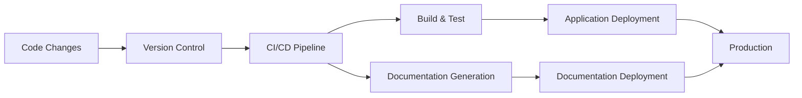

# CI/CD Documentation Automation

## Introduction

Documentation is often treated as an afterthought in software development, resulting in outdated or missing information that frustrates developers and users alike. CI/CD Documentation Automation addresses this problem by integrating documentation generation, validation, and deployment directly into your continuous integration and delivery pipeline.

By automating documentation processes, you ensure that:
- Documentation stays in sync with code changes
- Technical content is consistently formatted and validated
- Documentation is deployed alongside your application
- Team members can focus on writing quality content rather than manual publishing tasks

This guide will help beginners understand how to implement documentation automation in their CI/CD workflows, with practical examples and step-by-step instructions.

## Understanding Documentation Automation

Documentation automation involves treating your documentation as code ("docs-as-code"), applying the same development principles to your documentation that you apply to your software:

<div className="mermaid-wrapper">



</div>

## Key Components of Documentation Automation

### 1. Documentation Formats and Tools

Several documentation formats and tools support automation:

| Format/Tool | Best For | Automation-Friendly Features |
|-------------|----------|------------------------------|
| Markdown | General documentation | Plain text, version control friendly |
| AsciiDoc | Technical documentation | Rich features, extensible |
| Docusaurus | Documentation websites | React-based, MDX support |
| MkDocs | Simple documentation sites | Python-based, easy configuration |
| Sphinx | API documentation | Auto-generation from docstrings |
| Swagger/OpenAPI | API specifications | Can generate from code annotations |

### 2. Setting Up a Documentation Repository

Documentation can be stored in:
- The same repository as your code (monorepo approach)
- A separate repository dedicated to documentation

Here's how to structure a documentation directory within your project:

```
project-root/
├── src/
├── tests/
├── docs/
│   ├── getting-started.md
│   ├── api/
│   │   └── reference.md
│   ├── tutorials/
│   │   └── first-steps.md
│   ├── images/
│   └── _sidebar.md
└── .github/workflows/
    └── docs-pipeline.yml
```

## Implementing Documentation Automation

Let's walk through implementing documentation automation in your CI/CD pipeline step by step.

### Step 1: Choose Documentation Tools

For this example, we'll use:
- Docusaurus for our documentation site
- GitHub Actions for our CI/CD pipeline
- Markdown and MDX for content

### Step 2: Set Up Docusaurus

First, initialize a Docusaurus project:

```bash
npx create-docusaurus@latest my-docs classic
cd my-docs
```

Your project will have this structure:

```
my-docs/
├── blog/
├── docs/
├── src/
├── static/
├── docusaurus.config.js
├── package.json
└── sidebars.js
```

### Step 3: Create a CI/CD Workflow for Documentation

Create a GitHub Actions workflow file `.github/workflows/documentation.yml`:

```yaml
name: Documentation CI/CD

on:
  push:
    branches: [main]
    paths:
      - 'docs/**'
      - 'docusaurus.config.js'
      - 'package.json'
      - '.github/workflows/documentation.yml'
  pull_request:
    branches: [main]
    paths:
      - 'docs/**'
      - 'docusaurus.config.js'
      - 'package.json'

jobs:
  build-and-deploy:
    runs-on: ubuntu-latest
    steps:
      - uses: actions/checkout@v3
      
      - name: Setup Node.js
        uses: actions/setup-node@v3
        with:
          node-version: '18'
          cache: 'npm'
      
      - name: Install dependencies
        run: npm ci
      
      - name: Check for broken links
        run: npm run docusaurus doctor
      
      - name: Build documentation
        run: npm run build
      
      - name: Deploy to GitHub Pages
        if: github.event_name != 'pull_request'
        uses: peaceiris/actions-gh-pages@v3
        with:
          github_token: ${{ secrets.GITHUB_TOKEN }}
          publish_dir: ./build
```

This workflow:
1. Triggers when changes are made to documentation files
2. Sets up Node.js and installs dependencies
3. Checks for broken links in the documentation
4. Builds the documentation site
5. Deploys to GitHub Pages (only on pushes to main, not pull requests)

### Step 4: Enhance with Documentation Validation

Add a linting step to ensure consistent documentation quality:

```yaml
- name: Install markdownlint
  run: npm install -g markdownlint-cli

- name: Lint documentation files
  run: markdownlint 'docs/**/*.md' --config .markdownlint.json
```

Create a `.markdownlint.json` file:

```json
{
  "default": true,
  "MD013": false,
  "MD033": false,
  "MD041": false
}
```

### Step 5: Automatic API Documentation Generation

For code with comments, automate API documentation generation. Here's an example for a JavaScript project using JSDoc:

1. Install JSDoc:

```bash
npm install --save-dev jsdoc
```

2. Create a JSDoc configuration file `jsdoc.json`:

```json
{
  "source": {
    "include": ["src"],
    "includePattern": ".+\\.js(x)?$"
  },
  "opts": {
    "destination": "docs/api",
    "recurse": true
  }
}
```

3. Add to your CI/CD workflow:

```yaml
- name: Generate API documentation
  run: npx jsdoc -c jsdoc.json
```

## Real-World Examples

### Example 1: Versioned Documentation for Software Releases

Let's automate documentation versioning when releasing new software versions:

```yaml
name: Release Documentation

on:
  release:
    types: [published]

jobs:
  update-docs:
    runs-on: ubuntu-latest
    steps:
      - uses: actions/checkout@v3
      
      - name: Setup Node.js
        uses: actions/setup-node@v3
        with:
          node-version: '18'
      
      - name: Install dependencies
        run: npm ci
      
      - name: Create new documentation version
        run: |
          # Extract version from GitHub release
          VERSION=${GITHUB_REF#refs/tags/}
          
          # Create new Docusaurus version
          npm run docusaurus docs:version $VERSION
      
      - name: Build documentation
        run: npm run build
      
      - name: Deploy to GitHub Pages
        uses: peaceiris/actions-gh-pages@v3
        with:
          github_token: ${{ secrets.GITHUB_TOKEN }}
          publish_dir: ./build
```

### Example 2: Automated Release Notes Generation

Automate generating release notes from commit messages and pull requests:

```yaml
- name: Generate Release Notes
  id: release_notes
  uses: mikepenz/release-changelog-builder-action@v3
  with:
    configuration: "release-notes-config.json"
    outputFile: "docs/release-notes/version-${{ github.ref_name }}.md"
  env:
    GITHUB_TOKEN: ${{ secrets.GITHUB_TOKEN }}
```

With `release-notes-config.json`:

```json
{
  "categories": [
    {
      "title": "## 🚀 Features",
      "labels": ["feature", "enhancement"]
    },
    {
      "title": "## 🐛 Fixes",
      "labels": ["fix", "bugfix", "bug"]
    },
    {
      "title": "## 📝 Documentation",
      "labels": ["documentation"]
    }
  ],
  "template": "# Release Notes for v${{version}}

${{changes}}"
}
```

### Example 3: Automated Screenshot Generation for UI Documentation

For UI-based applications, automate taking screenshots for documentation:

```yaml
- name: Install Puppeteer
  run: npm install --save-dev puppeteer

- name: Generate screenshots
  run: node scripts/generate-screenshots.js

- name: Copy screenshots to docs folder
  run: cp -r screenshots/ docs/images/
```

With `scripts/generate-screenshots.js`:

```javascript
const puppeteer = require('puppeteer');
const fs = require('fs');

// Ensure screenshots directory exists
if (!fs.existsSync('screenshots')) {
  fs.mkdirSync('screenshots');
}

(async () => {
  const browser = await puppeteer.launch();
  const page = await browser.newPage();
  
  // Set viewport size
  await page.setViewport({ width: 1280, height: 800 });
  
  // Navigate to your application
  await page.goto('http://localhost:3000');
  
  // Take screenshot of the homepage
  await page.screenshot({ path: 'screenshots/homepage.png' });
  
  // Navigate to other pages and take screenshots
  await page.goto('http://localhost:3000/dashboard');
  await page.screenshot({ path: 'screenshots/dashboard.png' });
  
  await browser.close();
})();
```

## Advanced Documentation Automation Techniques

### Automated Code Example Testing

Ensure that code examples in your documentation actually work by testing them:

```yaml
- name: Extract and test code examples
  run: node scripts/test-code-examples.js
```

With `scripts/test-code-examples.js`:

```javascript
const fs = require('fs');
const path = require('path');
const { execSync } = require('child_process');

// Find all markdown files
const findMarkdownFiles = (dir) => {
  let results = [];
  const files = fs.readdirSync(dir);
  
  files.forEach(file => {
    const filePath = path.join(dir, file);
    const stat = fs.statSync(filePath);
    
    if (stat.isDirectory()) {
      results = results.concat(findMarkdownFiles(filePath));
    } else if (path.extname(file) === '.md' || path.extname(file) === '.mdx') {
      results.push(filePath);
    }
  });
  
  return results;
};

// Extract code blocks from markdown file
const extractCodeBlocks = (filePath) => {
  const content = fs.readFileSync(filePath, 'utf8');
  const codeBlockRegex = /```(\w+)
([\s\S]*?)```/g;
  const codeBlocks = [];
  let match;
  
  while ((match = codeBlockRegex.exec(content)) !== null) {
    const language = match[1];
    const code = match[2];
    
    if (language === 'javascript' || language === 'js') {
      codeBlocks.push(code);
    }
  }
  
  return codeBlocks;
};

// Test JavaScript code blocks
const testCodeBlocks = (codeBlocks, index) => {
  if (codeBlocks.length === 0) return;
  
  const tempFile = `temp-code-example-${index}.js`;
  
  codeBlocks.forEach((code, i) => {
    // Skip import statements as they'll fail in isolation
    if (code.includes('import ') || code.includes('require(')) {
      console.log(`Skipping code block with imports/requires`);
      return;
    }
    
    try {
      fs.writeFileSync(tempFile, code);
      execSync(`node ${tempFile}`, { stdio: 'pipe' });
      console.log(`✅ Code example ${i+1} passed`);
    } catch (error) {
      console.error(`❌ Code example ${i+1} failed: ${error.message}`);
      process.exit(1);
    } finally {
      if (fs.existsSync(tempFile)) {
        fs.unlinkSync(tempFile);
      }
    }
  });
};

// Main execution
const docsDir = path.join(__dirname, '../docs');
const markdownFiles = findMarkdownFiles(docsDir);

markdownFiles.forEach((file, fileIndex) => {
  console.log(`Testing code examples in ${file}`);
  const codeBlocks = extractCodeBlocks(file);
  testCodeBlocks(codeBlocks, fileIndex);
});
```

### Dynamic Documentation from OpenAPI Specifications

For API documentation, generate documentation automatically from OpenAPI specs:

```yaml
- name: Generate OpenAPI documentation
  run: |
    npm install -g @redocly/cli
    redocly build-docs api/openapi.yaml -o docs/api/index.html
```

## Common Challenges and Solutions

### Challenge 1: Documentation for Private Code

When working with private repositories, you need to set up proper authentication:

```yaml
- name: Configure Git for private packages
  run: |
    git config --global url."https://${GITHUB_TOKEN}@github.com/".insteadOf "https://github.com/"
  env:
    GITHUB_TOKEN: ${{ secrets.GITHUB_TOKEN }}
```

### Challenge 2: Large Documentation Sets

For large documentation sets, implement incremental builds:

```yaml
- name: Check for changed files
  id: changed_files
  run: |
    if [ "${{ github.event_name }}" == "pull_request" ]; then
      CHANGED_FILES=$(git diff --name-only origin/${{ github.base_ref }}..HEAD -- docs/)
    else
      CHANGED_FILES=$(git diff --name-only ${{ github.event.before }} ${{ github.sha }} -- docs/)
    fi
    echo "::set-output name=files::$CHANGED_FILES"

- name: Incremental documentation build
  if: steps.changed_files.outputs.files != ''
  run: npm run docusaurus -- build --out-dir build-incremental --contents docs/
```

### Challenge 3: Multi-Language Documentation

For projects requiring documentation in multiple languages:

```yaml
- name: Build documentation in all languages
  run: |
    # Build English (default)
    npm run build
    
    # Build Spanish
    npm run build -- --locale es
    
    # Build French
    npm run build -- --locale fr
    
    # Merge all builds
    mkdir -p build/es
    mkdir -p build/fr
    cp -r build-es/* build/es/
    cp -r build-fr/* build/fr/
```

## Summary

CI/CD Documentation Automation transforms documentation from a manual, often neglected task into an integrated part of your development workflow. By implementing the techniques covered in this guide, you can:

1. Ensure documentation stays current with code changes
2. Validate documentation quality automatically
3. Generate technical documentation from code
4. Deploy documentation alongside your applications
5. Version documentation to match software releases

This approach not only improves the quality and reliability of your documentation but also frees developers to focus on writing great code and clear explanations rather than wrestling with manual publishing processes.

## Exercises and Next Steps

### Exercise 1: Set Up Basic Documentation CI/CD

Create a basic documentation automation pipeline for an existing project:
1. Initialize a Docusaurus project
2. Write documentation for at least two features
3. Set up a GitHub Actions workflow to build and deploy the documentation

### Exercise 2: Implement Documentation Linting

Add documentation linting to your CI pipeline:
1. Install and configure markdownlint
2. Add custom rules specific to your project's style guide
3. Fix any linting issues in your documentation

### Exercise 3: Automate API Documentation

For a project with an API:
1. Add JSDoc or similar comments to your code
2. Configure automatic API documentation generation
3. Integrate API documentation into your main documentation site

### Additional Resources

- [Docusaurus Documentation](https://docusaurus.io/docs)
- [GitHub Actions Documentation](https://docs.github.com/en/actions)
- [Write the Docs Guide](https://www.writethedocs.org/guide/)
- [OpenAPI Specification](https://swagger.io/specification/)
- [JSDoc Documentation](https://jsdoc.app/)

By embracing documentation automation as part of your CI/CD pipeline, you're not just improving your documentation—you're improving your entire software development process.