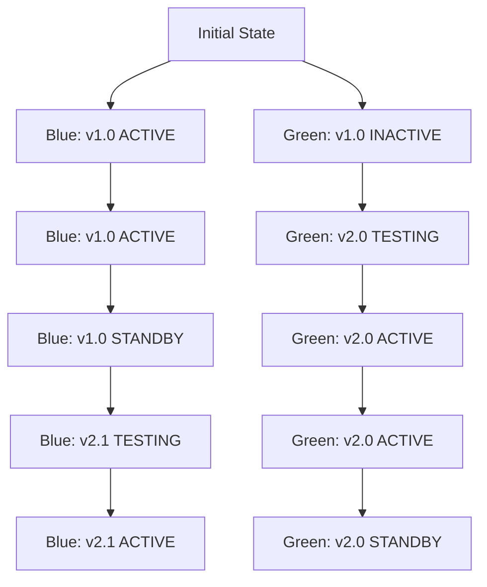

# CICD Blue-Green Deployment

## Introduction

Blue-Green deployment is a powerful CI/CD deployment strategy that aims to eliminate downtime during application updates while minimizing deployment risk. In a traditional deployment process, updating an application often requires taking it offline temporarily, leading to service disruptions. Blue-Green deployment solves this problem by maintaining two identical production environments, called "Blue" and "Green."

At any time, only one environment is live and serving production traffic, while the other remains idle. When it's time to deploy a new version, you update the idle environment and thoroughly test it before switching traffic from the current live environment to the newly updated one. This approach allows for instant rollbacks if issues arise and ensures zero downtime for your users.

## How Blue-Green Deployment Works

The basic process of Blue-Green deployment follows these steps:

1. **Set up two identical environments**: Blue and Green
2. **Route all traffic to one environment**: Initially, all users access the Blue environment
3. **Deploy new code to the inactive environment**: Update the Green environment
4. **Test the updated environment**: Ensure everything works correctly
5. **Switch traffic**: Redirect all users from Blue to Green
6. **Monitor the new live environment**: Verify the deployment was successful
7. **Keep the previous environment as backup**: For quick rollback if needed

Let's visualize this process with a diagram:



## Benefits of Blue-Green Deployment

Blue-Green deployment offers several advantages over traditional deployment methods:

1. **Zero downtime**: Users experience no service interruptions during updates
2. **Instant rollback**: If problems occur, you can immediately switch back to the previous environment
3. **Reduced risk**: Thoroughly test the new environment before directing users to it
4. **Simplified deployment**: The process is straightforward and can be automated
5. **Improved reliability**: Deploy with confidence knowing you have a safety net

## Implementing Blue-Green Deployment

Let's look at how to implement Blue-Green deployment using different tools and technologies.

### Basic Infrastructure Requirements

To implement Blue-Green deployment, you need:

- Two identical production environments
- A routing mechanism (load balancer, DNS, etc.) to switch traffic
- Automation for deployment and testing
- Monitoring to detect issues

### Using a Load Balancer

The most common way to implement Blue-Green deployment is using a load balancer to route traffic. Here's how to set it up with a basic Nginx configuration:

```nginx
# nginx.conf
http {
    upstream blue {
        server blue-app-1:8080;
        server blue-app-2:8080;
    }
    
    upstream green {
        server green-app-1:8080;
        server green-app-2:8080;
    }
    
    # Variable to control which environment is active
    # Can be changed without restarting Nginx
    map $cookie_environment $pool {
        default "blue";
        "green" "green";
    }
    
    server {
        listen 80;
        
        location / {
            proxy_pass http://$pool;
            proxy_set_header Host $host;
            proxy_set_header X-Real-IP $remote_addr;
        }
    }
}
```

To switch traffic from Blue to Green, you would update the default value in the map directive.

### Blue-Green Deployment with AWS

AWS provides several services that make Blue-Green deployment straightforward. Here's how to implement it using AWS Elastic Beanstalk:

```bash
# Create Blue environment
aws elasticbeanstalk create-environment \
    --application-name MyApp \
    --environment-name MyApp-Blue \
    --solution-stack-name "64bit Amazon Linux 2 v3.4.9 running Node.js 14" \
    --version-label v1.0

# Create Green environment
aws elasticbeanstalk create-environment \
    --application-name MyApp \
    --environment-name MyApp-Green \
    --solution-stack-name "64bit Amazon Linux 2 v3.4.9 running Node.js 14" \
    --version-label v1.0

# Deploy new version to Green
aws elasticbeanstalk update-environment \
    --environment-name MyApp-Green \
    --version-label v2.0

# Swap URLs (traffic switching)
aws elasticbeanstalk swap-environment-cnames \
    --source-environment-name MyApp-Blue \
    --destination-environment-name MyApp-Green
```

### Blue-Green Deployment with Kubernetes

Kubernetes makes Blue-Green deployment particularly elegant using its built-in Service and Deployment objects:

```yaml
# blue-deployment.yaml
apiVersion: apps/v1
kind: Deployment
metadata:
  name: my-app-blue
spec:
  replicas: 3
  selector:
    matchLabels:
      app: my-app
      version: blue
  template:
    metadata:
      labels:
        app: my-app
        version: blue
    spec:
      containers:
      - name: my-app
        image: my-app:1.0
        ports:
        - containerPort: 8080
---
# green-deployment.yaml
apiVersion: apps/v1
kind: Deployment
metadata:
  name: my-app-green
spec:
  replicas: 3
  selector:
    matchLabels:
      app: my-app
      version: green
  template:
    metadata:
      labels:
        app: my-app
        version: green
    spec:
      containers:
      - name: my-app
        image: my-app:2.0
        ports:
        - containerPort: 8080
---
# service.yaml
apiVersion: v1
kind: Service
metadata:
  name: my-app
spec:
  selector:
    app: my-app
    version: blue  # Initially route to blue
  ports:
  - port: 80
    targetPort: 8080
```

To switch traffic from Blue to Green, you would update the `version` selector in the Service from `blue` to `green`:

```bash
kubectl patch service my-app -p '{"spec":{"selector":{"version":"green"}}}'
```

## Real-World Example: Blue-Green Deployment Pipeline

Let's create a complete CI/CD pipeline for Blue-Green deployment using GitHub Actions and AWS:

```yaml
# .github/workflows/blue-green-deploy.yml
name: Blue-Green Deployment

on:
  push:
    branches: [ main ]

jobs:
  deploy:
    runs-on: ubuntu-latest
    steps:
      - uses: actions/checkout@v2
      
      - name: Configure AWS credentials
        uses: aws-actions/configure-aws-credentials@v1
        with:
          aws-access-key-id: ${{ secrets.AWS_ACCESS_KEY_ID }}
          aws-secret-access-key: ${{ secrets.AWS_SECRET_ACCESS_KEY }}
          aws-region: us-east-1
      
      - name: Determine inactive environment
        run: |
          ACTIVE_ENV=$(aws elasticbeanstalk describe-environments --application-name MyApp --query "Environments[?Status=='Ready' && CNAME=='myapp.elasticbeanstalk.com'].EnvironmentName" --output text)
          if [ "$ACTIVE_ENV" == "MyApp-Blue" ]; then
            echo "DEPLOY_ENV=MyApp-Green" >> $GITHUB_ENV
          else
            echo "DEPLOY_ENV=MyApp-Blue" >> $GITHUB_ENV
          fi
      
      - name: Build and package application
        run: |
          npm install
          npm run build
          zip -r application.zip .
      
      - name: Deploy to inactive environment
        run: |
          aws s3 cp application.zip s3://myapp-deployments/application-${{ github.sha }}.zip
          aws elasticbeanstalk create-application-version \
            --application-name MyApp \
            --version-label ${{ github.sha }} \
            --source-bundle S3Bucket="myapp-deployments",S3Key="application-${{ github.sha }}.zip"
          aws elasticbeanstalk update-environment \
            --environment-name ${{ env.DEPLOY_ENV }} \
            --version-label ${{ github.sha }}
      
      - name: Run smoke tests
        run: |
          ENV_URL=$(aws elasticbeanstalk describe-environments --environment-names ${{ env.DEPLOY_ENV }} --query "Environments[0].CNAME" --output text)
          ./run-tests.sh "http://$ENV_URL"
      
      - name: Switch traffic
        if: success()
        run: |
          ACTIVE_ENV=$(aws elasticbeanstalk describe-environments --application-name MyApp --query "Environments[?Status=='Ready' && CNAME=='myapp.elasticbeanstalk.com'].EnvironmentName" --output text)
          aws elasticbeanstalk swap-environment-cnames \
            --source-environment-name $ACTIVE_ENV \
            --destination-environment-name ${{ env.DEPLOY_ENV }}
```

This pipeline:
1. Determines which environment is currently inactive
2. Builds and packages the application
3. Deploys the new version to the inactive environment
4. Runs smoke tests to verify functionality
5. Switches traffic to the newly updated environment

## Common Challenges and Solutions

### Database Changes

One challenge with Blue-Green deployment is handling database schema changes. Here are some strategies:

1. **Backward and forward compatibility**: Design schema changes to work with both old and new application versions
2. **Decoupling database changes**: Deploy database changes separately from application changes
3. **Blue-Green for the database**: Maintain two databases and synchronize data

### Stateful Applications

For applications that maintain user sessions or other state:

1. **External session storage**: Use Redis, Memcached, or a database for session data
2. **Sticky sessions**: Configure the load balancer to route users consistently to the same environment
3. **Session draining**: Allow existing sessions to complete before fully decommissioning an environment

## Summary

Blue-Green deployment is a powerful technique that allows you to update your applications with zero downtime and minimal risk. By maintaining two identical environments and switching traffic between them, you can ensure a smooth deployment process and quick recovery from any issues.

The key points to remember are:
- Maintain two identical production environments (Blue and Green)
- Only one environment serves production traffic at a time
- Deploy new versions to the inactive environment
- Test thoroughly before switching traffic
- Keep the previous environment as a backup for quick rollback

## Exercises

1. Set up a basic Blue-Green deployment for a simple web application using Nginx as a load balancer.
2. Implement a Blue-Green deployment strategy in your preferred cloud provider (AWS, GCP, or Azure).
3. Create a CI/CD pipeline that automates the Blue-Green deployment process for a sample application.
4. Design a strategy for handling database schema changes in a Blue-Green deployment scenario.
5. Compare Blue-Green deployment with other deployment strategies like Canary Releases and Rolling Updates.

## Additional Resources

- [Martin Fowler's article on Blue-Green Deployment](https://martinfowler.com/bliki/BlueGreenDeployment.html)
- [AWS Blue-Green Deployments](https://aws.amazon.com/blogs/devops/blue-green-deployments-on-amazon-eks/)
- [Kubernetes Deployments](https://kubernetes.io/docs/concepts/workloads/controllers/deployment/)
- [Spinnaker Deployment Strategies](https://spinnaker.io/guides/user/kubernetes-v2/deploy-helm/)
- [GitHub Actions for CI/CD](https://docs.github.com/en/actions/guides/about-continuous-integration)