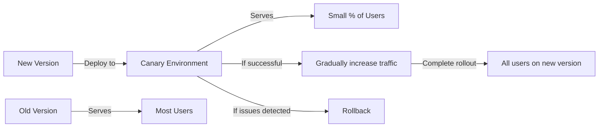

# CICD Canary Deployment

## Introduction

Canary deployment is a powerful risk-mitigation strategy in continuous integration and continuous deployment (CI/CD) pipelines. Named after the historical practice of coal miners using canaries to detect dangerous gases, this technique allows you to test new versions of your application with a small subset of users before rolling it out to everyone.

In this guide, we'll explore how canary deployments work, their benefits, and how to implement them in your CI/CD pipeline. By the end, you'll have a solid understanding of how to leverage this approach to safely deploy new features with minimal risk.

## What is a Canary Deployment?

Canary deployment is a technique where you gradually roll out changes to a small subset of users before making them available to the entire user base. This approach allows you to:

1. Test new features in production with real user traffic
2. Monitor for any issues or performance degradation
3. Roll back changes quickly if problems occur
4. Minimize the impact of potential failures

<br />



## Benefits of Canary Deployments

Canary deployments offer several advantages over traditional all-at-once deployment strategies:

- **Reduced Risk**: By limiting exposure of new code to a small percentage of users, you minimize the impact of potential bugs or issues.
- **Real-world Testing**: You get to test your application with actual user traffic and behavior patterns.
- **Progressive Rollout**: You can gradually increase the percentage of users receiving the new version as confidence builds.
- **Quick Rollback**: If issues arise, you can quickly revert to the previous stable version with minimal disruption.
- **Performance Monitoring**: You can compare performance metrics between the canary and stable versions side by side.

## How Canary Deployments Work

Let's break down the process step by step:

1. **Deploy the new version**: The updated application is deployed to a separate environment (the "canary").
2. **Route a small percentage of traffic**: A small portion of user traffic (often 5-10%) is directed to the canary version.
3. **Monitor and analyze**: Key metrics are closely monitored to compare the canary's performance against the stable version.
4. **Gradually increase traffic**: If the canary performs well, traffic is gradually increased to the new version.
5. **Complete the rollout**: Once confidence is high, 100% of traffic is shifted to the new version.
6. **Rollback if necessary**: If issues are detected at any point, traffic is immediately redirected back to the stable version.

## Implementing Canary Deployments

Let's look at practical examples of implementing canary deployments in different environments.

### Example 1: Kubernetes-based Canary Deployment

Kubernetes makes it relatively easy to implement canary deployments using its native features. Here's a step-by-step example:

1. First, let's create our stable deployment:

```yaml
# stable-deployment.yaml
apiVersion: apps/v1
kind: Deployment
metadata:
  name: myapp-stable
spec:
  replicas: 9
  selector:
    matchLabels:
      app: myapp
      version: stable
  template:
    metadata:
      labels:
        app: myapp
        version: stable
    spec:
      containers:
      - name: myapp
        image: myapp:1.0.0
        ports:
        - containerPort: 8080
```

2. Next, create the canary deployment:

```yaml
# canary-deployment.yaml
apiVersion: apps/v1
kind: Deployment
metadata:
  name: myapp-canary
spec:
  replicas: 1   # Only 1 replica for canary (10% of total)
  selector:
    matchLabels:
      app: myapp
      version: canary
  template:
    metadata:
      labels:
        app: myapp
        version: canary
    spec:
      containers:
      - name: myapp
        image: myapp:1.1.0  # New version
        ports:
        - containerPort: 8080
```

3. Create a service to route traffic to both deployments:

```yaml
# service.yaml
apiVersion: v1
kind: Service
metadata:
  name: myapp-service
spec:
  selector:
    app: myapp  # This matches both stable and canary pods
  ports:
  - port: 80
    targetPort: 8080
  type: LoadBalancer
```

In this example, we've created two deployments with the same app label but different version labels. By setting the canary to 1 replica and the stable to 9 replicas, approximately 10% of traffic will go to the canary version.

To gradually increase the canary traffic, you would update the replica counts:

```bash
# Increase canary to 3 replicas (25% of traffic)
kubectl scale deployment myapp-canary --replicas=3
kubectl scale deployment myapp-stable --replicas=9

# Later, increase to 50%
kubectl scale deployment myapp-canary --replicas=5
kubectl scale deployment myapp-stable --replicas=5

# Complete the rollout
kubectl scale deployment myapp-canary --replicas=10
kubectl scale deployment myapp-stable --replicas=0
```

### Example 2: Using Istio for Advanced Traffic Control

For more precise control over traffic routing, service mesh tools like Istio provide powerful capabilities:

```yaml
# virtual-service.yaml
apiVersion: networking.istio.io/v1alpha3
kind: VirtualService
metadata:
  name: myapp-vs
spec:
  hosts:
  - myapp.example.com
  http:
  - route:
    - destination:
        host: myapp-stable
        subset: stable
      weight: 90
    - destination:
        host: myapp-canary
        subset: canary
      weight: 10
```

With Istio, you can specify exact percentages for traffic splitting and gradually adjust them without changing the number of replicas.

### Example 3: AWS AppMesh Canary Deployment

If you're using AWS, you can leverage AWS AppMesh for canary deployments:

```json
{
  "routeName": "myapp-route",
  "spec": {
    "httpRoute": {
      "action": {
        "weightedTargets": [
          {
            "virtualNode": "myapp-stable",
            "weight": 90
          },
          {
            "virtualNode": "myapp-canary",
            "weight": 10
          }
        ]
      },
      "match": {
        "prefix": "/"
      }
    }
  }
}
```

## Monitoring Your Canary Deployment

For successful canary deployments, proper monitoring is crucial. Here are key metrics to track:

- **Error rates**: Compare error rates between canary and stable versions
- **Latency**: Monitor response time differences
- **Resource usage**: Track CPU, memory, and network usage
- **Business metrics**: Conversion rates, user engagement, etc.

Here's an example of setting up Prometheus monitoring rules for your canary:

```yaml
groups:
- name: canary-alerts
  rules:
  - alert: CanaryHighErrorRate
    expr: sum(rate(http_requests_total{status=~"5..", deployment="canary"}[5m])) / sum(rate(http_requests_total{deployment="canary"}[5m])) > 0.05
    for: 1m
    labels:
      severity: warning
    annotations:
      summary: "Canary deployment has high error rate"
      description: "Error rate is {{ $value }} for canary deployment"
  
  - alert: CanaryHighLatency
    expr: histogram_quantile(0.95, sum(rate(http_request_duration_seconds_bucket{deployment="canary"}[5m])) by (le)) > histogram_quantile(0.95, sum(rate(http_request_duration_seconds_bucket{deployment="stable"}[5m])) by (le)) * 1.2
    for: 5m
    labels:
      severity: warning
    annotations:
      summary: "Canary deployment has high latency"
      description: "P95 latency is {{ $value }}s for canary deployment, which is 20% higher than stable"
```

## Automating Canary Analysis

To fully leverage canary deployments in CI/CD, you can automate the analysis of whether a canary is performing well. Here's a simple example using a shell script:

```bash
#!/bin/bash

# Define thresholds
ERROR_THRESHOLD=0.01
LATENCY_THRESHOLD=1.2

# Get metrics from monitoring system (example with curl and Prometheus)
CANARY_ERROR_RATE=$(curl -s "http://prometheus:9090/api/v1/query?query=sum(rate(http_requests_total{status='5xx',deployment='canary'}[5m]))/sum(rate(http_requests_total{deployment='canary'}[5m]))" | jq '.data.result[0].value[1]')
STABLE_ERROR_RATE=$(curl -s "http://prometheus:9090/api/v1/query?query=sum(rate(http_requests_total{status='5xx',deployment='stable'}[5m]))/sum(rate(http_requests_total{deployment='stable'}[5m]))" | jq '.data.result[0].value[1]')

CANARY_LATENCY=$(curl -s "http://prometheus:9090/api/v1/query?query=histogram_quantile(0.95,sum(rate(http_request_duration_seconds_bucket{deployment='canary'}[5m]))by(le))" | jq '.data.result[0].value[1]')
STABLE_LATENCY=$(curl -s "http://prometheus:9090/api/v1/query?query=histogram_quantile(0.95,sum(rate(http_request_duration_seconds_bucket{deployment='stable'}[5m]))by(le))" | jq '.data.result[0].value[1]')

# Check error rate
if (( $(echo "$CANARY_ERROR_RATE > $ERROR_THRESHOLD" | bc -l) )); then
  echo "Canary error rate too high: $CANARY_ERROR_RATE"
  exit 1
fi

# Check latency ratio
LATENCY_RATIO=$(echo "$CANARY_LATENCY / $STABLE_LATENCY" | bc -l)
if (( $(echo "$LATENCY_RATIO > $LATENCY_THRESHOLD" | bc -l) )); then
  echo "Canary latency too high: $LATENCY_RATIO times stable"
  exit 1
fi

echo "Canary deployment looks good!"
exit 0
```

You could integrate this script into your CI/CD pipeline to automatically make promotion or rollback decisions.

## Best Practices for Canary Deployments

To make the most of canary deployments, follow these best practices:

1. **Start small**: Begin with a small percentage (1-5%) of traffic to minimize risk.
2. **Define clear success/failure criteria**: Establish metrics thresholds that determine whether to proceed or roll back.
3. **Automate monitoring and decisions**: Use tools to automatically analyze canary performance.
4. **Ensure compatibility**: Make sure your application can handle having multiple versions running simultaneously.
5. **Consider user experience**: Try to route the same user consistently to either canary or stable to avoid confusing experiences.
6. **Test thoroughly before canary**: Canary deployment is not a substitute for proper testing; it's an additional safety measure.
7. **Have a clear rollback strategy**: Know exactly how to revert changes if needed.

## Common Challenges and Solutions

### Challenge 1: Database Schema Changes

Canary deployments can be tricky when database schema changes are involved. 

**Solution**: Use backward-compatible schema changes by following these steps:
1. First, deploy changes that add new columns/tables but don't require them
2. Deploy the canary that uses the new columns/tables
3. Only after full deployment, clean up old schema elements

### Challenge 2: Session Persistence

Users might have a poor experience if they're switched between canary and stable versions during a session.

**Solution**: Use consistent hashing or sticky sessions to ensure users stay on the same version throughout their session.

### Challenge 3: Feature Flags vs. Canary

Sometimes it's unclear when to use feature flags instead of canary deployments.

**Solution**:
- Use feature flags for business logic changes that you want to control at a user level
- Use canary deployments for infrastructure or system-level changes
- Often, combine both: use canary for the deployment and feature flags for fine-grained control

## CI/CD Pipeline Integration

Here's an example of how a canary deployment might look in a GitLab CI/CD pipeline:

```yaml
stages:
  - build
  - test
  - deploy-canary
  - canary-analysis
  - deploy-production
  - cleanup

build:
  stage: build
  script:
    - docker build -t myapp:$CI_COMMIT_SHA .
    - docker push myapp:$CI_COMMIT_SHA

test:
  stage: test
  script:
    - run-tests.sh

deploy-canary:
  stage: deploy-canary
  script:
    - kubectl apply -f canary-deployment.yaml
    - kubectl set image deployment/myapp-canary myapp=myapp:$CI_COMMIT_SHA
  environment:
    name: production
    url: https://myapp.example.com

canary-analysis:
  stage: canary-analysis
  script:
    - sleep 5m  # Wait for metrics to be collected
    - ./analyze-canary.sh
  environment:
    name: production
    url: https://myapp.example.com

deploy-production:
  stage: deploy-production
  script:
    - kubectl set image deployment/myapp-stable myapp=myapp:$CI_COMMIT_SHA
    - kubectl scale deployment myapp-stable --replicas=10
    - kubectl scale deployment myapp-canary --replicas=0
  environment:
    name: production
    url: https://myapp.example.com
  when: on_success
  only:
    - master

rollback:
  stage: deploy-production
  script:
    - kubectl scale deployment myapp-canary --replicas=0
    - kubectl scale deployment myapp-stable --replicas=10
  environment:
    name: production
    url: https://myapp.example.com
  when: on_failure
  only:
    - master

cleanup:
  stage: cleanup
  script:
    - kubectl delete deployment myapp-canary
  environment:
    name: production
  when: on_success
  only:
    - master
```

## Summary

Canary deployments provide a powerful method for reducing risk in your CI/CD pipeline. By gradually rolling out changes to a small subset of users, you can:

- Test in production with minimal risk
- Catch issues before they affect all users
- Make data-driven decisions about deployments
- Ensure high-quality releases

Implementing canary deployments does require additional infrastructure and monitoring setup, but the benefits in terms of reliability and confidence far outweigh these costs, especially for business-critical applications.

## Exercises

1. **Basic Canary Setup**: Create a simple canary deployment for a web application using Kubernetes manifests.
2. **Monitoring Integration**: Set up Prometheus alerts to monitor the health of your canary deployment.
3. **Automated Canary Analysis**: Write a script that automatically analyzes metrics and decides whether to promote a canary to production.
4. **CI/CD Pipeline**: Integrate canary deployment into a CI/CD pipeline using your preferred tool (Jenkins, GitLab CI, GitHub Actions, etc.).
5. **Traffic Shifting**: Implement gradual traffic shifting from 0% to 100% over a period of days.

## Additional Resources

- [Kubernetes Documentation on Deployments](https://kubernetes.io/docs/concepts/workloads/controllers/deployment/)
- [Istio Traffic Management](https://istio.io/latest/docs/concepts/traffic-management/)
- [Progressive Delivery with GitLab](https://docs.gitlab.com/ee/ci/environments/progressive_delivery.html)
- [Flagger - Progressive Delivery Operator for Kubernetes](https://docs.flagger.app/)
- [AWS App Mesh - Canary Routing](https://docs.aws.amazon.com/app-mesh/latest/userguide/routes.html)