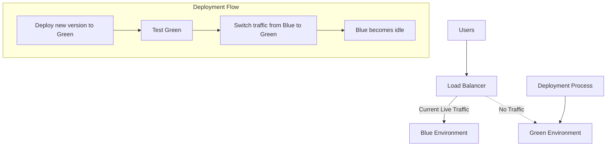
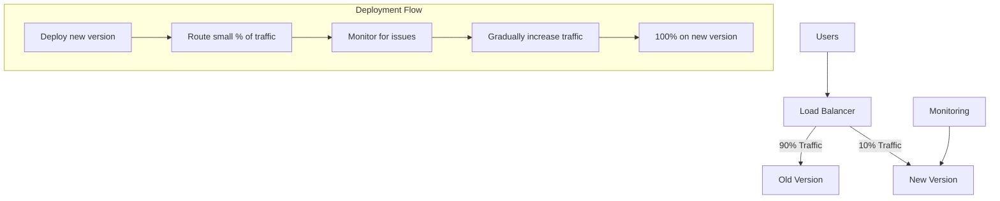
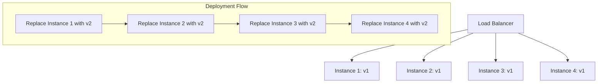

# CICD Zero-Downtime Deployment

In modern web applications, users expect services to be available 24/7. Any downtime, even for maintenance or updates, can lead to poor user experience and potential revenue loss. This is where **Zero-Downtime Deployment** strategies come into play - they allow you to deploy new versions of your application without interrupting service for your users.

## What is Zero-Downtime Deployment?

Zero-downtime deployment (also known as seamless deployment) is a deployment strategy that ensures your application remains available to users throughout the deployment process. When implemented correctly, users won't notice any interruption or degradation in service while you're updating your application.

## Why is Zero-Downtime Deployment Important?

- **Improved User Experience**: Users can continue using your application without interruption
- **Business Continuity**: No loss of revenue or productivity during deployments
- **Reduced Deployment Risk**: Issues can be caught early with proper monitoring
- **More Frequent Deployments**: Enables continuous delivery practices
- **Reduced Stress**: Teams can deploy during normal business hours instead of late nights

## Common Zero-Downtime Deployment Strategies

Let's explore the most popular techniques for achieving zero-downtime deployments:

### 1. Blue-Green Deployment

Blue-Green deployment involves maintaining two identical production environments: the "Blue" environment (currently live) and the "Green" environment (idle or staging).



#### How it works:

1. Your application runs in the Blue environment, serving all production traffic
2. You deploy the new version to the Green environment
3. You test the Green environment to ensure everything works correctly
4. Once verified, you switch the router/load balancer to direct all traffic to Green
5. Blue becomes idle and can be updated for the next deployment

#### Example with Nginx Load Balancer:

```bash
# Initial nginx.conf pointing to Blue environment
upstream backend {
    server blue-server-1.example.com;
    server blue-server-2.example.com;
}

# Deploy to Green environment
$ ./deploy-application.sh --environment=green

# Test Green environment
$ ./run-smoke-tests.sh --environment=green

# Update nginx.conf to point to Green
upstream backend {
    server green-server-1.example.com;
    server green-server-2.example.com;
}

# Reload Nginx configuration (without restart)
$ nginx -s reload
```

#### Advantages:
- Quick rollback capability (switch back to Blue)
- Complete testing in a production-like environment
- Zero downtime during switchover

#### Disadvantages:
- Resource intensive (requires two full environments)
- Database schema changes require additional consideration

### 2. Canary Deployment

Canary deployment involves gradually shifting traffic from the old version to the new version.



#### How it works:

1. Deploy the new version alongside the old version
2. Route a small percentage of traffic (e.g., 5-10%) to the new version
3. Monitor for any errors or performance issues
4. Gradually increase traffic to the new version if no issues are found
5. Once 100% of traffic is on the new version, decommission the old version

#### Example with Kubernetes:

```yaml
# Initial deployment with 10 replicas
apiVersion: apps/v1
kind: Deployment
metadata:
  name: myapp
spec:
  replicas: 10
  selector:
    matchLabels:
      app: myapp
  template:
    metadata:
      labels:
        app: myapp
        version: v1
    spec:
      containers:
      - name: myapp
        image: myapp:1.0.0
```

```bash
# Deploy canary with new version (2 replicas = ~20% traffic)
$ kubectl apply -f - <<EOF
apiVersion: apps/v1
kind: Deployment
metadata:
  name: myapp-canary
spec:
  replicas: 2
  selector:
    matchLabels:
      app: myapp
  template:
    metadata:
      labels:
        app: myapp
        version: v2
    spec:
      containers:
      - name: myapp
        image: myapp:2.0.0
EOF

# Monitor for errors in the new version
$ kubectl logs -l app=myapp,version=v2 -f

# If everything looks good, scale up canary and scale down original
$ kubectl scale deployment myapp-canary --replicas=10
$ kubectl scale deployment myapp --replicas=0
```

#### Advantages:
- Reduces risk by limiting exposure of new version
- Issues affect only a small subset of users
- Provides real production testing with real users

#### Disadvantages:
- More complex to set up than blue-green
- Multiple versions running simultaneously can complicate logging/monitoring

### 3. Rolling Updates

Rolling updates involve gradually replacing instances of the old version with the new version, one at a time.



#### How it works:

1. Start with all instances running the old version
2. Take one instance out of the load balancer pool
3. Deploy the new version to that instance
4. Add the instance back to the pool once ready
5. Repeat for each instance until all are updated

#### Example with Docker Swarm:

```bash
# Initial service with 4 replicas
$ docker service create --name myapp --replicas 4 myapp:1.0.0

# Update with rolling update (1 at a time, 30s delay between updates)
$ docker service update --image myapp:2.0.0 --update-parallelism 1 --update-delay 30s myapp
```

#### Example with Kubernetes:

```yaml
# Deployment with rolling update strategy
apiVersion: apps/v1
kind: Deployment
metadata:
  name: myapp
spec:
  replicas: 4
  strategy:
    type: RollingUpdate
    rollingUpdate:
      maxUnavailable: 1
      maxSurge: 1
  selector:
    matchLabels:
      app: myapp
  template:
    metadata:
      labels:
        app: myapp
    spec:
      containers:
      - name: myapp
        image: myapp:1.0.0
```

```bash
# Update the image to trigger rolling update
$ kubectl set image deployment/myapp myapp=myapp:2.0.0
```

#### Advantages:
- Simpler to implement than other strategies
- Resource efficient (no need for duplicate environments)
- Built-in support in most orchestration tools

#### Disadvantages:
- Slower deployment process
- Harder to roll back if an issue is discovered mid-deployment
- Multiple versions running simultaneously during deployment

## Database Considerations for Zero-Downtime Deployments

One of the most challenging aspects of zero-downtime deployments is handling database schema changes. Here are some strategies:

### Backward Compatible Changes

Make database changes backward compatible so that both old and new application versions can work with the schema.

#### Example of backward compatible schema change:

```sql
-- Adding a new column with a default value
ALTER TABLE users ADD COLUMN last_login_at TIMESTAMP DEFAULT NULL;

-- Instead of renaming a column (not backward compatible), add a new one
ALTER TABLE users ADD COLUMN email_address VARCHAR(255);
-- Copy data from old column to new column
UPDATE users SET email_address = email;
```

### Database Migration Patterns

For more complex changes, consider these patterns:

1. **Expand and Contract Pattern**:
   - Expand: Add new structures without removing old ones
   - Transition: Deploy new app version that uses new structures
   - Contract: Remove old structures when no longer needed

2. **Feature Toggles**:
   - Use feature flags to control which code paths are active
   - Gradually roll out database changes while controlling application behavior

## Implementing Zero-Downtime Deployment in Your CI/CD Pipeline

Let's walk through setting up a CI/CD pipeline for zero-downtime deployments:

### Example CI/CD Pipeline Configuration (GitHub Actions + AWS):

```yaml
name: Zero-Downtime Deployment

on:
  push:
    branches: [ main ]

jobs:
  deploy:
    runs-on: ubuntu-latest
    steps:
      - uses: actions/checkout@v2
      
      - name: Configure AWS credentials
        uses: aws-actions/configure-aws-credentials@v1
        with:
          aws-access-key-id: ${{ secrets.AWS_ACCESS_KEY_ID }}
          aws-secret-access-key: ${{ secrets.AWS_SECRET_ACCESS_KEY }}
          aws-region: us-west-2
      
      - name: Build and push Docker image
        run: |
          aws ecr get-login-password | docker login --username AWS --password-stdin $ECR_REGISTRY
          docker build -t $ECR_REGISTRY/myapp:$GITHUB_SHA .
          docker push $ECR_REGISTRY/myapp:$GITHUB_SHA
      
      # Blue-Green deployment with ECS
      - name: Deploy to Green environment
        run: |
          # Update task definition with new image
          aws ecs register-task-definition --cli-input-json file://task-definition.json --family myapp
          
          # Update green service with new task definition
          aws ecs update-service --cluster my-cluster --service myapp-green --task-definition myapp
          
          # Wait for deployment to complete
          aws ecs wait services-stable --cluster my-cluster --services myapp-green
          
          # Run tests against green environment
          ./run-tests.sh https://green.myapp.com
          
          # Switch load balancer target group to point to green
          aws elbv2 modify-listener --listener-arn $LISTENER_ARN --default-actions Type=forward,TargetGroupArn=$GREEN_TARGET_GROUP
```

### Testing Your Zero-Downtime Deployment

To verify your deployment strategy works correctly, you should test:

1. **Functionality**: Does the application work correctly after deployment?
2. **Availability**: Was there any downtime during deployment?
3. **Performance**: Is there any degradation in performance?

You can use tools like:

- **Load testing tools** (JMeter, Locust) to generate constant traffic
- **Monitoring tools** (Prometheus, Grafana) to watch for errors or downtime
- **Synthetic monitoring** to run continuous tests during deployment

## Best Practices for Zero-Downtime Deployment

1. **Automate everything**: Manual steps increase risk of errors
2. **Implement health checks**: Ensure your application can report its health status
3. **Use immutable infrastructure**: Create new servers instead of updating existing ones
4. **Implement feature flags**: Separate deployment from feature release
5. **Plan for rollbacks**: Always have a strategy to quickly revert to a previous version
6. **Monitor aggressively**: Watch for any issues during and after deployment
7. **Test your deployment process**: Practice deployment strategies in staging environments

## Common Challenges and Solutions

| Challenge | Solution |
|-----------|----------|
| Database schema changes | Use expand/contract pattern or backward-compatible changes |
| Stateful applications | Use sticky sessions or distributed caching |
| Long-running processes | Implement graceful shutdown and state persistence |
| Third-party dependencies | Ensure all dependencies support zero-downtime updates |
| Legacy applications | Use strangler pattern to gradually replace components |

## Summary

Zero-downtime deployment strategies are essential for modern applications that need to provide uninterrupted service to users. By implementing techniques like blue-green deployment, canary releases, or rolling updates, you can deploy new versions of your application without downtime.

Remember that zero-downtime deployment isn't just about the technical implementation—it requires proper planning, testing, monitoring, and a culture that values reliability and user experience.

## Exercises

1. **Exercise 1**: Set up a simple web application with a load balancer and implement blue-green deployment using Nginx.
2. **Exercise 2**: Configure a Kubernetes deployment to use the rolling update strategy with appropriate health checks.
3. **Exercise 3**: Implement a canary deployment for a web application and add monitoring to detect issues.
4. **Exercise 4**: Practice a zero-downtime database migration by adding a new column to a table without causing downtime.

## Additional Resources

- [Martin Fowler's article on Blue-Green Deployment](https://martinfowler.com/bliki/BlueGreenDeployment.html)
- [Kubernetes Documentation on Rolling Updates](https://kubernetes.io/docs/tutorials/kubernetes-basics/update/update-intro/)
- [The Twelve-Factor App Methodology](https://12factor.net/)
- [Database Schema Migration Patterns for Zero Downtime Deployments](https://www.prisma.io/dataguide/database-management/schema-migrations-zero-downtime)