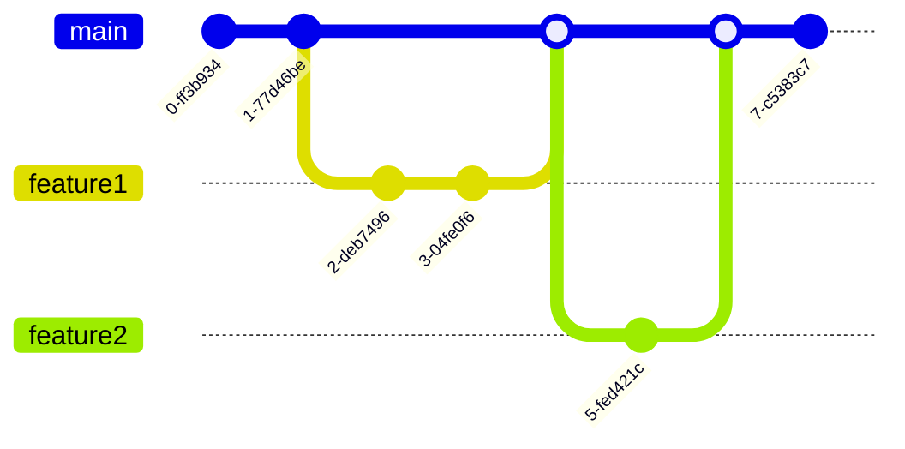

# CICD Deployment Frequency

## Introduction

Deployment frequency is a key metric in the world of Continuous Integration and Continuous Deployment (CI/CD) that measures how often an organization successfully releases code to production. It's one of the four critical metrics identified in the DORA (DevOps Research and Assessment) research that correlate with high-performing software teams, alongside lead time for changes, mean time to recovery, and change failure rate.

In this guide, we'll explore what deployment frequency means in the context of CI/CD, why it matters, how to measure it effectively, and practical strategies to increase your deployment cadence while maintaining quality and stability.

## What is Deployment Frequency?

Deployment frequency refers to how often an organization successfully delivers code to production. This metric can range from:

- **Low frequency**: Monthly or quarterly deployments
- **Medium frequency**: Weekly deployments
- **High frequency**: Daily deployments
- **Elite performance**: Multiple deployments per day

The goal of CI/CD is generally to enable higher deployment frequencies by automating and streamlining the processes involved in testing and deploying code.

## Why Deployment Frequency Matters

Increasing your deployment frequency offers several significant benefits:

1. **Faster time to market**: Features and fixes reach users more quickly
2. **Reduced deployment risk**: Smaller, more frequent changes are easier to test and less likely to cause major issues
3. **Quicker feedback cycles**: Teams get user feedback sooner and can iterate more rapidly
4. **Improved developer satisfaction**: Seeing work reach production is motivating
5. **Enhanced business agility**: The organization can respond to market changes more effectively

Research shows that teams with high deployment frequency also tend to have better stability and recover from incidents more quickly, contrary to the traditional belief that moving faster means breaking things.

## Measuring Deployment Frequency

To improve deployment frequency, you first need to measure it effectively. Here are the steps to establish this metric:

1. **Define what constitutes a deployment**: Is it any change to production or only certain types of changes?
2. **Set up tracking**: Use your CI/CD platform or deployment tools to track when deployments occur
3. **Calculate your baseline**: Determine how frequently you're currently deploying
4. **Set improvement targets**: Based on your baseline, set realistic goals for increasing frequency

### Example: Simple Deployment Tracking Script

Here's a basic Python script to track deployment frequency from Git commits:

```python
import subprocess
import datetime
from collections import Counter

# Get deployment dates (assuming tags represent deployments)
result = subprocess.run(['git', 'log', '--tags', '--simplify-by-decoration', 
                        '--pretty=format:%ai'], stdout=subprocess.PIPE)
deployment_dates = result.stdout.decode('utf-8').split('
')

# Convert to just dates (not times)
dates = [line.split()[0] for line in deployment_dates if line]

# Count deployments by month
date_objects = [datetime.datetime.strptime(date, '%Y-%m-%d') for date in dates]
months = [f"{date.year}-{date.month:02d}" for date in date_objects]
monthly_counts = Counter(months)

# Print results
for month, count in sorted(monthly_counts.items()):
    print(f"{month}: {count} deployments")
```

Output example:
```
2023-01: 4 deployments
2023-02: 6 deployments
2023-03: 12 deployments
2023-04: 18 deployments
```

## Strategies to Increase Deployment Frequency

Increasing your deployment frequency requires both technical and organizational changes. Here are key strategies to help you deploy more often:

### 1. Implement Feature Flags

Feature flags (or toggles) allow you to deploy code to production that remains inactive until you're ready to enable it.

```javascript
// Simple feature flag implementation
function showNewFeature(user) {
  if (featureFlags.isEnabled('new-dashboard', user.id)) {
    return <NewDashboard />;
  }
  return <CurrentDashboard />;
}
```

This approach decouples deployment from release, allowing you to deploy code frequently while controlling when users actually see new features.

### 2. Adopt Trunk-Based Development

Trunk-based development involves making small, frequent commits to the main branch rather than using long-lived feature branches.



With this approach:
- Feature branches are short-lived (1-2 days maximum)
- Changes are small and integrated frequently
- The main branch is always deployable

### 3. Automate Testing

Increasing test automation gives you confidence to deploy frequently.

```yaml
# Example GitHub Actions workflow for automated testing
name: Run Tests

on:
  push:
    branches: [ main ]
  pull_request:
    branches: [ main ]

jobs:
  test:
    runs-on: ubuntu-latest
    steps:
    - uses: actions/checkout@v3
    - name: Set up Node.js
      uses: actions/setup-node@v3
      with:
        node-version: '16'
    - name: Install dependencies
      run: npm ci
    - name: Run unit tests
      run: npm test
    - name: Run integration tests
      run: npm run test:integration
```

Comprehensive test suites should include:
- Unit tests
- Integration tests
- End-to-end tests
- Performance tests
- Security scans

### 4. Implement Continuous Deployment

Continuous deployment is the practice of automatically deploying every change that passes all tests to production.


This removes manual steps that can slow down deployment frequency and ensures every passing build reaches production.

### 5. Use Small Batch Sizes

Smaller changes are easier to test, deploy, and rollback if needed.

**Bad practice:**
```
Large feature branch with 50+ files changed, merged after 3 weeks of development
```

**Good practice:**
```
Multiple small PRs with 5-10 files each, merged throughout the development process
```

## Deployment Frequency Stages

Organizations typically progress through these stages:

1. **Manual deployments** (monthly/quarterly)
2. **Partially automated deployments** (weekly)
3. **Automated deployments with manual approval** (daily)
4. **Fully automated continuous deployment** (multiple times per day)

## Real-World Example: A Team's Journey

Let's follow a fictional web development team's journey to increase deployment frequency:

### Starting Point: Biweekly Deployments

- Manual deployments every two weeks
- Full QA cycle before each deployment
- Occasional hotfixes for critical issues

### Phase 1: Weekly Deployments

- Implemented automated unit and integration tests
- Created a standardized deployment checklist
- Reduced QA cycle time by focusing on critical paths

### Phase 2: Twice-Weekly Deployments

- Introduced feature flags for larger features
- Implemented canary deployments for risk reduction
- Shortened feature branches to max 3 days

### Phase 3: Daily Deployments

- Moved to trunk-based development
- Automated most testing and deployment processes
- Implemented monitoring and automated rollbacks

### Results:

- 90% reduction in deployment-related issues
- 75% faster time-to-market for new features
- 40% increase in developer satisfaction scores

## Common Challenges and Solutions

| Challenge | Solution |
|-----------|----------|
| Lack of test coverage | Gradually build automated tests, starting with critical paths |
| Fear of breaking production | Implement feature flags and canary deployments |
| Complex dependencies | Modularize architecture and consider microservices |
| Database schema changes | Use schema migration tools and backward-compatible changes |
| Manual approval bottlenecks | Create clear criteria for approvals and automate where possible |

## Measuring Success

To track your progress in increasing deployment frequency, monitor these metrics:

- **Deployment frequency**: How often you deploy to production
- **Lead time for changes**: How long it takes from commit to deployment
- **Change failure rate**: Percentage of deployments causing incidents
- **Mean time to recovery**: How quickly you recover from incidents

## Summary

Deployment frequency is a critical metric for software teams aiming to deliver value quickly and reliably. By implementing practices like feature flags, trunk-based development, automated testing, and continuous deployment, teams can safely increase their deployment cadence.

Remember that increasing deployment frequency isn't just about deploying more often—it's about building the capabilities that allow you to deploy confidently whenever necessary. The ultimate goal is to remove deployment as a bottleneck in your value delivery process.

## Further Resources

- "Accelerate: The Science of Lean Software and DevOps" by Nicole Forsgren, Jez Humble, and Gene Kim
- "Continuous Delivery" by Jez Humble and David Farley
- "Feature Flags: A Guide to Progressive Delivery" by John Kodumal

## Exercises

1. **Calculate your current deployment frequency**: Analyze your deployment history for the past three months and calculate your average deployment frequency.

2. **Identify bottlenecks**: Document your current deployment process and identify the longest steps or most common points of failure.

3. **Create a feature flag system**: Implement a simple feature flag system in your application and use it for your next feature deployment.

4. **Design a CI/CD pipeline**: Create a diagram of an ideal CI/CD pipeline for your project that would enable daily deployments.

5. **Set deployment frequency goals**: Based on your current state, set realistic goals for increasing your deployment frequency over the next six months.