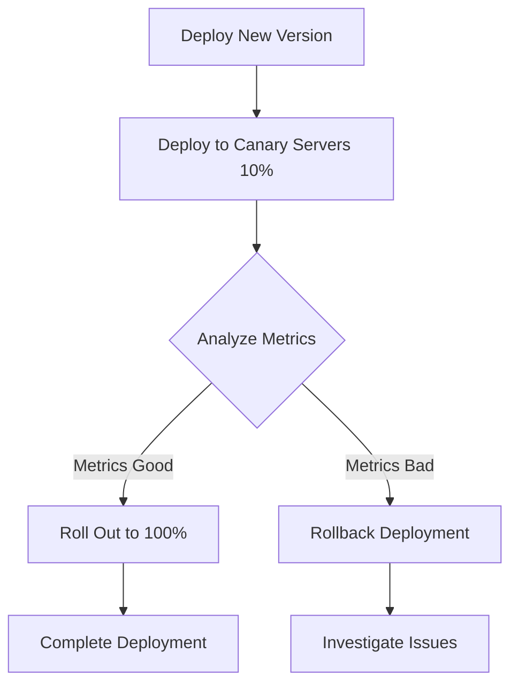
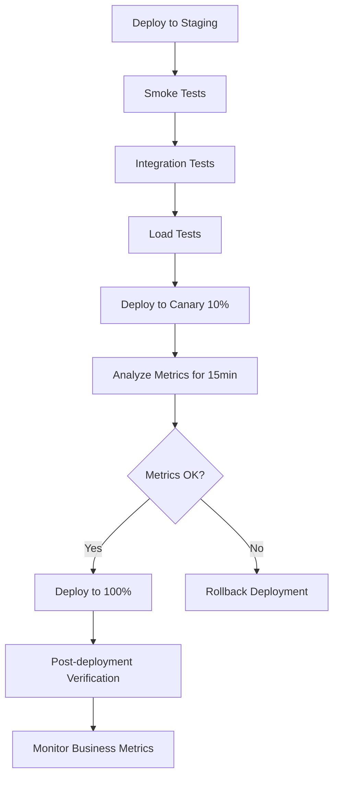

# CICD Deployment Verification

## Introduction

Deployment verification is a critical aspect of any CI/CD (Continuous Integration/Continuous Deployment) pipeline. It serves as the safety net that ensures your application works correctly after being deployed to production or staging environments. Without proper verification, even the most sophisticated deployment strategies can lead to user-facing bugs, system failures, or degraded performance.

In this guide, we'll explore how to implement effective deployment verification strategies within your CI/CD pipeline. You'll learn how to confirm that your deployments are successful, functional, and perform as expected before they reach your users.

## What is Deployment Verification?

Deployment verification refers to the set of processes, tests, and checks that occur after a deployment to ensure that:

1. The deployment itself was successful (the code was properly transferred and is running)
2. The application functions correctly in the target environment
3. The system meets performance expectations
4. No regression bugs have been introduced

Think of deployment verification as the quality control checkpoint after your code has been deployed but before it's considered "live" or ready for users.

## The Importance of Verification in CI/CD

In traditional deployment models, teams might perform manual testing after each deployment. However, in CI/CD environments where deployments can happen frequently (sometimes multiple times per day), manual verification becomes impractical and creates bottlenecks.

Automated deployment verification solves this problem by:

- Reducing human error
- Enabling frequent deployments
- Providing consistent quality checks
- Giving teams confidence to deploy more often
- Creating a safety net for detecting issues early

## Types of Deployment Verification

Let's explore the different types of verification you can implement in your CI/CD pipeline:

### 1. Smoke Testing

Smoke tests are quick, basic tests that verify the core functionality of your application is working after deployment.

```javascript
// Example smoke test for a REST API
const axios = require('axios');

async function smokeTest() {
  try {
    // Check if the API is up and returns 200 OK
    const response = await axios.get('https://api.example.com/health');
    
    if (response.status === 200 && response.data.status === 'healthy') {
      console.log('✅ Smoke test passed: API is responding correctly');
      return true;
    } else {
      console.error('❌ Smoke test failed: API returned unexpected response');
      return false;
    }
  } catch (error) {
    console.error('❌ Smoke test failed:', error.message);
    return false;
  }
}

// Run smoke test immediately after deployment
smokeTest();
```

### 2. Integration Testing

Integration tests verify that different components of your application work together correctly after deployment.

```javascript
// Example integration test for a user authentication system
const axios = require('axios');

async function testUserAuthentication() {
  try {
    // Test user registration
    const registerResponse = await axios.post('https://api.example.com/users', {
      username: 'testuser',
      email: 'test@example.com',
      password: 'securePassword123'
    });
    
    if (registerResponse.status !== 201) {
      throw new Error('User registration failed');
    }
    
    // Test user login
    const loginResponse = await axios.post('https://api.example.com/auth/login', {
      email: 'test@example.com',
      password: 'securePassword123'
    });
    
    if (loginResponse.status !== 200 || !loginResponse.data.token) {
      throw new Error('User login failed');
    }
    
    console.log('✅ Integration test passed: Authentication flow works correctly');
    return true;
  } catch (error) {
    console.error('❌ Integration test failed:', error.message);
    return false;
  }
}
```

### 3. End-to-End (E2E) Testing

E2E tests simulate real user flows through your application to ensure the entire system works together correctly.

```javascript
// Example E2E test using Cypress
// This would be in a file like cypress/integration/checkout_spec.js

describe('E-commerce Checkout Flow', () => {
  it('allows a user to add items to cart and complete checkout', () => {
    // Visit the homepage
    cy.visit('/');
    
    // Find a product and add it to cart
    cy.get('.product-card').first().within(() => {
      cy.get('.add-to-cart-btn').click();
    });
    
    // Navigate to cart
    cy.get('.cart-icon').click();
    
    // Verify product is in cart
    cy.get('.cart-item').should('have.length', 1);
    
    // Proceed to checkout
    cy.get('.checkout-btn').click();
    
    // Fill shipping information
    cy.get('#name').type('Test User');
    cy.get('#address').type('123 Test St');
    cy.get('#city').type('Test City');
    cy.get('#zip').type('12345');
    cy.get('#email').type('test@example.com');
    
    // Complete order
    cy.get('.complete-order-btn').click();
    
    // Verify success page is shown
    cy.get('.order-confirmation').should('be.visible');
    cy.get('.order-number').should('exist');
  });
});
```

### 4. Performance Testing

Performance tests ensure your application meets response time and load handling requirements after deployment.

```javascript
// Example performance test using k6
// This would be in a file like performance-test.js

import http from 'k6/http';
import { check, sleep } from 'k6';

export const options = {
  vus: 100,           // 100 virtual users
  duration: '30s',    // Test runs for 30 seconds
  thresholds: {
    http_req_duration: ['p95<500'], // 95% of requests must complete within 500ms
    http_req_failed: ['rate<0.01'],  // Less than 1% of requests can fail
  },
};

export default function() {
  const response = http.get('https://api.example.com/products');
  
  check(response, {
    'status is 200': (r) => r.status === 200,
    'response time < 200ms': (r) => r.timings.duration < 200,
  });
  
  sleep(1);
}
```

### 5. Canary Analysis

Canary analysis involves deploying to a small subset of users or servers first and analyzing metrics before rolling out to everyone.



Here's how to implement a basic canary check:

```javascript
// Example canary analysis script
const axios = require('axios');
const prometheus = require('prom-client');

async function analyzeCanaryMetrics(canaryGroup) {
  try {
    // Fetch error rates from Prometheus for both canary and baseline
    const canaryErrorRate = await getErrorRate(canaryGroup);
    const baselineErrorRate = await getErrorRate('production');
    
    // Fetch latency from Prometheus for both canary and baseline
    const canaryLatency = await getLatency(canaryGroup);
    const baselineLatency = await getLatency('production');
    
    // Compare metrics
    const errorRateDiff = canaryErrorRate - baselineErrorRate;
    const latencyDiff = canaryLatency - baselineLatency;
    
    console.log(`Error rate difference: ${errorRateDiff.toFixed(2)}%`);
    console.log(`Latency difference: ${latencyDiff.toFixed(2)}ms`);
    
    // Decision logic - these thresholds should be adjusted to your needs
    if (errorRateDiff > 0.5 || latencyDiff > 50) {
      console.error('❌ Canary analysis failed: Metrics exceeded thresholds');
      return false;
    } else {
      console.log('✅ Canary analysis passed: Metrics within acceptable thresholds');
      return true;
    }
  } catch (error) {
    console.error('❌ Canary analysis error:', error.message);
    return false;
  }
}

// Helper functions to fetch metrics from Prometheus
async function getErrorRate(group) {
  // Implementation to fetch error rate from Prometheus
}

async function getLatency(group) {
  // Implementation to fetch latency from Prometheus
}
```

## Implementing Deployment Verification in CI/CD Pipelines

Now, let's see how to incorporate these verification methods into different CI/CD platforms:

### GitHub Actions Example

```yaml
name: Deploy and Verify

on:
  push:
    branches: [ main ]

jobs:
  deploy:
    runs-on: ubuntu-latest
    steps:
      - uses: actions/checkout@v3
      
      - name: Deploy to staging
        run: ./deploy.sh staging
        
      - name: Run smoke tests
        run: npm run test:smoke
        
      - name: Run integration tests
        run: npm run test:integration
      
      - name: Canary deployment
        run: ./deploy.sh production --canary
      
      - name: Canary analysis
        run: |
          sleep 300  # Wait 5 minutes to gather metrics
          node canary-analysis.js
          
      - name: Complete deployment
        if: ${{ success() }}
        run: ./deploy.sh production --complete
        
      - name: Rollback on failure
        if: ${{ failure() }}
        run: ./rollback.sh production
```

### Jenkins Pipeline Example

```groovy
pipeline {
    agent any
    
    stages {
        stage('Deploy to Staging') {
            steps {
                sh './deploy.sh staging'
            }
        }
        
        stage('Smoke Tests') {
            steps {
                sh 'npm run test:smoke'
            }
        }
        
        stage('Integration Tests') {
            steps {
                sh 'npm run test:integration'
            }
        }
        
        stage('Canary Deployment') {
            steps {
                sh './deploy.sh production --canary'
            }
        }
        
        stage('Canary Analysis') {
            steps {
                sh 'sleep 300'  // Wait 5 minutes to gather metrics
                sh 'node canary-analysis.js'
            }
        }
        
        stage('Complete Deployment') {
            steps {
                sh './deploy.sh production --complete'
            }
        }
    }
    
    post {
        failure {
            sh './rollback.sh production'
        }
    }
}
```

## Best Practices for Deployment Verification

1. **Automate Everything**: Manual verification creates bottlenecks in CI/CD pipelines.

2. **Progressive Testing**: Start with quick smoke tests before running more time-consuming tests.

3. **Set Clear Thresholds**: Define specific success criteria for each verification step.

4. **Monitor Key Metrics**: Focus on metrics that matter most to your users:
   - Error rates
   - Response times
   - System resource utilization
   - Business metrics (e.g., conversion rates)

5. **Fail Fast**: If verification fails, automatically stop the deployment process.

6. **Plan for Failures**: Always have rollback mechanisms ready.

7. **Test in Production-Like Environments**: Your staging environment should mirror production as closely as possible.

8. **Keep Tests Isolated**: Each verification step should be independent of others.

## Real-World Example: E-Commerce Website Deployment

Let's examine a practical example of deployment verification for an e-commerce website:



In this workflow:

1. We first deploy to a staging environment and run basic tests
2. Once staging tests pass, we deploy to 10% of production servers
3. We monitor key metrics for 15 minutes
4. Based on the results, we either:
   - Roll out to all users
   - Roll back the deployment
5. After full deployment, we continue monitoring

## Implementing Feature Flags with Verification

Feature flags allow you to deploy code without exposing new features immediately. This can be combined with verification to create safer deployments:

```javascript
// Example feature flag implementation
const userIsInTestGroup = (userId) => {
  // Assign 5% of users to test group based on user ID
  return userId % 100 < 5;
};

const getProductRecommendations = (userId) => {
  if (featureFlags.isEnabled('new-recommendation-algorithm') && userIsInTestGroup(userId)) {
    // New algorithm
    return newRecommendationAlgorithm();
  } else {
    // Existing algorithm
    return currentRecommendationAlgorithm();
  }
};
```

With feature flags, you can:
1. Deploy code to production without activating new features
2. Enable features for a small percentage of users
3. Gather metrics from both user groups
4. Compare and make data-driven decisions

## Summary

Deployment verification is a crucial part of modern CI/CD pipelines that helps ensure reliability and quality in software delivery. By implementing automated verification steps, you can:

- Catch issues before they reach all users
- Deploy more frequently with confidence
- Reduce the risk of production outages
- Improve the overall quality of your software

Remember that effective deployment verification should be:
- Automated
- Quick
- Reliable
- Comprehensive

As you implement CI/CD in your projects, start with simple verification steps and gradually expand to more sophisticated approaches as your needs evolve.

## Additional Resources

- Learn about advanced monitoring tools like Prometheus and Grafana
- Explore chaos engineering principles to verify system resilience
- Study A/B testing frameworks to combine feature rollouts with user metrics

## Exercises

1. Create a basic smoke test for an application you're working on
2. Implement a canary deployment strategy in your CI/CD pipeline
3. Set up feature flags in your application and create a verification plan for a new feature
4. Design a rollback strategy for your deployments
5. Implement performance testing in your verification process