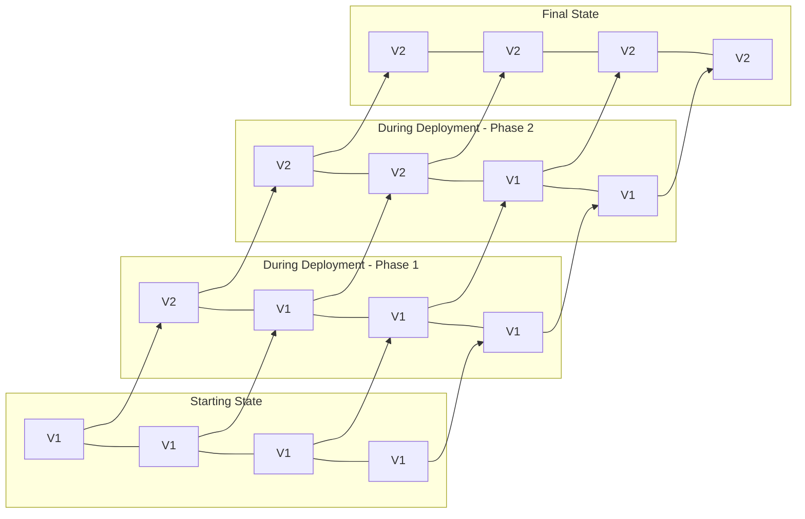
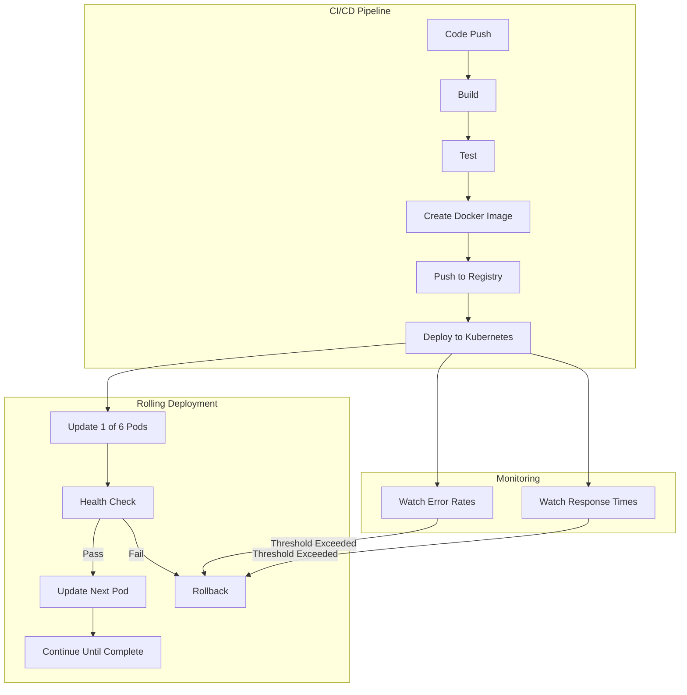

# CICD Rolling Deployment

## Introduction

In the world of modern software development, delivering new features and updates safely and efficiently is crucial. A **Rolling Deployment** is one of the most widely adopted deployment strategies in Continuous Integration and Continuous Delivery (CI/CD) pipelines. This approach gradually replaces instances of the previous version of an application with the new version, updating servers or pods one by one (or in small batches) instead of all at once.

Rolling deployments provide a balance between deployment speed and risk mitigation, making them an excellent default choice for many applications. In this guide, we'll explore what rolling deployments are, how they work, their benefits and challenges, and see real-world examples of implementing them.

## What is a Rolling Deployment?

A rolling deployment is a deployment strategy where the new version of an application gradually replaces the old version by updating servers or pods in small batches. Instead of taking down the entire application to perform an update, rolling deployments update instances incrementally, ensuring the application remains available during the deployment process.



## How Rolling Deployments Work

The mechanics of a rolling deployment follow these core steps:

1. **Start with all instances running the current version (V1)**
2. **Replace instances gradually:**
   - Take one or a small batch of instances out of the load balancer pool
   - Update these instances to the new version (V2)
   - Verify the new instances are healthy
   - Add the updated instances back to the load balancer pool
3. **Repeat** the process until all instances have been updated
4. **Complete the deployment** when all instances are running the new version

During this process, both versions of the application run simultaneously for a period, handling production traffic in parallel.

## Key Configuration Parameters

When implementing rolling deployments, you'll need to configure several important parameters:

### Max Unavailable

This parameter defines how many instances (or what percentage) can be unavailable during the update. For example, if you set `maxUnavailable: 25%` in a deployment with 4 instances, only 1 instance can be taken down at a time.

### Max Surge

This parameter defines how many extra instances (or what percentage) can be created during the update. For example, with `maxSurge: 25%` in a deployment with 4 instances, the system can create 1 new instance before taking down an old one.

### Health Checks

Health checks determine when a new instance is considered ready to receive traffic. These typically include:

- **Readiness probes**: Check if the application is ready to handle requests
- **Liveness probes**: Verify the application is still running properly

## Implementing Rolling Deployments

Let's look at practical examples of implementing rolling deployments in different environments.

### Example 1: Kubernetes Rolling Update

Kubernetes provides built-in support for rolling updates through the Deployment resource.

```yaml
apiVersion: apps/v1
kind: Deployment
metadata:
  name: my-app
spec:
  replicas: 4
  strategy:
    type: RollingUpdate
    rollingUpdate:
      maxSurge: 1
      maxUnavailable: 1
  selector:
    matchLabels:
      app: my-app
  template:
    metadata:
      labels:
        app: my-app
    spec:
      containers:
      - name: my-app
        image: my-app:v2  # Updated from v1 to v2
        ports:
        - containerPort: 8080
        readinessProbe:
          httpGet:
            path: /health
            port: 8080
          initialDelaySeconds: 5
          periodSeconds: 10
```

In this Kubernetes deployment configuration:
- We specify `RollingUpdate` as the deployment strategy
- `maxSurge: 1` allows one extra pod to be created
- `maxUnavailable: 1` ensures only one pod can be unavailable at a time
- A readiness probe checks if the new pods are ready to receive traffic

### Example 2: AWS Elastic Beanstalk Rolling Deployment

AWS Elastic Beanstalk also supports rolling deployments with its own configuration:

```json
{
  "AWSEBDeploymentPolicy": "RollingWithAdditionalBatch",
  "AWSEBRollbackOnFailure": "true",
  "Timeout": "600",
  "BatchSizeType": "Percentage",
  "BatchSize": "25"
}
```

This configuration can be saved as a `.ebextensions/deployment-policy.config` file in your application's source code.

### Example 3: Implementation with a CI/CD Pipeline (GitHub Actions)

Let's see how a complete CI/CD pipeline with rolling deployment might look using GitHub Actions:

```yaml
name: CI/CD Pipeline with Rolling Deployment

on:
  push:
    branches: [ main ]

jobs:
  build:
    runs-on: ubuntu-latest
    steps:
    - uses: actions/checkout@v3
    
    - name: Set up Docker Buildx
      uses: docker/setup-buildx-action@v2
    
    - name: Login to DockerHub
      uses: docker/login-action@v2
      with:
        username: ${{ secrets.DOCKERHUB_USERNAME }}
        password: ${{ secrets.DOCKERHUB_TOKEN }}
    
    - name: Build and push Docker image
      uses: docker/build-push-action@v3
      with:
        push: true
        tags: myapp:${{ github.sha }}

  deploy:
    needs: build
    runs-on: ubuntu-latest
    steps:
    - name: Set up kubectl
      uses: azure/setup-kubectl@v3
      
    - name: Configure AWS credentials
      uses: aws-actions/configure-aws-credentials@v1
      with:
        aws-access-key-id: ${{ secrets.AWS_ACCESS_KEY_ID }}
        aws-secret-access-key: ${{ secrets.AWS_SECRET_ACCESS_KEY }}
        aws-region: us-west-2
        
    - name: Update kubeconfig
      run: aws eks update-kubeconfig --name my-cluster --region us-west-2
      
    - name: Deploy with Rolling Update
      run: |
        # Update the image in the deployment
        kubectl set image deployment/my-app my-app=myapp:${{ github.sha }}
        
        # Watch the rollout status
        kubectl rollout status deployment/my-app --timeout=300s
```

This pipeline:
1. Builds and pushes a Docker image with the commit SHA as tag
2. Deploys to Kubernetes using a rolling update strategy
3. Watches the rollout status to ensure successful deployment

## Benefits of Rolling Deployments

Rolling deployments offer several significant advantages:

### 1. Zero Downtime Deployments

Since the application continues running during updates, users experience no downtime. The load balancer routes traffic only to available instances.

### 2. Reduced Risk

By updating instances gradually, you can:
- Detect problems early before all instances are updated
- Affect only a portion of users if issues occur
- Easily roll back problematic deployments

### 3. No Resource Surge

Unlike Blue-Green deployments that require double the resources, rolling deployments require only a small amount of additional resources during the transition.

### 4. Simple to Implement

Most modern deployment platforms support rolling deployments out of the box, making them easy to set up and configure.

## Challenges and Considerations

While rolling deployments are widely used, they come with some important considerations:

### 1. Database Compatibility

Since both old and new versions run simultaneously, they must be compatible with the same database schema. This requires careful planning for database migrations.

### 2. API Compatibility

The new version must maintain backward compatibility with APIs that existing instances or clients might call.

### 3. Longer Deployment Time

Rolling deployments take longer than all-at-once deployments since instances are updated sequentially.

### 4. Testing Complexity

Testing must account for the temporary state where both versions run in parallel.

## Real-World Implementation: E-commerce Platform

Let's consider how a real-world e-commerce platform might implement rolling deployments:



### Key Implementation Details:

1. **Canary Testing First**: Before initiating a full rolling deployment, deploy to a small subset of users (canary deployment) to catch major issues.

2. **Automated Health Checks**:
   ```yaml
   readinessProbe:
     httpGet:
       path: /api/health
       port: 8080
     initialDelaySeconds: 10
     periodSeconds: 5
     failureThreshold: 3
   livenessProbe:
     httpGet:
       path: /api/health
       port: 8080
     initialDelaySeconds: 20
     periodSeconds: 15
   ```

3. **Automated Rollback Triggers**:
   - Error rate increases above 2%
   - Response time increases by more than 30%
   - Failed health checks

4. **Session Handling**: Use sticky sessions or session replication to handle user sessions during the transition.

## Best Practices

To get the most from rolling deployments, follow these best practices:

1. **Start Small**: Set a low value for `maxUnavailable` to minimize impact.

2. **Automate Everything**: Fully automate the deployment process including health checks and rollbacks.

3. **Implement Feature Flags**: Use feature flags to control the activation of new features independently of deployments.

4. **Monitor Carefully**: Set up comprehensive monitoring to detect issues during and after deployment.

5. **Practice Database Migrations**: Develop a solid strategy for handling database schema changes that work with rolling deployments.

## When Not to Use Rolling Deployments

Rolling deployments aren't always the best choice:

1. **Major Version Changes**: When major architecture changes or completely incompatible versions need deployment, blue-green or canary deployments might be better.

2. **Very Small Applications**: For applications with only 1-2 instances, other strategies might be simpler.

3. **When Downtime is Acceptable**: If your application can afford some downtime, simpler strategies might be faster.

## Summary

Rolling deployments provide a balanced approach to updating applications in production by gradually replacing instances of the old version with the new one. This strategy offers zero-downtime updates while minimizing risk and resource requirements.

Key takeaways:
- Rolling deployments update instances incrementally in batches
- They enable zero-downtime deployments with minimal additional resources
- Both versions run simultaneously during the transition
- Most modern platforms support rolling deployments natively
- Proper health checks and monitoring are essential for success
- Database and API compatibility between versions is crucial

By implementing rolling deployments in your CI/CD pipeline, you can deliver updates to your users more frequently and with greater confidence.

## Additional Resources

- [Kubernetes Deployments Documentation](https://kubernetes.io/docs/concepts/workloads/controllers/deployment/)
- [AWS Elastic Beanstalk Deployment Policies](https://docs.aws.amazon.com/elasticbeanstalk/latest/dg/using-features.rolling-version-deploy.html)
- [A Comparison of Deployment Strategies](https://thenewstack.io/deployment-strategies/)

## Practice Exercises

1. **Exercise 1**: Set up a simple application with Kubernetes and implement a rolling deployment strategy.

2. **Exercise 2**: Configure health checks for your application and test what happens when a newly deployed instance fails its health check.

3. **Exercise 3**: Implement a CI/CD pipeline using GitHub Actions or another tool that performs rolling deployments to a test environment.

4. **Exercise 4**: Create a database migration that's compatible with rolling deployments, ensuring both old and new application versions can work with it.