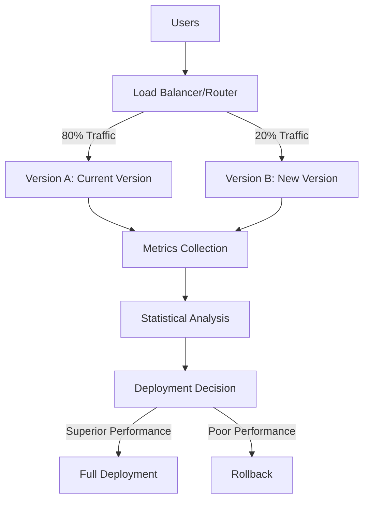
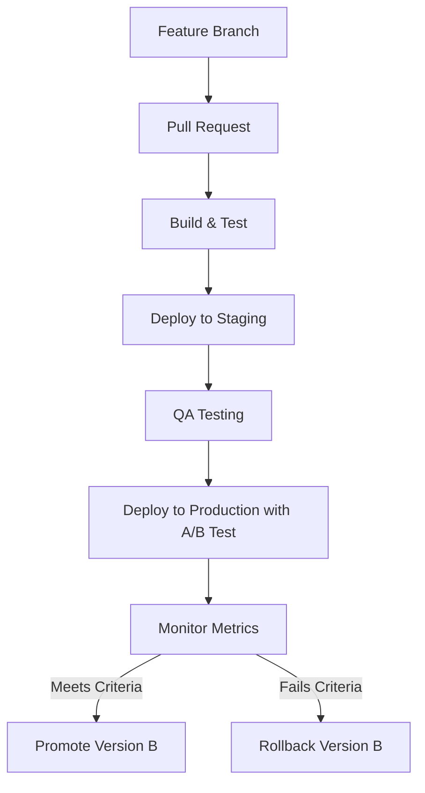

# CI/CD A/B Testing

## Introduction

A/B testing (also known as split testing) is a powerful deployment strategy that allows developers to compare two versions of an application or feature to determine which performs better. When integrated into a CI/CD pipeline, A/B testing provides a data-driven approach to validate changes before fully deploying them to all users.

Unlike traditional deployment methods where changes immediately affect all users, A/B testing routes a portion of traffic to the new version (variant B) while maintaining the original version (variant A) for the remaining users. This approach minimizes risk while allowing teams to collect valuable metrics about user behavior, performance, and business impact.

## How CI/CD A/B Testing Works

At its core, A/B testing in a CI/CD context works through controlled traffic distribution:



### Key Components

1. **Feature Flags**: Code-level switches that enable or disable features
2. **Traffic Routing**: Mechanisms to direct user traffic to different versions
3. **Metrics Collection**: Systems to gather performance and user behavior data
4. **Analysis Tools**: Software to evaluate the statistical significance of results

## Implementing A/B Testing in Your CI/CD Pipeline

Let's walk through the steps to implement A/B testing in your CI/CD pipeline:

### Step 1: Define Your Hypothesis and Metrics

Before writing any code, clearly define:
- What change you're testing
- What outcomes you expect
- Which metrics will determine success

Example metrics might include:
- Conversion rates
- Page load times
- User engagement
- Revenue impact

### Step 2: Set Up Feature Flags

Feature flags allow you to toggle features on and off without redeploying. Here's a simple implementation in JavaScript:

```javascript
// Feature flag implementation
class FeatureFlags {
  constructor(userId) {
    this.userId = userId;
    this.features = {};
  }

  // Determines if a user should see a feature
  isEnabled(featureName, percentage = 50) {
    // Use consistent hashing to ensure the same user gets the same experience
    const hash = this.hashUserFeature(this.userId, featureName);
    return hash % 100 < percentage;
  }

  // Create a deterministic hash for user+feature combination
  hashUserFeature(userId, featureName) {
    let hash = 0;
    const str = `${userId}-${featureName}`;
    for (let i = 0; i < str.length; i++) {
      hash = ((hash << 5) - hash) + str.charCodeAt(i);
      hash = hash & hash; // Convert to 32bit integer
    }
    return Math.abs(hash);
  }
}

// Usage example
const user = new FeatureFlags("user123");
if (user.isEnabled("new-checkout-flow", 20)) {
  // Show new checkout flow (20% of users)
} else {
  // Show existing checkout flow (80% of users)
}
```

### Step 3: Configure Traffic Routing

For web applications, you can implement traffic routing at different levels:

#### Server-Side (using Express.js)

```javascript
const express = require('express');
const app = express();

// Simple A/B test router middleware
function abTestMiddleware(req, res, next) {
  // Get or generate a unique user identifier
  const userId = req.cookies.userId || generateUserId();
  
  // Ensure consistent experience by setting cookie
  if (!req.cookies.userId) {
    res.cookie('userId', userId, { maxAge: 30 * 24 * 60 * 60 * 1000 }); // 30 days
  }
  
  // Determine which variant to show (20% get variant B)
  const hash = hashString(userId + '-homepage-redesign');
  req.abTest = {
    variant: hash % 100 < 20 ? 'B' : 'A'
  };
  
  next();
}

// Apply the middleware
app.use(abTestMiddleware);

// Use the assigned variant
app.get('/', (req, res) => {
  if (req.abTest.variant === 'B') {
    res.render('home-new');
  } else {
    res.render('home-current');
  }
});

function hashString(str) {
  let hash = 0;
  for (let i = 0; i < str.length; i++) {
    hash = ((hash << 5) - hash) + str.charCodeAt(i);
    hash = hash & hash;
  }
  return Math.abs(hash);
}

app.listen(3000);
```

#### Infrastructure Level (using Kubernetes)

For more complex applications, you might use Kubernetes to manage traffic splitting:

```yaml
apiVersion: networking.istio.io/v1alpha3
kind: VirtualService
metadata:
  name: my-app-service
spec:
  hosts:
  - my-app.example.com
  http:
  - route:
    - destination:
        host: my-app-v1
        port:
          number: 80
      weight: 80
    - destination:
        host: my-app-v2
        port:
          number: 80
      weight: 20
```

### Step 4: Collect and Analyze Metrics

Integration with analytics tools is essential for making data-driven decisions:

```javascript
// Simple in-app analytics collection
function trackEvent(eventName, properties = {}) {
  // Add the A/B test variant to all events
  const abTestProperties = {
    ...properties,
    variant: user.isEnabled("new-checkout-flow", 20) ? "B" : "A"
  };
  
  // Send to analytics service
  fetch('https://analytics-api.example.com/track', {
    method: 'POST',
    headers: { 'Content-Type': 'application/json' },
    body: JSON.stringify({
      eventName,
      properties: abTestProperties,
      timestamp: new Date().toISOString(),
      userId: user.userId
    })
  });
}

// Usage
function handleCheckoutComplete(orderId, totalValue) {
  trackEvent('checkout_complete', {
    orderId,
    totalValue,
    checkoutDuration: performance.now() - checkoutStartTime
  });
}
```

## CI/CD Pipeline Integration

To fully integrate A/B testing into your CI/CD pipeline, you'll need to automate the deployment and evaluation process. Here's an example workflow:



### Example GitHub Actions Workflow

```yaml
name: CI/CD with A/B Testing

on:
  push:
    branches: [ main ]
  pull_request:
    branches: [ main ]

jobs:
  build_and_test:
    runs-on: ubuntu-latest
    steps:
      - uses: actions/checkout@v3
      - name: Set up Node.js
        uses: actions/setup-node@v3
        with:
          node-version: '18'
      - name: Install dependencies
        run: npm ci
      - name: Run tests
        run: npm test

  deploy_ab_test:
    needs: build_and_test
    if: github.event_name == 'push'
    runs-on: ubuntu-latest
    steps:
      - uses: actions/checkout@v3
      - name: Configure AWS credentials
        uses: aws-actions/configure-aws-credentials@v1
        with:
          aws-access-key-id: ${{ secrets.AWS_ACCESS_KEY_ID }}
          aws-secret-access-key: ${{ secrets.AWS_SECRET_ACCESS_KEY }}
          aws-region: us-west-2
          
      - name: Deploy version B with traffic splitting
        run: |
          # Deploy new version alongside existing version
          aws cloudformation deploy \
            --template-file infrastructure/ab-test-stack.yaml \
            --stack-name my-app-ab-test \
            --parameter-overrides \
              VersionAWeight=80 \
              VersionBWeight=20 \
              VersionBImage=${{ github.sha }}
              
      - name: Set up monitoring alert for failed metrics
        run: |
          # Create CloudWatch alarm that triggers if metrics drop below threshold
          aws cloudwatch put-metric-alarm \
            --alarm-name version-b-conversion-drop \
            --metric-name ConversionRate \
            --namespace ABTests \
            --dimensions VersionName=B \
            --threshold 0.9 \
            --comparison-operator LessThanThreshold \
            --statistic Average \
            --period 3600 \
            --evaluation-periods 2 \
            --alarm-actions arn:aws:sns:us-west-2:123456789012:ab-test-alerts
```

## Real-World Example: Optimizing a Signup Form

Let's see how A/B testing can be applied to optimize a signup form conversion rate:

### Scenario
Your team has hypothesized that simplifying the signup form will increase conversion rates.

### Version A (Current)
```html
<form id="signup-form-a" class="signup-form">
  <h2>Create an Account</h2>
  <div class="form-group">
    <label for="first-name">First Name</label>
    <input type="text" id="first-name" required />
  </div>
  <div class="form-group">
    <label for="last-name">Last Name</label>
    <input type="text" id="last-name" required />
  </div>
  <div class="form-group">
    <label for="email">Email Address</label>
    <input type="email" id="email" required />
  </div>
  <div class="form-group">
    <label for="password">Password</label>
    <input type="password" id="password" required />
  </div>
  <div class="form-group">
    <label for="confirm-password">Confirm Password</label>
    <input type="password" id="confirm-password" required />
  </div>
  <div class="form-group">
    <label for="phone">Phone Number</label>
    <input type="tel" id="phone" />
  </div>
  <button type="submit">Create Account</button>
</form>
```

### Version B (Test)
```html
<form id="signup-form-b" class="signup-form">
  <h2>Create an Account</h2>
  <div class="form-group">
    <label for="email">Email Address</label>
    <input type="email" id="email" required placeholder="your@email.com" />
  </div>
  <div class="form-group">
    <label for="password">Password</label>
    <input type="password" id="password" required placeholder="Choose a strong password" />
  </div>
  <button type="submit">Create Account</button>
  <p class="form-note">You can add additional information after signing up</p>
</form>
```

### Implementation

First, we set up feature flagging in our CI/CD pipeline:

```javascript
// In our feature flag configuration
const FEATURE_FLAGS = {
  'simplified-signup': {
    enabled: true,
    testPercentage: 50,
    description: 'Test simplified signup form against standard form'
  }
};

// In our application code
function renderSignupForm() {
  const showSimplifiedVersion = isFeatureEnabled('simplified-signup', currentUser.id);
  
  if (showSimplifiedVersion) {
    renderTemplate('signup-form-b.html');
    trackEvent('view_signup_form', { variant: 'B' });
  } else {
    renderTemplate('signup-form-a.html');
    trackEvent('view_signup_form', { variant: 'A' });
  }
}

// Track form submissions
function trackFormSubmission(formId) {
  const variant = formId === 'signup-form-b' ? 'B' : 'A';
  trackEvent('signup_form_submitted', { variant });
}
```

### Data Collection and Analysis

Over a two-week period, we collect:
- Form impressions
- Form submissions
- Time spent on the form
- Subsequent user activity

Our analysis might show:
- Version A: 3% conversion rate
- Version B: 4.8% conversion rate
- Version B users complete the form 35% faster

Based on this data, we make a decision to fully deploy Version B to all users.

## Best Practices for CI/CD A/B Testing

1. **Start small** - Begin with a small percentage (5-10%) of traffic to the new version
2. **Test one change at a time** - Isolate variables to get clear results
3. **Run tests long enough** - Ensure statistical significance (typically 1-2 weeks minimum)
4. **Set clear success criteria** - Define metrics that will determine success before beginning
5. **Implement proper monitoring** - Set up alerting for any dramatic negative impacts
6. **Document everything** - Keep records of all tests, hypotheses, and results
7. **Consider user segmentation** - Some changes may affect different user groups differently

## Common Pitfalls

- **Insufficient test duration** - Tests ended too early may give misleading results
- **Ignoring statistical significance** - Small sample sizes can lead to incorrect conclusions
- **Testing too many variables** - Makes it difficult to determine which change made the impact
- **Not accounting for external factors** - Seasonal trends or other events can skew results
- **Poor metrics selection** - Tracking vanity metrics instead of meaningful ones

## CI/CD A/B Testing Tools

Several tools can help implement A/B testing in your CI/CD pipeline:

1. **LaunchDarkly** - Feature flag management platform
2. **Split.io** - Feature delivery platform with experimentation
3. **Optimizely** - Experimentation platform with CI/CD integrations
4. **Google Optimize** - A/B testing tool that integrates with Google Analytics
5. **Istio** - Service mesh for Kubernetes that supports traffic splitting

## Summary

A/B testing in CI/CD pipelines provides a systematic approach to validate changes with real users before full deployment. By directing a portion of traffic to a new version while maintaining the current version, teams can make data-driven decisions based on actual user behavior and performance metrics.

This approach reduces risk, improves feature quality, and helps teams focus on changes that deliver measurable value. When properly integrated into your CI/CD pipeline, A/B testing becomes a powerful tool for continuous improvement and innovation.

## Exercises

1. Implement a simple A/B test for a button color change using feature flags
2. Create a CI/CD pipeline that automatically deploys a new version to 10% of users
3. Design a metrics dashboard to track the performance of an A/B test
4. Analyze a sample dataset to determine if a test has reached statistical significance
5. Develop a rollback strategy for an A/B test that shows negative performance impacts

## Additional Resources

- [The Principles of A/B Testing](https://www.optimizely.com/optimization-glossary/ab-testing/)
- [Feature Flags Best Practices](https://launchdarkly.com/blog/best-practices-feature-flag-driven-development/)
- [Statistical Significance in A/B Testing](https://vwo.com/blog/statistical-significance-ab-testing/)
- [CI/CD Pipeline Implementation Strategies](https://www.atlassian.com/continuous-delivery/principles/pipeline-implementation-strategies)
- [A/B Testing with Kubernetes and Istio](https://istio.io/latest/docs/tasks/traffic-management/traffic-shifting/)