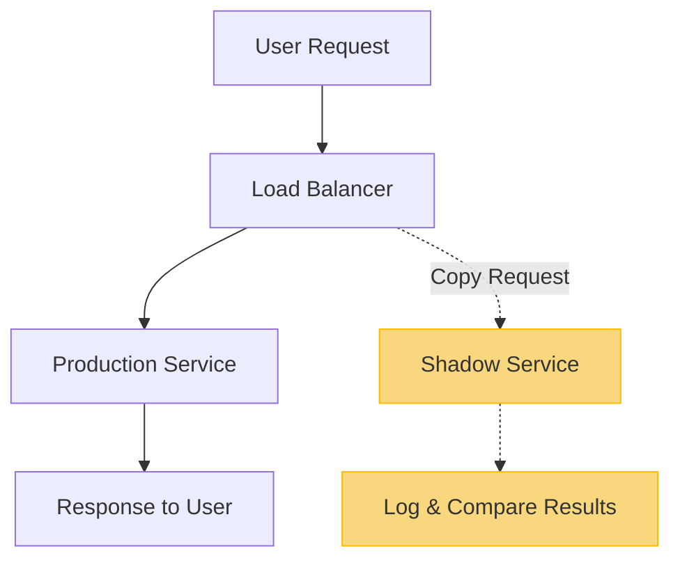

# CI/CD Shadow Deployment

## Introduction

Shadow deployment is a powerful risk-mitigation strategy in the continuous integration and continuous deployment (CI/CD) pipeline. Unlike traditional deployment methods where new code immediately replaces existing functionality, shadow deployments run new code alongside the existing production code without exposing it to end users. This allows developers to evaluate how new code would perform in real production environments without risking user experience or system stability.

Think of shadow deployment as having a "ghost" version of your application running in parallel with your live version. The ghost receives the same inputs but its outputs are only monitored, not actually used.

## Why Use Shadow Deployments?

Shadow deployments offer several advantages:

1. **Risk Reduction**: Test new code against real production traffic without affecting users
2. **Performance Validation**: Measure how new code performs against production workloads
3. **Bug Detection**: Discover issues that might only appear in production environments
4. **Confidence Building**: Gain confidence in changes before exposing them to users
5. **Feature Readiness**: Determine if a new feature is ready for full deployment

## How Shadow Deployments Work

Let's explore how shadow deployments function in a CI/CD pipeline:



1. User requests are sent to the production environment as normal
2. Each request is duplicated and sent to both the production service and the shadow service
3. The production service processes the request and returns results to users
4. The shadow service processes the identical request, but its results are not returned to users
5. Results from both services are logged and compared for analysis

## Implementing Shadow Deployments

Let's look at how to implement shadow deployments in different scenarios:

### Basic Infrastructure Setup

Here's a simple example using Nginx as a proxy to duplicate traffic:

```nginx
http {
    upstream production_backend {
        server production-app:8080;
    }
    
    upstream shadow_backend {
        server shadow-app:8080;
    }
    
    server {
        listen 80;
        
        location / {
            # Send request to production
            proxy_pass http://production_backend;
            
            # Mirror request to shadow service
            mirror /shadow;
            mirror_request_body on;
        }
        
        # Handle mirrored requests
        location /shadow {
            proxy_pass http://shadow_backend$request_uri;
            proxy_ignore_client_abort on;
            proxy_set_header X-Shadow-Request true;
            
            # Discard the response from the shadow service
            proxy_pass_request_headers off;
            proxy_pass_request_body off;
        }
    }
}
```

### Cloud-Based Implementation

For a more robust solution in AWS, you might use AWS Lambda and API Gateway:

```javascript
// AWS Lambda function to handle traffic mirroring
exports.handler = async (event) => {
    try {
        // Forward the original request to production
        const productionResponse = await forwardToProduction(event);
        
        // Asynchronously forward to shadow service without waiting for response
        forwardToShadow(event).catch(err => {
            console.error("Shadow service error:", err);
        });
        
        // Return only the production response to the user
        return productionResponse;
    } catch (error) {
        console.error("Error in request handler:", error);
        return {
            statusCode: 500,
            body: JSON.stringify({ error: "Internal Server Error" })
        };
    }
};

async function forwardToProduction(event) {
    // Implementation to forward request to production service
    // ...
}

async function forwardToShadow(event) {
    // Implementation to forward request to shadow service
    // ...
    // Log response metrics for comparison
}
```

## Monitoring and Comparison

The key to effective shadow deployments is proper monitoring and comparison of results:

```javascript
// Example code for comparing shadow and production responses
function compareResponses(productionResponse, shadowResponse) {
    const metrics = {
        statusCodeMatch: productionResponse.statusCode === shadowResponse.statusCode,
        responseTimeRatio: shadowResponse.duration / productionResponse.duration,
        payloadSizeRatio: JSON.stringify(shadowResponse.body).length / 
                          JSON.stringify(productionResponse.body).length,
        errors: []
    };
    
    // Check for specific response differences
    try {
        const prodData = JSON.parse(productionResponse.body);
        const shadowData = JSON.parse(shadowResponse.body);
        
        // Compare key fields in the response
        if (prodData.items?.length !== shadowData.items?.length) {
            metrics.errors.push("Item count mismatch");
        }
        
        // Add more specific comparisons as needed
        
    } catch (error) {
        metrics.errors.push(`Comparison error: ${error.message}`);
    }
    
    // Log metrics to your monitoring system
    logMetricsToMonitoringSystem(metrics);
    
    return metrics;
}
```

## Real-World Example: E-commerce Product Recommendation

Let's consider a practical example of implementing shadow deployment for a new recommendation algorithm in an e-commerce application:

1. **Current System**: Your e-commerce site uses Algorithm A to show product recommendations
2. **New Feature**: You've developed Algorithm B that you believe will improve conversion rates

Instead of immediately replacing Algorithm A with Algorithm B, you implement a shadow deployment:

```javascript
// Pseudo-code for handling product recommendations
async function getProductRecommendations(userId, productContext) {
    // Get recommendations from the current production algorithm
    const productionRecommendations = await algorithmA.getRecommendations(userId, productContext);
    
    try {
        // Asynchronously call the shadow algorithm
        algorithmB.getRecommendations(userId, productContext)
            .then(shadowRecommendations => {
                // Log both recommendations for comparison
                compareAndLogRecommendations(
                    userId, 
                    productContext,
                    productionRecommendations,
                    shadowRecommendations
                );
            })
            .catch(error => {
                console.error("Shadow algorithm error:", error);
                // Log failure metrics
                logShadowFailure(userId, productContext, error);
            });
    } catch (error) {
        // Shadow errors should never affect the main flow
        console.error("Error setting up shadow call:", error);
    }
    
    // Return only the production recommendations to the user
    return productionRecommendations;
}
```

In this example, users continue to receive recommendations from Algorithm A, while Algorithm B runs in parallel. The system logs both sets of recommendations for comparison, allowing you to evaluate if Algorithm B is truly better before making it live.

## Graduating from Shadow to Production

Once you've collected enough data and are confident that your shadow deployment is performing well, you can "graduate" it to production. This typically follows these steps:

1. **Data Analysis**: Review performance metrics comparing shadow and production
2. **Fix Issues**: Address any problems discovered during shadow period
3. **Controlled Rollout**: Use techniques like canary deployment or feature flags to gradually introduce the new code
4. **Full Deployment**: Replace the old code entirely once confident

## Challenges and Considerations

While shadow deployments are powerful, they come with challenges:

### Resource Requirements

Shadow deployments essentially double the processing resources for shadowed components. Ensure your infrastructure can handle this load.

### Stateful Operations

For operations that change state (like database writes), you need to prevent the shadow service from making actual changes:

```javascript
class ShadowDatabaseClient extends DatabaseClient {
    async write(data) {
        if (this.isShadowMode) {
            // In shadow mode, validate the write operation but don't actually perform it
            await this.validateWrite(data);
            
            // Log what would have happened
            this.logShadowWrite(data);
            
            // Return a mock response
            return { success: true, id: "shadow-" + Date.now() };
        } else {
            // Normal write for production
            return super.write(data);
        }
    }
}
```

### External Service Calls

Be careful with external API calls that might have side effects:

```javascript
async function processPayment(paymentDetails, isShadowMode) {
    if (isShadowMode) {
        // Don't actually charge the customer in shadow mode!
        // Instead, validate the payment details
        const validationResult = await validatePaymentDetails(paymentDetails);
        
        // Log what would have happened
        logShadowPaymentAttempt(paymentDetails, validationResult);
        
        return createMockPaymentResponse(validationResult);
    } else {
        // Real payment processing for production
        return paymentProcessor.charge(paymentDetails);
    }
}
```

## Best Practices

To get the most out of shadow deployments:

1. **Start Small**: Begin with non-critical components
2. **Monitor Thoroughly**: Compare performance, errors, and business metrics
3. **Set Clear Criteria**: Define what success looks like before starting
4. **Handle Side Effects**: Be careful with operations that affect external systems
5. **Automate Analysis**: Build tools to automatically compare and report differences
6. **Limit Duration**: Don't run shadow deployments indefinitely; set a timeframe

## Summary

Shadow deployments offer a powerful approach to mitigate risks when deploying new code. By running new code alongside production code without exposing it to users, you can:

- Test in real production environments
- Gain confidence in your changes
- Detect potential issues before they affect users
- Make data-driven decisions about when to deploy

This technique is particularly valuable for critical systems where downtime or bugs could have significant consequences.

## Further Learning

To build on this knowledge:

- **Exercise 1**: Design a shadow deployment architecture for a microservice you're familiar with
- **Exercise 2**: Create a comparison framework to evaluate metrics between production and shadow systems
- **Exercise 3**: Implement a simple shadow deployment for a non-critical component in your application

## Related Topics

- Canary Deployments
- A/B Testing
- Feature Flags
- Blue/Green Deployments
- Traffic Mirroring