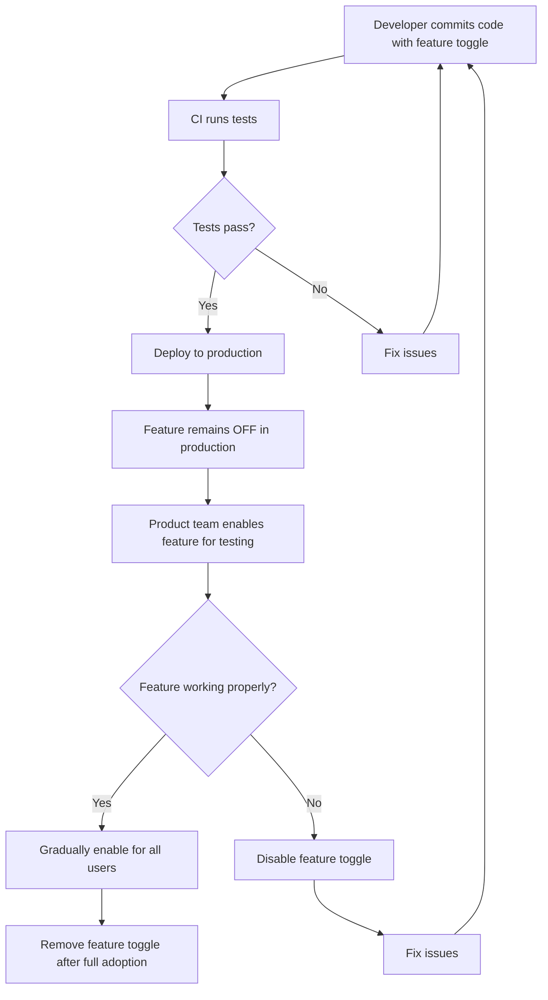

# CICD Feature Toggles

## Introduction

Feature toggles (also known as feature flags, feature switches, or feature flippers) are a powerful technique in modern software development that allows developers to modify system behavior without changing code. In the context of CI/CD (Continuous Integration/Continuous Deployment), feature toggles provide a way to deploy code to production while controlling when and how new features are made available to users.

Unlike traditional deployment strategies that rely on branching and merging code, feature toggles enable teams to integrate code continuously into the main branch while keeping features hidden until they're ready for release. This approach supports the "trunk-based development" model and aligns perfectly with CI/CD principles.

## Why Use Feature Toggles in CI/CD?

Feature toggles offer several advantages in a CI/CD pipeline:

1. **Reduced Deployment Risk**: Deploy code without exposing unfinished features
2. **Continuous Delivery**: Enable frequent deployments without disrupting users
3. **A/B Testing**: Test features with a subset of users before full rollout
4. **Canary Releases**: Gradually roll out features to detect issues early
5. **Kill Switch**: Quickly disable problematic features without redeployment
6. **Environment-Specific Features**: Enable features in specific environments only

## Types of Feature Toggles

Before implementing feature toggles, it's important to understand the different types:

### 1. Release Toggles

Used to hide incomplete or untested features in production until they're ready.

### 2. Experiment Toggles

Enable A/B testing to measure the impact of different implementations.

### 3. Ops Toggles

Allow operations teams to control system behavior (e.g., enabling/disabling resource-intensive features).

### 4. Permission Toggles

Provide access to features based on user roles or subscriptions.

## Implementing Feature Toggles

Let's look at how to implement feature toggles in different programming languages:

### JavaScript Example

Here's a simple implementation of feature toggles in a JavaScript application:

```javascript
// feature-toggle.js
const FEATURES = {
  NEW_DASHBOARD: false,
  ADVANCED_REPORTING: false,
  DARK_MODE: true
};

function isFeatureEnabled(featureName) {
  return FEATURES[featureName] === true;
}

// Using the feature toggle
if (isFeatureEnabled('NEW_DASHBOARD')) {
  renderNewDashboard();
} else {
  renderLegacyDashboard();
}
```

This basic implementation stores feature states in a configuration object. In real applications, you'd typically load this configuration from an external source.

### Remote Configuration with Node.js

For production applications, feature toggles are usually managed via a remote service:

```javascript
// feature-service.js
const axios = require('axios');

class FeatureToggleService {
  constructor() {
    this.features = {};
    this.loaded = false;
  }

  async loadFeatures() {
    try {
      const response = await axios.get('https://api.myapp.com/feature-toggles');
      this.features = response.data;
      this.loaded = true;
      console.log('Feature toggles loaded successfully');
    } catch (error) {
      console.error('Failed to load feature toggles:', error);
      // Fallback to default configuration
      this.features = {
        NEW_DASHBOARD: false,
        ADVANCED_REPORTING: false,
        DARK_MODE: true
      };
      this.loaded = true;
    }
  }

  isEnabled(featureName) {
    if (!this.loaded) {
      console.warn('Feature toggles not loaded yet');
      return false;
    }
    return this.features[featureName] === true;
  }
}

module.exports = new FeatureToggleService();
```

### Java Spring Boot Example

For Java applications, especially those built with Spring Boot, you can leverage the robust configuration management system:

```java
// FeatureToggleConfig.java
package com.myapp.config;

import org.springframework.boot.context.properties.ConfigurationProperties;
import org.springframework.context.annotation.Configuration;

import java.util.HashMap;
import java.util.Map;

@Configuration
@ConfigurationProperties(prefix = "features")
public class FeatureToggleConfig {
    private Map<String, Boolean> toggles = new HashMap<>();
    
    public Map<String, Boolean> getToggles() {
        return toggles;
    }
    
    public void setToggles(Map<String, Boolean> toggles) {
        this.toggles = toggles;
    }
    
    public boolean isEnabled(String featureName) {
        return toggles.getOrDefault(featureName, false);
    }
}
```

```java
// application.yml
features:
  toggles:
    newDashboard: false
    advancedReporting: false
    darkMode: true
```

```java
// UserController.java
package com.myapp.controllers;

import com.myapp.config.FeatureToggleConfig;
import org.springframework.beans.factory.annotation.Autowired;
import org.springframework.web.bind.annotation.GetMapping;
import org.springframework.web.bind.annotation.RestController;

@RestController
public class UserController {
    
    @Autowired
    private FeatureToggleConfig featureToggles;
    
    @GetMapping("/dashboard")
    public String getDashboard() {
        if (featureToggles.isEnabled("newDashboard")) {
            return "New dashboard content";
        } else {
            return "Legacy dashboard content";
        }
    }
}
```

## Integrating Feature Toggles in CI/CD Pipeline

Now let's see how feature toggles fit into a CI/CD pipeline:



## Best Practices for Using Feature Toggles

While feature toggles are powerful, they require careful management:

### 1. Keep Toggles Temporary

Feature toggles should be removed once a feature is fully deployed. Long-lived toggles increase technical debt and code complexity.

```javascript
// Before feature toggle removal
if (featureToggles.isEnabled('NEW_UI')) {
  renderNewUI();
} else {
  renderOldUI();
}

// After feature is fully adopted, simplify to:
renderNewUI();
```

### 2. Document All Toggles

Keep a central inventory of all feature toggles with their purpose and expected lifespan.

### 3. Clean Up Regularly

Schedule regular "toggle cleanup" sessions to remove obsolete toggles.

### 4. Test Both Toggle States

Always test your application with the toggle both on and off.

```javascript
// Sample test
test('Dashboard renders correctly with toggle ON', () => {
  mockFeatureToggle('NEW_DASHBOARD', true);
  const dashboard = render(<Dashboard />);
  expect(dashboard).toHaveNewUIElements();
});

test('Dashboard renders correctly with toggle OFF', () => {
  mockFeatureToggle('NEW_DASHBOARD', false);
  const dashboard = render(<Dashboard />);
  expect(dashboard).toHaveLegacyUIElements();
});
```

### 5. Default to "Off"

New features should be off by default to prevent accidental exposure.

### 6. Use Granular Toggles

Create specific toggles for individual features rather than large feature sets.

## Feature Toggle Tools and Services

Several tools and services can help manage feature toggles:

1. **LaunchDarkly**: Enterprise feature flag service with robust targeting and analytics
2. **Split.io**: Feature flag platform with experimentation capabilities
3. **Unleash**: Open-source feature toggle service
4. **Flagsmith**: Open-source feature flag and remote config service
5. **CloudBees Feature Management**: Enterprise feature management solution

## Real-World Example: Rolling Out a New User Interface

Let's walk through a complete example of using feature toggles to roll out a new UI:

### Step 1: Add the feature toggle to your configuration

```json
// features.json
{
  "NEW_USER_INTERFACE": false
}
```

### Step 2: Implement the toggle in your code

```javascript
// UserInterface.jsx
import React from 'react';
import { useFeatureToggles } from './hooks/useFeatureToggles';
import NewUI from './components/NewUI';
import LegacyUI from './components/LegacyUI';

function UserInterface() {
  const { isEnabled } = useFeatureToggles();
  
  return (
    <div className="app-container">
      {isEnabled('NEW_USER_INTERFACE') ? <NewUI /> : <LegacyUI />}
    </div>
  );
}

export default UserInterface;
```

### Step 3: Deploy to production with toggle off

The new code is now in production but not visible to users.

### Step 4: Enable for internal users

Update the toggle configuration to enable the feature for internal testing:

```javascript
// featureToggleService.js
function isNewUIEnabled() {
  // Enable for internal users only
  return isInternalUser(currentUser.email);
}

// Using the feature
if (isNewUIEnabled()) {
  renderNewUI();
} else {
  renderLegacyUI();
}
```

### Step 5: Roll out to a small percentage of users

```javascript
// featureToggleService.js
function isNewUIEnabled() {
  // Internal users always get the feature
  if (isInternalUser(currentUser.email)) {
    return true;
  }
  
  // Enable for 5% of external users based on user ID
  if (getUserIdPercentile(currentUser.id) < 5) {
    return true;
  }
  
  return false;
}
```

### Step 6: Gradually increase the percentage

```javascript
// Increase to 20%
if (getUserIdPercentile(currentUser.id) < 20) {
  return true;
}
```

### Step 7: Enable for all users

```json
// features.json
{
  "NEW_USER_INTERFACE": true
}
```

### Step 8: Remove the toggle code

Once the feature is stable and fully adopted, remove the toggle code:

```javascript
// UserInterface.jsx - After toggle removal
import React from 'react';
import NewUI from './components/NewUI';

function UserInterface() {
  return (
    <div className="app-container">
      <NewUI />
    </div>
  );
}

export default UserInterface;
```

## Summary

Feature toggles are a crucial component of modern CI/CD pipelines that enable teams to:

- Decouple deployment from release
- Reduce risk by controlling feature visibility
- Test features with subset of users
- Quickly disable problematic features
- Support continuous integration with trunk-based development

By integrating feature toggles into your CI/CD pipeline, you gain finer control over your software releases and can deliver changes to production more frequently with less risk.

## Additional Resources

- **Books**:
  - "Feature Toggles" chapter in "Continuous Delivery" by Jez Humble and David Farley
  - "Release It!" by Michael Nygard

- **Practices**:
  - Implement a simple feature toggle system in your personal project
  - Practice using feature toggles to implement a new feature without affecting existing users
  - Create a toggle cleanup schedule and process for your team

- **Exercises**:
  1. Implement a basic feature toggle system in your preferred language
  2. Use feature toggles to implement A/B testing for a UI component
  3. Create a dashboard to monitor and manage feature toggle states

Remember that feature toggles come with complexity costs. Establish clear processes for creating, managing, and removing toggles to keep your codebase clean and maintainable.