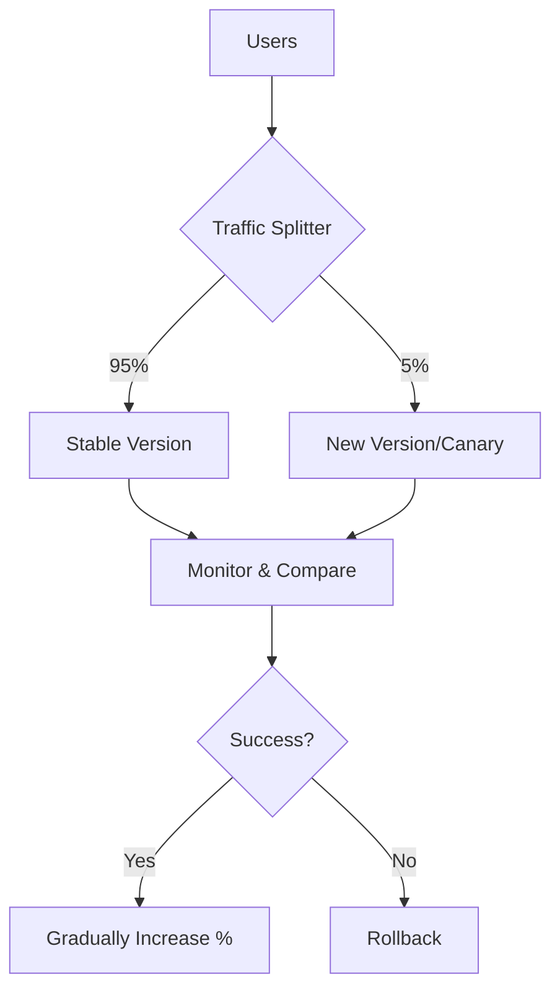
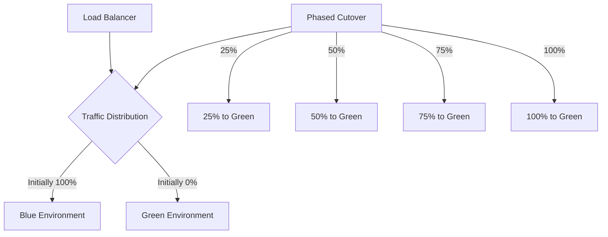

# CICD Phased Rollout

## Introduction

A phased rollout (also known as incremental deployment or progressive delivery) is a CI/CD deployment strategy that gradually releases new versions of an application to subsets of users before deploying to the entire user base. Unlike a traditional all-at-once deployment, phased rollouts reduce risk by allowing teams to validate changes with a limited audience before affecting all users.

This approach is especially valuable when you're uncertain about how a new release might perform in production or when you want to gather user feedback on new features incrementally.

## Why Use Phased Rollouts?

Phased rollouts offer several key benefits:

- **Reduced Risk**: By limiting the scope of deployment, potential issues affect fewer users
- **Early Detection**: Problems can be identified before they impact the entire user base
- **Controlled Testing**: Real-world usage data can be gathered from a subset of users
- **Easy Rollback**: If problems occur, only a portion of the infrastructure needs to be reverted
- **Confidence Building**: Teams can gain confidence in changes before full deployment

## Common Phased Rollout Strategies

Let's explore the most popular phased rollout approaches:

### 1. Canary Deployments

Canary deployments (named after the "canary in a coal mine" concept) direct a small percentage of traffic to the new version while the majority continues to use the stable version.



**Example Implementation with Kubernetes:**

```yaml
apiVersion: networking.istio.io/v1alpha3
kind: VirtualService
metadata:
  name: my-service
spec:
  hosts:
  - my-service
  http:
  - route:
    - destination:
        host: my-service
        subset: v1
      weight: 95
    - destination:
        host: my-service
        subset: v2
      weight: 5
```

In this example, Istio (a service mesh) is used to direct 5% of traffic to the new version (v2) while keeping 95% on the stable version (v1).

### 2. Blue/Green with Phased Cutover

In this approach, you deploy the new version (green) alongside the existing version (blue), but instead of switching all traffic at once, you gradually shift users from blue to green.



**Example Implementation with AWS:**

```yaml
# Using AWS CloudFormation with weighted DNS routing
Resources:
  DNSRecord:
    Type: "AWS::Route53::RecordSet"
    Properties:
      HostedZoneName: "example.com."
      Name: "service.example.com"
      Type: "A"
      SetIdentifier: "Primary"
      Weight: 90
      AliasTarget:
        HostedZoneId: !GetAtt BlueLoadBalancer.CanonicalHostedZoneID
        DNSName: !GetAtt BlueLoadBalancer.DNSName
        
  NewVersionDNSRecord:
    Type: "AWS::Route53::RecordSet"
    Properties:
      HostedZoneName: "example.com."
      Name: "service.example.com"
      Type: "A"
      SetIdentifier: "Secondary"
      Weight: 10
      AliasTarget:
        HostedZoneId: !GetAtt GreenLoadBalancer.CanonicalHostedZoneID
        DNSName: !GetAtt GreenLoadBalancer.DNSName
```

This AWS CloudFormation example sets up weighted DNS routing with 10% of traffic going to the new (green) environment.

### 3. Feature Flags / Feature Toggles

This strategy involves deploying code with new features turned off by default, then gradually enabling them for specific user segments.

```javascript
// Example feature flag implementation
const userIsInBetaGroup = (userId) => {
  // Check if user is in beta test group
  return betaUserIds.includes(userId);
};

// In application code
if (featureFlags.newDashboard.isEnabledFor(currentUser) || 
    userIsInBetaGroup(currentUser.id)) {
  // Show new dashboard
  renderNewDashboard();
} else {
  // Show existing dashboard
  renderClassicDashboard();
}
```

Many companies offer feature flag services (LaunchDarkly, Split.io, etc.) that make it easy to control which users see which features.

## Implementing a Phased Rollout Pipeline

Let's walk through how to set up a basic phased rollout pipeline:

### Step 1: Define Your Deployment Stages

First, define the stages and thresholds for your phased rollout:

```yaml
# Example configuration in a CI/CD pipeline
phases:
  - name: canary
    percentage: 5
    duration: 60m
    successCriteria:
      errorRate: < 0.1%
      latency99thPercentile: < 200ms
  
  - name: phase1
    percentage: 25
    duration: 120m
    successCriteria:
      errorRate: < 0.1%
      latency99thPercentile: < 200ms
  
  - name: phase2
    percentage: 50
    duration: 60m
    successCriteria:
      errorRate: < 0.1%
      latency99thPercentile: < 200ms
  
  - name: complete
    percentage: 100
```

### Step 2: Set Up Monitoring and Metrics

Implement comprehensive monitoring to compare performance between versions:

```javascript
// Example monitoring setup with Prometheus and Node.js
const express = require('express');
const client = require('prom-client');
const app = express();

// Create a Registry to register metrics to
const register = new client.Registry();

// Create metrics
const httpRequestDurationMs = new client.Histogram({
  name: 'http_request_duration_ms',
  help: 'Duration of HTTP requests in ms',
  labelNames: ['route', 'status_code', 'app_version'],
  buckets: [0.1, 5, 15, 50, 100, 500]
});

// Register the metrics
register.registerMetric(httpRequestDurationMs);

// Add middleware to measure request duration
app.use((req, res, next) => {
  const end = httpRequestDurationMs.startTimer();
  res.on('finish', () => {
    end({ route: req.path, status_code: res.statusCode, app_version: 'v2' });
  });
  next();
});

// Expose metrics endpoint for Prometheus scraping
app.get('/metrics', async (req, res) => {
  res.setHeader('Content-Type', register.contentType);
  res.send(await register.metrics());
});
```

### Step 3: Implement Automated Rollback Triggers

Set up automated rollback if metrics indicate problems:

```javascript
// Example rollback logic in a Node.js monitoring service
const axios = require('axios');
const prometheus = require('prom-client');

async function checkMetrics() {
  try {
    // Query error rate for the new version
    const errorRateResponse = await axios.get('http://prometheus:9090/api/v1/query', {
      params: {
        query: 'sum(rate(http_requests_total{status=~"5..",app_version="v2"}[5m])) / sum(rate(http_requests_total{app_version="v2"}[5m])) * 100'
      }
    });
    
    const errorRate = errorRateResponse.data.data.result[0].value[1];
    
    // If error rate exceeds threshold, trigger rollback
    if (parseFloat(errorRate) > 1.0) {
      console.log(`Error rate too high: ${errorRate}%. Triggering rollback...`);
      await axios.post('http://deployment-controller/rollback', {
        deployment: 'my-application',
        version: 'v2',
        reason: 'Error rate exceeded threshold'
      });
    }
  } catch (error) {
    console.error('Error monitoring metrics:', error);
  }
}

// Check metrics every minute
setInterval(checkMetrics, 60000);
```

### Step 4: Create a Deployment Pipeline

Here's an example GitHub Actions workflow for a phased rollout:

```yaml
name: Phased Deployment

on:
  push:
    branches: [ main ]

jobs:
  build:
    runs-on: ubuntu-latest
    steps:
      - uses: actions/checkout@v3
      - name: Build and push Docker image
        run: |
          docker build -t myapp:${{ github.sha }} .
          docker push myapp:${{ github.sha }}
          
  deploy-canary:
    needs: build
    runs-on: ubuntu-latest
    steps:
      - name: Deploy to canary (5%)
        run: |
          kubectl set image deployment/myapp-canary myapp=myapp:${{ github.sha }}
          kubectl scale deployment myapp-canary --replicas=1
          
      - name: Wait and evaluate
        run: |
          sleep 600  # Wait 10 minutes
          # Query metrics and evaluate
          ERROR_RATE=$(curl -s http://prometheus:9090/api/v1/query?query=sum\(rate\(http_requests_total\{status=~\"5..\",app_version=\"v2\"\}\[5m\]\)\)/sum\(rate\(http_requests_total\{app_version=\"v2\"\}\[5m\]\)\)*100 | jq -r '.data.result[0].value[1]')
          if (( $(echo "$ERROR_RATE > 1.0" | bc -l) )); then
            echo "Error rate too high: $ERROR_RATE%. Aborting deployment."
            exit 1
          fi
          
  deploy-phase1:
    needs: deploy-canary
    runs-on: ubuntu-latest
    steps:
      - name: Scale to 25%
        run: |
          kubectl scale deployment/myapp-canary --replicas=5
          kubectl scale deployment/myapp-stable --replicas=15
          
      # Similar monitoring steps...
      
  deploy-phase2:
    needs: deploy-phase1
    runs-on: ubuntu-latest
    steps:
      - name: Scale to 50%
        run: |
          kubectl scale deployment/myapp-canary --replicas=10
          kubectl scale deployment/myapp-stable --replicas=10
          
      # Similar monitoring steps...
      
  complete-deployment:
    needs: deploy-phase2
    runs-on: ubuntu-latest
    steps:
      - name: Complete deployment (100%)
        run: |
          kubectl set image deployment/myapp-stable myapp=myapp:${{ github.sha }}
          kubectl scale deployment/myapp-canary --replicas=0
          kubectl scale deployment/myapp-stable --replicas=20
```

## Real-World Example: Web Application Phased Rollout

Let's look at a practical example of how an e-commerce company might implement a phased rollout for a new checkout process:

### 1. Planning Phase

The team decides on the following rollout plan:
- Initially deploy to 5% of users
- Monitor key metrics: conversion rate, error rate, and checkout time
- If metrics remain stable, increase to 20%, then 50%, then 100%
- Implement automated rollback if critical metrics degrade

### 2. Implementation

First, they create a feature flag to control the visibility of the new checkout:

```javascript
// In frontend code
import { initializeFeatureFlags } from './featureFlags';

const featureFlags = initializeFeatureFlags();

function renderCheckoutProcess() {
  // User ID-based percentage rollout
  if (featureFlags.isEnabled('new-checkout-process', {
    userId: currentUser.id,
    percentage: 5 // Starting with 5%
  })) {
    return <NewCheckoutProcess />;
  }
  
  return <CurrentCheckoutProcess />;
}
```

### 3. Monitoring Setup

They set up a dashboard that compares the key metrics between old and new versions:

```javascript
// Tracking checkout success rates
function trackCheckoutCompletion(isSuccessful, checkoutVersion) {
  analytics.track('checkout_completion', {
    successful: isSuccessful,
    duration: performance.now() - checkoutStartTime,
    version: checkoutVersion,
    // Other relevant data
  });
}

// Called when checkout completes or fails
trackCheckoutCompletion(
  orderProcessed, 
  featureFlags.isEnabled('new-checkout-process') ? 'new' : 'current'
);
```

### 4. Gradual Expansion

After confirming the 5% rollout is successful, they update the percentage via their feature flag system:

```javascript
// Update percentage via API or configuration
featureFlagService.updateFlag('new-checkout-process', {
  percentage: 20, // Increase from 5% to 20%
  description: 'Phase 2 of new checkout rollout'
});
```

### 5. Handling Issues

If they detect problems, they can quickly disable the feature:

```javascript
// Emergency rollback via API
featureFlagService.updateFlag('new-checkout-process', {
  enabled: false,
  description: 'Emergency rollback due to payment issues'
});

// Then notify the team
notificationService.alert('New checkout process rollback triggered due to increased payment failures');
```

## Best Practices for Phased Rollouts

1. **Define Clear Metrics**: Establish the KPIs that will determine success or failure
2. **Automate Everything**: Make progression and rollback decisions automatic when possible
3. **User Segmentation**: Consider rolling out to internal users before external customers
4. **Consistent Infrastructure**: Ensure new and old versions run in similar environments
5. **Session Stickiness**: Make sure users don't bounce between versions during a session
6. **Feature Toggles**: Use feature flags to enable/disable features independent of deployment
7. **Progressive Timeframes**: Start with longer evaluation periods, then shorten as confidence grows
8. **Comprehensive Logging**: Ensure you can trace issues between versions
9. **Communications Plan**: Keep stakeholders informed during the rollout process

## Common Challenges and Solutions

| Challenge | Solution |
| --------- | -------- |
| Database schema changes | Use schema migration tools that support backward compatibility |
| API versioning | Implement API versioning to support both old and new clients |
| Monitoring overhead | Use sampling to reduce the volume of metrics while maintaining accuracy |
| Rollback complexity | Create automated rollback scripts and test them before deployment |
| User session consistency | Implement sticky sessions to keep users on the same version |
| Multiple concurrent rollouts | Establish a clear process for prioritizing and scheduling rollouts |

## Summary

Phased rollout strategies provide a safer approach to deploying applications by gradually introducing changes to a limited audience before extending to all users. The key benefits include reduced risk, early problem detection, and the ability to gather real user feedback.

By implementing canary deployments, blue/green with phased cutover, or feature flags, development teams can significantly reduce the impact of potential issues while gaining confidence in their changes.

Remember to:
1. Define clear metrics for success
2. Automate both progression and rollback
3. Maintain consistent infrastructure
4. Use feature flags for fine-grained control
5. Ensure adequate monitoring and alerting

## Exercises for Practice

1. **Basic Exercise**: Set up a simple feature flag system in a sample application to toggle between two versions of a UI component.

2. **Intermediate Exercise**: Implement a canary deployment for a sample microservice using Kubernetes and a service mesh like Istio.

3. **Advanced Exercise**: Create a complete phased rollout pipeline with automatic progression and rollback based on performance metrics.

## Additional Resources

- Books:
  - "Accelerate: The Science of Lean Software and DevOps" by Nicole Forsgren, Jez Humble, and Gene Kim
  - "Continuous Delivery" by Jez Humble and David Farley

- Online Learning:
  - [Google Cloud's Canary Deployments Guide](https://cloud.google.com/solutions/implementing-canary-deployments)
  - [Feature Flags Best Practices](https://launchdarkly.com/blog/best-practices-feature-flagging/)

- Tools:
  - Feature Flag Systems: LaunchDarkly, Split.io, Flagsmith
  - Traffic Management: Istio, Linkerd, AWS App Mesh
  - Observability: Prometheus, Grafana, New Relic, Datadog